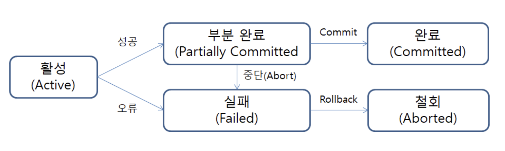
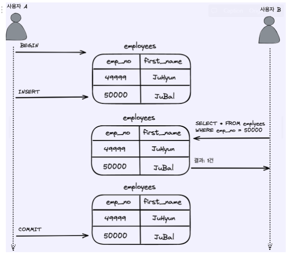
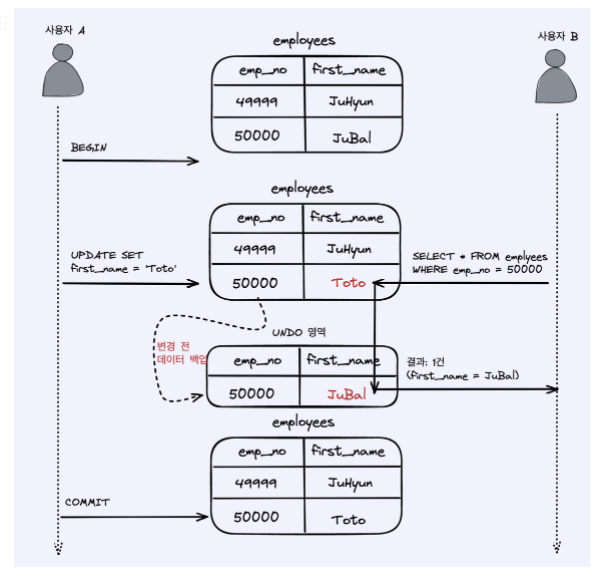
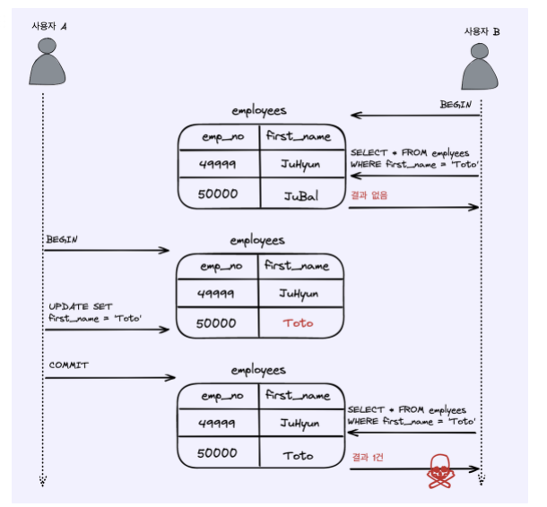
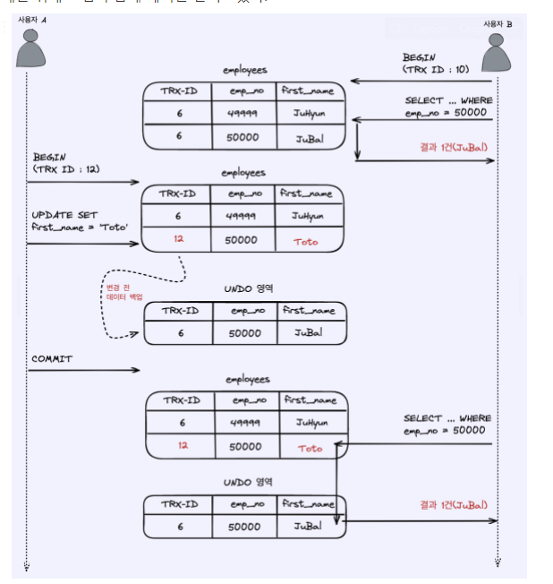
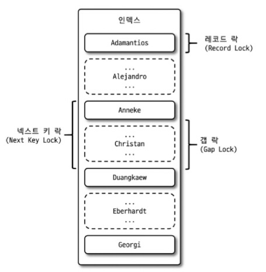

**Ureca 3기 - 백엔드 대면 교육**을 들으며 따로 진행한 약 8주간의 데이터베이스 스터디 내용입니다.

[https://github.com/Study-Castle/Database\_Study](https://github.com/Study-Castle/Database_Study)

[GitHub - Study-Castle/Database\_Study

Contribute to Study-Castle/Database\_Study development by creating an account on GitHub.

github.com](https://github.com/Study-Castle/Database_Study)

## 📘 1. 트랜잭션

### 트랜잭션

> 데이터베이스의 상태를 변화시키기 위해 수행하는 작업의 논리적인 단위.  
> 작업의 완전성을 보장.  
> 논리적인 작업 셋을 완벽하게 처리하거나, 처리하지 못할 경우 원 상태로 복구해서 작업의 일부만 적용되는 현상이 발생하지 않게 만들어 주는 기능.  
> 논리적인 작업 셋이 100% 적용되거나 아무것도 적용되지 않아야함을 보장.

### 특징

-   **`원자성 (Atomicity)`** : 트랜잭션이 DB에 모두 반영되던가, 아니면 전혀 반영되지 않아야 한다는 것.
-   `**일관성 (Consistency)**` :
    -   트랜잭션의 작업 처리 결과가 항상 일관성이 있어야 한다는 것.
    -   트랙잭션이 진행되는 동안에 데이터베이스가 변경되더라도, 업데이트된 데이터베이스로 트랜잭션을 진행하는 것이 아니라 처음에 트랜잭션을 진행하기 위해 참조한 데이터베이스로 진행.
-   **`독립성 (Isolation)`** : 어떤 하나의 트랜잭션이라도, 다른 트랜잭션의 연산에 끼어들 수 없다는 것.
-   `**지속성 (Durability)**` : 트랜잭션이 성공적으로 완료되었을 경우, 결과는 영구적으로 반영되어야 한다는 것.

### 트랜잭션 상태



1.  **`활성`**
    1.  트랜잭션이 정상적으로 실행중인 상태.
    2.  트랜잭션 시작 시, 해당 트랜잭션의 상태는 활동 상태.
2.  **`부분 완료`**
    1.  트랜잭션의 마지막까지 실행되었지만, COMMIT 연산이 실행되기 직전의 상태.
    2.  트랜잭션 명령을 성공적으로 수행 → 부분적 완료 상태
    3.  성공적인 작업이었더라도 무조건 반영이 아니라 설계자의 최종 승인(COMMIT)이 있을 때까지 데이터베이스에 작업 내용을 반영하지 않고 기다리는 상태.
3.  **`완료`**
    1.  트랜잭션이 성공으로 종료되어 COMMIT 연산을 실행한 후 상태
4.  **`실패`**
    1.  트랜잭션 실행에 오류가 발생하여 중단된 상태
5.  **`철회`**
    1.  트랜잭션이 비정상적으로 종료되어 ROLLBACK 연산을 수행한 상태

### COMMIT

-   하나의 트랜잭션이 성공적으로 완료되었고, 데이터베이스가 일관성있는 상태에 있을 때, 하나의 트랙잭션이 끝났다는 것을 알려주기 위해 사용하는 연산.
-   **Commit** 수행 시 하나의 트랜잭션 종료.

### ROLL BACK

-   하나의 트랜잭션 처리가 비정상적으로 종료되어 트랜잭션의 원자성이 꺠진 경우, 트랜잭션을 처음부터 시작하거나, 트랜잭션의 부분적으로만 연산된 결과를 다시 취소.
-   마지막 **Commit**을 완료한 시점으로 원복.
-   단, **DDL(CREATE, DROP, ALTER, RENAME, TRUNCATE)는** Rollback 대상❌

## 📘 2. 격리수준

### 격리 수준

> 여러 트랜잭션이 동시에 처리될 때 특정 트랜잭션이 다른 트랜잭션에서 변경하거나 조회하는 데이터를 볼 수 있게 허용할지 말지를 결정하는 것.

-   **격리 수준** : `READ UNCOMMITTED` < `READ COMMITTED` < `REPEATABLE READ` < `SERIALIZABLE`
-   **동시 처리 성능** : `READ UNCOMMITTED` > `READ COMMITTED` > `REPEATABLE READ` > `SERIALIZABLE`

### READ UNCOMMITED



1.  **사용자 A**가 `emp_no = 50000`, `first_name = ‘JuBal’` 사원 Insert
2.  **사용자 B**가 **사용자 A**가 변경한 내용 커밋 이전에 `emp_no = 50000`인 사원 조회
3.  **사용자 B**의 SELECT 결과 **사용자 A**가 아직 커밋하지 않은 새로운 사원 JuBal 조회

### 🚨🚨🚨 **Dirty Read 발생!**

사용자 A가 Insert된 내용을 롤백시 사용자 B는 JuBal이 정상적인 사원이라고 생각한고 계속 처리!!!

> **Dirty Read** : 어떤 트랜잭션에서 처리한 작업이 완료되지 않았음에도 다른 트랜잭션에서 볼 수 있는 현상.

### READ COMMITED

-   오라클 DBMS에서 기본으로 사용되는 격리 수준.
-   온라인 서비스에서 가장 많이 사용되는 격리 수준.
-   Dirty Read 발생❌

> **Undo 로그?**

-   언두 영역은 UPDATE / DELETE와 같은 문장을 데이터를 변경했을 때 변경되기 전 데이터를 보관하는 곳(백업 공간)



1.  **사용자 A**가 `emp_no = 50000`인 사원의 `first_name`을 **JuBal**에서 **Toto** 수정
2.  **Toto**는 `employees` 테이블에 즉시 기록 → 이전 값 **Jubal**은 **Undo**영역에 백업
3.  **사용자 A**가 커밋이전 **사용자 B**가 emp\_no = 50000인 사원 조회 시 이전 값인 **JuBal**이 조회됨. ← **Undo**영역의 백업 레코드에 결과를 조회.



### 🚨🚨🚨 Non-Repeatable Read 발생!

> 하나의 트랜잭션 내에서 동일 SELECT 쿼리 실행 시 항상 같은 결과를 보장해야한다는 정합성에 어긋나는 것.

1.  **사용자 B**가 트랜잭션을 시작하고 `first_name = ‘Toto’`인 사원 조회 시 결과값 = 0
2.  **사용자 A**가 `emp_no = 50000`인 사원의 이름을 Toto로 수정하고 커밋
3.  **사용자 B**가 다시 똑같은 `SELECT` 쿼리로 조회 시 결과값 = 1

→ **사용자B**가 하나의 트랜잭션 내 동일한 `SELECT` 쿼리 실행 시 같은 결과를 보장하지 못하는 ***Non-Repeatable Read*** 발생.

* * *

### Repeatable Read

-   MySQL의 InnoDB 스토리지 엔진에서 기본 사용되는 격리 수준.
-   ***Non-Repeatable Read*** 발생 ❌



1.  **사용자 A**의 트랙잭션 번호 = 12 / **사용자 B**의 트랜잭션 번호 = 10
2.  **사용자 A**가 사원의 이름을 Toto로 변경 후 커밋
3.  사용자 B는 `emp_no = 50000`인 사원을 사원의 이름이 변경되기 전(`트랜잭션 번호 6`)과 변경 후(`트랜잭션 번호 12`)조회 시 동일한 결과 (JuBal)

→ **사용자 B**가 BEGIN 명령으로 트랜잭션을 시작하면서 트랜잭션 번호 10번을 부여받았는데, **사용자 B**의 10번 트랜잭션 안에서 실행되는 모든 `SELECT` 쿼리는 트랜잭션 번호 10번보다 작은 트랜잭션 번호에서 변경된 데이터만을 볼 수 있다.

### 🚨🚨🚨 Phantom Read 발생!

> SELECT … FOR UPDATE 쿼리와 같은 쓰기 잠금을 거는 경우 다른 트랜잭션에서 수행한 변경 작업에 의해서 레코드가 보였다가 안 보였다가 하는 현상.

-   ***SELECT … FOR UPDATE***
-   선택된 행들에 대해서 LOCK을 설정하는 기능. SELECT FOR UPDATE 문을 통해 커서 결과 집합의 레코드를 잠글 수 있음.

1.  사용자B의 2번의 SELECT … FOR UPDATE 결과 각각 1건과 2건으로 다른 결과.
2.  SELECT … FOR UPDATE 쿼리같은 경우 SELECT 하는 레코드에 잠금을 걸어야 하지만 Undo 영역에는 잠금을 걸 수 없기 때문.

### SERIZABLE

-   가장 엄격한 격리 수준 + 가장 낮은 동시 처리 성능
-   한 트랜잭션에서 읽고 쓰는 레코드를 다른 트랜잭션에서는 절대 접근 불가!
-   ***Phantom Read*** 발생❌
-   InnoDB 스토리지 엔진에서는 갭 락과 넥스트 키 락 덕분에 REPEATABLE READ에서 이미 ***Phantom Read***발생❌

## 📘 3. 잠금

## MySQL 엔진 잠금

### 글로벌 락

```sql
FLUSH TABLES WITH READ LOCK
```

-   한 세션에서 글로벌 락 획득 → 다른 세션에서 SELECT 제외한 DDL문장 + DML 문장 대기 상태.
-   범위 : MySQL 서버 전체에 존재하는 모든 테이블
-   글로벌 락은 테이블에 실행 중인 모든 종류의 쿼리가 완료되어야 함.
-   웹 서비스용 MySQL에서는 가급적 사용❌
-   mysqldump와 같은 백업프로그램으로 백업을 수행할 때 사용.

### 테이블 락

```sql
LOCK TABLES table_name [ READ | WRITE ]
```

-   개별 테이블 단위로 설정되는 잠금.
-   UNLOCK TABLES 명령으로 잠금을 반납 가능.
-   글로벌 락과 동일하게 작업에 영향을 크게 미치므로 특별한 상황을 제외하고는 사용 필요❌
-   ***언제가 특별한 상황?***
    -   여러 테이블을 한 번에 업데이트.
    -   특정 테이블 전체를 갱신
    -   →Batch 작업 , 백업 또는 데이터 덤프 , 테이블 구조 변경 작업 , 마이그레이션 작업

### 네임드 락

```sql
GET_LOCK()
```

-   임의의 `문자열`에 대해 잠금 설정.
-   사용자가 지정한 `문자열`에 대해 획득하고 반납.
-   많은 레코드에 대해 복잡한 요건으로 레코드를 변경하는 트랜잭션에서 유용.
-   ***실제 적용 사례***예시 : **사용자A**가 지출 카테고리 ‘교통비’를 생성요청과 동시에 **사용자B**가 같은 카테고리명 생성 요청.(DB에는 중복된 카테고리명이 들어가서는 안된다.)
    -   MySQL의 **NAMED LOCK**
        
        -   **GET\_LOCK(String,time)** : 입력받은 String으로 time동안 잠금 획득.
        -   **RELEASE\_LOCK (String)** : 입력받은 String으로 잠금 해제.
        
        Lock만을 위한 `JpaRepository`를 구성.
    
    -   사용자가 입력하는 `카테고리명`에 대해서만 ***NAMED\_LOCK*** 수행.
-   상황 : `100`명의 사용자가 동시에 지출 내역의 새로운 카테고리 생성 요청 → Race Condition 발생

```java
@Repository 
public interface LockRepository extends JpaRepository<CategoryExpend,Long> { 
	@Query(value = "select get_lock(:key,10)",nativeQuery = true) Integer getLock(@Param("key") String key); 
	@Query(value = "select release_lock(:key)",nativeQuery = true) void releaseLock(@Param("key") String key); 
}
```

### 메타데이터 락

-   데이터베이스 객체(테이블,뷰)의 이름이나 구조 변경 시 자동으로 획득.
-   RENAME\_TABLE 명령인 경우 원본 이름과 변경될 이름 2개 모두 잠금.

* * *

### Inno DB 스토리지 엔진 잠금

-   스토리지 엔진 내부에서 레코드 기반의 잠금 방식.
-   MySQL 서버의 i`nformation_schema` - `INNODB_TRX`, `INNODB_LOCKS`, `INNODB_WAITS` 테이블 조인 후 조회 시 어떤 트랜잭션이 어떤 잠금을 대기하며 가지고 있는지 확인 가능.



### 레코드 락

-   레코드 자체만을 잠금.
-   레코드를 잠그는 것이 아닌 인덱스의 레코드를 잠금.
-   키 또는 유니크 인덱스에 의한 변경 작업 시 레코드 자체에 대해서만 락.

### 갭 락

-   레코드와 인접한 레코드 사이의 간격만을 잠금.
-   역할 : 레코드와 레코드 사이의 간격에 새로운 레코드 생성되는 것 제어.

### 넥스트 키 락

-   `레코드 락 + 갭 락`
-   `innodb_locks_unsafe_for_binlog` 시스템 비활성화(0)이 되면 검색하는 레코드에 넥스트 키 락 잠금.
-   ***목적*** : 바이너리 로그에 기록되는 쿼리가 레플리카 서버에서 실행될 때 소스 서버에서 만들어 낸 결과와 동일한 결과를 만들어내도록 보장.

### 자동증가 락

-   `AUTO_INCREMENT` 락 수준의 잠금 사용.
-   `INSERT` / `REPLACE` 쿼리 문장과 같이 새로운 레코드를 저장하는 쿼리에서만 필요.
-   AUTO\_INCREMENT 값을 가져오는 순간만 락이 걸렸다가 즉시 해제.
-   명시적으로 획득하고 해제하는 방법은 ❌
