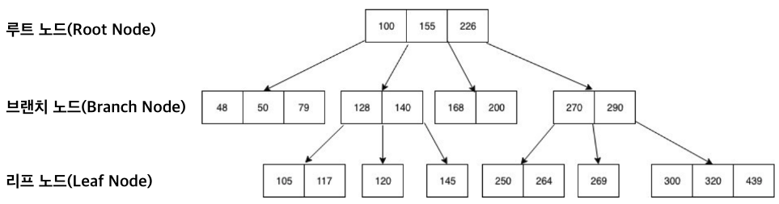
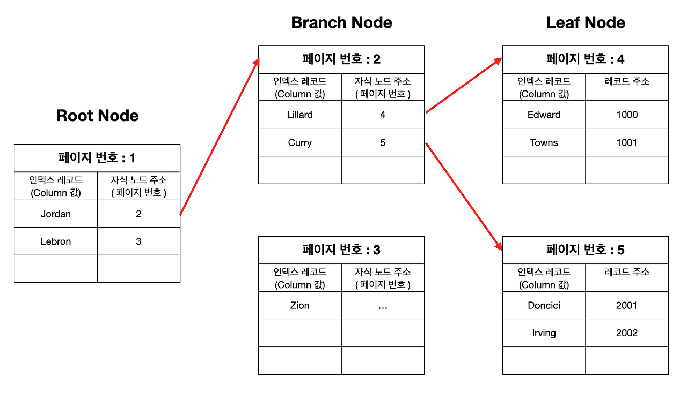
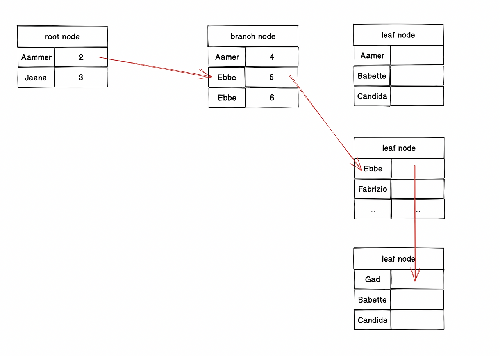
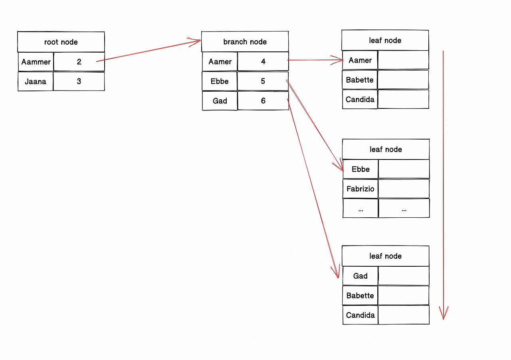

Ureca 3기 - 백엔드 대면 교육을 들으며 따로 진행한 약 8주간의 데이터베이스 스터디 내용입니다.

[https://github.com/Study-Castle/Database\_Study](https://github.com/Study-Castle/Database_Study)

[GitHub - Study-Castle/Database\_Study

Contribute to Study-Castle/Database\_Study development by creating an account on GitHub.

github.com](https://github.com/Study-Castle/Database_Study)

## 📘 1. 인덱스의 장단점

#### **장점**

-   데이터의 읽기 속도 향상
-   전반적인 시스템 부하 감소

#### **단점**

-   \- **INSERT**, **UPDATE**, **DELETE** 성능 희생
-   데이터의 **저장속도**를 얼마나 희생가능 + 읽기 속도를 얼마나 더 빠르게 만들어야 하는가에 따라 결정.
-   데이터의 **읽기 속도** 희생 CASE - 쓰기 지연보다 **처리량** 중시 ⇒ \`**INSERT**\` 성능 향상 중시
    -   로그 / 센서 수집
    -   트랜잭션 처리 - 금융 거래, 주문 처리
    -   버퍼링 / 배치
-   데이터의 저장 **속도 희생** CASE
    -   검색 / 컨텐츠 서비스
    -   분석 / 리포팅 서비스

## 📘 2. 인덱스 자료구조

### B-Tree 인덱스



B-Tree

#### **구성**

-   **루트 노드** : 최상위 노드
-   **브랜치 노드** : 중간 노드, 루트↔리프 노드 간 데이터 경로 제공.
-   **리프 노드** : 실제 데이터 레코드를 찾아가기 위한 주솟값.
    -   **MyISAM 엔진** : 세컨더리 인덱스가 물리적 주소를 가진다.
    -   **InnoDB 엔진** : PK(데이터의 논리적 주소) 저장. 인덱스를 통해 얻은 PK의 논리적 주소를 통해 클러스터드 테이블에서 실제 테이블 조회(즉, 1번의 추가 조회 발생)

> **Q.** **B-Tree 노드**에는 어떤 값이 저장되는가?  
> **A.** 각 노드는 데이터를 가지는 것이 아닌 한 개의 \`Page\`(InnoDB 스토리지 엔진이 데이터를 저장하는 기본 단위 / Page내 여러 데이터 존재)를 가진다.



#### **인덱스 키 추가**

1.  저장될 키 값 **B-Tree**에서 적절한 위치 검색
2.  레코드의 키 값과 대상 레코드의 주소 정보 → **리프 노드**에 저장.

#### **인덱스 키 삭제**

1.  해당 키 값 저장된 리프노드 탐색
2.  찾은 리프노드 삭제 마킹(그대로 유지 혹은 재활용 가능)

#### **인덱스 키 변경**

1.  인덱스 키 삭제
2.  인덱스 키 추가

#### **인덱스 키 검색**

1.  루트 노드 시작
2.  브랜치 노드 : 비교 작업
3.  리프 노드 : 비교 작업

> **Q.** 인덱스 순서대로 정렬되어 저장?  
> **A.** 대부분의 RDBMS의 레코드는 특정 기준으로 정렬되지 않고 임의의 순서로 저장. InnoDB 테이블에서의 레코드는 기본적으로 PK 순서대로 정렬

### 인덱스 성능에 영향을 미치는 요소

#### **1\. *인덱스 키 값의 크기***

-   인덱스를 구성하는 키 값의 크기가 커질수록 한 **Page** 내에 저장 가능한 **레코드의 수가 감소**. ⇒ 디스크로 부터 읽어야 하는 횟수의 증가 ⇒ **성능 저하**

```text
인덱스 페이지에 저장 가능 개수 = Page 크기 / (인덱스 크기 + 자식 노드 주소)
```

-   **인덱스 A**의 키 값 크기 :32KB / **인덱스 B**의 키 값 크기 16KB 가정
    -   **A**의 한 페이지에서는 372개, **B**의 한 페이지에서는 585개가 저장됨
    -   500개의 레코드를 READ 작업을 한다면 **A**는 최소 2번 이상 디스크 읽기 작업.

#### **2. *B-Tree 깊이***

-   직접 제어 불가능.
-   B-Tree의 깊이는 값을 검색할 때 몇 번이나 랜덤하게 디스크를 읽어야 하는지 문제로 직결.
-   인덱스 키 값 ⬆️ ⇒ 한 페이지에 담을 수 있는 키 값 개수⬇️ ⇒ **B-Tree** 깊이 ⬆️ ⇒ 디스크 읽기 ⬆️

#### **3. *선택도 (기수성)***

1.  모든 인덱스 키 값 중 유니크한 값의 수
2.  인덱스 키 값 중 중복된 값 ⬆️ ⇒ 기수성 ⬇️  / 선택도 ⬇️
3.  선택도 ⬆️ ⇒ 검색 대상 ⬇️ ⇒ 디스크 읽기 ⬇️

#### **4. *읽어야 하는 레코드의 건수***

1.  일반적으로 DBMS의 옵티마이저는 **인덱스를 통해 레코드 1건 읽는 것**이 테이블에서 **직접 레코드 1건 읽는 것**보다 **4~5배 비용** 많이 드는 작업으로 예측.
2.  즉, 100만 건 레코드 중 50만 건을 읽는 작업에 대해서 옵티마이저는 인덱스를 타지 않고 직접 테이블을 모두 읽을 것.
3.  **총 레코드 수 x (20~25%) > 읽어야 하는 총 레코드 수** ⇒ 인덱스 추가 사용에 대한 고려 해봐야함.

## 📘 3. 인덱스를 이용하여 데이터 읽는 방법

### 인덱스 레인지 스캔

```sql
SELECT *

FROM employees

WHERE first_name BETWEEN 'Ebbe' AND 'God';
```



1.  가장 대표적이면서 가장 빠른 방법
2.  검색해야 할 인덱스 범위가 결정되었을 때 사용.
3.  **스캔 과정**
    -   루트 노드 비교 → 브랜치 노드 비교 → 리프 노드 비교 ⇒ 필요한 레코드 시작 지점 찾는다.
    -   리프 노드의 레코드들만 스캔 (만약, 리프 노드를 끝까지 읽으면 리프 노드 간 링크를 통해 다음 리프 노드로 이동)
    -   스캔 종료 지점 → 이제까지 읽은 레코드들 반환.
4.  어떤 방식으로 스캔하든 관계없이 인덱스를 구성하는 **칼럼의 정순 OR 역순** 정렬된 레코드를 가지고 옴.

### 인덱스 풀 스캔



1.  인덱스의 처음부터 끝까지 모두 읽는 방식.
2.  쿼리 조건절에 사용된 칼럼이 인덱스의 첫 번쨰 칼럼이 아닌 경우
3.  쿼리가 인덱스에 명시된 칼럼만으로 조건을 처리 가능한 경우
4.  **속도** : 인덱스 레인지 스캔 > 인덱스 풀 스캔 > 테이블 풀 스캔

### 루스 인덱스 스캔

1.  듬성듬성하게 인덱스를 읽는 방법.
2.  중간에 필요하지 않은 인덱스 키 값 SKIP
3.  **GROUP BY** / **MAX() MIN()** 함수 최적화 하는 경우 사용.
4.  dept\_no 그룹 별로 1번째 레코드의 emp\_no 값만 읽으면 됨.
5.  WHERE 조건 절 모두 스캔 필요❌ ⇒ 조건 만족하지 않으면 레코드 무시하고 SKIP

```sql
SELECT 
	dept_no, MIN(emp_no)
FROM
	dept_emp
WHERE
	dep_no BETWEEN 'd002' AND 'd004'
GROUP BY
	dept_no;
			
=> (dept_no, emp_no) 인덱스 설정
```

### 인덱스 스킵 스캔

-   **루스 인덱스 스캔**은 GROUP BY 작업을 처리하기 위한 인덱스 스캔 방식이라면 인덱스 스킵 스캔은 WHERE 조건절 검색을 위한 인덱스 스캔 방식.
-   **단점**
    1.  WHERE 조건절에 조건 없는 인덱스의 선행 칼럼의 유니크 값 개수 적어야함.
    2.  쿼리가 인덱스에 존재하는 컬럼만으로 처리 가능해야함.

## 📘 4. 인덱스의 가용성과 효율성

### 비교 조건

```java
SELECT * FROM dept_emp
WHERE dept_no = 'd002' AND emp_no >= 1004;
```

1.  ***INDEX(dept\_no, emp\_no)***
    -   dept\_no와 emp\_no 칼럼 ⇒ **작업 범위 결정 조건**
2.  ***INDEX(emp\_no,dept\_no)***
    -   emp\_no 칼럼 ⇒ **작업 범위 결정 조건**
    -   dept\_no 칼럼 ⇒ **필터링 조건**

-   작업 범위 결정 조건 🔼 ⇒ 쿼리 처리 성능 🔼
-   필터링 조건 ⇒ 쿼리 처리 성능❌

**\[ INDEX(dept\_no, emp\_no) \]**

-   **dept\_no** 기준 정렬 ⇒ **emp\_no** 기준 정렬

```text
(dept_no, emp_no)
-----------------
(d001, 1001)
(d001, 1002)
(d001, 1003)
(d002, 1001)
(d002, 1002)
(d002, 1003)
(d002, 1004)
(d002, 1005)
(d002, 1006)
(d003, 1001)
(d003, 1002)
...
```

1.  인덱스에서 ‘d002’ 시작되는 구간 스캔
2.  인덱스 상에서 (d002,…)로 시작하는 인덱스 시작 위치와 끝 위치 탐색.
3.  줄여진 구간 내에서 **(d002, 1004) 시작 위치 ⇒ (d002,MAX)까지** 스캔.

**\[ INDEX(emp\_no,dept\_no) \]**

```text
(emp_no, dept_no)
-----------------
(1001, d001)
(1001, d002)
(1001, d003)
(1002, d001)
(1002, d002)
(1002, d003)
(1003, d001)
...
(1004, d001)
(1004, d002)
(1004, d003)
(1005, d001)
(1005, d002)
...
```

1.  인덱스에서 **emp\_no ≥ 1004시작 지점 ~ emp\_no = MAX\_VALUE** 범위까지 스캔.
2.  스캔 범위 내 레코드에서 dep\_no = ‘d002’인 레코드 필터링 ⇒ 결국 1번에서의 스캔한 모든 레코드 탐색.

### 인덱스 가용성

#### **INDEX(first\_name)**

-   주어진 인덱스 페이지

```text
(first_name   |  주소)
---------------------
(A a mer,     | 1001)
(A a mod,     | 1002)
(A b delaziz, | 1003)
(A b delghani,| 1001)
(A b delkadar,| 1002)
(A b delwaheb,| 1003)
(A b dulah,   | 1004)
(A b dulla,   | 1005)
(A c hilleas, | 1006)
...
```

```sql
SELECT * FROM employee WHERE first_name LIKE '%mer';
```

-   인덱스 사용❌
-   인덱스로 설정한 first\_name에서 왼쪽부터 한 글자씩 비교하면서 일치 레코드를 찾아야함.
-   But! %mer로 왼쪽 부분 고정❌ ⇒우선 순위가 낮은 뒷부분 값만으로 정렬됨 ⇒ 인덱스 효과 미미.

```text
(dept_no   |  emp_no   |  주소)
------------------------------
d001      |   10239    |     
d001      |   10259    |     
d002      |   10042    |
d002      |   10050.   |
d002      |.  10059.   |
d002      |   10080.   |
d002      |   10132.   |
d003      |   10005.   |
d003      |   10013.   |
...
```

```sql
SELECT * FROM dept_emp WHERE emp_no >= 10144;
```

-   **dept\_no** 컬럼 먼저 정렬 ⇒ **emp\_no** 정렬
-   **dept\_no** 조건 없이 **emp\_no** 값만으로 검색 ⇒ 인덱스 효율적 사용❌

### 인덱스를 사용할 수 없는 조건

1.  **NOT-EQUAL 비교**
2.  **LIKE ‘%??’**
3.  **스토어드 함수 / 다른 연산으로 인덱스 칼럼 변경**
4.  **NOT-DETERMINISTIC 속성의 스토어드 함수**
5.  **데이터 타입이 서로 다른 비교(인덱스 컬럼을 변경시키는 경우)**
6.  **NULL 조건**

## 📘 5. 다양한 인덱스

### 전문 검색 인덱스

-   컬럼에서 키워드로 검색하기 위한 방법
-   일부 검색에도 **FullText** 인덱스 사용 가능 ⇒ **LIKE 조회보다 성능 우수**

#### **인덱싱 방식**

-   **Stopword**
    -   내용을 공백, Tab, 문장 기호로 구분자 혹은 사용자 정의 문자열
    -   나누어진 단어들에 대해 저장 ⇒ 조회 시 완전히 일치한 단어만 포함

```text
ex)
1. 우리 집 강아지는 복슬강아지
2. 우리집 강아지는 복슬강아지
3. 우리집강아지는복슬강아지

=> "우리" 키워드 포함 조회 -> 1번만 조회됨.
```

-   **N-gram**
    -   컬럼의 값을 변형해서 만들어진 값에 대해 인덱스 구축 시 사용.

### 함수 기반 인덱스

-   컬럼의 값을 변형해서 만들어진 값에 대해 인덱스 구축 시 사용.

#### **인덱싱 방식**

-   **가상 칼럼**
    -   테이블 구조가 변경된다는 단점 존재

```sql
first_name + last_name 합쳐서 검색 상황
1. full_name 가상 컬럼 생성
2. 모든 레코드에 대해 full_name 업데이트

ALTER TABLE user
	ADD full_name VARCHAR(30) AS (CONCAT(first_naem,' ',last_name)) VIRTUAL,
	ADD INDEX ix_fullname (full_name);
```

-   **함수 이용**
    -   테이블 구조 변경 ❌

```java
CREATE TABLE user (
	user_id BIGINT,
	..
	INDEX ix_fullname((CONCAT(first_name,' ',last_name))
);
```

### 멀티 밸류 인덱스

-   하나의 데이터 레코드가 여러 개의 키 값 가지는 형태
-   MySQL 8.0부터 JSON 형식 사용 가능.

```sql
CREATE TABLE user (
	user_id BIGINT,
	...
	credit_info JSON,
	INDEX mx_creditscores ( (CAST(credit_info->'$.credit_scores' AS UNSIGNED ARRAY)) )
```

```sql
INSERT INTO user VALUES (1, 'Matt', 'Lee', '{"credit_scores":[360,353,351]}');
```

### 클러스터링 인덱스

-   PK 값이 비슷한 레코드끼리 묶어서 저장하는 것.
-   테이블의 PK에 대해서만 적용
-   PK 값으로 클러스터링 된 테이블은 PK에 대한 **의존도** ❌
-   PK 값 변경 시 페이징 이동 발생할 수도 있음.

| 장점 | 단점 |
| --- | --- |
| PK로 검색 시 성능 우수 | 클러스터링 키 값 크기 큰 경우 인덱스의 크기 커짐 |
| 테이블의 모든 세컨더리 인덱스가 클러스터링 키를 가지므로 인덱스만으로 처리되는 경우 많음. | 세컨더리 인덱스를 통해 검색 시 PK로 다시 한 번 검색 → 처리 성능 느림 |
|  | INSERT할 때 PK에 따라 레코드 위치 결정되므로 처리 성능 느림 |
