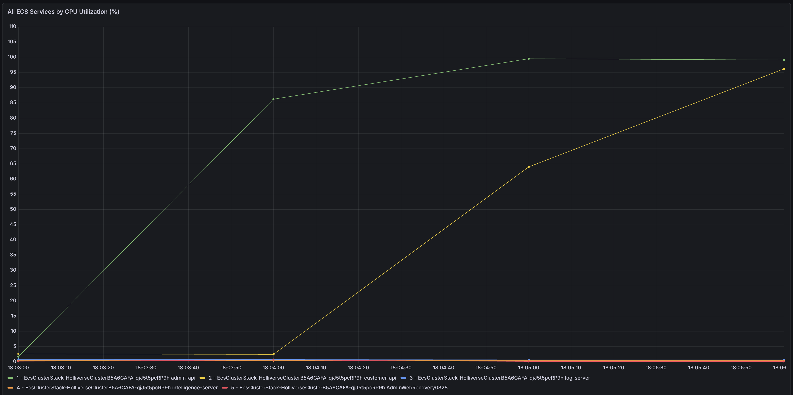
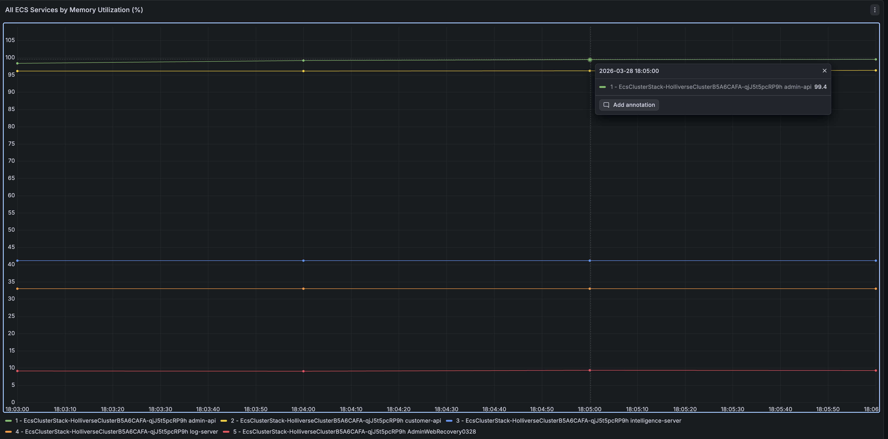
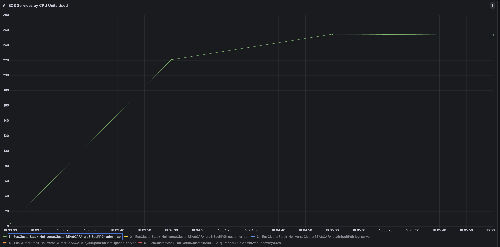
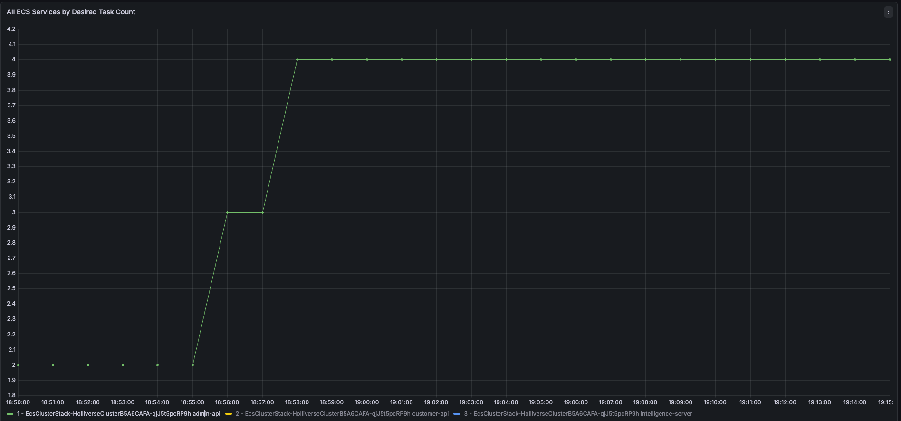
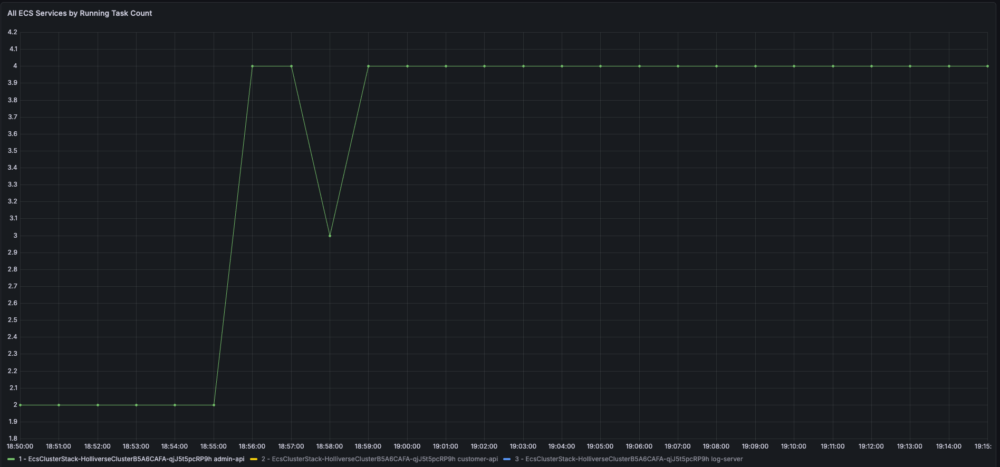
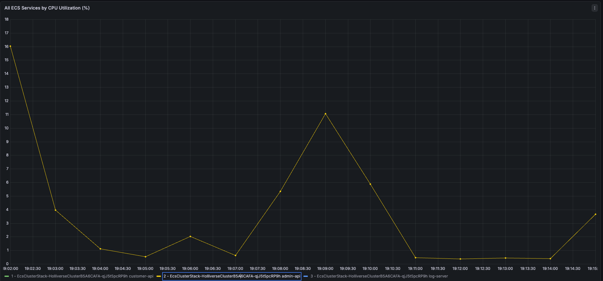
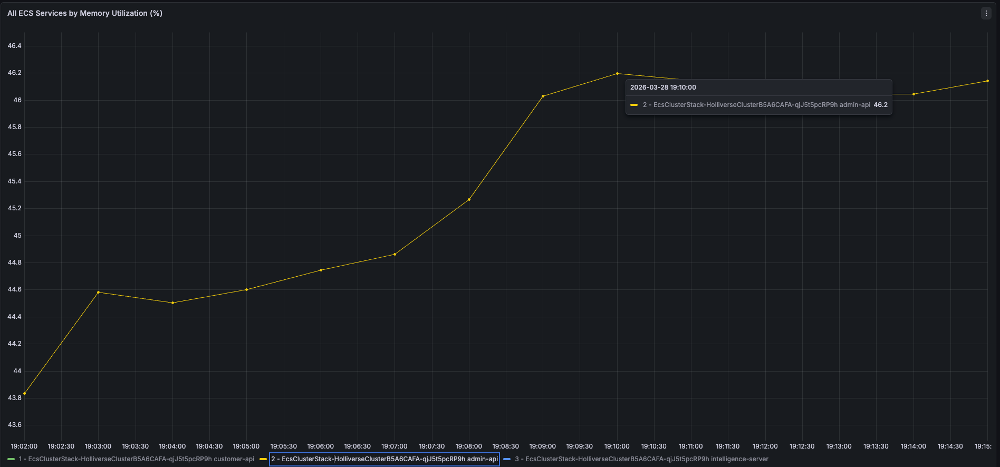

## **1\. 개요**

프로젝트 막바지에 관리자 API 중 안정성을 확인하기 위해 팀원이 K6를 활용한 경량 부하 테스트를 진행하였다. 이 테스트의 목적은 관리자가 동시에 API를 호출했을 때 서버가 기본적인 응답 성능과 안정성을 유지할 수 있는지 확인하는 것이었다.

당시 기본적인 인덱스 처리와 DB 커넥션 풀 조정은 이미 진행한 상태였다. 팀원이 진행한 1차 부하 테스트 결과, 관리자 API는 30초를 안정적으로 버티지 못했고, **p95**와 **error rate**를 정상적인 성능 지표로 보기 어려울 정도로 서버가 금방 부하가 걸리면서 죽었다.

이후 나는 **Grafana**와 **ECS** 지표를 기준으로 병목 지점을 추적하였고, 그 결과 문제의 핵심이 단일 **ECS task**의 **CPU**, **Memory** 포화와 **Auto Scaling**의 부재임을 확인했다.

테스트 시나리오를 간단하게 언급하자면 아래와 같다.

> 관리자 50명이 동시에 접속 상황을 가정하여 아래와 같은 API 9개를 조회한다.  
> 1\. 회원 목록 조회  
> 2\. 회원 상세 조회  
> 3\. 월별 통계 확인  
> 4\. 상담 키워드 분석  
> 5\. 페르소나 분석  
> 6\. 상담 키워드 트렌드 조회  
> 7\. 회원 정보 수정 요청  
>   
> API 통과 기준은 아래와 같은 2가지로 잡았다.  
> 1\. 모든 요청이 HTTP 200응답  
> 2\. 응답 시간이 500ms 미만일 것

* * *

## **2\. 1차 테스트: ECS 서버 부하 상태 지속**

Admin Server CPU Utilization(초록색이 Admin 서버)

  
1차 테스트 구간인 **18:03 ~ 18:06**에서 가장 먼저 확인했던 것은 **ECS CPU 사용률**이였다. **admin-api**는 짧은 시간에 사용률 86%를 넘겼고, 이후 **99.4%**수준까지 상승했다.

Admin Server Memory Utilization(초록색이 Admin 서버)

같은 테스트 시간대에 **admin-api 메모리 사용률**은 **98~99.4%** 수준이 지속되었다. CPU만 높은 것이 아니라, 메모리 사용률 또한 거의 상한에 가까웠다.

Java 어플리케이션 관점에서 이러한 상태는 매우 위험하다. GC 부담 증가, 응답 지연, 타임 아웃, 컨테이너 재시작 가능성이 모두 함께 증가한다.

Admin Server CPU Units Used

**CPU 사용률**을 단순 퍼센트 지표로 보면 체감이 약할 수 있기 떄문에, 실제 사용 CPU 지표도 함께 관측했다. **admin-api**의 **CPU Units Used**는 약 **254** 수준까지 올라갔다. 당시 해당 task에 할당된 CPU가 256이였기 때문에 사실상 예약한 CPU 자원을 한계치로 사용하고 있었다.

| 지표 | 개선 | 의미 |
| --- | --- | --- |
| admin-api CPU Utilization | 최대 99.4% | CPU 포화 |
| customer-api CPU Utilization | 최대 96% | 동시 병목 발생 |
| admin-api Memory Utilization | 최대 99.4% | 메모리여유 부족 |
| customer-api Memory Utilization | 약 96% | 메모리도 거의 포화 |
| admin-api CPU Units Used | 약 254 / 256 | 예약 CPU 상한 근접 |
| Running Task Count | 1 | 단일 태스크 구조 |
| Desired Task Count | 1 | 확장 없음 |
| Pending Task Count | 0 | scale-out 자체가 안 일어남 |

> **여기서 필자는 왜 이렇게 작은 CPU를 할당했는가에 대해 궁금할 수 있다**.  
> 우리 서비스 기능(이탈률 감지, 요금제 추천, 사용자 feature 분석, 상담 키워드 분석등)을 구현하고 실제로 배포 환경에서 테스트 하기 위해서 다른 팀보다 일찍 서버를 AWS에 배포하고 시작했다.  
> 때문에 비용 감소를 위해 최소치로 잡아두고, 점진적인 부하 테스트를 통해서 서버 리소스를 개선해나가려고 했다.

* * *

## **3\. 개선 방향: Task 스펙 상향 + 최소 Task 수 확보 + AutoScaling 추가**

1차 부하 테스트에서 드러난 문제는 단순한 응답 지연이 아니었다. 느린 정도의 문제가 아니라, **현재 구조로는 테스트 자체를 정상적으로 이어가기 어려운 상태**에 가까웠다. 테스트가 시작되자마자 **admin-api**의 **CPU**와 **메모리 사용률**은 거의 상한에 도달했고, Running Task Count는 끝까지 1에 머물렀다.

  
즉, 요청이 늘어났을 때 여러 태스크가 분산해서 받는 구조가 아니라, **단일 ECS 태스크가 모든 부하를 혼자 감당하다가 자원 한계에 먼저 도달하는 구조**였던 것이다. 이런 상황에서는 **오토스케일링**의 임계치만 조금 조정하는 방식으로는 큰 의미를 기대하기 어렵다.  
왜냐하면 scale-out 정책은 어디까지나 **기존 시스템이 일정 시간은 버텨준다는 전제** 위에서 작동하기 때문이다.

그런데 당시 환경은 그 전제가 실패한 상태였다. 부하가 걸리자마자 CPU와 메모리가 거의 포화됐고, p95나 실패율 같은 지표조차 안정적으로 관측하기 어려웠다. 이 상태에서는 “65%가 좋을까, 70%가 좋을까” 같은 **threshold 튜닝**이 본질이 아니었다.

먼저 해야 할 일은, **시스템이 너무 빨리 무너져서 측정 자체가 불가능한 상태를 벗어나게 만드는 것**이었다. 그래서 이번 개선은 오토스케일 임계치부터 만지지 않았다. 우선 서비스가 최소한의 부하를 흡수할 수 있도록, **기본 수용량(baseline capacity) 자체를 상향하는 방향**으로 접근했다.

**다음 부하 테스트를 정상적으로 수행할 수 있는 상태를 만드는 것**, 다시 말해 인프라 기준선을 한 단계 끌어올리는 것이 목표였다.

* * *

### **1.) 먼저 baseline을 2배로 늘렸다.**

가장 먼저 수행한 조치는 **admin-api**의 태스크 스펙과 최소 태스크 수를 동시에 올리는 것이었다.

위의 **Grafana 지표** 관측 결과를 바탕으로 인프라 설정을 다음과 같이 조정했다. **Customer Server**도 동일한 리소스로 변경했다.

| 항목 | 변경 전 | 변경 후 |
| --- | --- | --- |
| admin-api CPU | 256 | 512 |
| admin-api Memory | 512 MiB | 1024 MiB |
| desiredCount | 1 | 2 |
| min capacity | 없음 | 2 |
| max capacity | 없음 | 4 |

1차 테스트 당시 admin-api는 사실상 **254/256** 수준까지 CPU를 사용했고, 메모리 역시 **99%**에 가까운 수준까지 올라갔다. 이 상태는 “조금 위험하다”가 아니라, 태스크 하나가 부하를 조금만 더 받아도 바로 tail latency가 튀거나 타임아웃이 날 수 있는 상태에 더 가까웠다.

그래서 다음 테스트을 진행하기 위해서는 먼저 **한 태스크가 즉시 무너지지 않는 최소 조건**부터 확보해야 했다. CPU와 Memory를 상향한 이유도 여기에 있다. 당장 성능을 최적화하려는 목적이라기보다, **포화에 도달하기 전까지 버틸 수 있는 임계치을 확보**하려는 조치였다.

desiredCount=2 역시 같은 맥락이다.

  
이 설정은 단순히 태스크 수를 늘린 것이 아니라 테스트 시작 시점부터 최소 두 개의 태스크가 동시에 요청을 나눠 받도록 만들어, **오토스케일이 반응하기 전에도 기본 분산이 가능한 상태**를 확보하려는 의도였다.

* * *

### **2) 그 위에 오토스케일링 정책을 얹었다.**

기본 수용량을 상향한 뒤에는, 그 위에 ECS 오토스케일링 정책을 추가했다.

| 항목 | 설정값 | 이유 |
| --- | --- | --- |
| min / max | 2 / 4 | 기본 안정성 확보 + 추가 확장 여지 확보 |
| CPU target | 65% | CPU 포화 이전에 scale-out 유도 |
| Memory target | 75% | JVM 메모리 압박 이전에 확장 유도 |
| scale-out cooldown | 60초 | 빠른 확장 |
| scale-in cooldown | 180초 | 확장 직후 진동 방지 |

  
1차 테스트에서 CPU와 메모리가 모두 **95~99%** 수준까지 빠르게 치솟았던 만큼, scale-out은 **부하 직전**이 아니라 **부하 이전**에 반응해야 했다. 그래서 CPU 기준은 ***65%***로, Memory 기준은 ***75%***로 두었다.  
특히 Memory 기준을 별도로 둔 이유는 Java 애플리케이션의 특성을 고려했다. Java는 CPU가 아직 남아 있어 보여도 메모리 압박이 먼저 심해지면 GC가 늘어나고, 그 순간부터 응답시간의 tail이 급격하게 나빠질 수 있다.

즉, CPU만 보고 있으면  버틸 만하다고 착각할 수 있지만, 실제 사용자 입장에서는 이미 p95나 p99가 크게 흔들리고 있을 수 있다.,그래서 이번 설정에서는 CPU와 Memory를 모두 **scaling signal**로 사용했다.

또한 **scale-in cooldown**을 180초로 길게 둔 것도 운영 관점에서 중요하다. 부하가 잠깐 떨어졌다고 바로 태스크를 줄여버리면, 다시 트래픽이 올라왔을 때 **scale-out**과 **scale-in**이 짧은 주기로 반복되며 시스템이 오히려 더 불안정해질 수 있다.

이번 단계에서는 비용 최적화보다 **안정적인 유지**가 우선이었다. 그래서 축소는 보수적으로, 확장은 비교적 빠르게 반응하도록 설계했다.

* * *

## **4\. 오토스케일링은 실제로 동작했는가**

개선 이후 가장 먼저 확인한 지표는 **Desired Task Count**였다. 오토스케일링을 붙였다고 해서, 그것만으로 확장이 잘 됐다고 말할 수는 없기 때문이다. 실제로 부하에 반응해서 원하는 태스크 수가 늘어났는지부터 확인 했다.

Admin Server by Desired Task Count

지표를 보면 초기 **desired count**는 2에서 시작했고, 부하가 올라가자 3, 이후에는 4까지 증가했다. 단순히 설정만 등록된 상태가 아니라, **실제로 ECS 서비스가 부하를 감지하고 원하는 태스크 수를 늘리도록 동작했다**.

Admin Server by Running Task Count

실제로 **Running Task Count**도 같은 방향으로 움직였다. 초기 2에서 시작한 뒤 최종적으로 4까지 증가했고, 중간에 잠깐 3으로 내려가는 구간은 있었지만 곧 다시 4로 회복된 뒤 유지됐다.

  
**Desired Task Count**만 올라가고 실제 **Running Task Count**가 따라오지 못했다면, **scale-out**은 시도만 된 것에 가까웠을 것이다. 하지만 이번에는 running task 자체가 2에서 4까지 증가했다. 즉, **실제로 추가 태스크가 기동되어 요청을 나눠 받기 시작했다는 뜻**이다.

1차 테스트에서는 running task가 끝까지 1에 머물렀다.

결국 하나의 태스크가 모든 요청을 혼자 떠안는 구조였고, 그 결과 CPU와 메모리가 시작 직후부터 거의 포화 상태에 도달했다. 반면 개선 후에는 **running task**가 2에서 4까지 확장됐다. 이 차이는 **시스템 구조가 “단일 태스크 의존”에서 “최소한 분산 가능한 구조”로 바뀌었다는 의미**를 가진다.

* * *

### **1) 개선 후 리소스 사용률: 부화되는 구조에서 여유 구간을 확보**

오토스케일링이 실제로 동작했다면, 다음으로 확인해야 할 것은 **리소스 사용률**이었다. 태스크 수만 늘어났다고 끝이 아니라, 그 결과 CPU와 메모리의 부하가 실제로 완화됐는지를 봐야 했기 때문이다.

Admin Server CPU Utilization

개선 후 **CPUUtilization** 지표를 보면 최대치는 **16%** 수준이었다.  이전에는 테스트가 시작되자마자 CPU가 90% 후반까지 급격히 치솟았고, 사실상 상한에 가까운 상태로 바로 들어갔다. 반면 이번에는 부하를 받더라도 컨테이너가 즉시 CPU 상한에 도달하지 않았다.

메모리 지표도 비슷했다. 개선 후 메모리 사용률은 대체로 **43.8%**에서 **46.2%** 사이에 머물렀다. 개선 전에는 메모리가 98~99% 수준까지 올라가 있었기 때문에, 사실상 컨테이너 입장에서는 여유가 거의 없는 상태였다.그에 비하면 이번에는 메모리 관점에서 절반 이상의 여유 공간이 새로 생겼다.

  
CPU는 순간적으로 높아졌다가 다시 내려올 수 있지만, 메모리 압박은 GC 빈도를 늘리고 응답시간의 tail을 악화시키는 방향으로 이어질 수 있다. 심한 경우에는 컨테이너 자체가 다운 상태로 들어갈 가능성도 커진다.

* * *

### **2) 2차 부하 테스트  진행**

1차 테스트에서는 서버가 30초를 안정적으로 버티지 못했기 때문에, p95나 error rate 같은 지표를 제대로 해석하기 어려웠다. 시스템이 너무 빨리 무너졌기 때문이다. 반면 이번에는 **baseline capacity**를 **2배** 수준으로 올리고 오토 스케일링까지 추가한 뒤, 적어도 **테스트를 끝까지 수행하고 결과를 수집할 수 있는 상태**가 되었다.

이 지점에서 고민이 바뀌었다.기존 질문이 **“서버가 버티는가?”** 였다면, 이번 단계 이후의 질문은 **“어떤 API가 tail latency를 만들고 있는가?”** 였다. 즉, 이제는 단순 생존 여부를 보는 단계가 아니라, **어디서부터 느려지는지 구체적으로 추적할 수 있는 단계**로 넘어왔다.

2차 k6 결과는 다음과 같았다.

-   총 요청 수: 873
-   실패율: http\_req\_failed = 10.19%
-   전체 평균 응답시간: 1.88s
-   전체 p95 응답시간: 4.77s
-   HTTP 200 체크 통과율: 약 89.8%
-   500ms 미만 체크 통과율: 약 20.4%

숫자만 보면 아직 SLA를 만족한다고 보긴 어렵다. 실패율도 남아 있고, p95 역시 꽤 높다. 500ms 미만 응답 비율도 기대 수준과는 거리가 있다. 하지만 더 중요한 건, **이제는 느린 이유를 구체적으로 볼 수 있는 상태가 되었다는 점**이다. 이전에는 서버가 너무 빨리 한계에 도달해서 아무 것도 분리해서 볼 수 없었다. 반면 이번에는 어떤 API가 평균 응답시간을 끌어올리는지, 어떤 API가 tail latency를 크게 만드는지까지 확인할 수 있었다. 

* * *

## **4\. 회고**

이번 작업의 의미는 SLA를 바로 맞췄다는 데 있지는 않았다. 오히려 나한테 더 중요했던 건, 이제야 다음 테스트를 제대로 해볼 수 있는 상태가 됐다는 점이었다. 이전에는 서버가 너무 빨리 무너져서 p95 같은 지표를 봐도 사실 큰 의미가 없었다.

  
근데 이번에는 최소한 테스트를 끝까지 돌리고, 어떤 지표가 어떻게 나오는지 볼 수 있는 상태까지는 왔다. 그리고 이번에 또 좋았던 건, 병목을 보는 시야가 조금 넓어졌다는 점이다. 전에는 그냥 “쿼리가 느린 건가?” 정도로만 생각했다면, 이제는 **ECS CPU**, **메모리**, **task 수**, **오토스케일링 동작**까지 같이 보면서 문제를 조금 더 전체적으로 볼 수 있게 됐다. 

### **1) 개선 후 ECS 동작 지표**

| 지표 | 관측값 | 설명 |
| --- | --- | --- |
| Desired Task Count | 2 → 3 → 4 | 부하 증가에 따라 원하는 태스크 수 증가 |
| Running Task Count | 2 → 4 | 실제 태스크가 기동되어 요청 분산 |
| Pending Task Count | 일시적 증가 후 0 복귀 | 새 태스크 기동 과정에서 정상적으로 발생 |

### **2) 개선 후 리소스 사용률**

| 지표 | 개선 전 | 개선 후 | 설명 |
| --- | --- | --- | --- |
| CPU Utilization | 최대 99.4% | 최대 16% 수준 | 시작 직후 부하되던 구조 완화 |
| Memory Utilization | 98~99.4% | 43.8~46.2% | 메모리 여유 구간 확보 |

[one-year-gap

one-year-gap has 10 repositories available. Follow their code on GitHub.

github.com](https://github.com/one-year-gap)
