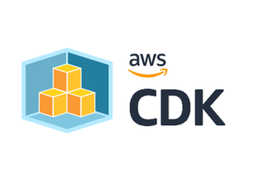

1달 반?만에 포스팅입니다.(프로젝트 너무 바빴어요.. 그래도 우수상 2개 ^^)

이제 \[LG U+\] 유레카 3기가 막 끝나서 진행한 프로젝트 문서 정리 및 회고 정리 시작할게요...

* * *

## **1\. 개요**

**Holliverse** 프로젝트에서 인프라를 맡기 전까지는, 인프라 구성이라고 하면 그냥 **AWS Console** 켜서 리소스 하나하나 눌러서 만드는 거라고만 알고 있었습니다. 블로그나 유튜브 강의들도 대부분 콘솔 기반으로 설명하고 있었고, 저도 별 의심 없이 그게 기본 방법이겠거니 생각했습니다.

근데 막상 콘솔로 직접 인프라를 구축해보니까, 불편한 점이 꽤 있었습니다. 프로젝트 끝나고 비용 때문에 서버랑 DB를 정리하고 나면, 나중에 다시 환경을 복원하려 할 때 "그래서 내가 뭘 어떻게 만들었더라..."를 처음부터 되짚어야 하는 상황이 생기더라고요. VPC 어떻게 나눴는지, 보안 그룹은 뭘 열었는지, ALB랑 ECS는 어떻게 연결했는지, Route53이랑 인증서는 어떤 순서로 붙였는지까지 전부 기억에 의존해야 합니다. 한 번 만드는 건 어찌어찌 할 수 있어도, 똑같은 환경을 다시 안정적으로 재현하는 건 완전히 다른 문제였습니다.

그러다가 URECA에서 진행한 미니 프로젝트 **Slack Judge**를 하면서 **IaC(Infrastructure as Code)**라는 개념을 처음 제대로 접했습니다. 당시에 팀원이 **Terraform**으로 인프라를 관리하는 걸 보면서 뭔가 느끼는 게 있었습니다. "아, 인프라도 한 번 만드는 것보다 계속 유지하고 다시 재현할 수 있게 관리하는 게 훨씬 중요하구나." 콘솔로 만든 인프라는 만든 흔적만 남지만, 코드로 만든 인프라는 왜 이렇게 설계했는지까지 같이 남습니다. 프로젝트가 커질수록 이 차이가 확 와닿았습니다.

그래서 이번 **Holliverse** 프로젝트에서는 처음부터 IaC 방식으로 가기로 결정했습니다.

* * *

## **2\. Terraform VS CDK, 뭘 쓸까?**

IaC를 쓰기로 결정했을 때 제일 먼저 떠오른 건 당연히 **Terraform**이었습니다. IaC 도구 중에 가장 유명하고, 검색하면 레퍼런스도 정말 많이 나오니까요. 처음엔 그냥 **Terraform** 쓰면 되겠다 싶었는데, 제 상황을 좀 더 따져보니 생각이 달라졌습니다.

프로젝트 기간이 7주밖에 안 됐고, 저는 인프라만 맡은 게 아니라 **이탈률 관련 기능 설계**랑 **DB 설계**도 병행해야 했습니다. 솔직히 Terraform 문법이랑 상태 관리 방식까지 처음부터 익히면서 동시에 다른 것도 챙길 자신이 없었습니다. 생각보다 학습 비용이 만만치 않거든요.

다른 프로젝트를 진행하면서 AI 도움을 꽤 많이 받았는데, 그러면서 느낀 게 있었습니다. AI가 코드를 뚝딱 만들어주는 것과, 내가 그 코드를 진짜로 이해할 수 있느냐는 완전히 다른 문제라는 겁니다. **Terraform** 코드를 AI가 만들어줘도, 저한테는 그게 "이해해서 선택한" 코드가 아니라 "일단 받아서 그냥 쓰는" 코드가 되는 느낌이었습니다. 인프라는 잘못 건드리면 비용이나 보안에 바로 영향을 주는 영역인데, 그렇게 무지성으로 적용하기엔 좀 불안했습니다.

반면 **AWS CDK**는 레퍼런스가 상대적으로 적더라도, 공식 문서 자체가 꽤 잘 정리되어 있어서 직접 읽고 이해하는 게 충분히 가능하다고 판단했습니다.

제 기준은 "뭐가 더 유명한가"가 아니라, "7주 안에 내가 끝까지 이해하고 책임질 수 있는가"였습니다.

* * *

## **3\. 결국 Java CDK를 선택한 이유**

그럼 왜 **Java CDK**였느냐.

가장 큰 이유는 단순합니다. 우리 팀이 Java에 가장 익숙했기 때문입니다. **Holliverse** 백엔드 자체가 **Java + Spring Boot**로 돌아가고 있었는데, 인프라만 전혀 다른 언어로 관리하면 애플리케이션 코드는 Java로 이해하면서 인프라 코드는 또 따로 다른 방식으로 읽어야 하는 이중 부담이 생깁니다. 반면 인프라까지 Java로 통일하면, 최소한 코드를 읽고 수정하고 리뷰하는 기준은 하나로 맞출 수 있습니다.

AWS 공식 문서를 찾아봤을 때도, **Java**는 **CDK**에서 완전히 지원되는 안정적인 언어로 소개되어 있었고, JDK나 Maven, 기존 IDE 환경을 그대로 쓸 수 있어서 별도로 세팅할 것도 없었습니다. CDK 프로젝트 자체가 Maven 프로젝트로 생성되고, 리소스 설정도 **Props**나 **Builder 패턴**으로 구성되니까 백엔드 개발자한테는 딱 익숙한 구조입니다.

실제 작업에서도 이게 꽤 크게 작용했습니다. 저희 인프라가 EC2 하나 띄우는 수준이 아니라, VPC, ALB, ECS, ECR, Route53, ACM, RDS 같은 리소스를 조합해서 배포 환경을 구성하는 구조였습니다. 이걸 콘솔로 관리하면 나중에 재현이 어렵고, Terraform으로 관리하면 그 언어를 충분히 알아야 합니다. Java CDK는 익숙한 객체지향 방식으로 인프라를 구조화할 수 있으니까, 공통 설정은 묶고 환경별 차이는 분리하는 식으로 정리하기도 자연스러웠습니다.

AI랑 협업하는 상황에서도 마찬가지였습니다. AI가 코드를 만들어줘도 내가 "왜 이렇게 작성됐지?"를 직접 읽고 파악하고 수정할 수 있어야 의미가 있습니다. Java는 그게 가능한 언어였고, Terraform HCL은 그게 잘 안 되는 언어였습니다. AI가 뭔가 제안해줘도 "이게 맞는 건지" 검증이 안 되면, 편해 보이는 것 같지만 실제로는 책임을 AI한테 넘기는 거나 마찬가지거든요.

결국 **Java CDK**를 선택한 건 단순히 "Java 잘 하니까"가 아닙니다. 짧은 기간에 인프라 구축과 다른 기능 개발을 병행해야 했고, AI 도움을 받더라도 사람이 직접 구조를 이해하고 검증해야 하는 상황이었습니다. 그 조건들을 다 따져봤을 때 **Java CDK**가 가장 현실적인 선택이었습니다. 

[one-year-gap

one-year-gap has 10 repositories available. Follow their code on GitHub.

github.com](https://github.com/one-year-gap)
