## **1\. 개요**

해당 글에서는 이전 글에서 정리한 이탈률 생명주기를 바탕으로, 각 이벤트가 어떤 방식으로 이탈률 계산에 반영되는지, 그리고 이탈률 임계치에 도달한 이유를 기록하기 위해 어떤 파이프라인을 구축했는지를 설명하고자 한다. 이번 글에서는 그중에서도 실제 구축 과정에서 팀원들과 함께 고민했던 지점들, 그리고 그 문제를 어떤 방식으로 해결해 나갔는지를 중심으로 기록하려 한다.

* * *

## **2\. Event / Real Time / Default**

### **1) Event - 상담 데이터 이탈률 반영**

#### 고민 1) 어느 시점에 상담 데이터를 반영할 것 인가?

상담 데이터는 처음에는 Default 유형과 마찬가지로, 7일 단위의 배치 시스템을 통해 상담 내용을 분석한 뒤 그 결과를 이탈률에 반영하는 방식으로 결정했었다. 즉, 일정 기간 동안 누적된 상담 데이터를 모아 분석하고, 이후 해당 분석 결과를 기반으로 이탈률을 계산하는 구조였다.

하지만 이 방식에는 분명한 한계가 있었다. 예를 들어 사용자가 상담 과정에서 다음과 같은 내용을 남겼다고 가정해 보자.

-   “인터넷이 너무 느려서 다른 서비스를 이용하고 싶어요.”
-   “3일 전에 제 개인정보가 유출된 것 같은데, 정확한 사실 확인과 조치를 부탁드립니다.”

이러한 상담은 사용자가 서비스에 대해 강한 불만을 가지고 있거나, 이미 이탈을 고려하고 있음을 간접적으로 보여주는 신호라고 볼 수 있다.  
그런데 이런 신호를 최대 7일 뒤에나 분석하고 반영한다면, 관리자가 해당 사용자의 상태를 인지했을 때는 이미 서비스 해지가 발생한 이후일 수도 있다. 이탈 가능성이 드러나는 상담은 배치로 늦게 반영하기보다, 상담이 기록되는 시점에 최대한 빠르게 분석하고 즉시 이탈률에 반영해야 의미가 있다고 판단했다. 그래야 관리자가 실시간에 가깝게 위험 사용자를 모니터링할 수 있고, 필요한 대응도 더 빠르게 할 수 있기 때문이다. 결국 상담 데이터는 7일 단위 배치 반영이 아니라, ****상담이 생성되거나 분석 결과가 확정되는 시점에 이벤트성으로 이탈률에 반영하는 방향****으로 설계를 변경했다.

#### 고민 2) 어떻게 상담 데이터를 반영할 수 있는가?

이 단계에서 가장 많은 시간을 쓴 고민은, 분석된 상담 데이터를 ****어떤 방식으로 Admin Server에 전달할 것인가****였다. 현재 상담 분석은 Python 기반의 별도 서비스인 **Intelligence Server**에서 수행하고 있다. 이 서버는 상담 데이터에 대해 부정/긍정 판단을 수행하고, 비즈니스 키워드를 추출하고, 최종적으로 상담 분석 결과를 생성한다. 문제는, 이렇게 분석이 끝난 결과를 어떤 방식으로 Admin Server에 전달해 이탈률 계산 파이프라인에 연결할 것인가였다.

후보는 크게 세 가지였다.

-   MSK(Kafka)
-   HTTP
-   CDC

먼저 **MSK(Kafka)**는 초기에 후보로 올랐지만 비교적 빠르게 제외했다. 로그 데이터처럼 대량으로 빠르게 유입되는 이벤트라면 Kafka가 적합하지만, 상담 데이터는 그 정도의 대용량 트래픽이 발생하지 않는다. 상담은 비교적 낮은 빈도로 생성되고, 분석 결과 역시 건별로 의미가 크기 때문에 Kafka 기반의 스트리밍 구조를 도입하는 것은 현재 요구사항 대비 과하다고 판단했다. 즉, 처리량에 비해 운영 복잡도와 리소스 비용이 더 크다고 보았다.

그다음으로 검토한 방식은 HTTP였다. 이 방식은 상담이 등록되면 먼저 원본 데이터를 저장하고, 이후 상담 전문 또는 상담 ID를 Intelligence Server로 전달해 분석을 요청한 뒤, 분석 결과를 다시 Admin Server로 반영하는 흐름을 생각할 수 있었다. 하지만 이 방식은 곧바로 채택하지는 않았다.

겉보기에는 단순해 보였지만, 실제로는 “누가 분석 요청의 책임을 가지는가”, “분석 완료 시점을 어떻게 보장할 것인가”, “실패 시 재시도나 중복 반영은 어떻게 제어할 것인가” 같은 문제가 함께 따라왔기 때문이다. 특히 Admin Server가 직접 분석 흐름을 오케스트레이션하게 되면, 분석 서비스와의 결합도가 높아지고 시스템 간 책임 경계가 애매해질 수 있다는 점이 부담이었다.

#### 고민 3) 최종적으로 왜 CDC 방식을 선택하였는가?

여러 후보를 비교한 끝에, 상담 데이터 반영 방식은 최종적으로 **CDC(Change Data Capture)** 기반으로 가져가기로 결정했다.

가장 큰 이유는 ****서비스 간 책임을 자연스럽게 분리할 수 있었기 때문****이다. HTTP 요청 기반으로 설계를 가져가면, 상담이 등록되는 시점에 어느 서비스가 분석 요청을 시작하고, 어느 서비스가 그 완료를 기다리며, 실패 시 재시도까지 어디서 책임질 것인지가 애매해질 수 있다.

특히 **Admin Server**가 **Intelligence Server**의 분석 흐름까지 직접 의식하게 되면, 본래 이탈률 계산과 모니터링을 담당해야 하는 서비스가 분석 파이프라인의 오케스트레이션까지 떠안게 되는 문제가 생긴다. 반면 CDC 방식은 흐름이 훨씬 자연스럽다.

-   상담 원본 데이터는 기존처럼 서비스 DB에 먼저 저장된다.
-   Intelligence Server는 DB 변경을 감지해 필요한 상담 데이터를 가져간다.
-   자체적으로 부정/긍정 분석, 비즈니스 키워드 추출 및 매핑을 수행한다.
-   분석이 완료된 뒤, 그 결과만 Admin Server에 전달한다.

즉, 상담 데이터의 ****생성 책임은 원본 서비스****, 상담 데이터의 ****분석 책임은 Intelligence Server****, 분석 결과를 바탕으로 한 ****이탈률 반영 책임은 Admin Server****가 가지는 구조로 분리된다.

또 하나 중요한 이유는 ****실시간성 확보와 결합도 최소화****를 동시에 만족할 수 있었다는 점이다. 우리는 상담이 기록된 이후 가능한 한 빠르게 이탈률을 반영하고 싶었지만, 그렇다고 해서 Admin Server가 상담 생성 트랜잭션이나 분석 요청 흐름에 직접 결합되는 구조는 피하고 싶었다.

CDC는 데이터 변경을 기반으로 분석을 시작하기 때문에, 원본 서비스의 쓰기 흐름을 막지 않으면서도 비교적 빠르게 후속 분석 파이프라인을 시작할 수 있었다.

1.  ****재처리와 복구가 상대적으로 용이하다.****  
    HTTP 요청 기반에서는 특정 시점의 요청이 누락되거나 실패했을 때 이를 다시 복구하려면 별도의 재전송 로직이나 보상 로직이 필요하다. 반면 CDC는 원본 데이터 변경 이력을 기준으로 다시 따라갈 수 있기 때문에, 장애 상황에서 재처리 전략을 세우기가 훨씬 수월하다.
2.  ****분석 대상의 기준점이 명확하다.****  
    Admin Server 입장에서는 “분석해 달라”는 요청을 받는 것이 아니라, “분석이 완료된 결과”를 전달받게 된다.  
    즉, 이탈률 반영 시점은 상담 생성 시점이 아니라 ****분석 결과가 확정된 시점****으로 명확하게 정리된다.  
    이 덕분에 Admin Server는 본연의 책임인 이탈률 계산과 저장에 더 집중할 수 있었다.

별도의 변경 감지 파이프라인을 운영해야 하고, 분석 완료 이후 결과 전달 경로도 추가로 설계해야 했다. 하지만 우리는 이 복잡도가 장기적으로 더 나은 구조를 만든다고 판단했다. 단순히 “빠르게 연결하는 방법”보다는, 각 서비스가 자신의 책임에 집중할 수 있고 이후 확장이나 재처리에도 유리한 구조가 더 중요하다고 보았다.

결론적으로 상담 데이터는 아래와 같은 플로우로 진행된다.

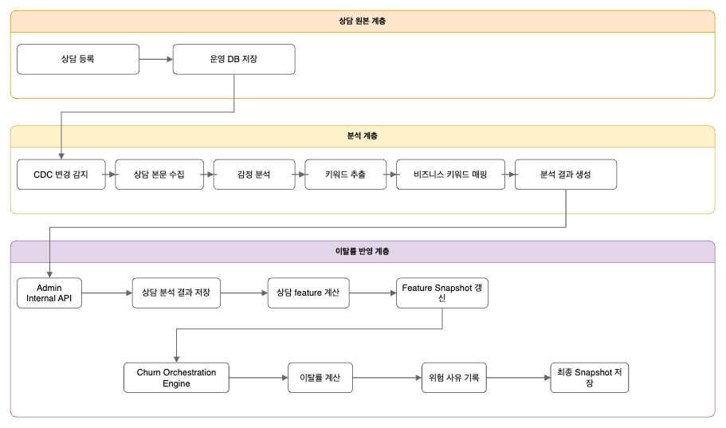

* * *

### **2) Real Time - 사용자 로그 데이터 이탈률 반영**

#### 고민 1) Customer Server로부터 로그를 받을때 MSK(Kafka)를 사용할 것 인가?

상담 데이터와 별개로, 사용자 행동 로그도 이탈률을 빠르게 반영할 수 있는 중요한 신호라고 봤다. 특히 우리가 주목한 로그는 요금제 탐색, 요금제 비교, 요금제 변경 시도, 위약금 조회처럼 사용자의 이탈 가능성을 비교적 직접적으로 보여주는 행동들이었다. 상담 데이터가 사용자의 불만을 텍스트로 드러내는 신호라면, 행동 로그는 사용자의 의도를 실제 행동으로 보여주는 신호에 가깝다.

문제는 이 로그를 어떤 방식으로 **Admin Server**에 전달할 것이냐였다. 가장 먼저 떠오른 선택지는 기존에도 사용 중이던 MSK(Kafka)였다. Kafka는 대량 이벤트를 비동기적으로 안정적으로 처리할 수 있어 충분히 매력적인 후보였다. 하지만 다시 생각해 보니, 정말 필요한 것은 모든 사용자 로그가 아니라, 이탈 가능성을 보여주는 일부 로그만 빠르게 전달하는 구조였다. 이 지점에서 팀은 “이 정도 로그량에 정말 Kafka가 필요할까?”를 먼저 검토했다. 대상 로그는 모든 클릭이나 페이지 진입처럼 지속적으로 쌓이는 이벤트가 아니라, 특정 상황에서만 발생하는 고의도 행동이었다. DAU 3만 명 수준을 가정하더라도 모든 사용자가 동시에 요금제를 비교하거나 위약금을 조회하는 것은 아니었고, 짧은 시간 안에 대량으로 반복되는 성격도 아니었다.

그래서 우리는 이 정도 규모라면 HTTP 기반으로도 충분히 안정적으로 처리할 수 있다고 판단했다. **Customer Server**에서 이탈률과 관련된 로그만 필터링해 **Admin Server**로 직접 전달하는 방식이 더 단순하고 목적에도 잘 맞았다. 물론 Kafka를 도입하면 버퍼링, 재처리, 소비자 확장 같은 장점이 있다. 하지만 이번 요구사항에서는 토픽 관리, 컨슈머 운영, 장애 추적 포인트 증가 같은 복잡도가 더 크게 느껴졌다. 결과적으로 Kafka는 기술적으로는 더 확장성 있는 선택이지만, 현재 문제를 해결하기에는 다소 무거운 구조였다. 전체 로그 저장과 장기 분석에는 Kafka가 여전히 유효하지만, 이탈률 반영용 실시간 로그는 적은 양의 고의도 이벤트만 다루기 때문에 HTTP로도 충분하다고 판단했다.

#### 고민 2) 로그를 왜 Customer Server에서 받아서 적재하지 않는가?

로그 데이터를 실시간으로 이탈률에 반영하기로 결정한 이후, 다음으로 고민한 것은 ****어느 서비스가 이탈 관련 로그를 선별할 것인가****였다.

처음에는 두 가지 방향을 생각할 수 있었다.

1.  **Customer Serve\*\***r**는 발생한 로그를 그대로 전달하고, \*\*Admin Server**가 그중 이탈률 계산에 필요한 로그만 다시 필터링하는 방식
2.  **Customer Server**에서부터 이탈률 반영 대상 로그만 선별해서 **Admin Server**로 전달하는 방식

Admin Server의 본래 역할은 로그 수집 서비스가 아니라, 전달받은 신호를 기반으로 ****이탈률을 계산하고, 그 이유를 기록하고, 관리자 화면에서 이를 조회할 수 있게 만드는 것****이다.

그런데 모든 로그를 그대로 받아버리면 Admin Server는 결국 “어떤 로그가 의미 있는가”를 계속 판단하는 책임을 가지고 시간이 지날수록 행동 로그 해석 규칙이 이탈률 계산 로직과 섞이게 된다. 우리가 다루는 사용자 로그는 Customer Server가 가장 먼저 의미를 해석할 수 있는 데이터다. 예를 들어 사용자가 요금제를 비교하거나 위약금을 조회하는 행동은 어떤 API에서 발생했는지, 단순 조회인지 실제 이탈 가능성과 연결되는 행동인지를 **Customer Server**가 가장 잘 알고 있다.

반면 **Admin Server**는 이러한 사용자 인터랙션의 세부 맥락까지 모두 알 필요는 없다. Admin Server는 이미 가공된 “이탈 관련 행동 신호”를 전달받고, 이를 기반으로 feature 계산, 점수 산정, 위험 사유 기록, snapshot 저장에 집중하는 책임만을 가지면 된다. 즉, 우리는 로그 필터링을 단순한 성능 최적화가 아니라 ****서비스 책임 분리의 문제****로 보았다.

이탈률 반영 대상 로그를 **Customer Server**에서 먼저 필터링하면 아래와 같은 장점이 있었다.

-   Admin Server가 불필요한 원본 로그 맥락까지 알지 않아도 된다.
-   전체 로그를 모두 전달하지 않아도 되므로 전송량과 내부 호출 비용을 줄일 수 있다.
-   로그 해석 규칙을 사용자 행동에 가장 가까운 Customer Server에 둘 수 있다.
-   Admin Server는 이탈률 계산과 저장이라는 책임에 더 집중할 수 있다.

물론 어떤 로그를 이탈 관련 이벤트로 볼 것인지에 대한 규칙이 **Customer Server**에 들어가기 때문에 관리 포인트가 늘어날 수 있다는 점은 단점이었다. 하지만 현재 이탈률에 반영하기로 한 로그 종류가 명확했고, 전체 로그를 모두 넘긴 뒤 **Admin Server**에서 다시 해석하는 구조보다 훨씬 단순하다고 판단했다.

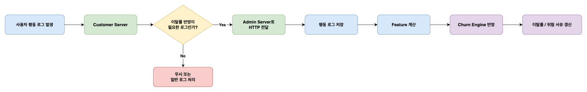

* * *

### **3) Default - 사용자 기본 정보 주기적 배치 반영**

#### 고민 1) 어떤 값들을 갱신해야 하는가?

사용자 기본 정보는 상담 내용이나 행동 로그처럼 실시간으로 크게 변하지 않는다. 하지만 **계약 상태**, **이용 기간**, **사용량 대비 요금 수준**처럼 사용자의 현재 상태를 보여주는 정보는 이탈률을 해석하는 핵심 기준이 된다. 중요한 것은 많은 데이터를 가져오는 것이 아니라, 실제로 이탈 가능성을 설명할 수 있는 값만 선별하는 것이었다. 이를 위해 우리는 기본 정보를 계약 기반 정보와 사용량 기반 정보로 나눠 보았다.

**계약 기반 정보**에서는 약정 상태와 계약 잔여 기간처럼 서비스 유지 여부에 영향을 주는 값을 중요하게 봤다. **사용량 기반 정보**에서는 현재 요금제와 실제 사용량이 얼마나 맞는지, 그리고 사용량 변화가 어떤 신호를 주는지를 중심으로 판단했다. 또한 데이터의 특성에 맞게 반영 방식도 구분했다. 상담 데이터와 행동 로그는 이벤트 기반으로 처리하고, 계약 정보와 사용량 정보는 주기적 배치로 반영하는 방식이 더 안정적이었다. 결국 기본 정보 반영의 핵심은 데이터의 양이 아니라, 이탈 가능성을 설명할 수 있는 의미 있는 값만 선택하는 데 있었다.

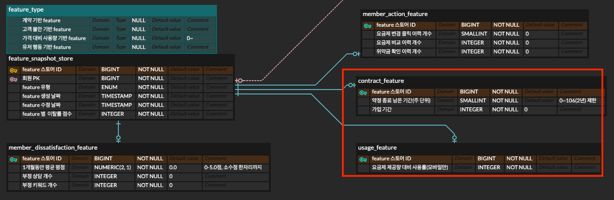

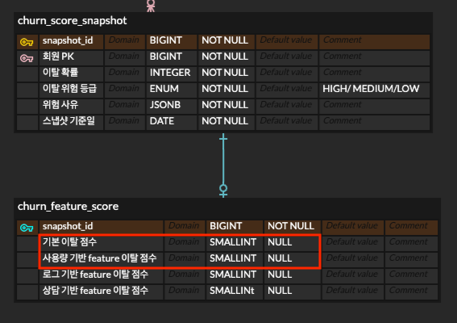

* * *

## **3\. 이탈률 데이터 적재 및 계산 오케스트레이션 엔진 구축**

먼저 해당 이탈률 계산에 대해서 계산 엔진을 설계할 때 2가지 고려 사항을 우선시하여 설계를 진행했다.

1.  우리 서비스에 새로운 Feature가 추가되더라도 전체 계산 흐름을 다시 뜯어고치지 않을 것
2.  룰 기반 시스템의 특성상 가중치와 임계치가 언제든 바뀔 수 있다는 점을 구조적으로 수용할 것

이 두 가지를 만족시키기 위해 우리는 ****입력 채널별 처리****와 ****최종 이탈률 집계****를 분리한 오케스트레이션 구조를 설계했다.  
상담, 로그, 배치 데이터는 모두 서로 다른 형태로 들어오지만, 최종적으로는 feature -> feature snapshot -> churn snapshot이라는 동일한 흐름으로 수렴하도록 만들었다.

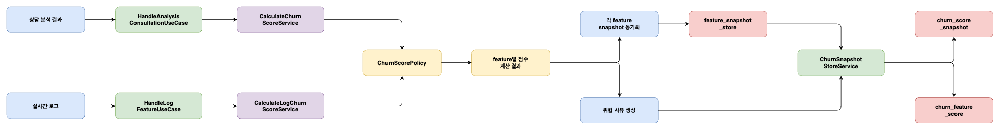

입력 이벤트가 최종 이탈률을 덮여쓰지 않는다. 각 입력 파이프라인은 먼저 자신이 담당하는 Feature만을 계산하고, **feature\_snapshot\_store**를 갱신한다. 그 다음 공통 오케스트레이션 계층이 최신 Feature 점수를 다시 읽어 최종 이탈률과 위험 사유를 저장한다.

### 1) Feature 확장성을 어떻게 확보했는가?

가장 중요한 확장 포인트는 **ChurnFeatureType**, **ChurnFeatureScorer**, **ChurnFeatureScorerFactory**였다. 새로운 Feature가 추가되면 새로운 feature 모델과 scorer를 추가하고, 입력 계층에서 해당 feature snapshot만 동기화하면 된다. 공통 계산 정책인 **ChurnScorePolicy**는 **ChurnFeatureSet**에 담긴 feature들을 순회하면서 scorer를 찾아 점수를 계산하므로, 계산 흐름 자체는 바뀌지 않는다.

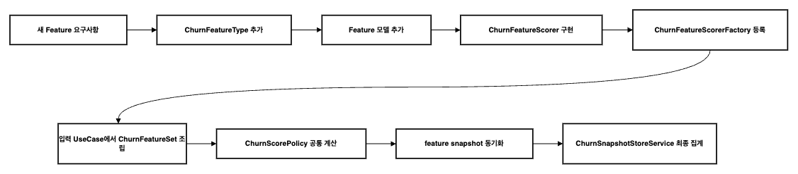

이 방식의 장점은 새 Feature가 들어와도 controller, use case, policy, 저장 계층을 전부 수정하는 것이 아니라, 주로 아래와 같은 고정된 지점만 건드리면 된다는 점이다.

-   feature 유형 정의
-   해당 feature의 점수 계산기 구현
-   해당 feature의 snapshot 동기화 로직
-   필요 시 최종 feature score 저장 컬럼

즉, 확장 포인트가 명확하기 때문에 기능이 늘어나더라도 전체 코드가 무너지는 구조를 피할 수 있었다.

* * *

### 2) 가중치 변경 가능성을 어떻게 분리하는가?

이탈률 계산에서 두 번째로 중요했던 것은, 점수 계산 가중치 규칙이 언제든지 변경될 수 있다는 점이다. 이탈률은 모델 기반보다는 룰 기반 성격이 강했기 때문에 운영 중에도 관리자가 '특정 조건에 대해서 점수를 높이고 싶다', '위험도 기준을 조금 낮추고 싶다' 같은 요구가 충분히 나올 수 있다.

그래서 가중치를 직접 하드코딩으로 controller나 usecase 안에 직접 밀어넣지 않고 **설정 파일(appication-churn.yml)**과 **scoreer 계층**으로 분리했다.

해당 값들은 Default를 지정해주고 AWS Secret Manager로 관리했다.

```yaml
app:
  churn:
    # 최종 이탈 점수 구간별 위험도 기준.
    grade:
      high: ${APP_CHURN_GRADE_HIGH:80}
      medium: ${APP_CHURN_GRADE_MEDIUM:50}
    rules:
      contract:
        # 약정 종료가 가까울수록 구조적 churn risk를 높게 본다.
        remaining-weeks:
          - min: ${APP_CHURN_RULE_CONTRACT_REMAINING_WEEKS_1_MIN:0}
            max: ${APP_CHURN_RULE_CONTRACT_REMAINING_WEEKS_1_MAX:2}
            score: ${APP_CHURN_RULE_CONTRACT_REMAINING_WEEKS_1_SCORE:20}
          - min: ${APP_CHURN_RULE_CONTRACT_REMAINING_WEEKS_2_MIN:3}
            max: ${APP_CHURN_RULE_CONTRACT_REMAINING_WEEKS_2_MAX:4}
            score: ${APP_CHURN_RULE_CONTRACT_REMAINING_WEEKS_2_SCORE:16}
          - min: ${APP_CHURN_RULE_CONTRACT_REMAINING_WEEKS_3_MIN:5}
            max: ${APP_CHURN_RULE_CONTRACT_REMAINING_WEEKS_3_MAX:8}
            score: ${APP_CHURN_RULE_CONTRACT_REMAINING_WEEKS_3_SCORE:12}
          - min: ${APP_CHURN_RULE_CONTRACT_REMAINING_WEEKS_4_MIN:9}
            max: ${APP_CHURN_RULE_CONTRACT_REMAINING_WEEKS_4_MAX:12}
            score: ${APP_CHURN_RULE_CONTRACT_REMAINING_WEEKS_4_SCORE:8}
          - min: ${APP_CHURN_RULE_CONTRACT_REMAINING_WEEKS_5_MIN:13}
            score: ${APP_CHURN_RULE_CONTRACT_REMAINING_WEEKS_5_SCORE:0}
        # 가입 초기 churn 가능성을 반영
        tenure-weeks:
          - min: ${APP_CHURN_RULE_CONTRACT_TENURE_WEEKS_1_MIN:0}
            max: ${APP_CHURN_RULE_CONTRACT_TENURE_WEEKS_1_MAX:4}
            score: ${APP_CHURN_RULE_CONTRACT_TENURE_WEEKS_1_SCORE:10}
          - min: ${APP_CHURN_RULE_CONTRACT_TENURE_WEEKS_2_MIN:5}
            max: ${APP_CHURN_RULE_CONTRACT_TENURE_WEEKS_2_MAX:12}
            score: ${APP_CHURN_RULE_CONTRACT_TENURE_WEEKS_2_SCORE:6}
          - min: ${APP_CHURN_RULE_CONTRACT_TENURE_WEEKS_3_MIN:13}
            score: ${APP_CHURN_RULE_CONTRACT_TENURE_WEEKS_3_SCORE:0}
      usage:
        # 제공량 대비 실제 사용률이 낮을수록 요금 대비 체감 가치가 낮다고 본다.
        allowance-usage-rate-pct:
          - min: ${APP_CHURN_RULE_USAGE_ALLOWANCE_USAGE_RATE_PCT_1_MIN:0}
            max: ${APP_CHURN_RULE_USAGE_ALLOWANCE_USAGE_RATE_PCT_1_MAX:10}
            score: ${APP_CHURN_RULE_USAGE_ALLOWANCE_USAGE_RATE_PCT_1_SCORE:15}
          - min: ${APP_CHURN_RULE_USAGE_ALLOWANCE_USAGE_RATE_PCT_2_MIN:11}
            max: ${APP_CHURN_RULE_USAGE_ALLOWANCE_USAGE_RATE_PCT_2_MAX:30}
            score: ${APP_CHURN_RULE_USAGE_ALLOWANCE_USAGE_RATE_PCT_2_SCORE:12}
          - min: ${APP_CHURN_RULE_USAGE_ALLOWANCE_USAGE_RATE_PCT_3_MIN:31}
            max: ${APP_CHURN_RULE_USAGE_ALLOWANCE_USAGE_RATE_PCT_3_MAX:50}
            score: ${APP_CHURN_RULE_USAGE_ALLOWANCE_USAGE_RATE_PCT_3_SCORE:8}
          - min: ${APP_CHURN_RULE_USAGE_ALLOWANCE_USAGE_RATE_PCT_4_MIN:51}
            score: ${APP_CHURN_RULE_USAGE_ALLOWANCE_USAGE_RATE_PCT_4_SCORE:0}
      member-action:
        # 최근 요금제 변경 횟수. 가격 민감도 signal이지만 비교/위약금 조회보다는 약하게 반영한다.
        change-mobile-count:
          - min: ${APP_CHURN_RULE_MEMBER_ACTION_CHANGE_MOBILE_COUNT_1_MIN:0}
            max: ${APP_CHURN_RULE_MEMBER_ACTION_CHANGE_MOBILE_COUNT_1_MAX:0}
            score: ${APP_CHURN_RULE_MEMBER_ACTION_CHANGE_MOBILE_COUNT_1_SCORE:0}
          - min: ${APP_CHURN_RULE_MEMBER_ACTION_CHANGE_MOBILE_COUNT_2_MIN:1}
            max: ${APP_CHURN_RULE_MEMBER_ACTION_CHANGE_MOBILE_COUNT_2_MAX:1}
            score: ${APP_CHURN_RULE_MEMBER_ACTION_CHANGE_MOBILE_COUNT_2_SCORE:5}
          - min: ${APP_CHURN_RULE_MEMBER_ACTION_CHANGE_MOBILE_COUNT_3_MIN:2}
            max: ${APP_CHURN_RULE_MEMBER_ACTION_CHANGE_MOBILE_COUNT_3_MAX:2}
            score: ${APP_CHURN_RULE_MEMBER_ACTION_CHANGE_MOBILE_COUNT_3_SCORE:8}
          - min: ${APP_CHURN_RULE_MEMBER_ACTION_CHANGE_MOBILE_COUNT_4_MIN:3}
            score: ${APP_CHURN_RULE_MEMBER_ACTION_CHANGE_MOBILE_COUNT_4_SCORE:15}
        # 요금제 비교 행동은 실시간 churn intent signal로 취급
        comparison-count:
          - min: ${APP_CHURN_RULE_MEMBER_ACTION_COMPARISON_COUNT_1_MIN:0}
            max: ${APP_CHURN_RULE_MEMBER_ACTION_COMPARISON_COUNT_1_MAX:0}
            score: ${APP_CHURN_RULE_MEMBER_ACTION_COMPARISON_COUNT_1_SCORE:0}
          - min: ${APP_CHURN_RULE_MEMBER_ACTION_COMPARISON_COUNT_2_MIN:1}
            max: ${APP_CHURN_RULE_MEMBER_ACTION_COMPARISON_COUNT_2_MAX:1}
            score: ${APP_CHURN_RULE_MEMBER_ACTION_COMPARISON_COUNT_2_SCORE:8}
          - min: ${APP_CHURN_RULE_MEMBER_ACTION_COMPARISON_COUNT_3_MIN:2}
            max: ${APP_CHURN_RULE_MEMBER_ACTION_COMPARISON_COUNT_3_MAX:2}
            score: ${APP_CHURN_RULE_MEMBER_ACTION_COMPARISON_COUNT_3_SCORE:12}
          - min: ${APP_CHURN_RULE_MEMBER_ACTION_COMPARISON_COUNT_4_MIN:3}
            score: ${APP_CHURN_RULE_MEMBER_ACTION_COMPARISON_COUNT_4_SCORE:15}
        # 위약금 조회는 churn intent signal 높은 점수 부여
        checked-penalty-fee-count:
          - min: ${APP_CHURN_RULE_MEMBER_ACTION_CHECKED_PENALTY_FEE_COUNT_1_MIN:0}
            max: ${APP_CHURN_RULE_MEMBER_ACTION_CHECKED_PENALTY_FEE_COUNT_1_MAX:0}
            score: ${APP_CHURN_RULE_MEMBER_ACTION_CHECKED_PENALTY_FEE_COUNT_1_SCORE:0}
          - min: ${APP_CHURN_RULE_MEMBER_ACTION_CHECKED_PENALTY_FEE_COUNT_2_MIN:1}
            max: ${APP_CHURN_RULE_MEMBER_ACTION_CHECKED_PENALTY_FEE_COUNT_2_MAX:1}
            score: ${APP_CHURN_RULE_MEMBER_ACTION_CHECKED_PENALTY_FEE_COUNT_2_SCORE:25}
          - min: ${APP_CHURN_RULE_MEMBER_ACTION_CHECKED_PENALTY_FEE_COUNT_3_MIN:2}
            score: ${APP_CHURN_RULE_MEMBER_ACTION_CHECKED_PENALTY_FEE_COUNT_3_SCORE:35}
      member-dissatisfaction:
        # 상담 만족도 평균은 batch/default 성격의 불만 signal
        star-mean-score:
          - min: ${APP_CHURN_RULE_MEMBER_DISSATISFACTION_STAR_MEAN_SCORE_1_MIN:1.0}
            max: ${APP_CHURN_RULE_MEMBER_DISSATISFACTION_STAR_MEAN_SCORE_1_MAX:1.9}
            score: ${APP_CHURN_RULE_MEMBER_DISSATISFACTION_STAR_MEAN_SCORE_1_SCORE:15}
          - min: ${APP_CHURN_RULE_MEMBER_DISSATISFACTION_STAR_MEAN_SCORE_2_MIN:2.0}
            max: ${APP_CHURN_RULE_MEMBER_DISSATISFACTION_STAR_MEAN_SCORE_2_MAX:2.9}
            score: ${APP_CHURN_RULE_MEMBER_DISSATISFACTION_STAR_MEAN_SCORE_2_SCORE:10}
          - min: ${APP_CHURN_RULE_MEMBER_DISSATISFACTION_STAR_MEAN_SCORE_3_MIN:3.0}
            max: ${APP_CHURN_RULE_MEMBER_DISSATISFACTION_STAR_MEAN_SCORE_3_MAX:3.9}
            score: ${APP_CHURN_RULE_MEMBER_DISSATISFACTION_STAR_MEAN_SCORE_3_SCORE:5}
          - min: ${APP_CHURN_RULE_MEMBER_DISSATISFACTION_STAR_MEAN_SCORE_4_MIN:4.0}
            score: ${APP_CHURN_RULE_MEMBER_DISSATISFACTION_STAR_MEAN_SCORE_4_SCORE:0}
        # 상담 전체 감정 분석 결과 점수
        sentiment:
          negative: ${APP_CHURN_RULE_MEMBER_DISSATISFACTION_SENTIMENT_NEGATIVE:10}
          positive: ${APP_CHURN_RULE_MEMBER_DISSATISFACTION_SENTIMENT_POSITIVE:0}
          none: ${APP_CHURN_RULE_MEMBER_DISSATISFACTION_SENTIMENT_NONE:0}
```

위의 설정들은 **ChurnScoringProperties.java**로 바인딩되고, 실제 계산은 각 **scorer**가 담당하게 된다. 예를 들어 사용자 로그 Feature를 계산하는 **MemberActionFeatureScorer.java**는 아래와 같이 동작한다.

```java
@Override
public List<ChurnFeatureContribution> contribute(ChurnFeature feature) {
    MemberActionFeature memberActionFeature = (MemberActionFeature) feature;
    int comparisonScore = churnScoreBandResolver.resolveIntScore(
            churnScoringProperties.getRules().getMemberAction().getComparisonCount(),
            memberActionFeature.comparisonCount()
    );

    return List.of(
            new ChurnFeatureContribution(
                    ChurnSignalType.COMPARISON_COUNT,
                    String.valueOf(memberActionFeature.comparisonCount()),
                    comparisonScore
            )
    );
}
```

실제 가중치 값은 설정파일에서 읽고, 그 규칙을 통해 **ChurnFeatureContribution**으로 바꾸어 준다.

```java
/**
 * 최종 점수 기준 등급 판정 정책.
 */
@Profile("admin")
@Component
@RequiredArgsConstructor
public class ChurnRiskGradePolicy {

    private final ChurnScoringProperties churnScoringProperties;

    public ChurnRiskGrade classify(int score) {
        if (score >= churnScoringProperties.getGrade().getHigh()) {
            return ChurnRiskGrade.HIGH;
        }

        if (score >= churnScoringProperties.getGrade().getMedium()) {
            return ChurnRiskGrade.MEDIUM;
        }

        return ChurnRiskGrade.LOW;
    }
}
```

**최종 이탈률 위험 등급(HIGH, MEDIUM, LOW)** 판정도 총점만을 매개변수로 받아 위험도를 판정한다.

이러한 구조를 구성하여 "가중치"라는 정책이 변경되더라도 입력 파이프라인이나 오케스트레이션 흐름 자체를 수정할 필요가 없다. **데이터의 파이프라인 구조**와 **점수를 계산하는 로직**을 분리하였다.

* * *

### 3) 상담/로그/배치가 실제로 어떤 순서로 같은 엔진에 합류하는가

앞에서 설명한 것처럼 입력 채널은 서로 다르지만, 최종적으로는 동일한 계산 엔진으로 합류되도록 설계했다. 상담은 상담대로, 로그는 로그대로, 배치는 배치대로 데이터를 해석하지만, 마지막에는 모두 같은 snapshot 집계 흐름으로 들어간다.

해당 계산 로직의 포인트는 **각 입력 채널들이 최종 이탈률을 계산하지 않는다**는 점이다. 모든 입력은 각자 담당하는 Feature를 계산하고 저장한 뒤, 공통 오케스트레이션 엔진이 최신 Feature 점수들을 다시 읽어 최종 이탈률을 갱신한다.

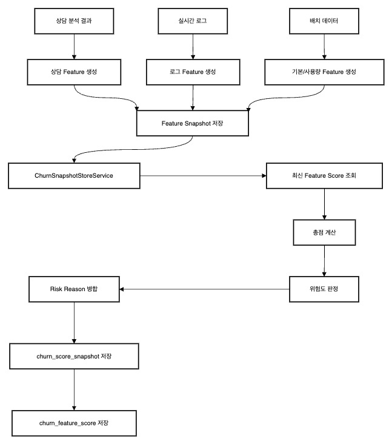

오케스트레이션 동작 다이어그램

* * *

#### 3-1. 상담데이터가 들어오는 방식

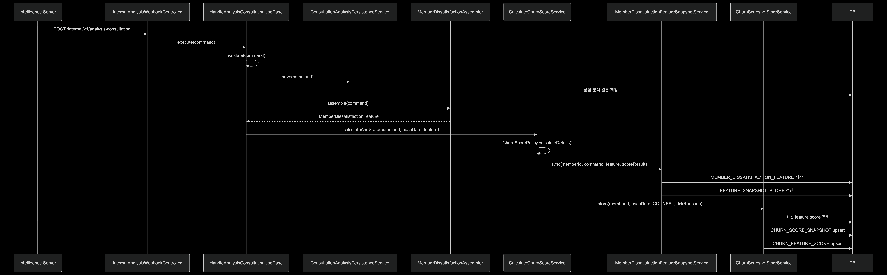

상담데이터 입력 시퀀스 다이어그램

**Intelligence Server**로부터 분석된 상담 데이터를 아래와 같은 Json 형식으로 받아온다.

```http
POST /internal/v1/analysis-consultation
{
  "dispatchRequestId": "dispatch-001",
  "caseId": 101,
  "analyzeVersion": 1,
  "analysisId": 5001,
  "memberId": 10001,
  "status": "COMPLETED",
  "keywordTypes": 2,
  "keywordHits": 3,
  "consultationType": "NEGATIVE",
  "keywordCounts": [
    {
      "keywordId": 1,
      "businessKeywordId": 10,
      "keywordCode": "terminate",
      "keywordName": "해지",
      "count": 2,
      "negativeWeight": 10
    }
  ],
  "producedAt": "2026-03-27T10:15:00Z"
}
```

**InternalAnalysisWebhookController.java**에서 해당 데이터를 받아온다.

```java
@Profile("admin")
@RequiredArgsConstructor
@RestController
@RequestMapping("/internal/v1/analysis-consultation")
public class InternalAnalysisWebhookController {
    private final HandleAnalysisConsultationUseCase useCase;

    @PostMapping
    public ResponseEntity<Void> receive(@RequestBody @Valid AnalysisResponseWebhookRequest request) {
        // 요청 처리
        useCase.execute(toCommand(request));

        // 응답 반환
        return ResponseEntity.accepted().build();
    }

    private AnalysisResponseCommand toCommand(AnalysisResponseWebhookRequest request) {
        // 키워드 목록 변환
        List<AnalysisResponseCommand.KeywordCountCommand> keywordCounts = request.keywordCounts() == null
                ? List.of()
                : request.keywordCounts().stream()
                .map(item -> new AnalysisResponseCommand.KeywordCountCommand(
                        item.keywordId(),
                        item.businessKeywordId(),
                        item.keywordCode(),
                        item.keywordName(),
                        item.count(),
                        item.negativeWeight()
                ))
                .toList();

        // 명령 변환
        return new AnalysisResponseCommand(
                "analysis.response.v1",
                request.dispatchRequestId(),
                null,
                request.caseId(),
                (long) request.analyzeVersion(),
                (long) request.analysisId(),
                request.memberId(),
                request.status().name(),
                toSentimentType(request.consultationType()),
                request.keywordTypes(),
                request.keywordHits(),
                keywordCounts,
                null,
                request.producedAt() != null ? request.producedAt() : java.time.Instant.now()
        );
    }

    private ConsultationSentimentType toSentimentType(Enum<?> consultationType) {
        // 기본 감정
        if (consultationType == null) {
            return ConsultationSentimentType.NONE;
        }

        // 감정 변환
        return ConsultationSentimentType.valueOf(consultationType.name());
    }
}
```

이 요청은 **HandleAnalysisConsultationUseCase.java**로 넘어가서, 아래와 같은 작업을 수행한다.

1.  입력값 검증
2.  분석 원본 저장
3.  상담 Feature 저장
4.  공통 계산 서비스 호출

```java
@Service
@Profile("admin")
@RequiredArgsConstructor
public class HandleAnalysisConsultationUseCase {
    private final ConsultationAnalysisPersistenceService persistenceService;
    private final MemberDissatisfactionAssembler assembler;
    private final CalculateChurnScoreService calculateChurnScoreService;

    @Transactional
    public ChurnEvaluationResult execute(AnalysisResponseCommand command) {
        // 입력 검증
        validate(command);

        // 분석 결과 저장
        persistenceService.save(command);

        // 상담 feature 생성
        MemberDissatisfactionFeature dissatisfactionFeature = assembler.assemble(command);

        // 이탈률 계산
        return calculateChurnScoreService.calculateAndStore(
                command,
                resolveBaseDate(command),
                dissatisfactionFeature
        );
    }

    private void validate(AnalysisResponseCommand command) {
        // 회원 확인
        if (command.memberId() == null) {
            throw new IllegalArgumentException("memberId는 필수입니다.");
        }

        // 상태 확인
        if (!CounselAnalysisStatus.COMPLETED.name().equals(command.status())) {
            throw new IllegalArgumentException("완료된 상담 분석 결과만 처리할 수 있습니다. status=" + command.status());
        }
    }
    
    ...
  
}
```

분석 원본 저장은 **ConsultationAnalysisDao.java**에서 처라되고, consultation\_analysis(상담 분석 결과), business\_keyword\_mapping\_result(비즈니스 매핑 결과) 테이블에 저장된다.

이후에 **CalculateChurnScoreService.java**가 상담 Feature를 점수화한다.

```java
@Service
@Profile("admin")
@RequiredArgsConstructor
public class CalculateChurnScoreService {

    private final ChurnScorePolicy churnScorePolicy;
    private final ChurnRiskReasonFactory churnRiskReasonFactory;
    private final ChurnSnapshotStoreService churnSnapshotStoreService;
    private final MemberDissatisfactionFeatureSnapshotService memberDissatisfactionFeatureSnapshotService;

    /**
     * 스냅샷 계산.
     */
    public ChurnEvaluationResult calculateAndStore(
            AnalysisResponseCommand command,
            LocalDate baseDate,
            MemberDissatisfactionFeature dissatisfactionFeature
    ) {
        // feature 조립
        ChurnFeatureSet featureSet = new ChurnFeatureSet(Map.of(
                ChurnFeatureType.MEMBER_DISSATISFACTION,
                dissatisfactionFeature
        ));

        // 점수 계산
        ChurnScoreCalculationResult scoreResult = churnScorePolicy.calculateDetails(featureSet);

        // feature 스냅샷 저장
        memberDissatisfactionFeatureSnapshotService.sync(
                command.memberId(),
                command,
                dissatisfactionFeature,
                scoreResult
        );

        // 위험 사유 조립
        List<ChurnRiskReason> riskReasons = buildCounselRiskReasons(command, scoreResult);

        // 스냅샷 저장
        return churnSnapshotStoreService.store(
                command.memberId(),
                baseDate,
                ChurnRiskReason.Feature.COUNSEL,
                riskReasons
        );
    }

    /**
     * 상담 사유 조립.
     */
    private List<ChurnRiskReason> buildCounselRiskReasons(
            AnalysisResponseCommand command,
            ChurnScoreCalculationResult scoreResult
    ) {
        ...
    }

    /**
     * 감정 사유.
     */
    private Optional<ChurnRiskReason> buildSentimentReason(
            AnalysisResponseCommand command,
            ChurnScoreCalculationResult scoreResult
    ) {
       ...
    }

    /**
     * 키워드 사유.
     */
    private Optional<ChurnRiskReason> buildKeywordReason(
            AnalysisResponseCommand command,
            ChurnScoreCalculationResult scoreResult
    ) {
        ...
    }
}
```

* * *

#### 3-2. 로그 데이터가 들어오는 방식

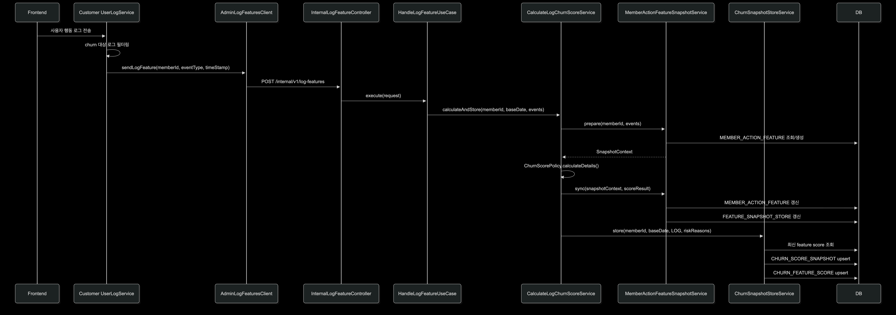

실시간 로그는 프론트엔드가 일정 시간 단위(5초)로 HTTP 방식으로 **Customer Server**로 전송된다. **UserLogService.java**는 전체로그를 Kafka로 전송하면서, churn과 관련 있는 로그들만 따로 **Admin Server**로 전송한다.

```java
/**
* Admin 이벤트 변환.
*/
private void sendAdminTarget(Long memberId, UserLogRequest request) {
    UserLogEventName eventName = UserLogEventName.from(request.eventName());
    if (!isAdminTarget(eventName)) {
        return;
    }

    adminLogFeaturesClient.sendLogFeature(
            memberId,
            eventName,
            request.timestamp()
    );
 }

/**
* 대상 이벤트.
*/
private boolean isAdminTarget(UserLogEventName eventName) {
   return eventName == UserLogEventName.CLICK_COMPARE
           || eventName == UserLogEventName.CLICK_PENALTY
           || eventName == UserLogEventName.CLICK_CHANGE;
}
```

아래와 같은 3가지 유형의 사용자 로그를 **Admin Server**로 전송한다.

-   click\_compare: 상품 비교 클릭
-   click\_penalty: 위약금 확인 클릭
-   click\_change: 요금 변경 클릭

**Admin Server**에서는 해당 로그들을 **HTTP 형식**으로 **InternalLogFeatureController.java**에서 받는다.

```java
/**
 * 실시간 로그 기반 feature customer -> admin 전송 로직
 */
@Profile("admin")
@RestController
@RequestMapping("/internal/v1/log-features")
@RequiredArgsConstructor
public class InternalLogFeatureController {
    private final HandleLogFeatureUseCase useCase;

    @PostMapping
    public ResponseEntity<Void> receive (@RequestBody @Valid LogFeatureWebhookRequest request){
        useCase.execute(request);

        return ResponseEntity.accepted().build();
    }

}
```

실제 요청 Json 형식은 아래와 같다.

```http
POST /internal/v1/log-features
{
  "eventType": "click_compare",
  "memberId": 10001,
  "timeStamp": "2026-03-27T10:30:00Z"
}
```

받은 요청값을 **HandleLogFeatureUseCase.java**에서 내부 이벤트로 정규화한다.

```java
@Service
@RequiredArgsConstructor
@Profile("admin")
public class HandleLogFeatureUseCase {

    private final CalculateLogChurnScoreService calculateLogChurnScoreService;

    /**
     * 실시간 로그 처리.
     *
     * 1. feature_snapshot_store memberId 조회
     * 2. member_action_feature 없으면 생성
     * 3. member_action_feature 요금제 비교 이력/위약금 확인 이력 UPDATE
     * 4. feature_snapshot_store:
     *                            feature_type = 'MEMBER_ACTION_FEATURE'
     *                            feature_score 계산(계산 오케스트레이션 계층 사용)
     */
    @Transactional
    public void execute(LogFeatureWebhookRequest request) {

        calculateLogChurnScoreService.calculateAndStore(
                request.memberId(),
                LocalDate.from(request.timeStamp()),
                List.of(new LogFeatureEvent(
                        resolveEventId(request),
                        request.timeStamp(),
                        "click",
                        request.eventType(),
                        Map.of()
                ))
        );
    }

    /**
     * 이벤트 식별자 생성.
     */
    private long resolveEventId(LogFeatureWebhookRequest request) {
        return Integer.toUnsignedLong((request.memberId() + "|" + request.eventType() + "|" + request.timeStamp()).hashCode());
    }

}
```

그 다음 **CalculateLogChurnScoreService.java**가 해당 **로그** **Feature**를 계산한다.

```java
package site.holliverse.admin.application.usecase;

import lombok.RequiredArgsConstructor;
import org.springframework.context.annotation.Profile;
import org.springframework.stereotype.Service;
import site.holliverse.admin.domain.model.churn.ChurnEvaluationResult;
import site.holliverse.admin.domain.model.churn.ChurnFeatureSet;
import site.holliverse.admin.domain.model.churn.ChurnFeatureType;
import site.holliverse.admin.domain.model.churn.ChurnScoreCalculationResult;
import site.holliverse.admin.domain.model.churn.ChurnSignalType;
import site.holliverse.admin.domain.model.churn.feature.MemberActionFeature;
import site.holliverse.admin.domain.policy.churn.ChurnScorePolicy;

import java.time.LocalDate;
import java.util.List;
import java.util.Map;
import java.util.Optional;

/**
 * 로그 이탈 계산 서비스.
 */
@Service
@Profile("admin")
@RequiredArgsConstructor
public class CalculateLogChurnScoreService {

    private final ChurnScorePolicy churnScorePolicy;
    private final ChurnRiskReasonFactory churnRiskReasonFactory;
    private final ChurnSnapshotStoreService churnSnapshotStoreService;
    private final MemberActionFeatureSnapshotService memberActionFeatureSnapshotService;

    /**
     * 로그 스냅샷 계산.
     */
    public ChurnEvaluationResult calculateAndStore(
            Long memberId,
            LocalDate baseDate,
            List<LogFeatureEvent> events
    ) {
        // 스냅샷 준비
        MemberActionFeatureSnapshotService.SnapshotContext snapshotContext =
                memberActionFeatureSnapshotService.prepare(memberId, events);

        // feature 조립
        ChurnFeatureSet featureSet = new ChurnFeatureSet(Map.of(
                ChurnFeatureType.MEMBER_ACTION,
                snapshotContext.feature()
        ));

        // 점수 계산
        ChurnScoreCalculationResult scoreResult = churnScorePolicy.calculateDetails(featureSet);

        // feature 스냅샷 저장
        memberActionFeatureSnapshotService.sync(snapshotContext, scoreResult);

        // 위험 사유 조립
        List<ChurnRiskReason> riskReasons = buildLogRiskReasons(events, snapshotContext.feature(), scoreResult);

        // 스냅샷 저장
        return churnSnapshotStoreService.store(memberId, baseDate, ChurnRiskReason.Feature.LOG, riskReasons);
    }

    /**
     * 로그 사유 조립.
     */
    private List<ChurnRiskReason> buildLogRiskReasons(
            List<LogFeatureEvent> events,
            MemberActionFeature feature,
            ChurnScoreCalculationResult scoreResult
    ) {
		...
    }

    /**
     * 로그 사유.
     */
    private Optional<ChurnRiskReason> buildLogReason(
            List<LogFeatureEvent> events,
            int totalCount,
            ChurnScoreCalculationResult scoreResult,
            ChurnRiskReason.ReasonCode reasonCode,
            ChurnSignalType signalType
    ) {
		...
    }

    /**
     * 이벤트 필터.
     */
    private List<LogFeatureEvent> filter(List<LogFeatureEvent> events, UserActionFeatureEventName eventName) {
        ...
    }

    /**
     * 이벤트 근거.
     */
    private List<ChurnRiskReason.LogEventItem> toLogItems(List<LogFeatureEvent> events) {
        ...
    }
}
```

* * *

#### 3-3. 배치 데이터가 들어오는 방식

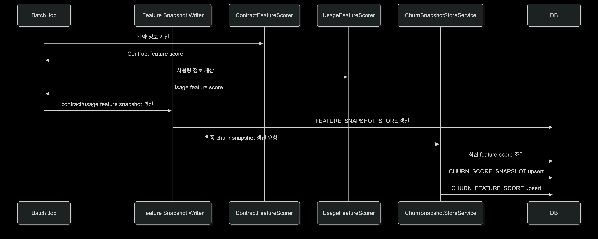

배치 데이터는 상담이나 로그처럼 즉시 들어오는 입력은 아니지만, 엔진에 합류하는 방식은 동일하다. 차이는 입력 시점이다. 상담과 로그는 이벤트 발생 시 들어오고, 배치는 일정 주기를 두고 계산하여 값을 적재한다.

**ContractFeatureScorer.java**와 **UsageFeatureScorer.java**가 각각 계약/사용량 Feature를 계산할 수 있게 작성하였다.

```java
/**
 * 계약 기반 feature 점수 계산.
 */
@Profile("admin")
@Component
@RequiredArgsConstructor
public class ContractFeatureScorer implements ChurnFeatureScorer {

    private final ChurnScoringProperties churnScoringProperties;
    private final ChurnScoreBandResolver churnScoreBandResolver;

    @Override
    public ChurnFeatureType supports() {
        return ChurnFeatureType.CONTRACT;
    }

    @Override
    public List<ChurnFeatureContribution> contribute(ChurnFeature feature) {
        ContractFeature contractFeature = (ContractFeature) feature;
        int remainingWeeksScore = churnScoreBandResolver.resolveIntScore(
                churnScoringProperties.getRules().getContract().getRemainingWeeks(),
                contractFeature.contractRemainingWeeks()
        );
        int tenureWeeksScore = churnScoreBandResolver.resolveIntScore(
                churnScoringProperties.getRules().getContract().getTenureWeeks(),
                contractFeature.tenureWeeks()
        );

        return List.of(
                new ChurnFeatureContribution(
                        ChurnSignalType.CONTRACT_REMAINING_WEEKS,
                        String.valueOf(contractFeature.contractRemainingWeeks()),
                        remainingWeeksScore
                ),
                new ChurnFeatureContribution(
                        ChurnSignalType.TENURE_WEEKS,
                        String.valueOf(contractFeature.tenureWeeks()),
                        tenureWeeksScore
                )
        );
    }
}
```

```java
/**
 * 사용량 기반 feature 점수 계산.
 */
@Profile("admin")
@Component
@RequiredArgsConstructor
public class UsageFeatureScorer implements ChurnFeatureScorer {

    private final ChurnScoringProperties churnScoringProperties;
    private final ChurnScoreBandResolver churnScoreBandResolver;

    @Override
    public ChurnFeatureType supports() {
        return ChurnFeatureType.USAGE;
    }

    @Override
    public List<ChurnFeatureContribution> contribute(ChurnFeature feature) {
        UsageFeature usageFeature = (UsageFeature) feature;
        int usageScore = churnScoreBandResolver.resolveIntScore(
                churnScoringProperties.getRules().getUsage().getAllowanceUsageRatePct(),
                usageFeature.allowanceUsageRatePct()
        );

        return List.of(
                new ChurnFeatureContribution(
                        ChurnSignalType.ALLOWANCE_USAGE_RATE_PCT,
                        String.valueOf(usageFeature.allowanceUsageRatePct()),
                        usageScore
                )
        );
    }
}
```

배치 작업 또한 최종 이탈률을 별도로 계산하는 것이 아니라, 오케스트레이션 엔진에 의해 계약/사용량 Feature의 최신 score를 snapshot 형태로 넣어준다.

그리고 공통 엔진은 그 값을 **ChurnSnapshotStoreService.java**에서 다시 읽는다.

```java
return new FeatureScores(
        toShortScore(latestScores.get(FeatureType.CONTRACT_FEATURE)),
        toShortScore(latestScores.get(FeatureType.USAGE_FEATURE)),
        toShortScore(latestScores.get(FeatureType.DISSATISFACTION_FEATURE)),
        toShortScore(latestScores.get(FeatureType.MEMBER_ACTION_FEATURE))
);
```

* * *

#### 3-4. 3가지 입력이 실제로 만나는 지점

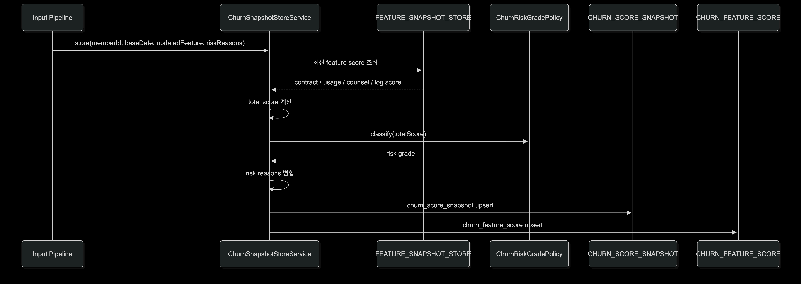

세 입력이 실제로 하나로 만나는 곳은 **ChurnSnapshotStoreService.java**이다.

```java
@Service
@Profile("admin")
@RequiredArgsConstructor
public class ChurnSnapshotStoreService {
  
    private static final Field<Long> CHURN_REVISION_ID = 
    		DSL.field(DSL.name("revision_id"), Long.class);
    private static final Field<java.time.OffsetDateTime> CHURN_UPDATED_AT =
            DSL.field(DSL.name("updated_at"), java.time.OffsetDateTime.class);
    private static final Field<Long> NEXT_CHURN_REVISION_ID =
            DSL.field("nextval('churn_score_revision_seq')", Long.class);

    private final DSLContext dsl;
    private final ObjectMapper objectMapper;
    private final ChurnRiskGradePolicy churnRiskGradePolicy;

    /**
     * 스냅샷 저장.
     */
    @Transactional
    public ChurnEvaluationResult store(
            Long memberId,
            LocalDate baseDate,
            ChurnRiskReason.Feature updatedFeature,
            List<ChurnRiskReason> riskReasons
    ) {
        // 상세 점수
        FeatureScores featureScores = readLatestFeatureScores(memberId);

        // 총점 계산
        ChurnScore churnScore = ChurnScore.fromRaw(featureScores.totalScore());
        int totalScore = churnScore.value();

        // 등급 계산
        ChurnRiskGrade riskGrade = churnRiskGradePolicy.classify(totalScore);

        // 위험 사유 직렬화
        JSONB riskReasonsJson = JSONB.valueOf(writeRiskReasons(mergeRiskReasons(
                memberId,
                baseDate,
                updatedFeature,
                riskReasons
        )));

        // 부모 업서트
        Long snapshotId = dsl.insertInto(CHURN_SCORE_SNAPSHOT)
                .set(CHURN_SCORE_SNAPSHOT.MEMBER_ID, memberId)
                .set(CHURN_SCORE_SNAPSHOT.CHURN_SCORE, totalScore)
                .set(CHURN_SCORE_SNAPSHOT.RISK_LEVEL, riskGrade.name())
                .set(CHURN_SCORE_SNAPSHOT.RISK_REASONS, riskReasonsJson)
                .set(CHURN_SCORE_SNAPSHOT.BASE_DATE, baseDate)
                .set(CHURN_REVISION_ID, NEXT_CHURN_REVISION_ID)
                .set(CHURN_UPDATED_AT, DSL.currentOffsetDateTime())
                .onConflict(CHURN_SCORE_SNAPSHOT.MEMBER_ID, CHURN_SCORE_SNAPSHOT.BASE_DATE)
                .doUpdate()
                .set(CHURN_SCORE_SNAPSHOT.CHURN_SCORE, totalScore)
                .set(CHURN_SCORE_SNAPSHOT.RISK_LEVEL, riskGrade.name())
                .set(CHURN_SCORE_SNAPSHOT.RISK_REASONS, riskReasonsJson)
                .set(CHURN_REVISION_ID, NEXT_CHURN_REVISION_ID)
                .set(CHURN_UPDATED_AT, DSL.currentOffsetDateTime())
                .returning(CHURN_SCORE_SNAPSHOT.SNAPSHOT_ID)
                .fetchOne(CHURN_SCORE_SNAPSHOT.SNAPSHOT_ID);

        // 자식 업서트
        dsl.insertInto(CHURN_FEATURE_SCORE)
                .set(CHURN_FEATURE_SCORE.SNAPSHOT_ID, snapshotId)
                .set(CHURN_FEATURE_SCORE.CHURN_BASE_SCORE, featureScores.baseScore())
                .set(CHURN_FEATURE_SCORE.CHURN_USAGE_SCORE, featureScores.usageScore())
                .set(CHURN_FEATURE_SCORE.CHURN_COUNSEL_SCORE, featureScores.counselScore())
                .set(CHURN_FEATURE_SCORE.CHURN_LOG_SCORE, featureScores.logScore())
                .onConflict(CHURN_FEATURE_SCORE.SNAPSHOT_ID)
                .doUpdate()
                .set(CHURN_FEATURE_SCORE.CHURN_BASE_SCORE, featureScores.baseScore())
                .set(CHURN_FEATURE_SCORE.CHURN_USAGE_SCORE, featureScores.usageScore())
                .set(CHURN_FEATURE_SCORE.CHURN_COUNSEL_SCORE, featureScores.counselScore())
                .set(CHURN_FEATURE_SCORE.CHURN_LOG_SCORE, featureScores.logScore())
                .execute();

        return new ChurnEvaluationResult(
                new ChurnScoreCalculationResult(churnScore, List.of()),
                riskGrade
        );
    }

    /**
     * 점수 변환.
     */
    private Short toShortScore(Integer featureScore) {
        return featureScore == null ? 0 : featureScore.shortValue();
    }

    /**
     * 점수 묶음.
     */
    private record FeatureScores(
            Short baseScore,
            Short usageScore,
            Short counselScore,
            Short logScore
    ) {
        /**
         * 총점 합계.
         */
        private int totalScore() {
            return score(baseScore) + score(usageScore) + score(counselScore) + score(logScore);
        }

        /**
         * 점수 계산.
         */
        private int score(Short value) {
            return value == null ? 0 : value;
        }
    }
}
```

해당 메서드에서는 '상담인지', '로그인지', '배치인지'를 구분하지 않고 회원의 최신 **Feature Score**만을 읽어와서

-   총점을 계산하고
-   위험도를 판정하고
-   기존 위험 사유와 새 위험 사유를 합치고
-   최종 snapshot를 저장한다.

[one-year-gap

one-year-gap has 10 repositories available. Follow their code on GitHub.

github.com](https://github.com/one-year-gap)
