# 📘 1. 힙 영역

## 1) 힙 영역 -  Heap Area

: JVM이 관리하는 프로그램상에서 데이터를 저장하기 위해 런타임 시 동적으로 할당하여 사용하는 영역. new 연산자로 생성되는 객체와 배열이 생성되는 영역.

> **Q. static이 아니라 new 생성자, 메서드들도 Heap영역에 저장하는 이유?**  
>   
> **A.** 클래스가 로딩될 때, 클래스의 모든 메서드 정보가 메서드 영역에 저장됨. 이 클래스를 이용하여 인스턴스를 사용할 때마다 heap 영역에 고유 주소값을 가진 인스턴스가 저장. 클래스라는 설계도를 가지고 생성된 객체들은 설계도에 적힌 메서드를 사용한다. 만약, 메서드 영역에 생성자, 메서드를 저장하지 않는다면 heap 영역에 있는 인스턴스들이 메서드 호출마다 메모리에 접근하게 되어 성능 저하 발생.

-   단 하나의 Heap영역이 생성되어 모든 스레드가 공유하는 자원.
-   method Area 영역에 저장된 클래스만을 생성 되어 적재.
-   가비지 컬렉션의 대상이 되는 공간.
-   생명주기는 JVM이 동작하고 클래스가 로딩된 후 GC에 의해 제거의 대상이 되지 않는다면 프로그램이 종료될 때까지.
-   힙 영역에 생성된 객체와 배열은 **Reference Type**으로 **JVM 스택 영역의 변수**나 다른 객체의 필드에서 참조됨.
-   메모리가 초과되는 경우 ⇒ OOM 발생(Out Of Memory Error)
-   속도 : Stack > Heap ⇒ 가비지 컬랙션과 같은 Stack보다 더 복잡한 메모리 관리를 요구하기 때문에 Heap이 Stack보다 느리다.

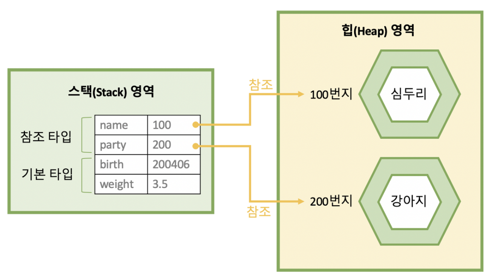

**👇힙 영역과 스택영역의 관계 - Gemini**

**Heap Area**(실제 물건) / **Stack Area**(물건을 가르키는 리모컨)

-   **Heap Area**
    -   덩치가 크고 가변적인 데이터(객체, 배열) 저장.
-   **Stack Area**
    -   덩치가 작고 실행이 끝나면 바로 사라지는 데이터(참조 변수, 지역 변수) 저장.

```java
public void method(){
	int age = 24;                      //기본 타입
	String name = new String("hello"); //참조 타입
	int[] scores = {20, 30, 40};       //배열(참조 타입)
}

=> name 변수 자체에는 "hello"라는 글자가 들어가 있지 않음
```

-   **힙** : 힙 영역의 빈 공간에 실제 **데이터 객체**가 생성, 이때, 해당 객체는 **메모리 주소**(예. 0x100)를 가짐.
-   **스택** : name이라는 **변수 공간**이 생기고, 여기에 실제 데이터 대신 **힙**에 있는 객체 주소값(0x100) 저장.

## 2) Heap Area 구조

: JVM이 관리하는 프로그램상에서 데이터를 저장하기 위해 런타임 시 동적으로 할당하여 사용하는 영역. new 연산자로 생성되는 객체와 배열이 생성되는 영역.

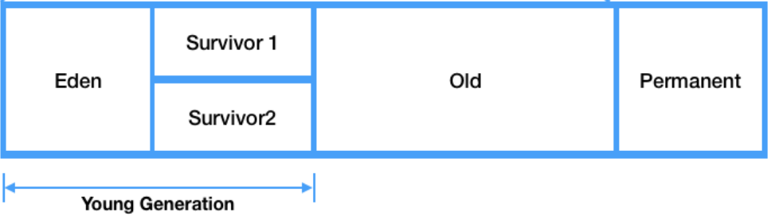

-   **Young Generation** : 생명 주기가 짧은 객체를 GC대상으로 하는 영역
    -   **Eden** : new를 통해 새로 생성된 객체. 정기적 Garbage 수집 후 살아 남은 객체들은 Survivor로 이동.
    -   **Survivor**
        -   각 영역이 채워지면 살아남은 객체는 비워진 Survivor로 순차적 이동
        -   살아남은 객체는 Survivor1 ↔ Survivor2 계속해서 이동함 ⇒ 이 과정에서 참조가 없는 객체는 Minor GC가 발생
        -   Survivor1 또는 Survivor2 중 하나는 항상 비워진 상태 유지.
-   **Old Generation**
    -   생명 주기가 긴 객체를 GC 대상으로 하는 영역. Young Generation에서 살아남은 객체들 이동.
    -   Young 영역보다 크게 할당.
    -   객체의 크기가 아주 큰 경우 Survivor영역을 지나지 않고 바로 Old 영역으로 넘어감.

> **Q. Young 영역에서 오랫동안(생명 주기가 긴 객체) 살아남은 객체는 Old영역으로 이동하는데 오랫동안의 기준은?**  
>   
> **A.** Young Generation 영역에서 Minor GC가 발생하는 동안 얼마나 오래 살아남았는지를 기준으로 한다. 이 때, Minor GC에서 살아남은 횟수를 기록하는 변수 age bit를 가지고 있으며 Minor GC가 발생할 때마다 age bit가 1씩 증가한다.  
>   
> **age bit** > **MaxTenuringThreshold** ⇒ Old Generation 영역으로 이동.  
>   
> Survivor 메모리 부족 ⇒ Old Generation 영역으로 이동.

## 3) MaxTenuringThreshold 튜닝

-   MaxTenuringThreshold 범위 : 1~15
-   높은 값 ⇒ 진짜 오랫동안 살아남은 객체를 더 많이 복사
-   낮은 값 ⇒ 단명 객체가 승격되어 Old Generation 메모리 가중됨 ⇒ 풀 수집(STW-Stop The World : 일시 정지) 자주 발생
-   임의로 디폴트 값(Java 11 기준 : 7)을 조정하지 말자(GC 모니터링 과정이 반드시 필요)

# 📘2. GC

: 자바의 메모리 관리 방법 중 하나로 JVM의 Heap영역에 동적으로 할당되었던 메모리 중 필요 없게 된 메모리 객체를 모아 주기적으로 제거하는 프로세스.

## 1) 동작 방식

-   **Stop The World - STW** : GC를 실행하기 위해 JVM이 애플리케이션의 실행을 멈추는 작업.
    -   GC를 실행하는 스레드를 제외한 모든 스레드의 작업이 모두 중단 ⇒ GC 작업 이후 재개
    -   GC 성능 개선은 보통 Stop The World의 시간을 줄이는 작업.
    -   모든 GC는 STW가 발생.

-   **Mark And Sweep**
    
    -   **Mark** : 사용되는 메모리와 사용되지 않는 메모리를 식별하는 작업
    -   **Sweep** : Mark단계에서 사용되지 않음으로 식별된 메모리를 해제하는 작업
    
    1.  GC는 스택의 모든 변수 또는 Reachable 객체를 스캔하면서 각각 어떤 객체를 참고하는 지 탐색
    2.  사용되고 있는 메모리를 식별 → Mark가 되지 않은 객체들을 메모리에서 제거

### Minor GC 동작 방식

-   Young Generation은 Old Generation 영역보다 상대적으로 작기 때문에 Unreachable한 객체를 찾아 제거하는데 비교적 적은 시간이 걸림.

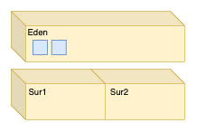

1\. 생성된 객체는 **Young Generation** 영역인 **Eden** 영역에 위치.

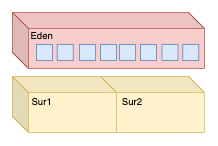

2\. **Eden** 영역의 공간이 가득 차면 **Minor GC** 실행

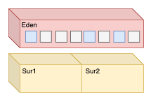

3\. **Mark** 동작을 통해 Reachable 객체 탐색 

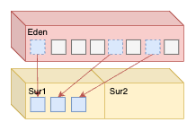

4\. **Eden 영역**에서 Reachable 객체 → 1개의 **Survivor 영역**으로 이동

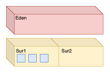

5\. **Eden 영역**에서 Unreachable 객체 메모리 해제

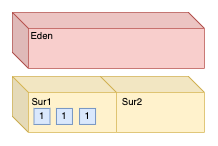

6\. **Survivor 영역**에 있는 객체들의 age 값이 1씩 증가.

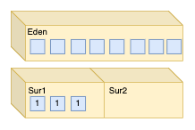

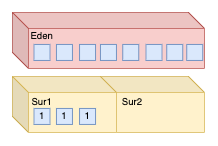

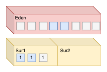

7\. **Eden 영역**에서 신규 객체들로 가득 차면 다시 minor GC가 발생하고 Mark.

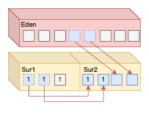

8\. Mark된 객체들을 비어있는 Survival1(그림상은 2-잘못그림..) 이동 후 Sweep.

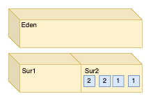

1) 살아남은 객체들의 age를 1씩 증가.

2) 1~8 과정을 계속해서 반복.

### Major(Full GC) 동작 방식

-   Old Generation에서 오래 살아남은 메모리를 정리하는 과정.
-   객체들이 계속해서 Promotion(승격)되어 Old Generation 영역의 메모리가 부족해지면 발생.
-   Old Generation은 Young Generation 영역보다 더 크며 Young Generation 영역을 참조할 수 있다.
-   GC 동작 시간 : Major GC >> Minor GC
-   Survivor 영역 중 1개는 반드시 사용되어야 함.
-   ⇒ 2개의 survivor영역의 사용량이 0이거나 모두 데이터가 존재하면 정상적인 시스템 상황❌
-   Old영역에 할당된 메모리가 허용치 초과 ⇒ Old 영역에 있는 모든 객체들을 검사하여 참조되지 않는 객체들 한 번에 정리
-   ⇒ 이 과정에서 STW 발생

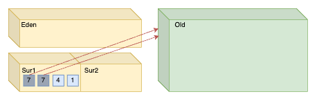

1\. Survivor에 존재하는 객체 중 age bit가 임계값(Java 11 기준 디폴트 값 : 7) 도달.

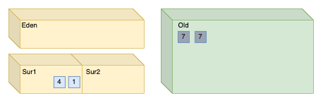

2\. 해당 객체들은 Old 영역으로 이동 (Promotion)

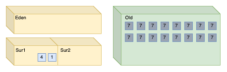

3\. 1,2 과정들을 반복하여 Old 영역의 메모리가 부족하면 Major GC가 발생.

## 2) GC 알고리즘

### Serial GC

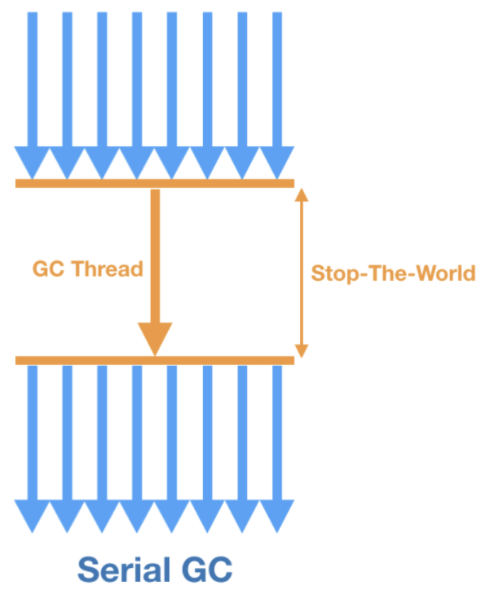

-   가장 단순한 CG
-   GC를 처리하는 스레드가 1개 ⇒ 멀티 스레드 환경에서는 좋지 않은 방법.
-   STW의 시간이 가장 길다.
-   Minor GC → Mark-Copy / Major GC → Mark-Sweep-Compact 사용

> **\[ Mark-Copy \]** : 살아남은 객체만 Mark(식별)하여 비어있는 다른 Survivor 영역으로 복사  
>   
> **\[ Mark-Sweep-Compact \] :**  
> \- Mark : 살아있는 객체 식별  
> \- Sweep : 쓰레기 객체를 메모리에서 제거  
> \- Compact : 제거 후 비어있는 메모리 공간(파편화)을 메우기 위해 객체들을 메모리 앞쪽으로 밀어넣기.

-   실행 명령어

```bash
java -XX: +UseSerialCG -jar Application.java
```

### Parallel GC

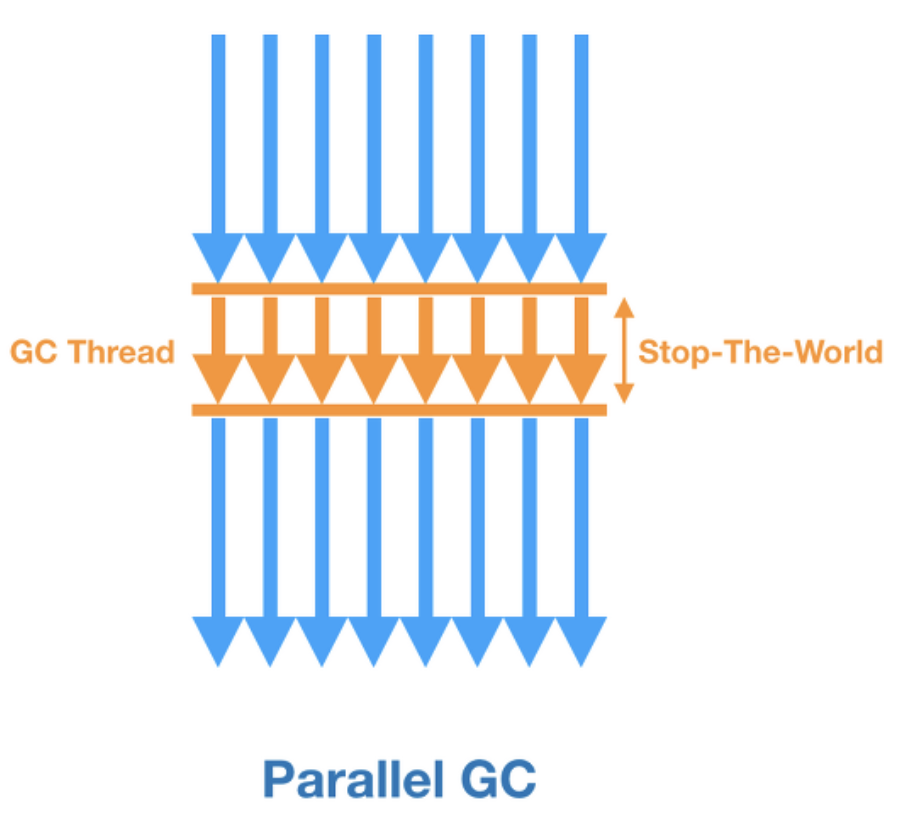

-   Java 8의 default GC
-   힙 공간의 관리를 위해 멀티 스레드(Old영역은 싱글 스래드) 사용
-   STW 시간 : Serial GC > Parallel GC
-   기본적으로 cpu 개수만큼 GC 스레드 할당됨
-   실행 명령어

```bash
java -XX: +UseParallelGC -jar Application.java
```

### Parallel Old GC

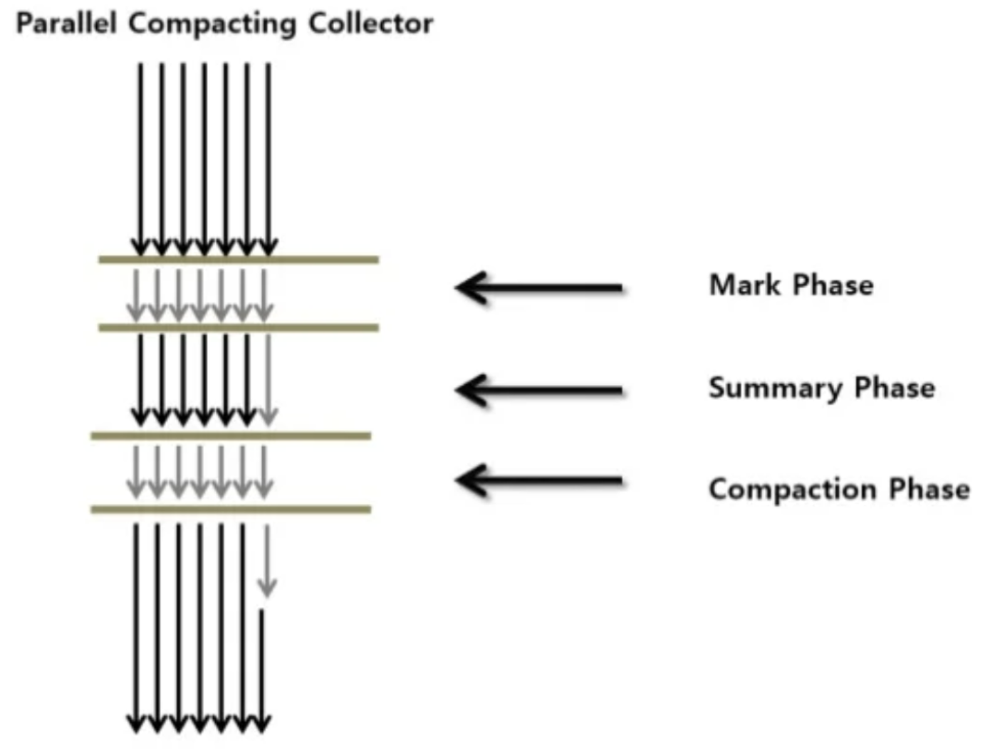

-   Parallel GC의 개선 버전
-   기존 Parallel GC에서 Old영역은 싱글 스레드의 사용을 멀티 스레드도 수행 가능 개선.
-   **Mark-Summary-Compact** 방식 사용

> \[ Mark-Summary-Compact \]  
>   
> **Q. Sweep와 Summary 차이?**  
> **A.** Sweep 경우 단일 스레드가 Old영역을 찾아 살아있는 객체만을 찾아내는 방식이지만, Summary는 여러 스레드가 Old 영역을 나누어 **병렬적**으로 찾아낸다.

-   명령어

```bash
java -XX: +UseParallelOldGC -jar Application.java
```

### CMS GC - Concurrent Mark Sweep

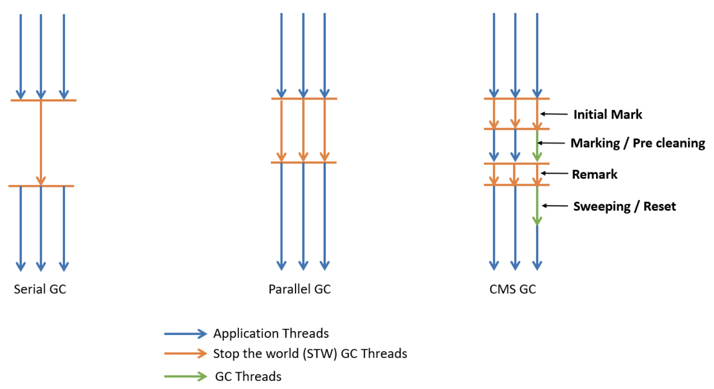

-   멀티 스레드 환경에서 STW 시간을 최대한 줄이기 위해 만들어짐.
-   GC 대상을 파악하는 과정 → 다른 GC 대비 CPU 사용량 높음.
-   GC와 프로세스 리소스 공유 가능.
-   Java 9 버전부터 Deprecated 되었고 Java 14에서 사용 중지.

### G1 GC

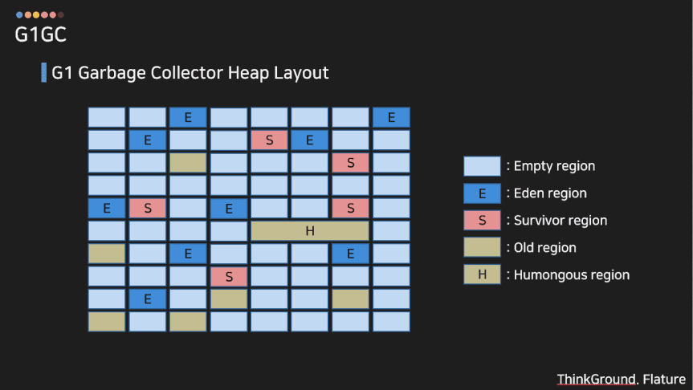

-   Java 9+ 버전의 default GC
-   큰 메모리 공간을 가지고 있는 멀티 프로세서 시스템에서 빠른 처리 속도.
-   CMS GC를 개선하기 위해 나옴.
-   4GB 이상의 힙 메모리 + STW 시간이 500ms정도 필요 상황에 사용 권장됨.
-   기존 Heap 영역을 Young / Old 영역으로 나누던 것에서 체스판같이 Heap 영역을 분할하는 **Region영역** 도입.
-   동적으로 Eden, Old, Young 영역을 부여.
-   기존 GC 알고리즘은 참조값이 없는 객체들이 Eden → Survivor1 **↔** Survivor2 → Old 순차적으로 이동하였지만, G1 GC는 더욱 효율적이라고 생각되는 위치로 해당 객체를 Reallocate(재할당) 시킴.

### ZGC

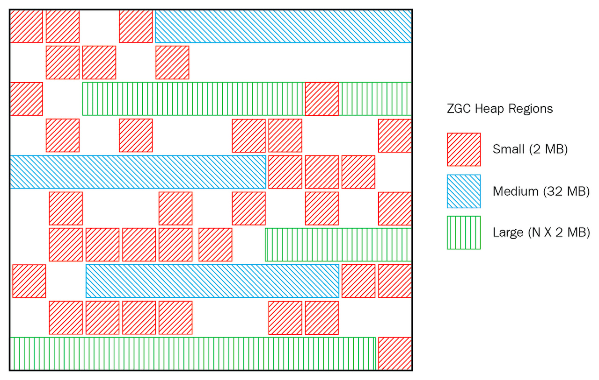

-   Java 15부터 release됨.
-   확장성 있고 지연 시간이 짧음.
-   대량의 메모리 (8MB ~16TB)를 Low latency로 처리하기 위한 GC.

> **Q. 그러면 GC 튜닝을 할 때 ZGC로만 튜닝하면 만능아닌가?**  
>   
> **A.** 애플리케이션 실행 중 백그라운드에서 GC가 계속 일을 해야 하는데 이를 위해 Colored Pointers + Load Barries라는 기술을 사용하는데 이 과정에서 CPU 자원을 많이 소모한다.  
> 따라서, 다른 GC 알고리즘에 비해 지연 시간은 짧지만, 전체적인 데이터 처리량은 낮아질 수 있다.  
> 애플리케이션을 실행하면서 GC가 같이 CPU 리소스를 잡아먹으면서 동작하는 것!

-   ZPage라는 영역을 사용하여 ZPage는 2mb 배수로 동적으로 운영됨.
-   힙의 크기가 증가하더라도 STW 시간이 **10ms**를 넘지 않고 모든 작업을 동시에 진행하도록 설계.
-   명령어

```bash
java -XX: +UnlockExperimentalVMOptions -XX: +UseZGC -jar Application.java
```
