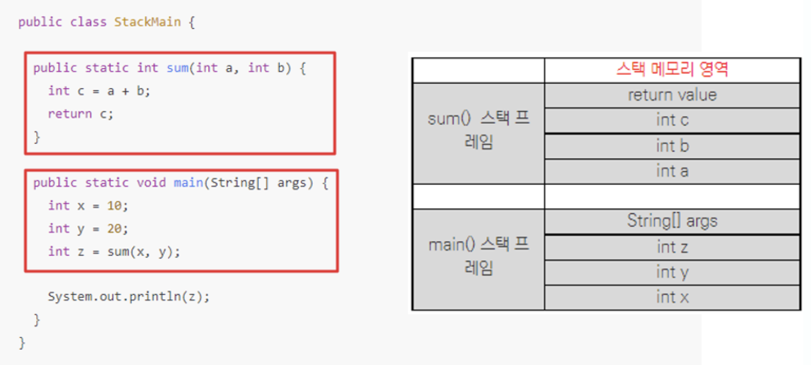
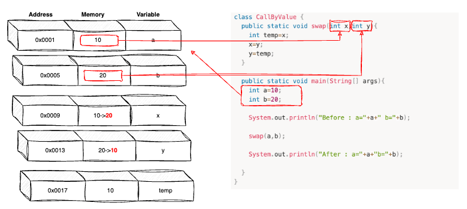
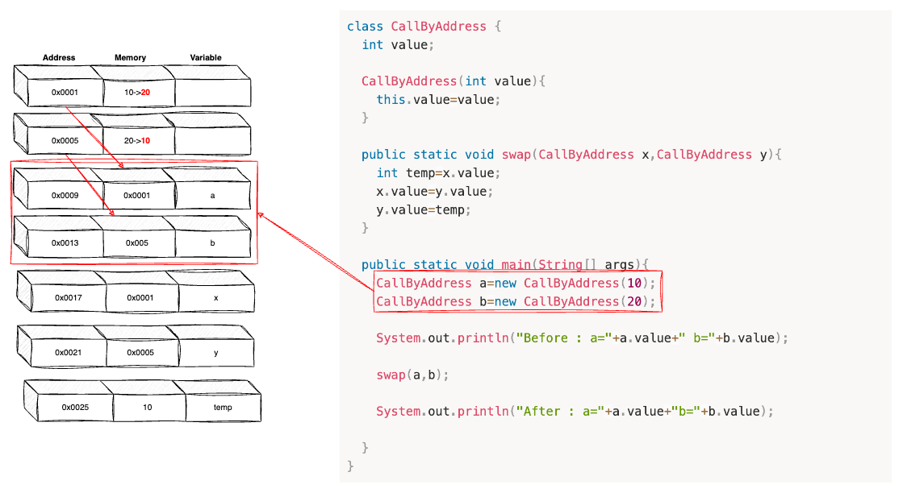
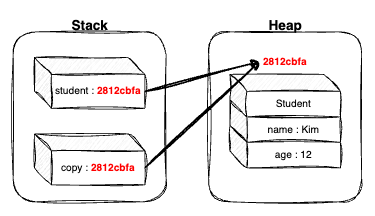
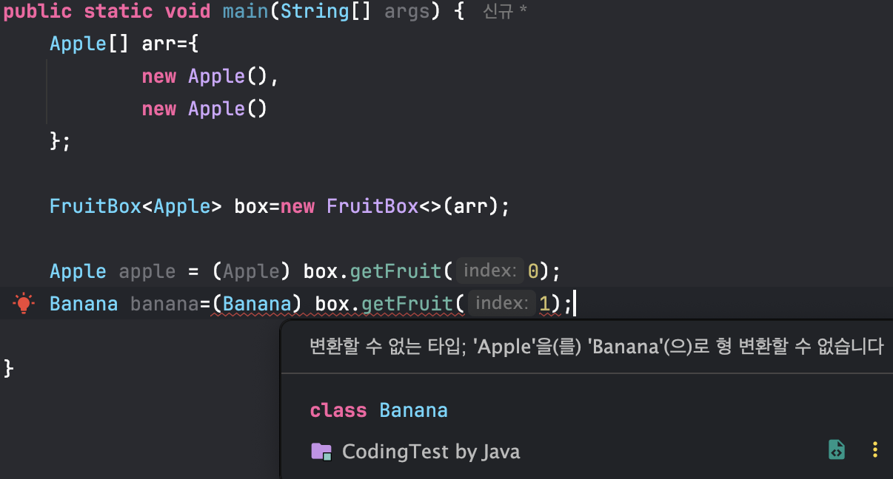
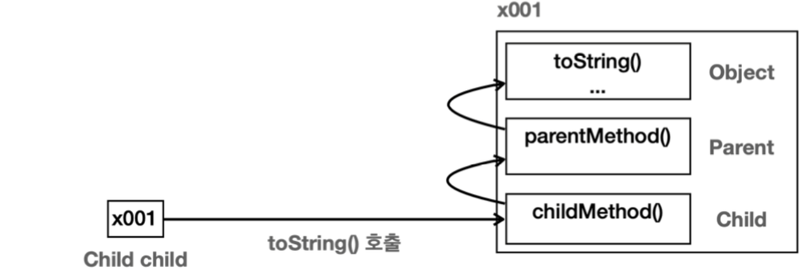
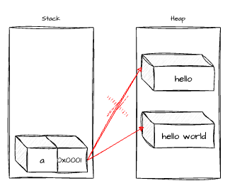

# 📘 1. Call By Value VS Call By Reference

### 스택 프레임

-   하나의 메서드에 필요한 메모리 덩어리
-   하나의 메서드당 하나의 스택 프레임.
-   메서드 호출 전 스택프레임을 자바 Stack에 생성 → 메서드 호출
-   메서드 호출 범위 종료 → 스택에서 제거



## 1) Call By Value

:호출 시 값을 직접 넘겨주는 방식

-   변수의 복사본이 전달되며 원래 값은 수정되지 않는다.
-   실제 인수는 다른 메모리 위치에 생성된다.

```java
class CallByValue {
	public static void swap(int x,int y){
		int temp=x;
		x=y;
		y=temp;
	}
	
	public static void main(String[] args){
		int a=10;
		int b=20;
		
		System.out.println("Before : a="+a+" b="+b);
		
		swap(a,b);
		
		System.out.println("After : a="+a+"b="+b);
		
	}
}
```

```text
[ 출력값 ]
Before : a=10 b=20
After : a=10 b=20
```



1.  변수 a와 b가 각각 메모리 0x0001번지와 0x0005번지에 할당 가정.
2.  할당된 메모리 변수에 각각 10, 20 값 저장.
3.  swap() 메서드 호출 → 인자 a와 b는 메모리 주소 값이 아닌 메모리에 담겨져 있던 값만 복사되어 메서드 내부 매개변수 x, y의 메모리 주소에 삽입.

## 2) Call By Address

: 호출 시 주소 값을 넘겨주는 방식

-   변수 자체가 전달되며 원래 값이 수정된다.
-   실제 인수는 같은 메모리 위치에 생성된다.
-   참조(주소 값)을 직접 넘기기 때문에 **호출자의 변수 = 수신자의 파라미터**

```java
class CallByAddress {
	int value;
	
	CallByAddress(int value){
		this.value=value;
	}
	
	public static void swap(CallByAddress x,CallByAddress y){
		int temp=x.value;
		x.value=y.value;
		y.value=temp;
	}
	
	public static void main(String[] args){
		CallByAddress a=new CallByAddress(10);
		CallByAddress b=new CallByAddress(20);
		
		System.out.println("Before : a="+a.value+" b="+b.value);
		
		swap(a,b);
		
		System.out.println("After : a="+a.value+"b="+b.value);
		
	}
}
```

```text
[ 출력값 ]
Before : a=10 b=20
After : a=20 b=10
```



1.  CallByAddress 타입의 변수 a,b는 객체를 각각 생성하여 0x0001번지와 0x0005번지에 저장된 10과 20의 주소값 저장.
2.  swap() 메서드 호출 시 인자 a,b는 메모리에 저장된 주소 값 복사 → 매개변수 x,y의 메모리에 저장.
3.  swap() 메서드는 10과 20이 저장된 0x0001번지와 0x0005번지의 주소 참조하여 연산 → 원본 데이터 변경

## 3) Java는 Call By Reference가 존재하지 않는다.

-   자바에서의 참조는 객체가 힙에 저장된 위치를 가리키는 메모리 주소.
-   실제 객체에 대한 참조가 아니라 객체에 접근하고 조작하는 방법.
-   원시값을 복사하느냐(**Call By Value**) / 주소 값을 복사하느냐(**Call By Address**)의 차이

# 📘 2. 얕은 복사 VS 깊은 복사

## 1) 얕은 복사(Shallow Copy)

: 값의 주소 값을 복사

-   복사한 객체의 값을 변경 ⇒ 기존 객체의 값도 변경

```java
public static void main(String[] args) {
	Student student = new Student("Kim",12);
	Student copyOfStudent=student;

	System.out.println("name = "+student.name+" age = "+student.age);
	System.out.println("name = "+copyOfStudent.name+" age = "+copyOfStudent.age);

	student.setName("Lee");
	System.out.println("name = "+student.name+" age = "+student.age);
	System.out.println("name = "+copyOfStudent.name+" age = "+copyOfStudent.age);
	
}
```

```text
[ 출력 결과 ]
name = Kim age = 12
name = Kim age = 12
name = Lee age = 12
name = Lee age = 12
```



-   **스택 영역**에 **copyOfStudent** 객체를 생성하지만, **Heap** **영역**에 있는 같은 인스턴스를 참조.
-   **setAge()**를 통해 객체내 변수 변경 시 기존 **student - age** 값도 변경.

## 2) 깊은 복사(Deep Copy)

: 실제 값을 새로운 메모리 공간에 복사

-   실제 값을 복사하여 메모리 공간에 새로운 인스턴스를 만든다.

### 깊은 복사 방법

**1\. Cloneable 인터페이스 구현**

\[ clone()메서드를 재정의 \]

```java
class Student implements Cloneable{
	String name;
	int age;

	Student(String name, int age){
		this.age=age;
		this.name=name;
	}

	@Override
	protected Student clone() throws CloneNotSupportedException{
		return (Student) super.clone();
	}
}
```

> **\[ Cloneable 인터페이스의 문제점 \]**  
>   
> clone 메서드가 선언된 곳은 Cloneable이 아닌 Object이며, 접근자 또한 protected 따라서, 외부 객체에서 해당 객체의 clone 메서드를 100% 호출할 수 없다. 새로운 클래스는 Cloneable를 확장, 구현해서는 안된다. 되도록이면 배열만 Cloneable의 clone()를 사용하고, 나머지는 생성자와 팩토리를 이용.

**2\. 생성자**

```java
class Student {
	String name;
	int age;
	
	public Student(){}

	public Student(Student origin){
		this.age=origin.age;
		this.name=origin.name;
	}
}
```

**3\. 팩토리 메서드**

```java
class Student {
	String name;
	int age;
	
	public Student(){}

	public Student copy(Student origin){
		Student student = new Student();
		student.age=origin.age;
		student.name=origin.name;
		
		return student;
	}
}
```

**4\. 1차원 배열 복사**

```java
//1. Object.clone()
int[] arr={1,2,3,4}
int[] copy=arr.clone();

//2.Arrays.copyOf()
int[] arr={1,2,3,4};
int[] copy=Arrays.copyOf(arr,arr.length);

//3.Arrays.copyOfRange()
int[] arr={1,2,3,4};
int[] copy=Arrays.copyOfRange(arr,1,3); //index=1~index=2까지 깊은 복사

//4.System.arrayCopy()
int[] arr={1,2,3,4};
int[] copy=new int[arr.length];

System.arrayCopy(arr,0,copy,0,arr.length);
```

**5\. 2차원 배열 복사**

```java
//1. 2중 for문
int[][] arr={{1,2,3},{4,5,6},{7,8,9}};
int[][] copy=new int[arr.length][arr[0].length];

for(int row=0;row<arr.length;row++){
	for(int col=0;col<arr[0].length;col++){
		copy[row][col]=arr[row][col];
	}
}

//2. System.arrayCopy
for(int row=0;row<copy.length;row++){
	System.arrayCopy(arr[row],0,copy[row],0,arr[0].length);
}
```

# 📘 3. 제너릭

## 1) 개념

: 클래스 내부에서 사용할 데이터 타입을 외부에서 지정하는 기법 / 타입을 변수화한 기능.

### 제너릭의 사용 이유

**1\. 불필요한 캐스팅을 제거하여 성능 향상**

> **업 캐스팅** : 자식 클래스 → 부모 클래스  
> **다운 캐스팅** : 부모 클래스 → 자식 클래스

-   가져온 타입에 대해 하나씩 다운캐스팅을 진행 → 성능 낭비

```java
Apple[] arr = { new Apple() , new Apple() };
FruitBox box = new FruitBox(arr);

Apple apple1 = (Apple) box.getFruit(0);
Apple apple2 = (Apple) box.getFruit(1);
Apple apple3 = (Apple) box.getFruit(2);
```

-   But ! 제너릭은 미리 타입을 지정 및 제한하기 때문에 타입 검사에 들어가는 메모리를 줄일 수 있음.

```java
FruitBox<Apple> box = new FruitBox<>(arr);

Apple apple1 = box.getFruit(0);
Apple apple2 = box.getFruit(1);
Apple apple3 = box.getFruit(2);
```

**2\. 컴파일 타입 검사를 통해 예외 방지**

```java
class Apple {}
class Banana {}

class FruitBox {
	private Object[] fruit;
	
	public FruitBox(Object[] fruit){
		this.fruit=fruit;
	}
	
	public Object getFruit(int index){
		return fruit[index];
	}
}
```

```java
public void main(String[] args){
	Apple[] arr = { new Apple() , new Apple() };
	
	FruitBox box = new FruitBox(arr);
	
	Apple apple = (Apple) box.getFruit(0);
	Banana banana = (Banana) box.getFruit(1);
}
```

⇒ Apple 타입의 객체를 arr배열에 넣었는데, Banana를 캐스팅하여 가져오려고 하여 **ClassCastException** 런타임 에러 발생

-   제너릭 타입을 사용시 컴파일 단계에서 제거 가능



### 제너릭 타입

제너릭에서 할당 받을 수 있는 타입은 **Reference Type** 뿐이다.

-   **기본형 - Primitive Type ⇒ stack** 영역에 저장.
    -   논리형
        -   boolean
    -   문자형
        -   char
    -   정수형
        -   byte
        -   short
        -   int
        -   long
    -   실수형
        -   float
        -   double
-   **참조형 - Reference Type ⇒** 자료가 저장된 공간에 저장 / **Heap** 영역에 저장.
    -   배열 타입
    -   열거 타입
    -   클래스
    -   인터페이스

> **Q. 왜 참조형만 제너릭 변수로 사용이 가능한가?**  
>   
> **A.**  
> 1\. 코드를 컴파일하면 <T> 제너릭 타입은 Object로 변환된다. 이때, Object는 모든 참조 타입의 최상위 부모이지만, 원시 타입같은 경우 Object를 상속받지 않는다.  
>   
> 2\. 참조 타입 같은 경우 실제 값은 Heap영역에 존재하고, Stack에는 주소값을 저장(주소는 크기가 일정함)한다. 만약, 원시 타입을 제너릭 타입으로 허용한다면 데이터의 크기가 제각기 다르기 때문에 내부 메모리 처리가 복잡해진다.

### 복수 타입

-   쉼표를 사용하여 복수 타입의 파라미터를 지정 가능.

```java
class Apple{}
class Banana{}

class FruitBox<T,U> {
	List<T> apples = new ArrayList<>();
	List<U> bananas = new ArrayList<>();
	
	public void add(T apple, U banana){
		apples.add(apple);
		bananas.add(banana);
	}
}
```

### 네이밍

| 타입 | 설명 |
| --- | --- |
| <T> | 타입 |
| <E> | 요소 |
| <K> | 키 |
| <V> | 리턴 값 또는 매핑된 값 |
| <N> | 숫자 |
| <S,U,V> | 2번째, 3번째, 4번째에 선언된 타입 |

## 2) 제너릭 타입 소거

> **\[ 힙 오염 \]**  
>   
> JVM의 힙 메모리 영역에 저장되어 있는 객체가 잘못된 데이터를 참조하여, 힙에서 해당 데이터를 가져오려고 할 때 예기치 못한 런타임 에러가 발생할 수 있는 상태를 의미한다.  
>   
> 1\. 원시 타입과 매개변수 타입을 동시에 사용.  
> 2\. 확인되지 않은 형변환을 수행.  
>   
> 
> ```
> ArrayList<String> list1=new ArrayList<>();
> list1.add("test1");
> list1.add("test2");
> 
> Object obj = list1;
> 
> ArrayList<Double> list2 = (ArrayList<Double>) obj;
> list2.add(2.0);
> list2.add(2.6);​
> ```
> 
> \- String 타입의 ArrayList를 선언하고 test1, test2 문자열 데이터 삽입.  
> \- ArrayList<String> 자체를 Object 클래스로 업캐스팅  
> \- 다시 ArrayList 객체로 다운캐스팅 과정에서 서브 타입을 Double로 설정 후 소숫값 추가 ⇒ 힙 오염 발생.

> **\[ Reifiable Type : 실체화 타입 \]**  
> \- int,byte,char 등 원시 타입  
> \- List<?> , ArrayList<?>등 와일드카드가 포함된 매개변수화 타입  
> \- List, ArrayList, Map 등 자체 Row Type  
> \- Number, Integer 등 일반 클래스 , 인터페이스  
>   
> **\[ Non-Reifiable Type : 비실체화 타입 \]**  
> \- List<T>  
> \- List<Number>, ArrayList<String>  
> \- List<? extends Number>, List<? extends String>

### 제너릭 타입 소거 과정

***1\. 제너릭의 bound 제거***

-   <T extends String> ⇒ 하위의 T는 String으로 치환.
-   <T> ⇒ Object로 치환

```java
//============= before ==============
class Example<T extends String> {
	List<T> list =new ArrayList<>();
	
	void add(T item){
		list.add(item);
	}
	
	T getValue(int index){
		return list.get(index);
	}
}

//============= after ==============
class Example{
	List list =new ArrayList<>();
	
	void add(String item){
		list.add(item);
	}
	
	String getValue(int index){
		return list.get(index);
	}
}
```

***2\. 제너릭 타입 소거 후 타입이 일치하지 않는 곳은 형변환을 추가.***

```java
//============= before ==============
class Example<T extends String> {
	List<T> list =new ArrayList<>();
	
	void add(T item){
		list.add(item);
	}
	
	T getValue(int index){
		return list.get(index);
	}
}

//============= after ==============
class Example{
	List list =new ArrayList<>();
	
	void add(String item){
		list.add(item);
	}
	
	String getValue(int index){
		return (String) list.get(index);
	}
}
```

# 📘 4. Object

-   java.lang 패키지의 대표적 클래스
-   모든 클래스의 최상위 **부모 클래스**
-   클래스에 상속 받을 부모 클래스가 존재하지 않다면, Java 내에서 묵시적으로 **Object 클래스**를 상속받는다.

```java
public class Parent {
	public void parentMethod(){
		System.out.println("Parent.parentMethod");
	}
}

public class Child extends Parent {
	public void childMethod(){
		System.out.println("Child.childMethod");
	}
}

public class ObjectMain{
	public static void main(String[] args){
		Child child = new Child();
		child.childMethod();
		child.parentMethod();
		
		String string=child.toString();
		System.out.println(string);
	}
}
```

```text
Child.childMethod
Parent.parentMethod
lang.object.Child@x001
```



1.  child.toString()를 호출
2.  Child 클래스에서 toString() 메서드를 찾는다. 없으므로 부모 타입으로 올라가서 찾는다.
3.  부모 타입인 Parent에서 찾는다. 없으므로 부모 타입으로 올라가서 찾는다.
4.  부모 타입인 Object에서 찾는다. Object에 toString()이 있으므로 이 메서드에서 호출한다.

### 최상위 부모가 Object인 이유?

-   공통 기능 제공
    -   **toString()** : 객체의 정보를 제공.
    -   **equals()** : 객체의 같음을 비교.
    -   **getClass()** : 객체의 클래스 정보를 제공
-   다향성의 기본 구현
    -   Object는 모든 클래스의 부모 클래스 → 모든 객체를 참조 가능.
    -   모든 자바 객체는 Object 타입으로 처리 가능 → 다양한 타입의 객체를 통합적 처리 가능.

# 📘 5. String

-   String은 char, int와 다르게 primitive type이 아닌 reference type변수로 분류
-   String 객체의 값은 변경할 수 없다.

```java
String a = "hello";
a = a + "world";
```



### String Pool

: JVM이 문자열을 따로 모아두는 공간, 문자열 리터럴을 쓸 때마다 새 객체를 만들지 않고 이미 존재하는 동일한 문자열을 재사용 하도록 해주는 영역.

⇒ new를 통해 String 객체를 생성하면 String Pool를 사용하지 않아 기존에 있던 문자열을 재사용하는 것이 아니라 메모리에 새로운 객체가 생성된다.

```java
String s1="string";
String s2="string";

System.out.print(s1==s2); //true

//===================================

String s1="string";
String s2=new String("string");

System.out.print(s1==s2); //false
```

### String은 불변 객체

1.  **JVM**에서의 **String Constant Pool** 영역의 생성 ⇒ 문자열들을 상수화하여 다른 변수 또는 객체들간 공유하는데 이 과정에서 캐싱을 사용 가능
2.  **HashMap**의 **Key**로 사용할 수 있고 **JVM 내부 캐시**에서도 불변 객체는 신뢰성이 높음.
3.  보안적인 측면에서 민감한 데이터에 대해 불변 객체는 내용이 절대 바뀌지 않기 때문에 **보안적 측면** 우수.
4.  **멀티스레드** 환경에서 String은 불변 객체이므로 **동기화 처리 없이** 안전성을 보장.

### String을 성능 높여 쓰자

***1\. 문자열 연결 ❌ / StringBuilder ✅***

```java
String result = "";

for(int i=0;i<100;i++){
	result += i;
}
```

-   위와 같은 코드는 for문이 도는 동안 계속해서 새로운 String 객체가 생성된다.

```java
StringBuilder sb=new StringBuilder();

for(int i=0;i<100;i++){
	sb.append(i);
}

String result = sb.toString();
```

***2\. \== ❌ / equals() ✅***

-   \== : 객체의 참조값을 비교하므로 개발자의 의도와 다르게 값이 나올 수 있음.
-   equals() : 객체의 내용을 비교하므로 개발자의 의도에 맞게 값이 나옴.

***3\. equals() 비교 시 NPE 방지***

```java
someString.equals("value"); //someString이 null이면 🚨NPE🚨 발생
```

-   NPE 발생의 방지를 위해 아래와 같은 상수 값을 먼저 작성하는 안전한 코드로 작성.

```java
"value".equals(someString);
```

# 📘 6. 블변

> **\[ 불변성이 중요한 이유? \]**  
> 소프트웨어 설계는 복잡성과의 끊임없는 전투다. 그러므로, 우리는 특별하게 다루어야 할 부분과 그렇지 않은 부분을 구분해야 한다.  
> 에릭 에반스 <도메인 주도 설계> 저자 -  
>   
> 소프트웨어에서 불확실성을 없애는 것은 불가능하다. 따라서, 불확실성을 제거할 수 있는 부분과 불확실성을 안고 가야 하는 부분을 나누는 것을 시작으로 시스템에서 확실한 부분을 최대한 늘리는 것이 불변성이 추구하는 목적이다.

### 불변 객체의 장점

1.  **참조 투명성**
    1.  불변 객체는 동일 입력에 대해 항상 동일한 값을 반환하므로 예측 가능하고 추론하기 쉬움 ⇒ 코드 정확성과 유지 보수성 향상
2.  **데이터 무결성**
    1.  불변 객체의 상태는 변경 불가이므로 무결성을 유지하는데 도움이 됨.
    2.  디자인을 단순화하고 코드의 신뢰성을 높임.
3.  **GC 성능 향상**
    1.  새로운 객체를 만들지 않고 기존 객체를 재사용하므로 가비지 수집 빈도를 줄임.
    2.  GC가 내부 객체 참조를 추적할 필요가 없어 GC 작업 감소.

# 📘 7. 리플랙션

: 자바에서 클래스나 멤버에 대한 정보를 런타임에 조사하고 조작할 수 있는 기능으로, 클래스 이름, 메서드, 필드, 생성자 등에 대한 정보를 프로그램 실행 중에 알아내고 이를 통해 객체를 생성하거나 메서드를 호출가능하다.

## 1) Reflection은 언제 사용되는가?

-   **동적으로 class를 사용해야 하는 경우 - Spring Annotation**
    -   Spring의 @Autowired는 Reflection를 이용하여 생성자를 주입.
-   **Test Code**
    -   private 변수를 변경하고 싶을 때
    -   private 메서드를 테스트 하고 싶을 때
-   **자동 mapping 기능**
-   **정적 분석 tool**
-   **Jackson, GSON 등의 Json Serialization**
    -   Reflection를 통해 객체 필드의 변수명 / 애노테이션명을 Json key와 mapping

## 2) Class 클래스 객체 얻는 방법

***1\. Object.getClass()***

해당 클래스가 인스턴스화된 상태이어야 함.

```java
public static void main(String[] args){
	String str=new String("Class");
	
	Class<? extends String> cls = str.getClass();
	System.out.print(cls);//class java.lang.String
}
```

***2\. .class 리터럴***

인스턴스가 존재하지 않고, 컴파일된 클래스 파일 존재 시 Class 객체를 바로 얻을 수 있음.

```java
public static void main(String[] args){
	String str=new String("Class");
	
	Class<? extends String> cls = String.class;
	System.out.print(cls);//class java.lang.String
}
```

***3\. Class.forName()***

-   컴파일된 클래스 파일이 존재하는 경우 : 클래스 이름만으로 Class 객체를 반환 받을 수 있지만, 클래스 도메인을 자세하게 적어야 함.
-   메모리 절약 가능.

```java
public static void main(String[] args){
	try{
		Class<?> cls = Class.forName("java.lang.String");
		System.out.print(cls);//class java.lang.String
	}catch(ClassNotFoundException e){
		//예외처리
	}
} 
```

## 3) Reflection 장단점

### 장점

-   **유연성 제공**
    -   Reflection은 런타임에 클래스, 메서드, 필드 정보를 동적으로 조작하고 조사할 수 있어 코드의 유연성을 크게 향상.
-   **라이브러리 개발 편의 제공**
    -   스프링 같은 경우 Reflection를 이용하여 더 유연하고 확장 가능한 구조 제공
-   **디버거 / 테스트 도구**
    -   테스트 장치는 Reflection을 사용하여 클래스에 정의된 발견 가능한 API를 체계적으로 호출하여 테스트에서 높은 수준의 테스트 커버리지 보장 가능.

### 딘점

-   **추상화 위반**
    -   당연한 소리 → private와 같이 접근할 수 없는 필드 혹은 메서드에 접근이 가능하며 모든 클래스의 정보를 알게되므로 추상화를 파괴한다.
-   **성능 저하**
    -   Reflection은 런타임에 메서드나 필드를 찾고 접근하는 과정이 추가되어 일반 코드에 비해 더 많은 시간과 자원 소모.
-   **보안 이슈**
    -   Reflection을 사용하면 private 피드 혹은 메서드에 접근이 가능하다. 이는 애플리케이션 내부에 보호되어야 할 데이터에 접근하거나 변경할 수 있어 보안을 위협할 수 있음.

## 4) Reflection 사용방법

### 메서드 조작

-   **getMethod()** : public 메서드 접근 시 사용.
-   **getDeclaredMethod()** : 클래스에 선언된 모든 메서드 접근 시 사용.

```java
class Animal {
	public void publicRun() {
		System.out.println("publicRun");
	}
	
	private void privateRun() {
		System.out.println("privateRun");
	}
}

Class<? extends Animal> cls = Animal.class;
Method publicMethod = cls.getMethod("publicRun");
Method privateMethod = cls.getDeclaredMethod("privateRun");

privateMethod.setAccessible(true);//접근 가능하도록 설정

Animal animal = new Animal();

publicRun.invoke(animal);
privateRun.invoke(animal);
```

-   Method 클래스의 invoke() 메서드를 이용하여 Reflection를 통해 메서드 실행.

### 생성자 조작

-   **getConstructor()** : public 생성자 접근 시 사용.
-   **getDeclaredConstructor()** : 클래스에 선언된 모든 메서드 접근 시 사용.

```java
class Animal {
	public Animal(){}
	private Animal(String arg){}
}

Class<?> cls = Animal.class;
Constructor<?> publicConstructor = cls.getConstructor();
Constructor<?> privateConstructor = cls.getDeclaredConstructor();

privateConstructor.setAccessible(true);//접근 가능하도록 설정

//객체 생성
Animal animal1 = (Animal) publicConstructor.newInstance();
Animal animal2 = (Animal) privateConstructor.newInstance("arg");
```

### 필드 조작

-   **getField()** : public 생성자 접근 시 사용.
-   **getDeclaredField()** : 클래스에 선언된 모든 메서드 접근 시 사용.

```java
class Animal {
	public int publicField;
	private int privateField;
}

Class<?> cls = Animal.class;
Field publicField = cls.getField("publicField");
Field privateField = cls.getDeclaredField("privateField");

privateField.setAccessible(true);//접근 가능하도록 설정

//사용
Animal animal = new Animal();

//public 변수 읽기
int publicFieldValue = (Integer) publicField.get(animal);

//private 변수 읽기
int privateFieldValue = (Integer) privateField.get(animal);

//public 변수 수정
publicField.set(animal,20);

//private 변수 수정
privateField.set(animal,40);
```
