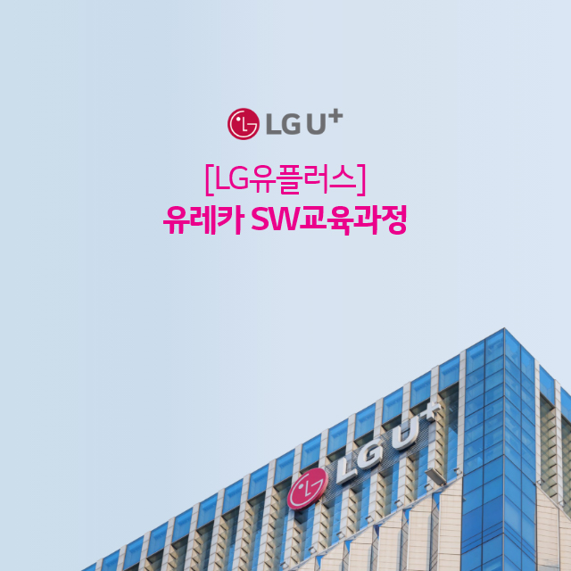
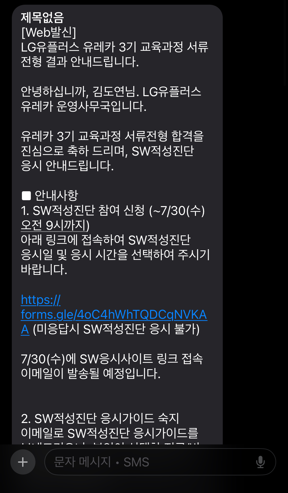
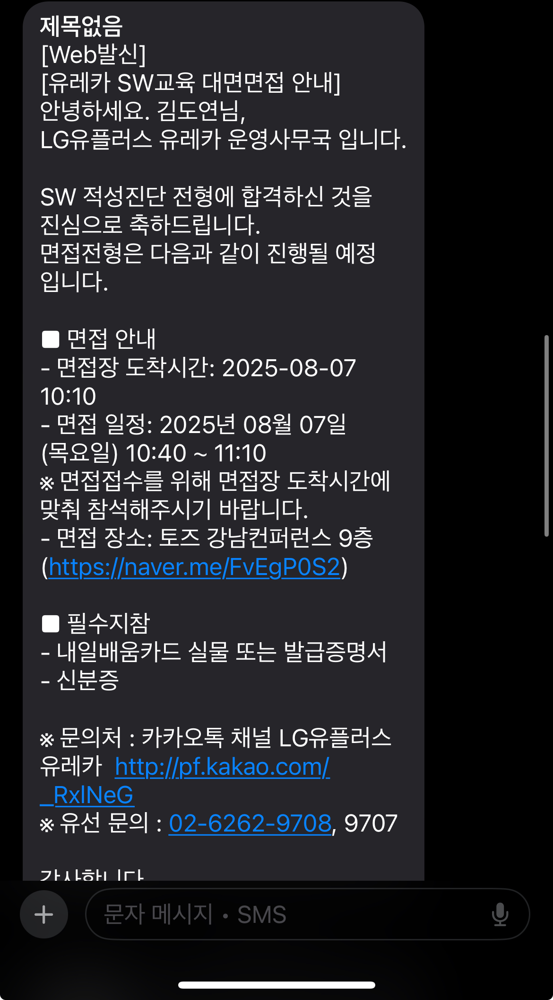
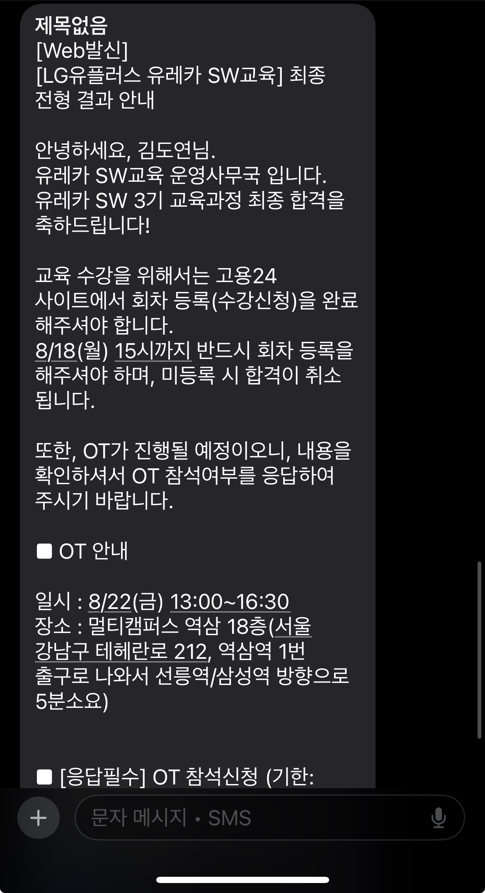

## **개요**

* * *

**LG 유플러스**에서 교육하는 **유레카 3기 SW 교육 백엔드과정(대면)** 과정에 합격했습니다.

방학동안 앞으로의 플랜을 다음과 같이 A, B, C를 세워두었습니다.

**A. 스타트업 혹은 중견기업 이상의 서비스 기업에서 인턴활동.**

**B. LG U+ 유레카 교육과정.**

**C. 프로그래머스 데브코스.**

방학동안 10개 정도의 다양한 기업들에 서류를 내밀었지만 결과는 모두 탈락이었고, 내가 지금까지 진행한 프로젝트나 경험들이 조금 부족했던 것 같아 부트캠프를 우선적으로 수강하고자 하였습니다.

유레카 과정보다 프로그래머스 데브코스 선발과정이 먼저 있었기 때문에 프로그래머스 코스에 지원하였고, 서류합격과 코딩테스트를 합격했습니다. 하지만, 뭔가 데브코스로는 조금 부족할 것 같은 느낌이 있어서 포기하고 유레카 지원날짜가 올 때까지 기다렸습니다.

유레카 3기의 지원 전형은 서류 -> 코딩 테스트 -> 대면 면접 순으로 진행되었고, 이전 기수들의 후기나 이번 기수 또한 체감상 면접이 가장 중요한 비중이었던 것 같습니다.

## **과정**

* * *

### **서류**

 2가지 질문으로 이루어져 있었습니다.

**1\. 유레카 SW교육에 지원하신 동기와  이루고 싶은 취업 계획.**

**2\. SW 관련 경험 중 어려웠던 과제와 해결 방안과 어떤 개발자로 성장하고 싶은지.**

1번째 문항은 이전까지 진행한 다양한 프로젝트들을 진행하며, 다양한 오류들의 문제 해결의 부족성을 강조했습니다. 또한, 유레카 과정을 통해 이루고 싶은 목표를 LG U+와 관련되게 서술하여 작성하였습니다.

2번째 문항은 실제 저의 프로젝트 진행했던 문제 중 성능 문제에 대해 자세하게 기술하였으며 이를 통해 얻은 점을 서술했습니다. 유레카 유투브를 통해 자세한 커리큘럼을 확인하고 이를 유레카를 통해 이루고 싶은 목표와 연관되게 작성했습니다.

### **코딩 테스트**

서류 전형 합격 후 빠르게 알고리즘 내용을 복습하기 위해서 **인프런 강의**를 수강했습니다.

[자바 코딩테스트 - it 대기업 유제| 김태원 - 인프런 강의

현재 평점 5점 수강생 928명인 강의를 만나보세요. 요즘 코딩테스트에는 어떤 유형의 문제가 출제될까요? 최신 기업 코테 트렌드를 반영한, “실전에 통하는” 문제를 직접 풀어보세요. 여러분의

www.inflearn.com](https://www.inflearn.com/course/%EC%9E%90%EB%B0%94-%EC%BD%94%EB%94%A9%ED%85%8C%EC%8A%A4%ED%8A%B8-%EC%B5%9C%EC%8B%A0%EA%B8%B0%EC%B6%9C/dashboard)

코딩테스트는 크게 2문제에서 각각 소문제 5문제로 총 10문제로 나왔습니다. 문제 푸는 방법은 **잡다** 사이트의 **개발 구현 능력 검사**와 유사했습니다. 저는 그래서 **잡다**의 **개발 구현 능력 검사**를 2번 정도 실제 환경과 유사하게 하여 연습했습니다.

결과적으로 2문제 중

**1번째 문제 : 5/5 솔**

**2번째 문제 : 2/5 솔**

을 하였습니다. 체감 상 백준 기준으로 **1번째 문제는 실버1** 정도였고, **2번째 문제는 실버1~골드5**정도 였습니다. 중간에 계속 화면이 꺼지는 문제가 있어서 시간이 조금 부족하여 1번째 문제라도 모두 풀자는 마인드로 응시했습니다.

### **면접**

면접 날짜가 확정된 이후 준비할 기간이 3~4일정도밖에 없어서, 우선은 구글링을 통해 이전 기수 합격자분들의 준비 과정을 쭉 확인하였고 이를 바탕으로 면접 예상 질문을 만들어 답변을 준비했습니다.

대외비라 직접적인 면접 질문에 대해서 작성할 수는 없지만, 저는 아래와 같은 면접 예상 질문들을 준비했습니다.

1.  **자기소개**
2.  **다른 캠프와 비교했을 때, 유레카를 지원한 이유**
3.  **본인이 진행했던 프로젝트 중 하나를 선정하여 소개하고, 해당 프로젝트에서 맡은 역할**
4.  **앞으로 취업을 위해 무엇을 할 것인지**

면접 당일날, 저는 B조로 배정되었고 앞에 4~5팀이 먼저 면접을 진행했습니다. 당일날만 보면 면접자들을 대략 100명 조금 안되었던 것 같습니다. 백엔드 대면과 비대면 지원자들과 같이 섞어서 면접을 진행했던 것 같습니다.

앞으로 7개월간의 **유레카** 교육을 통해 뛰어난 팀원들과 다양한 프로젝트를 진행하며 기술적으로 뿐만 아니라 저의 진로에 있어 확실한 직무성을 지닐 수 있는 개발자가 되도록 노력해보겠습니다!
