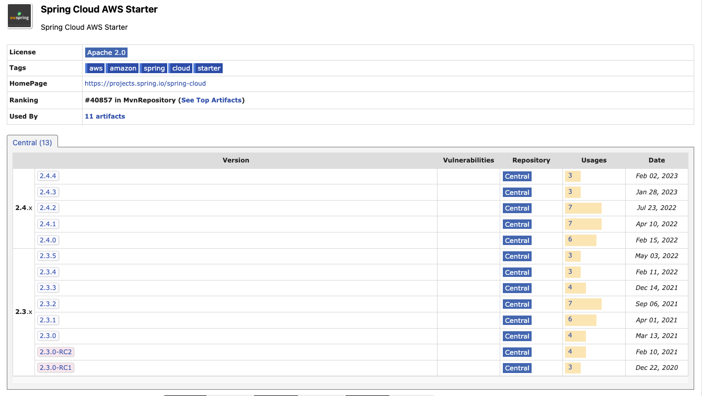
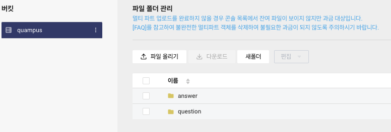
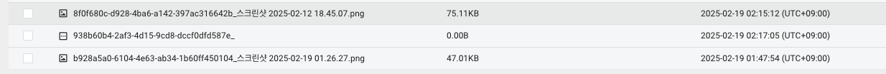

## **1\. 배경**

* * *

해당 글은 노션에 작성한 글을 티스토리로 재게시했습니다.

**SWYP 8기**의 서비스 제출 및 시연이 2주 정도밖에 남지 않았습니다. 우리의 서비스 **Qampus**의 주요 질문 및 답변의 CRUD는 백엔드 팀원분인 재하님이 어느정도 완료를 해주셨고 서비스의 주요기능이 대학생들간의 전공지식을 바탕으로 서로 질문하고 답변하며 학교별 순위측정이다 보니 질문과 답변을 게시하는 과정에서 **이미지를 공유**해야하는 일이 발생합니다. 이전 YeungNam-Nyang 프로젝트 과정에서 프론트엔드 파트로도 진행하며 경험하였던 **AWS S3**를 이용한 이미지 정적 관리를 이용하여 이미지를 관리하려고 하였지만 SWYP측에서 **Naver Cloud**의 20만원 크레딧을 지원해주어서 **NCP**를 이용하기로 하였습니다. **NCP** 공식문서를 읽어보니 **AWS S3**와 호환이 되어 **AWS S3 자바 라이브러리**를 이용하여 쉽게 이미지 호스팅을 할 수 있었습니다.

* * *

조금 아쉬운 점이라면 라이브러리의 업데이트가 빈도가 매우 낮다는 점...(제일 최신버젼이 23년 2월..)

**Gradle.build 설정**

```groovy
implementation 'io.awspring.cloud:spring-cloud-starter-aws:2.3.0'
implementation 'com.amazonaws:aws-java-sdk-s3:1.12.781'
```



AWS S3 라이브러리

**NCP 개인 설정**을 통해 **secretKey**와 **accessKey**를 발급을 받고 아래와 같이 버킷을 생성한 후 디렉토리를 구성했습니다. **Qampus**에서 이미지를 사용하는 부분이 질문과 답변이므로 **question**과 **answer**로 디렉토리를 설정했습니다.



NCP 버킷

* * *

### **코드**

#### **이미지 엔티티**

이미지 <-> 답변(다대일,단방향 매핑)  이미지 <-> 질문 (다대일,단방향 매핑)

```java
@Entity
@Getter
@Setter
@NoArgsConstructor
@AllArgsConstructor
@Builder
@Table(name = "Images")
public class Image extends BaseEntity {
    @Id
    @GeneratedValue(strategy = GenerationType.AUTO)
    @Column(name = "image_id")
    private long imageId;

    @Column(nullable = false, columnDefinition = "TEXT")
    private String pictureUrl;

    @ManyToOne
    @JoinColumn(name = "question_id")
    private Question question;

    @ManyToOne
    @JoinColumn(name = "answer_id")
    private Answer answer;
}
```

(지금 보니깐 애노테이션이 조금 무분별하게 사용된 것 같습니다...리팩토링을 진행해봐야 할 듯 싶습니다.)

#### **이미지 서비스 인터페이스**

```java
public interface ImageService {
    List<String> putFileToBucket(List<MultipartFile> files, String type);
}
```

#### **이미지 서비스 구현**

```java
@Service
@RequiredArgsConstructor
public class ImageServiceImpl implements ImageService {
    private static final String BUCKET_NAME="quampus";
    private static final String DIRECTORY_OF_QUESTION="/question";
    private static final String DIRECTORY_OF_ANSWER="/answer";
    private final AmazonS3Client objectStorageClient;
    @Override
    public List<String> putFileToBucket(List<MultipartFile> files, String type) {
        //질문하기 디렉토리
        String FILE_DIRECTORY="";
        List<String> urls=new ArrayList<>();
        //TODO:testCode작성
        if(type.equals("QUESTION")){
            FILE_DIRECTORY=BUCKET_NAME+DIRECTORY_OF_QUESTION;
            //답변하기 디렉토리
        } else if (type.equals("ANSWER")) {
            FILE_DIRECTORY=BUCKET_NAME+DIRECTORY_OF_ANSWER;
        }
        for (MultipartFile file:files){
            ObjectMetadata objectMetadata=new ObjectMetadata();
            objectMetadata.setContentType(file.getContentType());
            objectMetadata.setContentLength(file.getSize());

            String fileName= UUID.randomUUID()+"_"+file.getOriginalFilename();
            try {
                //사진 업로드 및 url저장
                PutObjectRequest request=new PutObjectRequest(FILE_DIRECTORY,fileName,file.getInputStream(),objectMetadata);
                objectStorageClient.putObject(request);
                urls.add(objectStorageClient.getUrl(BUCKET_NAME,fileName).toString());

            }catch (IOException e){
                throw new RestApiException(ImageErrorCode.FAILED_UPLOAD);
            }

        }
        return urls;
    }
}
```

로직을 간단하게 설명하면 다음과 같습니다.

1.  **QuestionServiceImpl**과 **AnswerServiceImpl**에서 의존성을 주입받아 **putFileToBucket**메서드를 이용해 한 번의 **POST API요청**으로 질문과 답변의 내용과 함께 **MultiFile**형태로 전송받아 이미지 업로드도 진행합니다.
2.  매개변수 **type**에서 질문에서의 이미지 업로드인지 답변에서의 이미지 업로드인지 구별하기 위해 스트링으로 **ANSWER, QUESTION**를 명시합니다.
    1.  **type**를 생각할 때도 **Boolean**이나 **ENUM**를 사용하는 것도 생각해봤는데 우선은 2가지 경우만 존재하니 **ENUM**은 과도한 클래스 생성이라고 생각했습니다. **Boolean**같은 경우는 다른 사람이 내 코드를 사용할 때 사전의 해당사항을 알지 못하면 어려움이 존재할 것이라고 생각항여 가장 직관적인 **String**으로 사용했습니다.
    2.  나중에 서비스 확장시에는 **ENUM**으로 관리하여 유지보수성을 높이는 방안을 찾아보는 것이 좋을 것 같습니다.
3.  **List형식**의 이미지를 제공받아 **for문**을 통해 모든 이미지 파일의 메타데이터를 저장합니다.
4.  **UUID형식**으로 이미지의 파일명을 생성하고 **AWS S3라이브러리**의 **PutObjectRequest** 객체를 이용하여 생성한 파일 이름과 함께 파일을 업로드한 후 업로드한 파일이름을 다른 서비스 계층에서 DB에 저장하기 위해 **String** 리스트로 반환합니다.



NCP 이미지 업로드 실행

여기까는 문제가 없습니다. 이전에 경험해보기 하고 AWS를 작년에 조금 많이 써보다보니 큰 이슈없이 금방 구현완료했습니다.

> 여기서 문제점이 위의 코드들은 외부라이브러리를 통해 구현이 되는데 테스트 코드를 어떻게 작성해야 하는가입니다.‼️‼️‼️

## **2\. 해결과정**

* * *

1\. 기존 외부라이브러리로 구현되어 있는 **AWS S3 Client**를 직접 **service interface**와 **serviceImpl**로 분할하여 구현합니다.

   a. 기존 **AmazonClient** 대신 직접 구현한 **AmazonS3Service**를 주입합니다.

```java
public interface AmazonS3Service {
    void putObject(PutObjectRequest request);
    URL getUrl(String bucketName, String fileName);
}
```

```java
@RequiredArgsConstructor
@Service
public class AmazonServiceImpl implements AmazonS3Service{
    private final AmazonS3Client amazonS3Client;

    @Override
    public void putObject(PutObjectRequest request) {
        amazonS3Client.putObject(request);
    }

    @Override
    public URL getUrl(String bucketName, String fileName) {
        return amazonS3Client.getUrl(bucketName,fileName);
    }
}
```

```java
@Service
@RequiredArgsConstructor
public class ImageServiceImpl implements ImageService {
    private static final String BUCKET_NAME="quampus";
    private static final String DIRECTORY_OF_QUESTION="/question";
    private static final String DIRECTORY_OF_ANSWER="/answer";
    private final AmazonS3Service objectStorageClient;
    @Override
    public List<String> putFileToBucket(List<MultipartFile> files, String type) {
        //질문하기 디렉토리
        String FILE_DIRECTORY="";
        List<String> urls=new ArrayList<>();
        //TODO:testCode작성
        if(type.equals("QUESTION")){
            FILE_DIRECTORY=BUCKET_NAME+DIRECTORY_OF_QUESTION;
            //답변하기 디렉토리
        } else if (type.equals("ANSWER")) {
            FILE_DIRECTORY=BUCKET_NAME+DIRECTORY_OF_ANSWER;
        }
        for (MultipartFile file:files){
            ObjectMetadata objectMetadata=new ObjectMetadata();
            objectMetadata.setContentType(file.getContentType());
            objectMetadata.setContentLength(file.getSize());

            String fileName= UUID.randomUUID()+"_"+file.getOriginalFilename();
            try {
                //사진 업로드 및 url저장
                PutObjectRequest request=new PutObjectRequest(FILE_DIRECTORY,fileName,file.getInputStream(),objectMetadata);
                objectStorageClient.putObject(request);
                urls.add(objectStorageClient.getUrl(BUCKET_NAME,fileName).toString());

            }catch (IOException e){
                throw new RestApiException(ImageErrorCode.FAILED_UPLOAD);
            }

        }
        return urls;
    }
}
```

2\. 테스트 코드는 아래와 같이 성공케이스와 실패케이스로 분할하여 구성하였습니다.

```java
@SpringBootTest
class ImageServiceImplTest {

    @Autowired
    private ImageService imageService;

    @MockitoBean
    private AmazonS3Service amazonS3Service;

    @Mock
    private MultipartFile multipartFile;
    //버킷 이름
    private static final String FILE_BUCKET_NAME="quampus";

    //파일 이름 설정
    private static final String FILE_URL="https://quampus.kr.object.ncloudstorage.com/test.jpg";
    private static final String FILE_NAME="test.jpg";
    @Test
    @DisplayName("[성공케이스]-이미지 업로드 성공시 Url를 반한합니다.")
    void imageUpload_SUCCESS() throws IOException {
        //given
        byte[] fileContent="fakeFile".getBytes();
        InputStream inputStream = new ByteArrayInputStream(fileContent);

        when(multipartFile.getContentType()).thenReturn("image/jpeg");
        when(multipartFile.getSize()).thenReturn((long)fileContent.length);
        when(multipartFile.getOriginalFilename()).thenReturn(FILE_NAME);
        when(multipartFile.getInputStream()).thenReturn(inputStream);

        doNothing().when(amazonS3Service).putObject(any(PutObjectRequest.class));
        when(amazonS3Service.getUrl(eq(FILE_BUCKET_NAME),any())).thenReturn(new URL(FILE_URL));

        //when
        List<String> resultUrls=imageService.putFileToBucket(List.of(multipartFile),"ANSWER");

        //then
        assertNotNull(resultUrls);
        assertThat(resultUrls).hasSize(1);
        assertThat(resultUrls.get(0)).isEqualTo(FILE_URL);

        verify(amazonS3Service,times(1)).putObject(any(PutObjectRequest.class));
        verify(amazonS3Service,times(1)).getUrl(eq(FILE_BUCKET_NAME),any(String.class));
    }
    @Test
    @DisplayName("[실패케이스]-이미지 업로드 실패시 예외를 반한합니다.")
    void imageUpload_FAILED() throws IOException {
        //given
        byte[] fileContent="fakeFile".getBytes();
        InputStream inputStream = new ByteArrayInputStream(fileContent);

        when(multipartFile.getContentType()).thenReturn("image/jpeg");
        when(multipartFile.getSize()).thenReturn((long)fileContent.length);
        when(multipartFile.getOriginalFilename()).thenReturn(FILE_NAME);
        when(multipartFile.getInputStream()).thenReturn(inputStream);

        //실패 상황 예외던지기
        when(multipartFile.getInputStream())
                .thenThrow(new IOException());

        //when then
        RestApiException exception = assertThrows(RestApiException.class, () ->
                imageService.putFileToBucket(List.of(multipartFile), "ANSWER"));

        assertThat(exception.getMessage()).isEqualTo("이미지 업로드를 실패했습니다.");
    }
}
```

-   실제 **AWS S3**이미지 **API**를 호출하여 비용을 소모하는 방법보다 **@MockitoBean**를 이용하여 **가짜 의존성**을 주입하여 테스트를 진행하였습니다.

```java
when(multipartFile.getContentType()).thenReturn("image/jpeg");
        when(multipartFile.getSize()).thenReturn((long)fileContent.length);
        when(multipartFile.getOriginalFilename()).thenReturn(FILE_NAME);
        when(multipartFile.getInputStream()).thenReturn(inputStream);
```

-   **MultipartFile**를 직접 만들지 않고 **@Mock**를 이용하여 **가짜객체**로 사용함으로써 실제 서비스에서 작동할 때 호출되는 메서드에 대해 예측값들을 넣어줍니다.
-   서비스단에서 **AmazonS3Service**의 메서드 **putObject**, **getUrl**이 각각 1번씩 호출되었는지 확인하고 **성공 케이스 테스트**를 종료합니다.
-   이미지 업로드 예외인 **IOException**값을 **RestApiException**으로 예외를 제대로 던지는지 확인하고 해당 **예외처리 메시지**를 확인하고 해당 **예외처리 메시지**를 확인하며 테스팅을 종료합니다.
