## ********1.  배경********

* * *

#### **1\. 문제 상황**

**Shoot Pointer**는 현재 **Jenkins**를 이용하여 **CI/CD** 파이프라인을 구축하여 운영 중입니다. 프론트엔드와 AI 쪽과의 좀 더 원활한 테스트 진행을 위해서 **Ubuntu LTS** 기반의 홈서버를 구축하여 지속적인 배포를 진행중입니다. (현재는 Spring 서버는 Azure로 이전하여 운영되고 있습니다.)

#### ⚙️운영 환경

-   **CI/CD tool** : Jenkins + Github Actions + Github WebHooks
-   **클라우드 인프라** : Azure VM (Standard D2 v5)
-   **DB** : PostgreSQL, Redis, MongoDB, Elasticsearch, Kibana
-   **배포 방식** : Docker compose 기반 멀티 컨테이너 아키텍처

현재까지 약 50번의 배포를 진행하면서 심각한 문제점을 발견했습니다. 배포 시마다 새로운 버전의 서버가 재가동되는 과정에서 **최소 5~6분**에서 **최대 8~9분**에서 다운 타임이 생겼습니다. 이는 단순히 시간이 오래 걸리는 것을 넘어 다른 팀원들이 수정된 API를 테스트하지 못하는 상황으로 이어져 개발 생산성에 악영향을 미쳤습니다. 

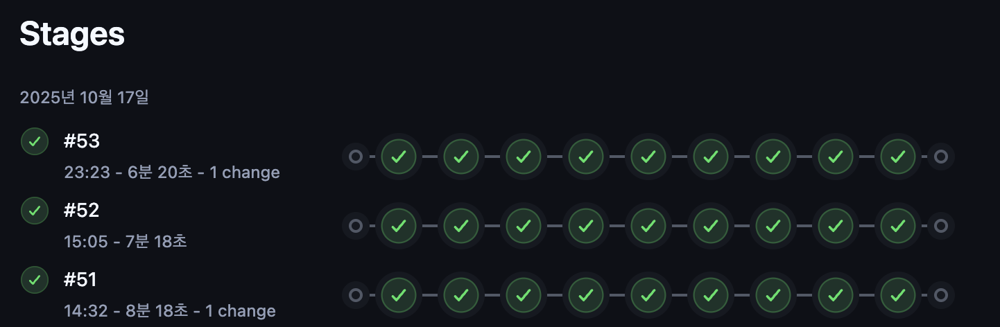

최근 배포 결과

#### **2.  CI / CD 아키텍처**

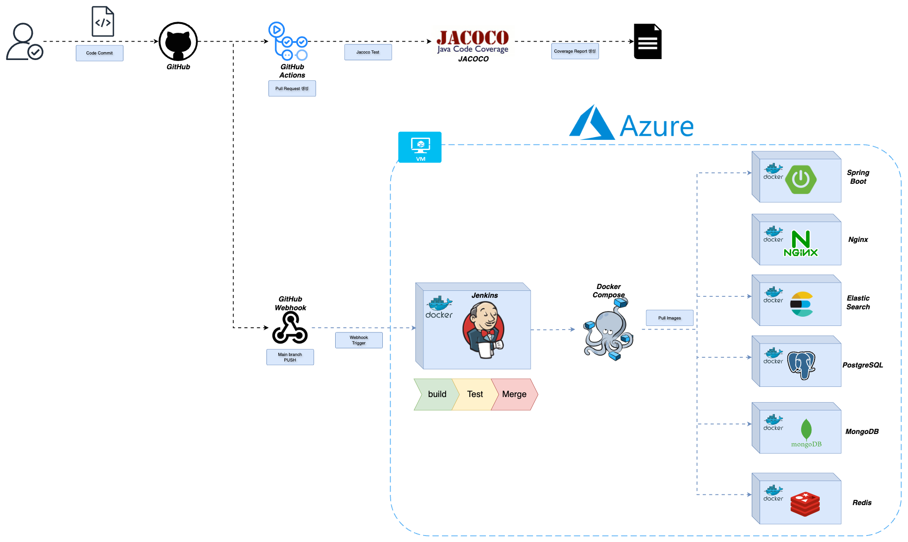

> 현재 저희의 **CI/CD Architecture** 입니다. 실제 프로덕션 브랜치인 main과 개발용 브랜치인 dev에 **Pull Requeest** 작성 시 Java 기반 테스트 커버리지 도구인 **Jacoco**를 통해 gradle 테스트를 진행해서 배포 이전에 모든 테스트를 완료합니다. 이를 통해 배포 이전 단계에서 모든 품질 검증을 완료하여, 실제 배포과정에서는 테스트를 진행하지 않습니다.

**Jacoco Test Flow**

1.  **dev / main** 브랜치에 새로운 PR 또는 Commit 발생
2.  Jacoco GitHub Actions 워크플로우 실행
3.  Temurin 기반 JDK 17 환경에서 Gradle 테스트 수행
4.  Jacoco HTML 리포트 자동 생성

**Jenkins Deploy Flow**

1.  **main** 브랜치에 Push 발생
2.  GitHub Webhook 워크플로우 실행
3.  Jenkins Job Trigger 발생
4.  Docker Compose 기반 빌드 및 배포 수행

#### **3\. 문제 진단 : 배포 시간 병목 구간 분석**

최근 배포 목록 중 가장 시간이 많이 소요된 **#51** 빌드를 기준으로 각 단계별 소요 시간을 분석했습니다.

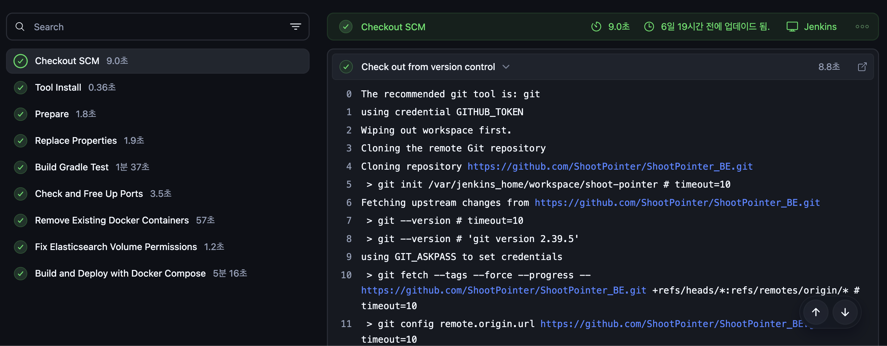

분석 결과, 두 가지의 주요 병목 구간을 발견할 수 있었습니다. 가장 먼저 **docker compose**가 build와 deploy하는 과정이 **5분 16초**로 가장 오래 걸렸고, 그다음으로는 **docker container**를 삭제하는 과정이 **57초**로 측정된 것을 확인할 수 있었습니다.

가장 시간이 오래걸리는 도커 이미지를 **빌드하고 배포하는 과정**에 대해서 **최적화**를 진행하도록 하겠습니다.

**👇기존 docker-compose.yml 파일**

```yaml
version: "3.9"  
  
services:  
  # PostgreSQL  
  postgres:  
    image: postgres:17  
    container_name: postgres  
    environment:  
      POSTGRES_DB: "shootpointer"  
      POSTGRES_USER: ""  
      POSTGRES_PASSWORD: ""  
      TZ: "Asia/Seoul"  
    ports:  
      - "5432:5432"  
    volumes:  
      - postgres-data:/var/lib/postgresql/data  
    networks:  
      - spring-network  
    restart: always  
    healthcheck:  
      test: ["CMD-SHELL", "pg_isready -U myuser -d shootpointer"]  
      interval: 10s  
      timeout: 5s  
      retries: 5  
      start_period: 30s  
  
  # Redis  
  redis:  
    image: redis:7  
    container_name: redis  
    ports:  
      - "6379:6379"  
    volumes:  
      - redis-data:/data  
    networks:  
      - spring-network  
    restart: always  
    healthcheck:  
      test: ["CMD", "redis-cli", "ping"]  
      interval: 10s  
      timeout: 5s  
      retries: 5  
      start_period: 10s  
  
  # PgAdmin  
  pgadmin:  
    image: dpage/pgadmin4  
    container_name: pgadmin  
    environment:  
      PGADMIN_DEFAULT_EMAIL: ""  
      PGADMIN_DEFAULT_PASSWORD: ""  
    ports:  
      - "3305:80"  
    networks:  
      - spring-network  
    restart: always  
  
  # MongoDB  
  mongo:  
    image: mongo:8  
    container_name: mongo  
    environment:  
      MONGO_INITDB_DATABASE: "shootpointer"  
    ports:  
      - "27017:27017"  
    volumes:  
      - mongo-data:/data/db  
      - mongo-config:/data/configdb  
    networks:  
      - spring-network  
    restart: always  
    healthcheck:  
      test: ["CMD", "mongosh", "--eval", "db.adminCommand('ping')"]  
      interval: 10s  
      timeout: 5s  
      retries: 5  
      start_period: 20s  
  
  # Spring Boot Application  
  shootpointer:  
    build:  
      context: .  
      dockerfile: Dockerfile  
    container_name: shootpointer  
    command: ["java", "-Xmx2g", "-jar", "/app.jar"]  
    depends_on:  
      postgres:  
        condition: service_healthy  
      redis:  
        condition: service_healthy  
      mongo:  
        condition: service_healthy  
      elasticsearch:  
        condition: service_healthy  
    environment:  
      SPRING_PROFILES_ACTIVE: "${SPRING_PROFILES_ACTIVE}"  
  
      # 서버 포트  
      SERVER_PORT: "9000"  
      # 데이터베이스 설정  
      SPRING_DATASOURCE_URL: "jdbc:postgresql://postgres:5432/shootpointer"  
      SPRING_DATASOURCE_USERNAME: ""  
      SPRING_DATASOURCE_PASSWORD: ""  
      SPRING_DATASOURCE_DRIVER_CLASS_NAME: "org.postgresql.Driver"  
      # JPA 설정  
      SPRING_JPA_HIBERNATE_DDL_AUTO: "create-drop"  
      SPRING_JPA_SHOW_SQL: "true"  
      SPRING_JPA_DATABASE_PLATFORM: "org.hibernate.dialect.PostgreSQLDialect"  
      SPRING_JPA_PROPERTIES_HIBERNATE_DIALECT: "org.hibernate.dialect.PostgreSQLDialect"  
      SPRING_JPA_PROPERTIES_HIBERNATE_FORMAT_SQL: "true"  
      # Hikari 연결 풀  
      SPRING_DATASOURCE_HIKARI_MAXIMUM_POOL_SIZE: "20"  
      SPRING_DATASOURCE_HIKARI_MINIMUM_IDLE: "5"  
      SPRING_DATASOURCE_HIKARI_CONNECTION_TIMEOUT: "30000"  
      SPRING_DATASOURCE_HIKARI_IDLE_TIMEOUT: "600000"  
      SPRING_DATASOURCE_HIKARI_MAX_LIFETIME: "1800000"  
      # Redis  
      SPRING_REDIS_HOST: "redis"  
      SPRING_REDIS_PORT: "6379"  
      # MongoDB  
      SPRING_DATA_MONGODB_URI: "mongodb://mongo:27017/shootpointer"  
      # 타임존  
      TZ: "Asia/Seoul"  
      # 로깅 레벨  
      LOGGING_LEVEL_ORG_HIBERNATE_SQL: "DEBUG"  
      LOGGING_LEVEL_ORG_HIBERNATE_TYPE_DESCRIPTOR_SQL_BASICBINDER: "TRACE"  
  
      # Elasticsearch  
      SPRING_ELASTICSEARCH_URIS: "http://elasticsearch:9200"  
  
    ports:  
      - "9000:9000"  
    networks:  
      - spring-network  
    restart: always  
    healthcheck:  
      test: ["CMD", "curl", "-f", "http://localhost:9000/actuator/health"]  
      interval: 30s  
      timeout: 10s  
      retries: 3  
      start_period: 60s  
  
  # Elasticsearch  
  elasticsearch:  
    build:  
      context: .  
      dockerfile: Dockerfile.elesticsearch  
    image: docker.elastic.co/elasticsearch/elasticsearch:8.6.0  
    container_name: elasticsearch  
    user: "0"  
    environment:  
      discovery.type: "single-node"  
      xpack.security.enabled: "false"  
      logger.level: "debug"  
      ES_JAVA_OPTS: "-Xms2g -Xmx2g"  
    entrypoint: >  
      bash -c "        mkdir -p /usr/share/elasticsearch/logs &&        chmod -R 775 /usr/share/elasticsearch/logs &&        chown -R 1000:1000 /usr/share/elasticsearch &&        echo 'Fixed log permissions, starting Elasticsearch as elasticsearch user...' &&        su -s /bin/bash elasticsearch -c '/usr/local/bin/docker-entrypoint.sh eswrapper'      "    ports:  
      - "9200:9200"  
      - "9300:9300"  
    volumes:  
      - ./esdata:/usr/share/elasticsearch/data  
      - ./es-logs:/usr/share/elasticsearch/logs  
    networks:  
      - spring-network  
    restart: always  
    healthcheck:  
      test: ["CMD", "curl", "-f", "http://localhost:9200/_cluster/health"]  
      interval: 30s  
      timeout: 10s  
      retries: 3  
      start_period: 60s  
  
  
  # Kibana  
  kibana:  
    image: docker.elastic.co/kibana/kibana:8.6.0  
    container_name: kibana  
    environment:  
      ELASTICSEARCH_HOSTS: "http://elasticsearch:9200"  
    ports:  
      - "5601:5601"  
    depends_on:  
      - elasticsearch  
    networks:  
      - spring-network  
    restart: always  
  
  # Nginx  
  nginx:  
    image: nginx:latest  
    container_name: nginx  
    restart: always  
    ports:  
      - "443:443"  
    volumes:  
      - /home/opendocs/jenkins/workspace/shoot-pointer/nginx/conf.d:/etc/nginx/conf.d  
      - /etc/letsencrypt:/etc/letsencrypt:ro  
    depends_on:  
      - shootpointer  
    networks:  
      - spring-network  
  
networks:  
  spring-network:  
    driver: bridge  
  
volumes:  
  redis-data:  
  postgres-data:  
  mongo-data:  
  mongo-config:  
  esdata:
```

## ********2\. 문제 해결********

* * *

우선 실제 가용중인 **Azure** 서버 쉘에 접속하여 현재 **docker**가 차지하고 있는 리소스를 확인해보도록 하겠습니다.

```bash
docker system df
```

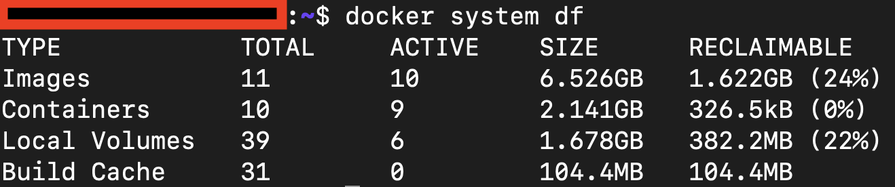

계산 결과 **8.67GB**를 차지하고 있습니다. 현재 사용하고 있는 **Azure** 서버의 스펙은 **Standard D2 v5**로 서버의 디스크를 확인해보겠습니다. 

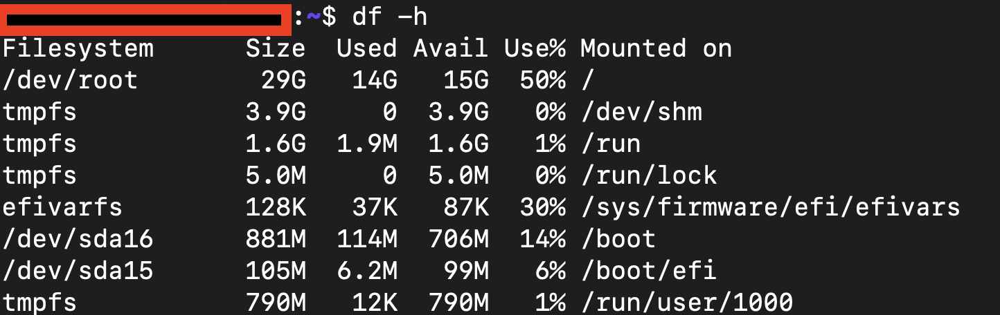

전체 용량 **29GB**에 대하여 도커 관련 서비스들만 **약 29.9%**를 차지하고 있습니다.

현재는 개발 단계로 PostgreSQL, Redis, Elasticsearch, MongoDB 등에 기본 테이블만 존재하고 실제 데이터는 거의 없는 상태입니다. 그럼에도 불구하고 **Docker** 관련 서비스만으로 디스크의 거의 30%를 차지하고 있다는 것은 명백한 최적화 대상이었습니다.

#### **1\. 불필요한  컨테이너 제거 : Redis 외부화**

현재 **Redis**는 redis:7 버젼의 컨테이너가 포함되었습니다. 프로젝트 구조상 OpenCv와 연결되어 있는 FastApi와의 PUB/SUB 통신을 위해 서버 내부 Redis 프로세스를 직접 사용하기로 결정했습니다.

즉, **Redis**는 이제 Ubuntu 내에서 직접 실행되는 구조로 Docker로 빌드할 필요가 없어졌습니다.

**👇삭제할 docker-compose.yml**

```yaml
# Redis  
  redis:  
    image: redis:7  
    container_name: redis  
    ports:  
      - "6379:6379"  
    volumes:  
      - redis-data:/data  
    networks:  
      - spring-network  
    restart: always  
    healthcheck:  
      test: ["CMD", "redis-cli", "ping"]  
      interval: 10s  
      timeout: 5s  
      retries: 5  
      start_period: 10s  
      
...

    # Redis  
      SPRING_REDIS_HOST: "redis"  
      SPRING_REDIS_PORT: "6379"  
      
...

volumes:  
  redis-data:  
  
...
```

* * *

#### **2\. JDK 이미지 경량화 : slim -> alpine**

기존 Spring Application를 빌드하는 Dockerfile은 다음과 같았습니다.

```dockerfile
FROM openjdk:21-slim  
  
ARG JAR_FILE=build/libs/shootpointer-0.0.1-SNAPSHOT.jar  
  
COPY ${JAR_FILE} app.jar  
  
ENV SPRING_PROFILES_ACTIVE=es,test-real-data,prod  
  
  
RUN apt-get update \  
    && apt-get install -y tzdata \  
    && ln -sf /usr/share/zoneinfo/Asia/Seoul /etc/localtime \  
    && echo "Asia/Seoul" > /etc/timezone \  
    && apt-get clean \  
    && rm -rf /var/lib/apt/lists/*  
  
ENTRYPOINT ["java", "-Duser.timezone=Asia/Seoul", "-jar", "/app.jar"]
```

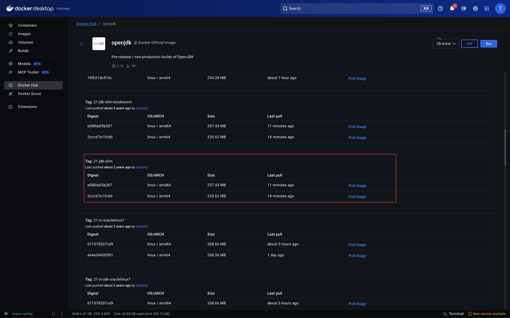

Open JDK

**Docker Hub**에 접속하여 현재 사용중인 jdk 이미지의 크기를 확인해보도록 하겠습니다. 현재 사용중인 **openjdk:21-slim** 버젼의 크기는 **약 237MB**로 비교적 큰 용량을 차지함을 확인할 수 있었습니다. 

**Alpine Linux**는 보안과 경량화에 특화된 리눅스 배포판입니다. 다음과 같은 장점이 있습니다:

-   **극도로 작은 이미지 크기**: 일반 Linux 배포판 대비 1/10 수준
-   **빠른 빌드 속도**: 이미지 크기가 작아 pull/push 시간 단축
-   **레이어 캐시 효율 향상**: 작은 베이스 이미지로 캐시 히트율 증가
-   **보안성 강화**: 최소한의 패키지만 포함하여 공격 표면 축소

Alpine 이미지를 기반으로 하는 **eclipse-temurin:21-jre-alpine**으로 교체했습니다. 


* * *

#### **3\. 환경 변수 외부화(.env 관리)**

현재 **Docker-Compose** 파일을 살펴보면 이미지들의 다양한 환경 변수들이 하드 코딩된 채로 존재합니다.  따라서, 이러한 환경 변수값들을 따로 .env 파일로 관리하여 **Jenkins**의 **Credentials**의 **SECRET\_DOCKER** 이름의 file로 관리하도록 합니다. 환경 변수를 하드코딩하는 방법이나 따로 시크릿 파일로 관리하는 방법은 속도면에서는 큰 차이가 존재하지 않습니다. 하지만, 현재 도커 파일 내의 많은 환경 변수들이 존재해 유지보수하는데에 어려움과 보안적으로 민감한 정보들이 여러 시스템에서 노출될 수 있으므로 따로 파일로서 관리해주도록 하겠습니다.

```properties
POSTGRES_USER=postgres
POSTGRES_PASSWORD=postgres
POSTGRES_DB=testdb
SPRING_PROFILES_ACTIVE=test,es,batch

#DB
SPRING_DATASOURCE_URL=jdbc:postgresql://postgresql:5432/testdb
SPRING_DATASOURCE_USERNAME=postgres
SPRING_DATASOURCE_PASSWORD=postgres
SPRING_DATASOURCE_DRIVER_CLASS_NAME=org.postgresql.Driver

#JPA
SPRING_JPA_HIBERNATE_DDL_AUTO=create-drop
SPRING_JPA_SHOW_SQL=true
SPRING_JPA_DATABASE_PLATFORM=org.hibernate.dialect.PostgreSQLDialect
SPRING_JPA_PROPERTIES_HIBERNATE_DIALECT=org.hibernate.dialect.PostgreSQLDialect
SPRING_JPA_PROPERTIES_HIBERNATE_FORMAT_SQL=true

#HikariCP
SPRING_DATASOURCE_HIKARI_MAXIMUM_POOL_SIZE=20
SPRING_DATASOURCE_HIKARI_MINIMUM_IDLE=5
SPRING_DATASOURCE_HIKARI_IDLE_TIMEOUT=30000
SPRING_DATASOURCE_HIKARI_CONNECTION_TIMEOUT=30000
SPRING_DATASOURCE_HIKARI_MAX_LIFETIME=1800000

#MongoDB
SPRING_DATA_MONGODB_URI=mongodb://mongodb:27017/shootpointer

#time zone
TZ=Asia/Seoul

#logging
LOGGING_LEVEL_ORG_HIBERNATE_SQL=DEBUG
LOGGING_LEVEL_ORG_HIBERNATE_TYPE_DESCRIPTOR_SQL_BASICBINDER=TRACE

#Elasticsearch
SPRING_ELASTICSEARCH_URIS=http://elasticsearch:9200

#kibana
ELASTICSEARCH_HOSTS=http://elasticsearch:9200
```

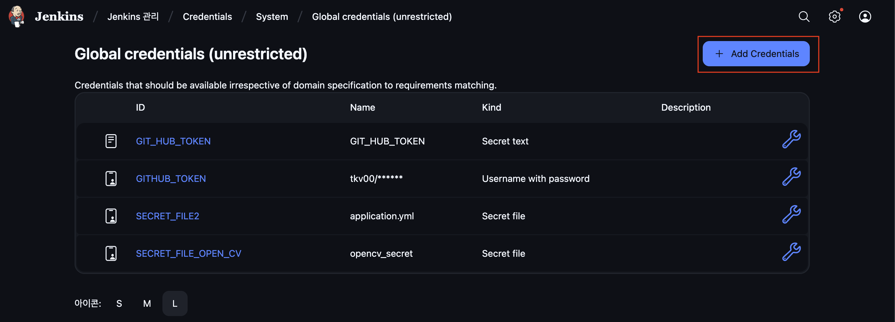

1\. Jenkins 관리 -> Credentials->System에 들어가 Add Credentials를 눌러 docker 환경 변수 파일을 업로드 합니다.

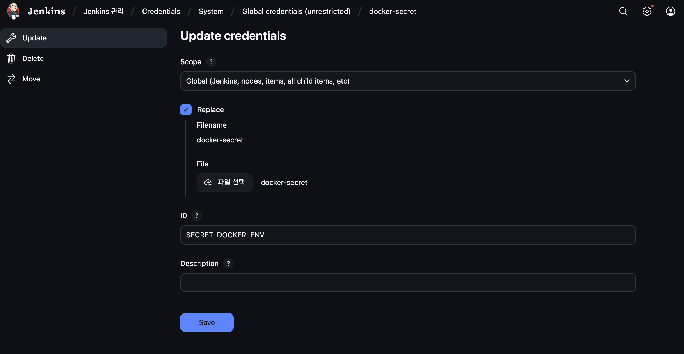

2\. 업로드를 완료 하였으니 환경변수명에 맞추어 docker-compose 파일 수정을 진행합니다.

* * *

#### **4\. 멀티스테이지 빌드 적용**

> **멀티스테이지 빌드란?  
> docker** 컨테이너 이미지를 만들면서 빌드 과정에서는 필요하지만, 최종 컨테이너 이미지에서는 필요 없는 환경을 제거할 수 있도록 빌드단계와 최종단계를 분리하는 방법입니다. 디시 말해, **Builder** image에서는 앱 빌드에 필요한 의존성 설정, 빌드 후 바이너리를 생성하고 실제로 동작하는 **러닝** 이미지에서는 빌더로부터 바이너리만 받아서 사용하는 방식입니다. 이러한 과정들을 통하여 **Running**과정에서는 Build에만 필요한 여러 도구, 라이브러리등을 제외하고 컴팩트한 이미지에서 바이너리만을 가지고 동작시킬 수 있습니다.

  
빌드 패턴을 이용하여 하나의 도커 파일에서 Base 이미지만을 바꿔 사용하 Builder에서 생성된 이미지를 전달해주기 위하여 COPY의 --form 옵션을 통해 실행 이미지로 전달해 줍니다.

기존 **Spring Application** 도커를 활용하여 빌드하는 **Docker file** 설정은 아래와 같습니다.

```dockerfile
FROM openjdk:21-slim

ARG JAR_FILE=build/libs/shootpointer-0.0.1-SNAPSHOT.jar

COPY ${JAR_FILE} app.jar

ENV SPRING_PROFILES_ACTIVE=es,test-real-data

RUN apt-get update \
    && apt-get install -y tzdata \
    && ln -sf /usr/share/zoneinfo/Asia/Seoul /etc/localtime \
    && echo "Asia/Seoul" > /etc/timezone \
    && apt-get clean \
    && rm -rf /var/lib/apt/lists/*

ENTRYPOINT ["java", "-Duser.timezone=Asia/Seoul", "-jar", "/app.jar"]
```

해당 이미지를 빌드한 후 Docker Hub에 push를 진행했습니다. 이미지의 전체 크기가 **298.04MB**임을 확인할 수 있습니다.

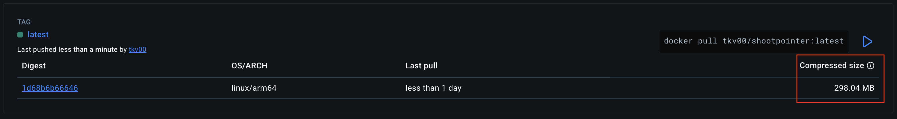

기존 Docker 이미지 크기

```dockerfile
# Builder
FROM gradle:8.10.2-jdk21 AS builder
WORKDIR /shootpointer
COPY build.gradle settings.gradle ./
COPY gradle gradle
COPY src src
RUN gradle clean bootJar --no-daemon -x test

# Running
FROM eclipse-temurin:21-jre-alpine
WORKDIR /app
RUN apk add --no-cache tzdata \
        && ln -sf /usr/share/zoneinfo/Asia/Seoul /etc/localtime \
        && echo "Asia/Seoul" > /etc/timezone
ENV SPRING_PROFILES_ACTIVE=es,test-real-data,batch
ENV TZ=Asia/Seoul
COPY --from=builder /shootpointer/build/libs/*.jar app.jar
ENTRYPOINT ["java", "-Duser.timezone=Asia/Seoul", "-jar", "app.jar"]
```

-   **Builder**
    1.  **WORKDIR /shootpointer :** 도커 컨테이너 내부의 작업 디렉토리명은 /shootpointer로 설정합니다.
    2.  **COPY build.gradle settings.gradle ./** **:** 의존성 정보를 먼저 복사하며 캐시를 활용합니다.
    3.  **COPY src src :** 실제 shootpointer의 애플리케이션 소스를 복사합니다.
    4.  **RUN gradle clean bootJar --no-daemon -x test :** 앞서 언급했듯이 Jcoco 테스트 도구를 이용하여 배포 이전에 모든 테스트를 진행하므로 테스트 없이 Spring boot를 실행하여 JAR를 생성합니다.
-   **Running**
    1.  **WORKDIR /app :** 실행 디렉토리를 /app으로 설정합니다.
    2.  **COPY --from=builder /shootpointer/build/libs/\*.jar app.jar :** Builder 단계의 결과물만을 복사합니다.   
          
        

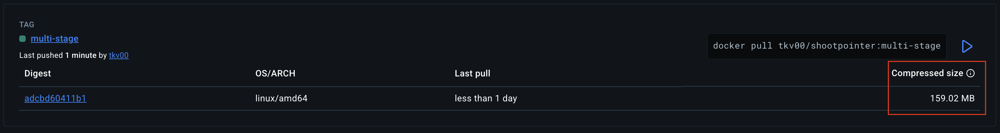

multi-stage 적용 결과 Docker 이미지 크기

수정한 **Docker file**을 **Docker Hub**에 push를 진행한 후 이미지의 전체 크기를 확인했습니다. 


* * *

#### **5.  dockerignore로 빌드 컨텍스트 최적화**

**Docker**는 이미지를 빌드할 때 **Dockerfile**이 있는 디렉토리의 모든 파일을 압축하여 **Docker 데몬**에 전송합니다. 이를 "빌드 컨텍스트"라고 합니다. **.dockerignore** 파일을 통해 빌드 컨텍스트에서 불필요한 파일을 제외하여 빌드 컨텍스트 크기 감소, Docker 데몬으로의 전송 시간 단축을 기대할 수 있습니다.

```dockerignore
#build
out/
!gradle/wrapper/gradle-wrapper.jar

#IDE
.idea/

#git
.git/
.gitignore

#test
tmp/
```

* * *

#### **6.  Jenkins 최적화 - BuildKit + 병렬 빌드 적용**

**Docker**의 **BuildKit**은 도커의 새로운 빌드 엔진으로 캐시를 더 효율적으로 사용하여 빌드 속도와 효율성을 크게 향상시킬 수 있습니다.  
현재 **shootpointer** 프로젝트는 **Jenkins** 환경에서 **Docker**가 실행되므로 **Jenkinsfile**에 직접 적용해보도록 하겠습니다.

1)Docker Build Kit 적용

```groovy
	...
	
	environment {  
    	COMPOSE_FILE = 'docker-compose.yml'  
    	SPRING_PROFILES_ACTIVE = "${params.PROFILE}"  
  
    	//Build kit  
    	DOCKER_BUILDKIT = '1'  
    	BUILDKIT_PROGRESS = 'plain'  
    
	}

...
```

**Jenkins**의 환경 설정 부분에 **Docker build kit**를 적용했습니다.

2)중복 빌드 제거

```groovy
stage('Build Gradle Test') {
    steps {
            sh 'echo "JAVA_HOME is set to: $JAVA_HOME"'
            sh 'java -version'
            sh 'chmod +x gradlew'
            sh './gradlew clean build -x test --info'
           }
     post {
            success { sh 'echo "✅ Successfully Built Gradle Project"' }
            failure { sh 'echo "❌ Failed to Build Gradle Project"' }
          }
  }
```

**Jenkinsfile**에서 **Gradle**을 통해 애플리케이션을 빌드하고 있었지만, **Dockerfile**의 멀티스테이지 빌드에서도 동일한 작업을 수행하고 있었습니다. 멀티스테이지 **Dockerfile**에서 이미 최적화된 빌드 프로세스를 수행하므로, **Jenkinsfile**의 중복 빌드 단계를 완전히 제거했습니다.

3)Jenkins 병렬 빌드 적용

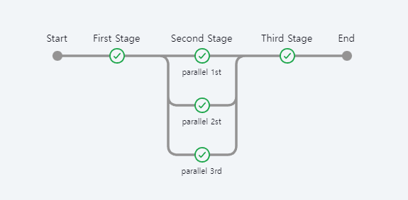

Jenkins 병렬 빌드

위의 사진과 같이 **Jenkins**를 이용하여 빌드를 진행할 때 병렬로 빌드하면 CPU 코어를 조금 더 효율적으로 사용하고 빌드가 가능합니다.

**Jenkins Pipeline**의 parallel 블록을 활용하여 독립적인 작업들을 동시에 수행할 수 있습니다.

1.  포트 점검 및 정리
2.  기존 Docker 컨테이너 제거

이 두 작업은 서로 독립적이므로 순차적으로 실행할 필요가 없습니다.

```groovy
stage('Preparation'){
            parallel{
                stage('Check and Free Up Ports') {
                            steps {
                                sh """
                                for port in 5431 27016; do
                                    if lsof -i :\$port; then
                                        echo "Port \$port is in use. Killing the process..."
                                        sudo kill -9 \$(lsof -ti :\$port) || true
                                    fi
                                done
                                echo "Port cleanup complete."
                                """
                            }
                        }

                 stage('Remove Existing Docker Containers') {
                             steps {
                                 sh '''
                                 JENKINS_CONTAINER=$(docker ps -aqf "name=jenkins")
                                 ALL_CONTAINERS=$(docker ps -aq)

                                 for CONTAINER in $ALL_CONTAINERS; do
                                     if [ "$CONTAINER" != "$JENKINS_CONTAINER" ]; then
                                         docker stop $CONTAINER || true
                                         docker rm -f $CONTAINER || true
                                     fi
                                 done

                                 docker-compose down --remove-orphans || true
                                 '''
                             }
                             post {
                                 success { sh 'echo "Successfully Removed Docker Containers"' }
                                 failure { sh 'echo "Failed to Remove Docker Containers"' }
                             }
                     }
            }

        }
```

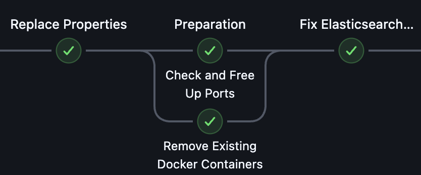

실제 병렬 빌드 적용 모습

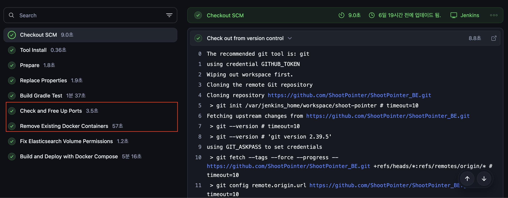

#51 빌드

기존 순차 실행은 **포트 정리(3.5 초) + 컨테이너 정리 (57초) = 60.5초** 에서 병렬 실행을 적용한 최근 빌드인 **#62**빌드 기준으로 **11초**로 **81.8%** 절감할 수 있었습니다

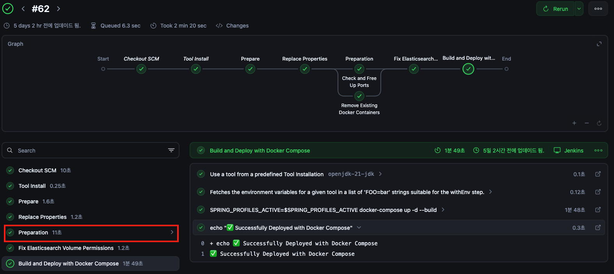


## ********3.  결과********

* * *

#### 1) 빌드 다운 타임 

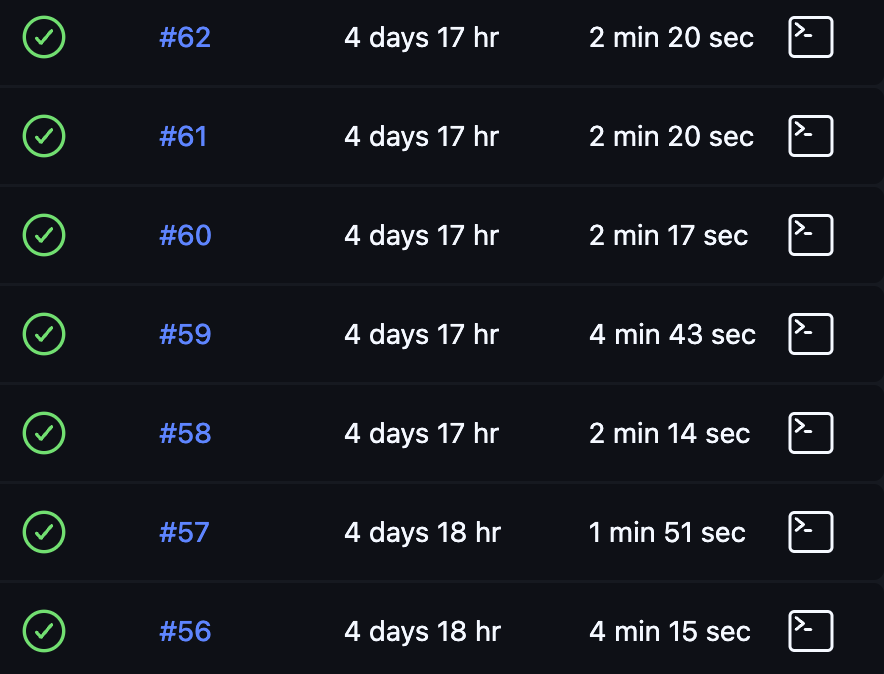

최적화 이후 빌드 목록

위와 같이 6가지의 최적화 방법을 진행하고 최근 재배포 목록 7가지를 가지고 왔습니다. 최대 배포 시간은 **4분 15초**이고 최소 배포 시간은 **1분 51초**로 기존 **평균 6~8분대**에서 **평균 2~3분대**로 빌드 시간을 대폭 절감할 수 있었습니다.

#### 2) 디스크 사용량 개선 결과

과연 용량에 대해서는 최적화가 되었을까요? 처음 확인 했던 방법과 같은 명령어를 통해 확인해봅시다.

```bash
# 동일한 명령어로 측정
docker system df
```

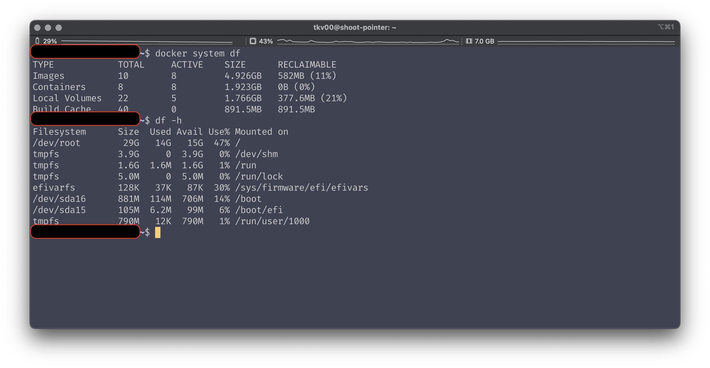

|  | 최적화 전 | 최적화 후 | 절감률 |
| --- | --- | --- | --- |
| Docker Images | 6.526GB | 4.926GB | 24.51% |
| Docker Containers | 2.131GB | 1.923GB | 9.76% |

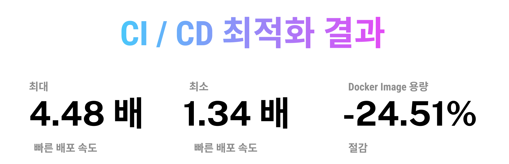
