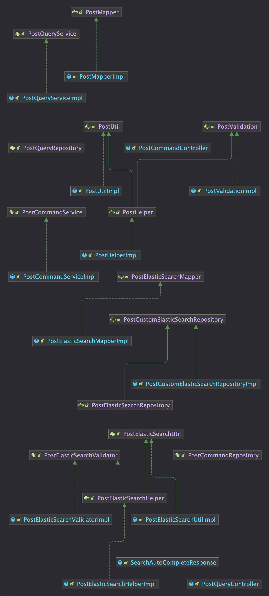
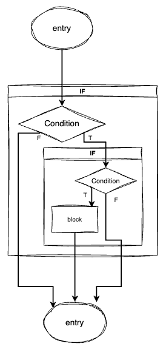
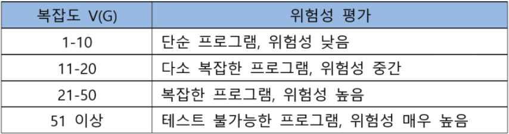
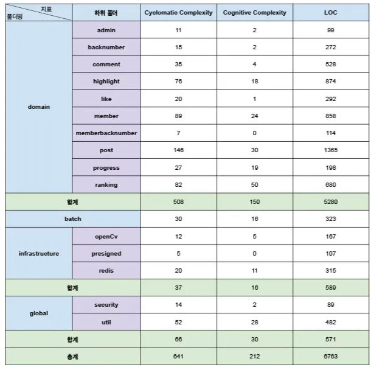
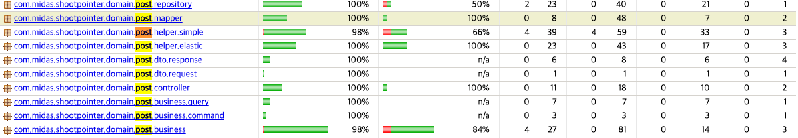
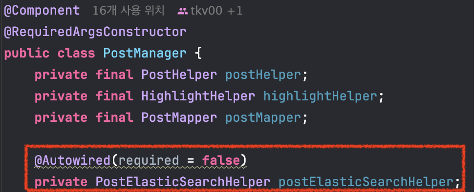
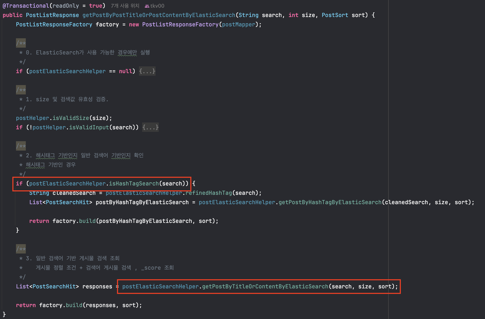
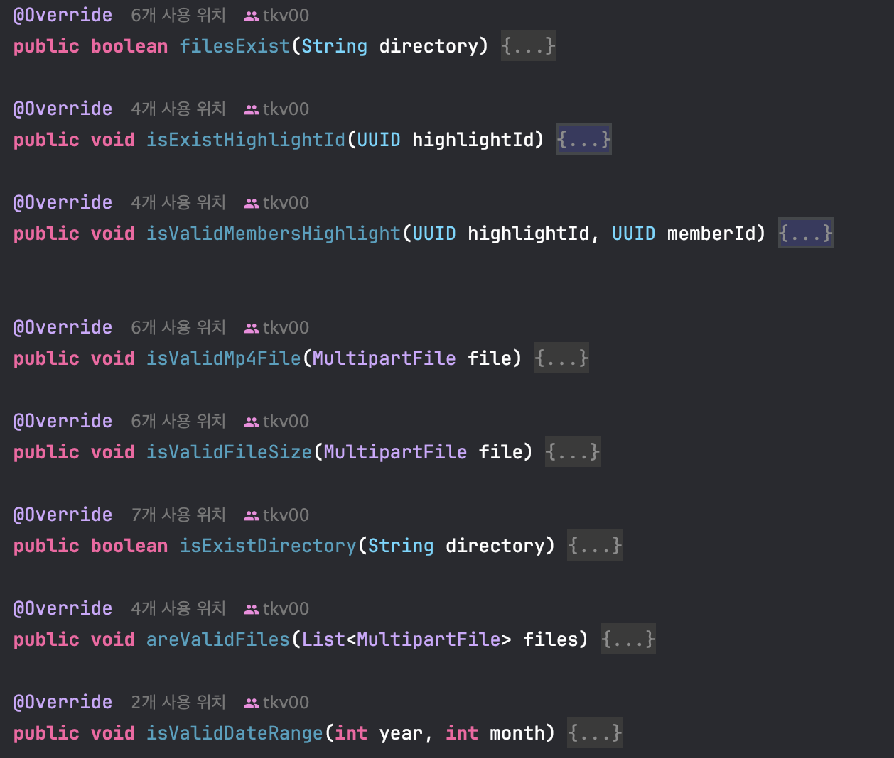
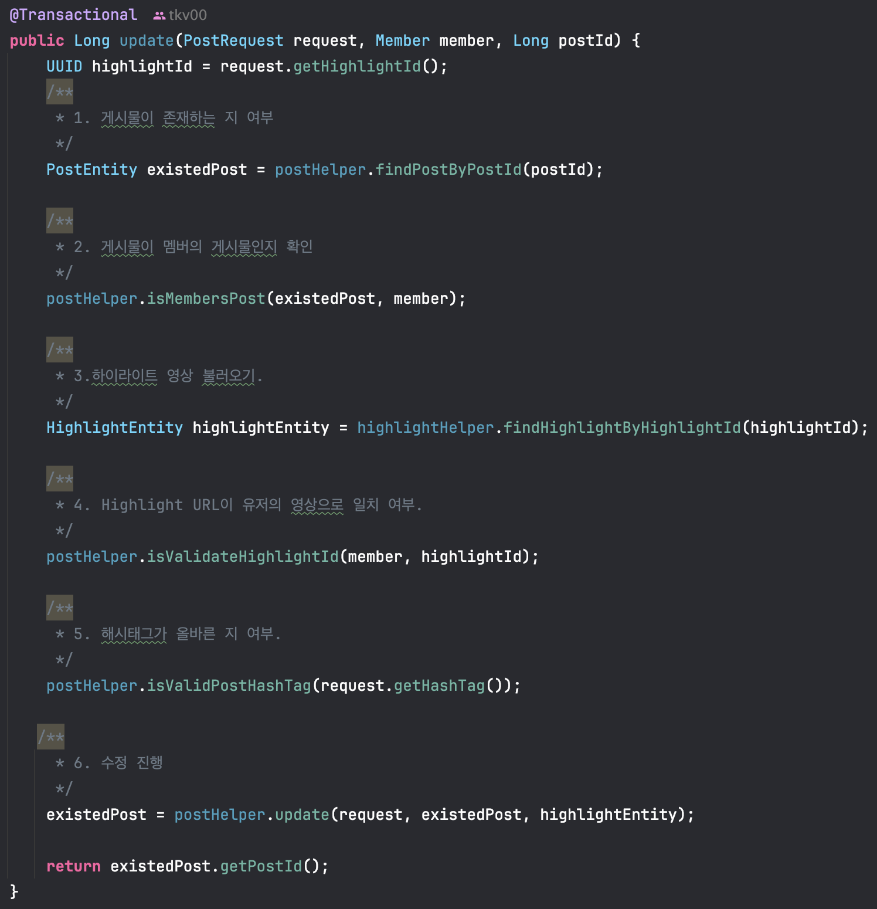

> "소프트웨어 아키텍처의 목표는 필요한 시스템을 만들고 유지보수하는 데 투입되는 인적 자원을 최소화하는 것이다." - 로버트 C. 마틴 (Robert C. Martin) -



게시판 도메인 클래스 다이어그램

현재 ShootPointer의 게시물 도메인의 전체적인 계층 구조입니다. 누가봐도 “더럽고” 과도한 인터페이스 남용+ 무지성 컨트롤러/서비스 구현체가 남발하는 상태입니다.

처음 아키텍처를 설계할 때, 교과서적인 **레이어드 아키텍처**로 프로젝트를 시작하게 되었습니다. 하지만 비즈니스 로직을 작성하는 과정에서 복잡한 메서드들을 단순히 감추기 위해 **private 메서드**로 내부에 감추려고 했습니다. 문제는 여기서 발생했습니다. **JUnit5 기반으로 테스트 코드를 작성하려니 private 메서드는 테스트할 수 없었던 것**입니다.

물론, 리플렉션이나 일시적으로 접근자를 protected로 변경하는 방법과 같은 ‘꼼수’도 있지만, 이는 근본적인 해결책이 아닙니다. Junit의 창시자 Kent Beck은 [https://shoulditestprivatemethods.com/](https://shoulditestprivatemethods.com/) 과 같은 답을 저에게 전달합니다.

### **아키텍처 개선을 위한 첫 번째 몸부림**

나름의 해결책으로 CQRS 패턴을 흉내내어 QueryController(READ)와 PostCommandController(CUD)를 분리하고 비즈니스 책임 분리를 위해 유효성 검증과 서비스 로직을 **helper ← util(서비스) + validator(유효성 검증)** 구조를 적용했습니다. 하지만 이는 Java의 객체지향이 아니라 절차지향적 코드를 단순히 인터페이스로 포장한 것에 불과했습니다.


결과는 참담했습니다. 테스트 커버리지를 맞추기 위해 의미 없는 단순 책임을 위임하면서 클래스들의 개수는 늘어갔고 이에 테스트 코드를 2배로 작성해나가야 했습니다. 또한, Elasticsearch의 도입으로 외부 시스템(Infrastructure) 로직이 도메인 영역을 침범하기 시작하며 정말 잘못된 아키텍처라는 것을 하나씩 몸소 체감할 수 있었습니다.

하지만!!! 아키텍처를 갈아엎을 수 없었습니다. 졸업 발표까지 3달 남짓한 지점에서 도메인 아키텍처에 대해 이해하고 실제로 체득하는 시간(+팀원도 같이 습득해야 하는 점)과 리팩토링 시 소요 시간을 생각해야 했습니다. 아직 구현해야 할 기능들이 많이 존재하였기 때문에 우선순위는 점점 뒤로 미뤄둘 수 밖에 없는 지경이 되었습니다.

졸업발표가 끝난 지금, 최선은 아닐지라도 차선의 방안으로 리팩토링을 진행하고자 합니다. 그 시작으로 정적 분석 코드 도구인 **SonarQube**를 이용하여 프로젝트의 현주소를 수치적으로 적나라하게 파헤쳐 보겠습니다.

* * *

## **1\. 객관적 측정 지표 : 숫자로 보는 프로젝트의 쌩얼**

막연하게 개발자의 느낌만으로 ‘코드가 더럽다’, ‘아키텍처가 난해하다.’는 다른 이들에게 전달력이 떨어지며 추상적입니다. 또한 리팩토링을 진행하면서 올바른 방향인지도 알기 어렵기 때문에 객관적인 수치들을 통해서 심각성을 인지하고 개선 방향을 설계하고자 local 환경에서 dev 브랜치를 기준으로 **SonarQube** 분석을 진행했습니다.

### **주요 측정 지표 설명**

#### **Cyclomatic Complexity - 순환 복잡도**

소스 코드의 복잡도를 나타내는 지표로 프로그램의 제어 흐름을 그래프로 표현하며, 이 그래프의 복잡도 계산식을 적용하여 산출할 수 있습니다.

```text
계산식 1: 복잡도 V(G) = Edge의 수 - Node 수 + 2
계산식 2: 복잡도 V(G) = 분기문 개수 + 1
```

```java
void func1(int a,int b){
	if(a<10){
		if(b==true){
			n++;
		}
	}
}
```

위와 같은 코드는 아래와 같은 이미지로 제어 흐름을 나타낼 수 있습니다. 제어 흐름 그래프에서 **6개의 Edge**와 **5개의 Node**가 존재하므로 계산식 1을 이용하여 C.C를 계산했을 때 **3**이 나오게 됩니다.



**Cyclomatic Complexity**가 처음 고안된 1970년대에는 **10 이하**의 복잡도를 유지할 것으로 권고하였습니다만 프로그램의 규모가 커짐에 따라서 현재 마이크로소프트 개발 지침에는 **25이하**를 유지할 것을 권고합니다. 미국 카네기 멜론 대학교의 sw 공학연구소는 복잡도에 따른 위험성을 아래와 같이 평가표를 만들었습니다.



#### **Cognitive Complexity - 인지 복잡도**

**Cognitive Complexity**는 인지 복잡도로 sonar cube가 도입한 **Cyclomatic Complexity**와 유사한 지표입니다. 이 지표는 메소드의 제어 흐름이 얼마나 이해하기 어려운지, 다시 말하여 유지 보수의 어려움을 나타냅니다. 프로젝트의 아키텍처의 주 목표는 이러한 유지 보수의 어려움을 벗어나려는 노력을 목표로 하므로 적당한 지표 선택이라고 생각합니다.

아래와 같은 원칙으로 측정합니다.

-   코드의 순차적인 흐름을 끊는 요소break가 존재하는 경우, 인지 복잡도 값을 증가시킵니다.
-   코드의 흐름을 끊는 요소가 중첩nested된 경우, 인지 복잡도 값을 증가시킵니다.
-   복수의 코드 라인을 하나의 코드라인으로 작성했으나, 이해할 수 있을 정도로 합쳐진 코드 구조shorthand structure의 경우, 인지 복잡도 값을 증가시키지 않습니다.

조금 더 자세한 설명은 문서를 참고해주세요. 

[https://sonarqubekr.atlassian.net/wiki/spaces/SON/blog/2017/10/06/34996228/Cognitive+Complexity+Because+Testability+Understandability

sonarqubekr.atlassian.net](https://sonarqubekr.atlassian.net/wiki/spaces/SON/blog/2017/10/06/34996228/Cognitive+Complexity+Because+Testability+Understandability)

### **LOC(Lines Of Code)**

**LOC**는 소프트웨어를 구성하는 **소스 코드의 라인 수**를 기반으로 시스템 규모를 측정합니다. 주석, 공백, 컴파일된 코드 포함 여부등의 다양한 기준으로 세분화되며, 양적인 측정을 통하여 프로젝트의 복잡도 및 개발 난이도를 가늠할 수 있습니다. LOC가 많을 수록 프로젝트의 규모와 **복잡도가 높다**고 볼 수 있습니다. 이러한 LOC 지표를 통하여 유지보수 비용 예측에도 활용할 수 있습니다.

### **ShootPointer의 정적 소스 지표 by SonarQube**



ShootPointer 측정 지표

* * *

## **2\. 문제점 파악 - 지피지기면 백전불태**

우선 현재 프로젝트의 전체적인 문제점들을 정리해보도록 하겠습니다.

### **1) 테스트 용이성 확보**

**/domain/post**를 기준으로 작성한 테스트 코드의 Jacoco 커버리지 측정 결과 ( Pull Request #251 기준)는 충격적이었습니다.



| total Missed Branches | total Missed Lines | total Missed Methods |
| --- | --- | --- |
| 483 | 220 | 91 |

총 **422개**의 테스트 케이스를 작성했음에도 불구하고, 분기 커버리지 중 **483개**의 분기가 테스트가 되지 않았고 **220라인**에서 테스트 코드가 실행되지 않았습니다. 또한, 테스트가 호출되지 않은 메서드 개수가 무려 **91개** 입니다.

과도한 인터페이스 사용과 거대한 크기의 서비스 클래스들 때문입니다. 겉으로만 객체지향을 흉내내며 억지로 만든 Helper, Validator 인터페이스들은 실제 로직을 검증하는기보다는 서로를 호출하는 것을 Mocking하는데 급급하게 만들었고 진정한 테스트 코드를 작성하지 못했습니다.

### **2) 외부 인프라/시스템과의 분리 필요성**

ShootPointer는 순수 Java/Spring 외에도 다양한 외부 시스템에 의존하고 있습니다.

-   **Redis\_1** : 인증,인가의 토큰 관리
-   **Redis\_2(OpenCV 서버의 Redis)** : openCV 하이라이트 영상 처리 과정 데이터 수신
-   **Elasticsearch** : 검색어 추천 및 가중치 기반 검색
-   **Spring Batch** : 하이라이트 클립 집계 및 데이터 삭제
-   **openCV** : 영상 처리(webClient 통신)

문제는 도메인 로직 내부에 이러한 인프라 구현 기술이 깊숙이 침투해 있다는 점입니다.





실제로 게시물의 비즈니스 로직을 처리하는 **PostManager 클래스**에서 **Elasticsearch**을 이용하여 가중치를 계산한 후 검색어 정확성 기반 조회 로직을 호출하여 사용하고 있어 비교적 **높은 결합도**를 가지는 모습을 보이고 있습니다. 다른 외부 서비스 로직에 대해서도 위와 동일한 형태로 구현되어 있어 프로젝트 전체적으로 **높은 결합도**를 지니고 있는 점이 존재합니다.

이로 인해 인프라 기술이 변경되거나 테스트를 진행할 때 도메인 코드까지 수정해야 하는 문제가 발생했습니다.

> **\[ Spring Batch와의 분리 필요성 \]**  
>   
> 비교적 대용량의 데이터를 처리하는 배치 작업은 CPU와 메모리를 점유하면 실시간 요청이 중요한 어플리케이션단에서는 응답 속도가 느려져 장애가 발생할 수 있습니다. 특히, 하이라이트 클립의 생성 진행률의 응답을 수신받고, 생성된 하이라이트 클립의 정보를 RESTFUL API로 받을 때 장애가 발생하면 심각한 문제를 초래할 수 있습니다. Web서버는 트래픽에 따라서 scale-out를 해야합니다. 하지만 배치 작업은 트래픽이 기준이 아닌 처리해야하는 데이터의 양의 기준으로 확장성을 고려해야 하므로 어플리케이션과 배치가 동일하게 묶여 있으면 현재 모놀로리식인 shootpointer환경에서는 리소스 낭비가 발생할 수 있습니다.

### **3) 흐려진 소프트웨어의 본질적인 목표**

소프트웨어의 본질적인 목표는 **현실의 문제**, 혹은 **해결해야 하는 상황**을 코드로 모델링하고 이 과정에서 **비즈니스 가치**를 창출해나가는 것입니다. 즉, 소프트웨어는 단순한 기능의 집합이 아니라, 현실을 이해하고 이를 구조화한 결과물이어야 합니다.

ShootPointer가 목표하는 현실 문제에 대한 솔루션은 동호회 혹은 개인 단위들 간 진행되는 농구 경기에서 전체 경기 영상 중 하이라이트 장면만을 자동으로 추출함으로써 사용자의 시간과 노력을 절약하는 솔루션을 제공하는 것입니다. 그러나 구현이 진행될수록 본질적인 목표는 점점 흐려지기 시작했습니다. 기능 구현 자체에만 집중한 나머지, 왜 기능이 존재하는지, 이 데이터가 어떤 도메인 의미를 가지는지에 대한 고민이 부족해졌습니다.

결과적으로 도메인 객체는 비즈니스 개념을 표현하는 모델이 아니라, 단순히 데이터를 담아 전달하는 DTO에 가까운 역할로 전락했습니다.

이러한 데이터 중식적인 사고는 아래와 같은 문제들을 야기했습니다.

-   도메인 로직이 서비스 계층(manager, validator,util class)에 산발적으로 흩어짐.
-   유사한 검증 및 변환 로직이 반복적으로 작성됨.
-   객체는 스스로 행위와 책임을 가지지 못하고 데이터 덩어리가 됨.

그 결과, 중복된 코드는 기하급수적으로 증가하였고 현재 프로젝트의 LOC(Line Of Codes)는 6,763라인에 이르렀습니다.새로운 기능 추가나 구조 변경, 테스트 코드 수정 및 추가하기에 부담스러운 상태에 도달했습니다. ShootPointer는 결국 현실 문제를 해결하는 서비스임에도 불구하고 현실을 표현하는 도메인 모델이 사라진 채 데이터를 저장하고 전달하는 구조만이 남아 있게 되었습니다.

### **4) 다중 책임 할당으로 인한 SRP 원칙 위배**



하이라이트 클립 영상에 대해서 유효 검증을 실시하는 **HighlightValidatorImpl 클래스**입니다. 해당 클래스는 아래와 같은 책임을 가지고 있습니다.

1.  파일 메타데이터 검증 책임(I/O)
2.  파일 디렉토리 검증 책임(시스템)
3.  하이라이트 존재 여부 검증 책임(DB 조회)
4.  하이라이트 소유자 검증 책임(비즈니스 정책)
5.  날짜 정책 검증 책임.(비즈니스 정책)

**I/O, DB 접근, 비즈니스 정책**이 하나의 클래스에 뒤섞여 있습니다. 만약 동영상 파일 확장자 정책이 변경되어도, 유저 권한 정책이 바뀌어도 이 클래스를 포함한 하위 클래스 모두를 수정해야 합니다. 이는 변경의 이유가 하나이어야 한다는 **SRP 원칙에 위배**됩니다.

### **5) 비즈니스 로직의 거대함**



위의 코드 사진은 단순하게 게시물의 수정을 처리하는 **PostManager의 update() 메서드**입니다.

이 메서드는 단순히 수정만 하는 것이 아닙니다. 게시물 존재 확인, 작성자 검증, 데이터 유효성 검사 등 모든 절차를 서비스 메서드 하나가 **처음부터 끝까지 절차적으로 제어**하고 있습니다. 이를 **트랜잭션 스크립트(Transaction Script)** 패턴이라 하는데, 로직이 복잡해질수록 서비스 계층이 비대해지고 코드의 가독성이 급격히 떨어지는 주원인입니다.

제가 짠 코드임에도 불구하고, 일주일만 지나도 "도대체 여기서 무슨 일을 하는 거지?"라며 흐름을 쫓는 데 시간을 허비하게 되었습니다.

* * *

## **3\. 설계의 원칙 - 레시피 선정부터**

**코드를 단순하게 깔끔하게 정리하자**는 ShootPointer의 리팩토링 목표가 되기에는 부족했습니다. 외부 시스템의 직간접적인 침범을 막아내고 비즈시스의 본질에 집중하기 위해서는 아키텍처의 선택이 중요했습니다. 이미 기능 구현은 완료된 스파게티 코드를 다시 요리하기 위해서 3가지의 아키텍처 레시피를 선정했습니다.

1.  **도메인 주도 설계 (DDD : ㄷㄷㄷ)** : 흩어진 비즈니스 로직을 응집시키기 위해
2.  **헥사고날 아키텍처(Hexagonal Architecture)** : 인프라 계층과의 확실한 격리를 위해
3.  **모듈러 모노리스(Modular monolith)** : 복잡성을 물리적으로 분리하기 위해

### **Recipe 01. 도메인 주도 설계(DDD) : 데이터가 아닌 도메인의 행동에 집중.**

가장 먼저 해결해야 할 문제는 현재 프로젝트에서는 빈혈 도메인 모델(Anemic Domain Model)이었습니다. 기존 도메인 모델들은 단순 Getter / Setter , 엔티티 모델 수정등의 간단한 가벼운 의미의 비즈니스 로직만이 존재했습니다. 따라서, 유효성 검증과 중요 비즈니스 로직을 서비스 계층에서 담당하였고 이로 인해 서비스 계층은 비대해졌고 객체지향의 장점은 사라졌습니다.

도메인 주도 설계를 도입하여 서비스 계층에 흩어진 비즈니스 로직을 각 도메인 객체에 배치시켜 도메인에게 행동의 주체로 되어 가벼운 서비스 계층으로 합니다.

또한, 객체 자신의 데이터를 스스로 책임지고 검증하게 하여 객체지향의 캡슐화 특징을 최대로 활용할 수 있도록 합니다.

### **Recipe 02. 헥사고날 아키텍처 : 도메인을 위한 철옹성**

두 번째 문제로 **외부 시스템들(openCV, Redis, Elasticsearch, Spring Batch)**과의 강한 결합성이었습니다. 이로 인해, 외부 기술을 교체하거나 테스트 하려면 하위 클래스와 도메인 객체등을 가지고 오면서 테스트 코드 작성의 난이도는 증가했습니다.

이 문제를 해결하기 위해서는 **헥사고날 아키텍처(Hexagonal Architecture)** 다른 말로는 **포트 앤 어댑터(Port And Adapters) 패턴**을 도입했습니다.

이 아키텍처의 핵심 전략은 도메인은 외부(인프라)를 몰라야 한다는 것입니다.

-   **Port** : 도메인이 외부와 소통하기 위한 인터페이스
-   **Adapter** : 포트에 맞춰 실제 기술을 구현한 것

위의 구조을 적용하면 도메인 로직은 오직 인터페이스인 Port에만 의존하게 됩니다. 즉, 실제 구현체가 Redis인지 RDB인지, 혹은 테스트를 위한 Mock 객체인지 도메인은 알 수 없습니다. 이 덕분에 도메인의 순수성을 지키면서 앞서 문제가 되었던 테스트 용이성 문제도 해결할 수 있을 것입니다.

### **Recipe 03. 모듈러 모노리스 : 마이크로서비스를 위한 작은 디딤돌**

마지막 고민은 프로젝트의 물리적인 아키텍처였습니다. 처음에는 트렌드에 맞추어 멋있게 MSA 적용을 생각했습니다. 하지만, 한정된 리소스와 아직은 매우 작은 사이즈의 트래픽 규모를 고려했을때 분산 시스템의 복잡도를 감당하는 것은 배보다 배꼽이 더 큰 선택이라고 판단했습니다.

그래서 선택한 절충안이 바로 **모듈러 모로리스(Modular Monolith)입니다.** 배포 단위는 하나이지만 내부 구조는 MSA 방식처럼 각 모듈별로 철저하게 분리합니다. 각 도메인을 독립적인 모듈로 분리하여 모듈 간의 참조를 물리적으로 제한하여 개발자가 인지하지 못하고 발생하는 도메인 간의 무분별한 참조를 제한합니다.

이러한 방식의 적용으로 추후 트래픽이 높아지거나 특정 모듈을 별도의 서버로 분리해야 할 때, 손쉽게 떼어낼수 있다고 판단됩니다.

* * *

## **4\. 마무리 - 도구는 도구일 뿐,  본질은 '이해'**

지금까지 ShootPointer의 3가지 레시피(DDD,헥사고날,모듈러 모노리스)를 선정했습니다. 이 아키텍처는 분명 강력한 도구이지만 도구 자체가 열쇠가 되진 못합니다.

아무리 좋은 칼과 프라이팬을 샀다고 하더라도 어떤 요리를 만들지, 어떤 재료들이 필요한지 모른다면 결과물은 여전히 엉망일 것입니다. 특히 DDD와 모듈러 모노리스의 핵심은 도메인의 경계를 잘 나누는 것인데 비즈니스 흐름과 도메인을 제대로 이해하지 못한다면 리팩토링의 의미가 사라질 것입니다.

그래서 저는 IDE를 켜고 코드를 작성하기에 앞서, 잠시 키보드에서 손을 뗐습니다. 대신 **Miro**와 **Draw.io**를 켜고 우리 서비스의 비즈니스 흐름을 시각화하는 작업부터 시작했습니다.

다음 포스팅에서는 코드라는 구현체로 넘어가기 전, 복잡한 요구사항 속에서 길을 잃지 않기 위해 치열하게 고민했던 **이벤트 스토밍(Event Storming)**과 **도메인 모델링(Domain Modeling)**의 과정을 꾹꾹 눌러담아 보여드리겠습니다.
