[\[Shoot-Pointer\] Refactoring01.설계의 원칙 - 스파게티 코드를 해결할 3가지 레시피

"소프트웨어 아키텍처의 목표는 필요한 시스템을 만들고 유지보수하는 데 투입되는 인적 자원을 최소화하는 것이다." - 로버트 C. 마틴 (Robert C. Martin) -현재 ShootPointer의 게시물 도메인의 전체적

codekim3570.tistory.com](https://codekim3570.tistory.com/entry/Shoot-Pointer-Refactoring01%EC%84%A4%EA%B3%84%EC%9D%98-%EC%9B%90%EC%B9%99-%EC%8A%A4%ED%8C%8C%EA%B2%8C%ED%8B%B0-%EC%BD%94%EB%93%9C%EB%A5%BC-%ED%95%B4%EA%B2%B0%ED%95%A0-3%EA%B0%80%EC%A7%80-%EB%A0%88%EC%8B%9C%ED%94%BC)

이전 포스팅에서 ShootPointer 기존 설계의 문제점 파악과 문제점을 해결하기 위한 **3가지의 아키텍처**(레시피)를 선정해 보았습니다.

이번 포스팅에서는 **ShootPointer 도메인**에 대한 깊이 있게 이해하고 정의하는 시간을 가져보려고 압니다. 도메인 설계를 위한 **핵심 용어**를 정리하고, **이벤트 스토밍과정**을 통해 구체적인 **도메인 설계**를 진행해보도록 하겠습니다.

#### **DDD 설계에서의 핵심 용어 정리**

DDD는 도메인 주도 설계로, 복잡한 소프트웨어를 단순히 **'기능의 집합**'으로 보지 않고 도메인(문제 영역)을 중심으로 설계하고 구현하는 방식입니다.

서비스의 기능을 기준으로 코드를 나누다 보면, 비즈니스 로직이 이곳저곳 흩어져 '스파게티 코드'가 되기 쉬운 반면, DDD는 도메인 영역을 기준으로 코드를 구별하기 때문에 각 코드의 역할과 책임이 명확해지고, 결과적으로 유지보수하기 좋은 구조를 가질 수 있습니다.

ShootPointer 리팩토링을 위해 우리가 먼저 짚고 넘어가야 할 DDD의 핵심 용어를 정리하겠습니다.

-   **도메인(Domain)**: 소프트웨어가 해결하고자 하는 문제 영역입니다. 예를 들어, ShootPointer 시스템의 경우 게시물,댓글 등의 도메인이 있습니다.
-   **유비쿼터스 언어(Ubiquitous Language)**: 도메인 전문가와 개발자가 공통으로 사용하는 언어로, 도메인 모델을 설명하는 데 사용됩니다. 이를 통해 팀원 간의 의사소통을 원활하게 하고, 도메인에 대한 이해를 높일 수 있습니다.
-   **바운디드 컨텍스트(Bounded Context)**: 도메인을 명확하게 구분 짓는 경계입니다. 각 바운디드 컨텍스트는 독립적으로 개발되고 배포될 수 있으며, 서로 다른 바운디드 컨텍스트 간의 상호작용은 명확한 인터페이스를 통해 이루어집니다.
-   **애그리거트(Aggregate)**: 도메인 모델의 일관성을 유지하기 위해 관련된 객체들을 묶어 관리하는 단위입니다. 애그리거트는 하나의 루트 엔티티(aggregate root)를 가지며, 외부에서는 루트 엔티티를 통해서만 접근할 수 있습니다.
-   **엔티티(Entity)**: 고유한 식별자를 가지며, 상태와 행동을 갖는 객체입니다. 엔티티는 도메인 모델의 핵심 구성 요소입니다.
-   **밸류오브젝트(Value Object)**: 고유한 식별자를 가지지 않으며, 불변성을 가지는 객체입니다. 값 객체는 도메인 모델의 속성을 표현하는 데 사용됩니다.

* * *

## **1\. 이벤트 스토밍 - 도메인의 시각화**

**이벤트 스토밍(Event Storming)**이란 서비스와 관계 있는 모든 이해관계자들(PM, Developer, Designer 등)이 서로가 가지고 있는 생각을 공유하며 화이트 보드에 포스트잇을 붙이며 서비스의 흐름을 공유하는 워크숍입니다. 서비스에 대한 이해도를 높일 수 있는 기법입니다. 

**🤔 "굳이 이벤트 스토밍을?"**

여기서 독자분들은 의문을 가질 수 있습니다.

> "리팩토링 과정이고 이미 서비스 구현도 완료되었는데, 혼자 포스트잇을 붙여가며 이벤트 스토밍을 해야 하나요?"

사실 저도 처음에는 같은 생각이였습니다. "내가 같이 기획하고 만든 서비스인데 머릿속에 다 있는데 시간 아깝게 굳이?".

하지만, 막상 도메인 설계 과정을 시작하려니 막막함이 밀려왔습니다. "서비스의 핵심 도메인은 정확히 무엇인가?", "각 도메인들간의 관계들은 어떻게 되는거지?"

ShootPointer는 제 아이디어에서 출발하여 기획까지 같이 도맡아 진행했지만, 머릿속에 흩어진 파편들을 모아서 전체적인 도메인 지도를 그리기에는 구체적인 그림들이 부족한 느낌이었습니다. 코드로 바로 뛰어들기 전, 숨겨진 복잡성을 찾아내며 **명확한 경계**를 짓기 위해서 저는 **이벤트 스토밍**을 선택했습니다.

### **이벤트 스토밍의 구성 요소**

이벤트 스토밍은 약속된 색상의 포스트잇을 사용하여 시스템 구성 요소를 정의합니다. ShootPointer 분석에 아래와 같은 사용할 ㅇ요소들은 다음과 같습니다.

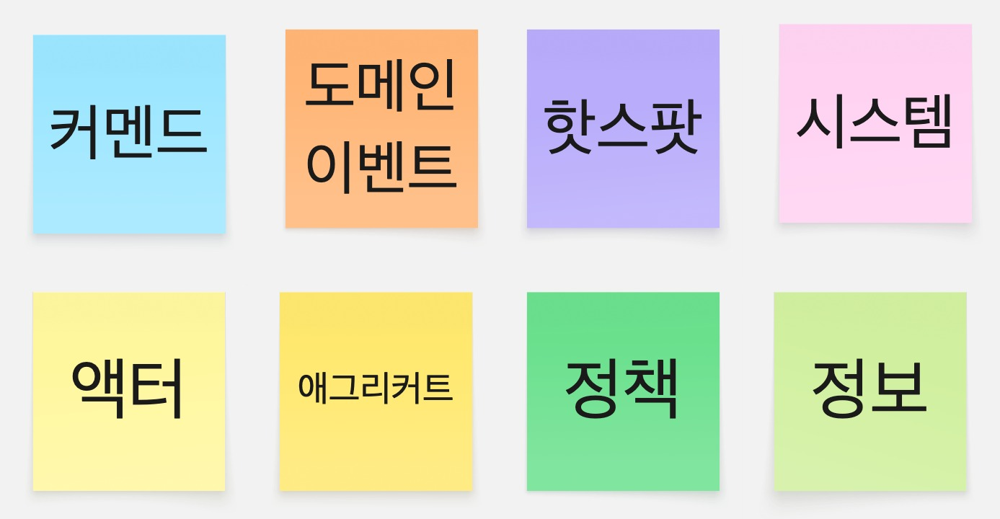

**Domain Event (도메인 이벤트)**

-   **정의** : 도메인에서 실제로 발생하는 결과입니다. 시스템에서 발생하는 중요한 이벤트로 데이터가 아닌 '비즈니스 프로세스'에 집중합니다.
-   **표기** : '과거형 동사'로 표현합니다.(~되었다)

**Hot Spot (핫 스팟)**

-   **정의** : 해결되지 않은 질문, 가정, 경고, 의견 수렴이 필요한 내용입니다.

**Command ( 커멘드 )**

-   **정의** : 이벤트를 트리거 하는 명령입니다.
-   **표기** : '현재동사'로 표현합니다. (~된다,~됨)

 **Actor ( 엑터 )**

-   **정의** : command를 동작하게 하는 사용자 혹은 역할입니다.
-   **표기** : '사람'이나 '역할의 이름'을 '명사'로 표현합니다.

**Policy ( 정책 )**

-   **정의** : 다른 바운디드 컨텍스트에 영향을 주는 이벤트입니다. "A하면 B한다"의 구조를 가집니다.

**External System**

-   **정의** : 연계가 필요한 외부 시스템 또는 프로세스입니다.
-   **표기** : '명사'로 표현합니다.

**Aggregate**

-   **정의:** Command와 Domain Event 사이에서 상태 변화를 책임지는 데이터 덩어리입니다.
-   **표기** : '명사'로 표현합니다.

**Information**

-   **정의** : Actor에게 제공되는 데이터, 결정을 내리는데 영향을 주는 정보입니다.

### **ShootPointer 이벤트 스토밍 만들어보기**

DDD에서 사용하는 용어와 함께 이벤트 스토밍에 대한 전반적인 용어를 정리하였으므로 이제 아래와 같은 단계로 이벤트 스토밍을 진행해보도록 하겠습니다. 

1.  **요구 사항 도출하기 (기존 구현 과정에서 작성된 기능 명세서가 있으므로, 이를 베이스로 활용합니다.)**
2.  **Domain Event 도출**
3.  **Command  및 Actor 식별하기**
4.  **Policy 및 외부 시스템 정의**
5.  **Aggregate 매핑 및 Bounded Context 식별하기**

#### **1\. Domain Event 도출**

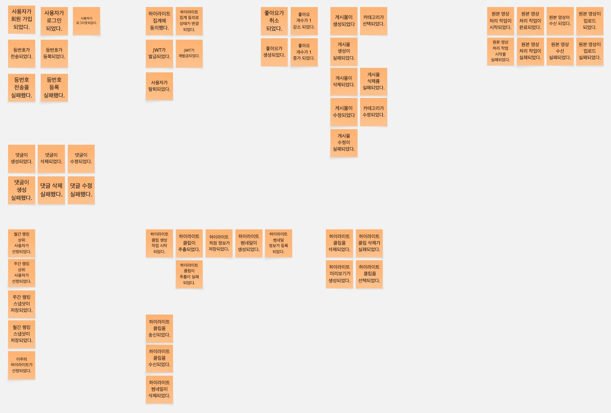

가장 먼저 진행한 일은 "시스템 내에 발생한/할 모든 사건"을 과거형 동사로 나열하는 것이었습니다. 기존 기능 명세서를 기반으로 하여 단순히 기능 완료뿐만 아니라 백엔드, 프론트 엔트, openCV 관점에서 발생하는 모든 이벤트를 포착하려고 했습니다. 그 결과, **총 56개**의 Domain Event를 추출할 수 있었습니다. 

아래와 같은 3가지의 접근 방식으로 도출했습니다.

-   **User Flow** : 사용자의 클릭이나 입력에 대해 발생하는 이벤트
-   **System Process** : 사용자가 모르는 뒷단에서 발생하는 이벤트
-   **Exception** : 도메인에서 발생할 수 있는 큰 예외 이벤트

#### **2\. Command  및  Actor 식별하기** 

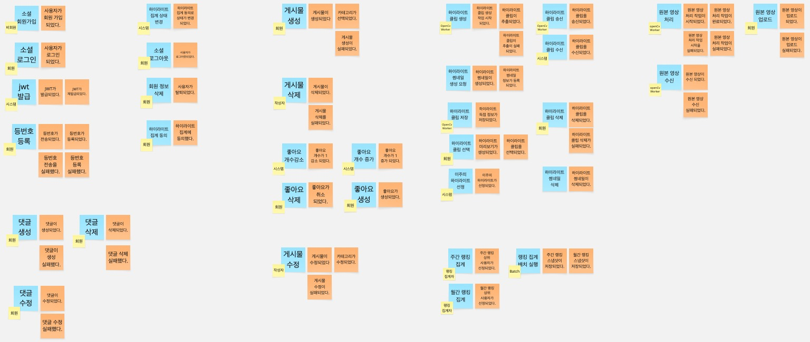

이벤트가 있다면 그 원인인 **Command**가 존재합니다.

**1) Command**

보통 command는 '사용자의 의도'를 가지고 있습니다. 추후 구현하게 될 API 엔드 포인트와 1:1로 매핑되는 경우가 많아 API 설계를 미리 진행해본다는 느낌으로 접근해보았습니다.

DDD원칙 상 command는 동사형으로 짓는 것이 일반적이지만, 이번 설계에서는 도출 상 편의를 위해 명사형으로 우선 정의하고 추후 구현 단계에서는 메서드명으로 구체화하도록 하겠습니다. 또한, 반드시 1개의 command가 1개의 Event를 생성하지는 않습니다. 예를 들어 하이라이트 **클립 썸네일 생성 요청**에 대해서 **하이라이트 썸네일 생성** + **하이라이트 썸네일 정보 등록**이라는 Event들이 연쇄적으로 트리거될 수 있습니다.

**2) Actor**

Command를 실행하는 주체인 Actor를 식별했습니다. 여기서 중요한 점은 Actor는 반드시 '**사람**'일 필요는 없다는 점입니다. 시스템 내부의 트리거나 AI 모델등 또한 Actor로 식별될 수 있습니다.

**\[ ShootPointer의 주요 Actor \]**

1.  **비회원 / 회원 / 작성자** : 일반적인 사용자 페르소나
2.  **시스템** : 스케줄러 , 자동화 로직
3.  **OpenCV Worker** : 영상 처리를 전담하는 AI 모델
4.  **랭킹 집계자** : 배치 작업을 통해 순위를 매기는 주체

#### **3\. Policy 및 외부 시스템 정의**

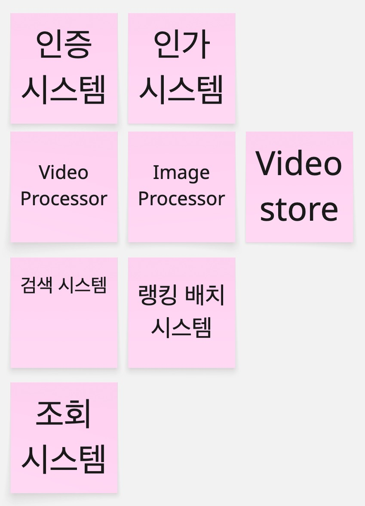

외부 시스템

이 단계에서는 **이벤트 흐름을 제어하는 Policy**와 **우리 시스템 밖의 External System**를 정의했습니다.

**1) External System**

ShootPointer가 의존하지만 직접 제어하지 않거나 별도의 인프라로 격리된 요소들을 식별했습니다. **총 8개**의 외부 시스템이 도출되었습니다.

| 구분 | 시스템 명 | 역할 |
| --- | --- | --- |
| 인증 / 인가 | Kakao Auth | 카카오톡 소셜 로그인 처리 |
| JWT Handler | 내부 토큰 발급 및 검증 로직 |  |
| 미디어 처리 | Video Processor | OpenCv 기반 하이라이트 인식 및 추출 라이브러리 |
| Image Processor | 등번호 인식을 위한 OCR 라이브러리 |  |
| 저장소 | Video Store | 처리된 클립을 저장하고 URL 반환 |
| 검색 | Elasticsearch | 정확성 기반 검색 엔진 |
| 배치 | Ranking Batch | 주간 / 월간 랭킹 스냅샷을 생성하고 저장하는 Spring Batch 시스템 |
| 조회 | Query Service | CQRS 패턴 조회 적용 모델 |

**2) Policy**

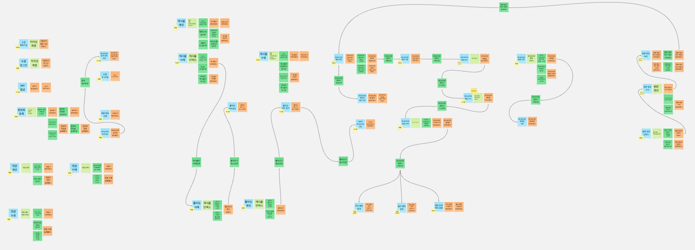

**Policy (정책)** Policy는 도메인 이벤트가 발생했을 때 시스템이 수행해야 하는 비즈니스 규칙입니다. 단순히 입력값을 검증하는 '유효성 검사(Validation)'가 아니라, "A라는 사건이 발생하면, B를 수행하라"는 반응형 로직이자, **서로 다른 Bounded Context를 연결하는 접착제**입니다.

저는 각 도메인 이벤트가 발생한 후 **"어떤 후속 조치가 필요한가?"**, **"이 이벤트가 다른 도메인에 어떤 영향을 미치는가?"**를 고민하여 Policy를 정의했습니다.

> 💡 **Policy 적용 예시**  
> \- **Event**: VideoProcessingCompleted (영상 처리가 완료됨 - Media Context)  
> \- **Policy**: Whenever 영상 처리가 완료되면, Then 사용자에게 알림을 보내고 랭킹 점수를 갱신한다.  
> \- **Command**: SendNotification (Alarm Context), UpdateUserScore (Ranking Context)

이 과정을 통해 영상 처리 로직과 랭킹 로직이 강하게 결합되어 있던 기존 코드를 **Policy를 통해 느슨하게 연결**할 수 있는 단서를 찾았습니다.

#### **4\. Aggregate 매핑 및 Bounded Context 식별하기**

지금까지 진행한 이벤트 스토밍을 통해서 다양한 이벤트와 커멘드, 정책등을 도출했습니다. 이를 기반으로 Aggreagate들을 식별해 냈습니다.

**1) Aggregate**

**\[ 식별된 Aggregate \]**

**Member, Post, Highlight, HighlightThumbnail, OriginalVideo, Like, Comment**

**🤯 "Aggregate가 곧 Bounded Context인가?"에 대한 고민**

Aggregate를 식별하는 과정에서 큰 혼란에 빠지게 되었습니다.  "식별된 Aggregate가 7개이니깐 Context도 7개로 식별하여 각 모듈별로 쪼개야 하는건가?"

만약, Post와 Like, Comment를 전부 다른 서비스로 쪼갠다면 어떻게 될까요? 게시물 1개를 조회할 때마다 각 모듈간의 네트워크 통신이 3번 발생해야 하고, 이에 따라 트랜잭션의 관리는 매우 어려울 것입니다.

따라서, 정의를 다시 한 번 훑어 보겠습니다.

-   **Aggregate** : 한 번의 트랜잭션으로 데이터 일관성을 지키는 최소 단위
-   **Bounded Context** : 동일한 비즈니스 목적을 공유하는 업무의 관계

결국 함께 생성되고, 함께 조회되는 **같은 비즈니스 목적**을 달성하는 Aggregate는 **하나의 Bounded Context**라는 울타리로 묶어야 한다고 느낄 수 있었습니다.

**2) Bounded Context**

위에 언급된 의미를 바탕으로 기능적 유사성과 변경의 생명주기를 고려하여, ShootPointer를 4개의 핵심 **Context**로 분리했습니다.

1.  **Member Context (회원 인증 및 인가)**
    -   **포함 Aggregate : 회원**
    -   회원 정보는 시스템 전반에서 참조되지만, 데이터의 변경 주기가 비교적 느리며 보안이 중요하므로 별도의 컨텍스트로 분리했습니다.
2.  **Media Processing Context(미디어 처리)**
    -   **포함 Aggregate : 하이라이트, 원본 영상**
    -   OpenCV를 이용하여 원본 영상을 분석하고 하이라이트를 추출, 썸네일을 생성하는 영상 데이터 처리의 생명주기를 관리합니다.
3.  **Community Context(소셜 활동)**
    -   **포함 Aggregate : 게시물, 댓글 , 좋아요**
    -   초기 설계에서는 이들을 각각의 context로 구별했지만, 이들을 하나로 묶는다면 게시판 소통이라는 하나의 문맥으로 통하기 때문에 1개의 컨텍스트로 묶었습니다.

* * *

## **2\. 도메인 모델링 - 도메인의 구체화**

이벤트 스토밍 단계를 지나, 이제는 실제 코드로 구현될 도메인 모델을 구체화하는 단계를 진행해보도록 하겠습니다.

초기 이벤트 스토밍 과정(1-3과정까지)에서 도메인 모델로 고려되었던 **'랭킹'** 같은 경우, 이번 설계 단계에서는 도메인에서 제외하는 결정을 했습니다.

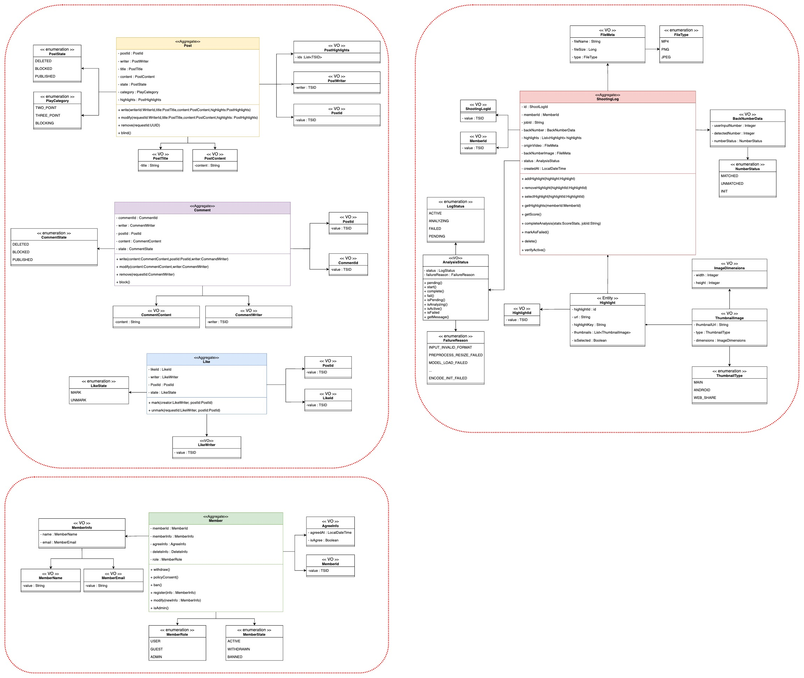

전체 도메인 모델링

> ****💡**왜 랭킹을 도메인 모델에서 제외했는가?  
>   
> 랭킹** 시스템 같은 경우 실시간 트랜잭션보다는 조회 특성을 지닌 영역입니다. 하이라이트 클립 영상을 OpenCV 서버로부터 Spring이 이벤트를 수신하면 기존 RDB가 아니라 **MongoDB**에 적재할 예정입니다.  
> 즉, 복잡한 비즈니스 로직보다는 대량의 데이터 집계와 조회의 성능이 중요하므로, 도메인의 영역이 아닌 **CQRS 패턴**의 **Read Model**로 다루는 것이 적합하다고 생각했습니다.

따라서, 이벤트 스토밍 결과로 도출한 3개의 **Bounded Context**에 집중하여 도메인 모델을 설계했습니다. **Community Context**부터 **Member Context**, **Media Processing Context** 순서로 설계과정과 과정 속에서의 기술적 고민을 적어보도록 하겠습니다.

### **Community Context**

**Community Context**에는 사용자 간의 상호작용이 일어나는 핵심 영역으로 **Post**, **Comment**, **Like** 도메인이 존재합니다.

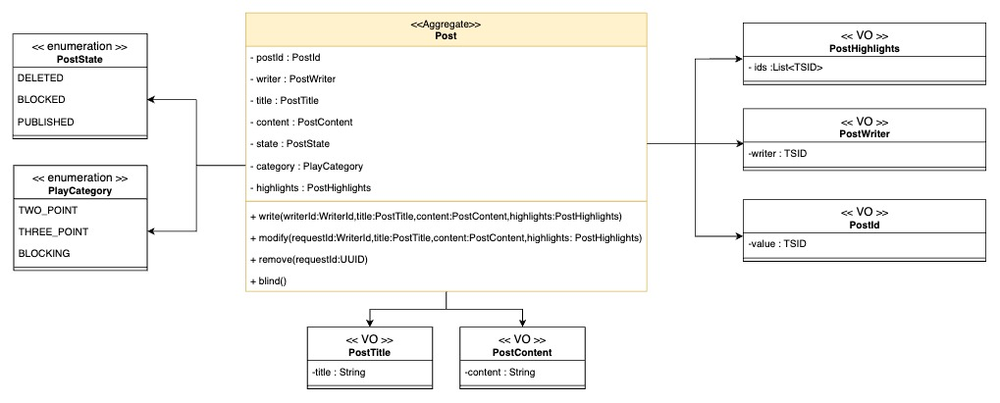

Post 도메인 모델

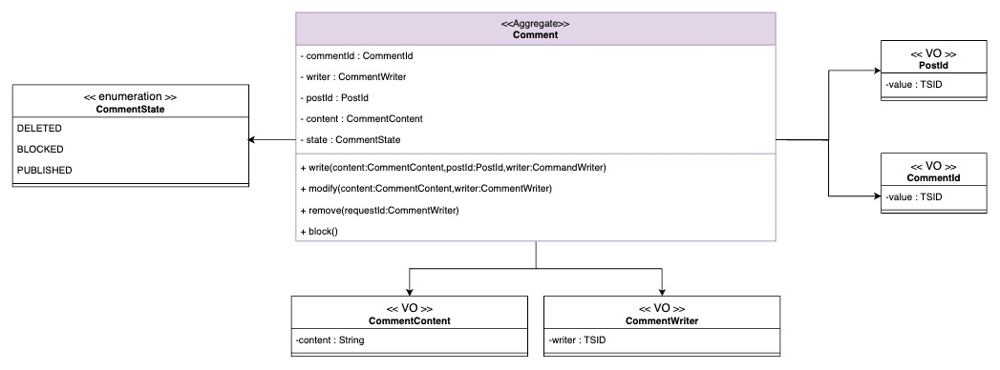

Comment 도메인 모델

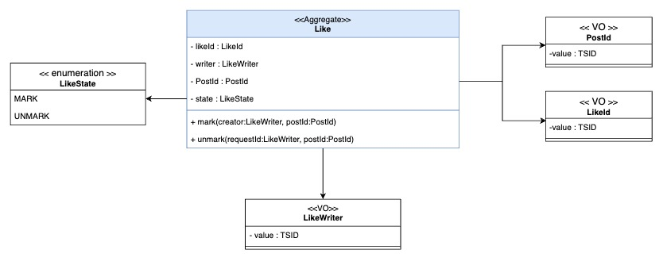

Like 도메인 모델

대부분의 요소들은 직관적이기 때문에 독자분들이 한 눈에 이해할 수 있다고 생각합니다. 주요 설계의도만을 설명하도록 하겠습니다. 

위 코드를 보았을 때, 일반적으로 레이어드 아키텍처에서 구현하는 JPA 엔티티와는 다른 2가지 특징이 눈에 띌 것입니다. 

#### **1\. 왜 식별자(Identity)가 TSID인가?**

처음에 설계를 진행할 때는 기존 구현되어 있던 **Post JPA 엔티티 클래스**를 만들 때처럼 변수 타입은 **Long**으로, 식별자 생성 전략은 **Auto Increment**로 사용하고자 하였습니다. 하지만, 아래와 같은 이슈를 발견 이를 해결하고자 **TSID**의 사용을 적용했습니다.

> **1) 도메인 이벤트 발행 시점의 불일치**  
> DDD 아키텍처에서는 도메인들간의 결합도를 낮추기 위해 도메인 이벤트를 발행 / 구독하는 구조를 가집니다.   
> 만약 Auto Increment 전략을 사용한다면 객체가 repository.save()를 호출 후 DB에 저장 이전까지는 ID의 값은 null값이 되어 버립니다. 하지만, 비즈니스 로직을 구현하다 보면, **객체가 생성되는 시점**과 동시에 이벤트를 발행해야 하는 경우가 존재합니다. 식별자가 없는 상태인 불완전한 객체로는 이벤트를 발행할 수 없습니다.  
> 따라서, DDD에서는 객체가 생성되는 시점에 식별자가 존재해야합니다.   
>   
> **2) DB 인덱싱 성능 문제**  
> 그렇다면 **UUID**를 사용하여 식별자를 객체 생성 시점에 삽입하면 됩니다. 하지만, UUID는 치명적인 문제가 존재합니다. 바로, 성능 문제입니다. UUID를 생성할 때는 항상 랜덤값으로 생성이 되는데 이때 DB의 옵티마이저 입장에서는 생성된 식별자의 컬럼이 테이블 어디에 생성되었는지 예측할 수 없습니다. 따라서, 새로운 컬럼을 삽입할 때 옵티마이저는 빈번한 **Random I/O**를 유발하고 이 때문에 대규모 환경헤서는 INSERT 성능이 저하될 수 있습니다.   
>   
> **3) 공간 비효율성**  
> UUID는 기본적으로 16바이트 형태의 구조를 지니게 됩니다. 이는 기존 식별자 타입으로 사용하던 Long 타입(8바이트)나 integer 타입(4바이트)에 비해 2~4배 많은 저장공간을 차지합니다. 단순 PK의 크기가 커지면 단순히 테이블의 크기만 커지는 것이 아니라, PK를 참조하는 모든 세컨더리 인덱스의 크기까지 함께 증가하게 되어 저장 공간의 낭비가 발생합니다.  
>   
> **결론: TSID (Time-Sorted Unique Identifier)**   
> **1\. 도메인 발생 시점**: 애플리케이션 레벨에서 생성하므로 객체 생성 즉시 ID를 획득할 수 있습니다.  
> **2\. 성능**: 시간순으로 정렬되는 특성을 가져 Auto Increment와 유사한 순차적 인덱싱 성능을 보장합니다.  
> **3\. 저장 공간 효율**: Long 타입(64비트, 8바이트)에 매핑되므로 UUID 대비 저장 공간을 50% 절약할 수 있습니다.

#### **2\. 원시타입은 어디에...?**

도메인 메서드는 아래와 같이 주로 사용됩니다.

```java
public void modify(String title, String content) {...}
```

그냥 String으로 받으면 호출하는 쪽도 편하고 추가 클래스의 작성이 필요없어 코드도 짧아지는데 왜 굳이 VO를 통해 객체로 감싸는지 의문이 들 수 있습니다.

> **1) 엔티티를 더럽히는 검증 로직 제거의 필요성**  
> 만약 그대로 String으로 값을 받게 되면, 엔티티 내부에서 **유효성 검증**을 진행해야 합니다. 결국 엔티티 메서드는 실제 비즈니스 로직들보다 더 긴 if문으로 도배된 방어 코드로 가득 차게 됩니다. 따라서 엔티티가 값이 맞는지 검사하는 일을 주는 것이 아니라 데이터를 변경하는 일에만 집중하도록 설계했습니다.  
>   
> **2) 불변식 보장의 필요성**  
> 도메인 클래스 다이어그램을 보면 **VO(Value Object)**를 도입한 모습을 볼 수 있습니다. 예를 들어 PostTitle 클래스는 생성자 단계에서 값의 유효성을 검사합니다.. 따라서, 해당 객체는 언제 어디서든 호출하면 유효성 검사가 진행된 안전한 값으로 사용할 수 있습니다.  
>   
> **3) 코드 자체가 문서**  
> String 같은 경우 포괄적인 의미를 가지게 됩니다. 예를 들어, String은 title이 될 수 있고 또는 content가 될 수도 있습니다. 따라서 Posttitle, PostContetnt라는 **VO 클래스**를 통하여 문서처럼 명시할 수 있습니다.

### **Member Context**

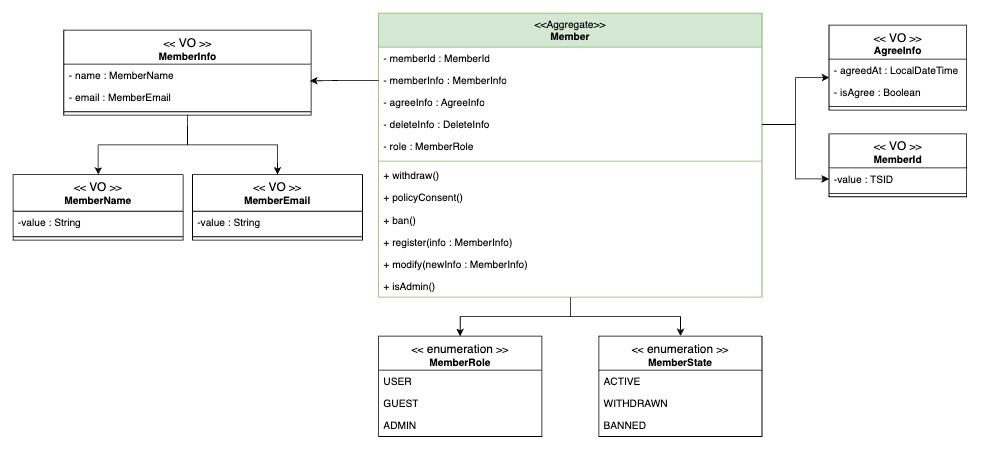

Member 도메인 모델

Member 도메인 설계에서는 기존의 부족함을 극복하고, 객체지향적인 구조를 갖추고자 하였습니다.

> **1) 사용자 권한(Role) 체계의 도입**   
> 기존 시스템에는 명확한 사용자 역할 구분이 존재하지 않아 API 접근을 유연하게 처리하기 어려웠습니다. 이를 해결하기 위해 우리는 사용자를 GUEST(비회원), USER(회원), ADMIN(관리자)의 세 가지 Role로 정의했습니다. 이를 통해 도메인 로직 내에서 역할에 따른 행위를 구분하고 API 엔드포인트 별 권한을 분리할 수 있도록 설계했습니다.  
>   
> **2) VO의 그룹화와 응집도(Cohesion)향상**   
> 초반 설계 과정에서는 MemberName과 MemberEmail이 Member 엔티티 내에 개별적인 필드로 흩어져 있었습니다.  '회원 정보'라는 연관성을 생각하여 이 두 가지의 VO를 MemberInfo라는 하나의 **복합 값 객체**로 묶었습니다.   
> 회원 프로필 수정과 같이 이름과 이메일이 함께 동작하는 로직에서, MemberInfo 단위로 데이터를 교체하여 객체의 응집도를 높이는 설계를 진행했습니다.

### **Media Processing Context**

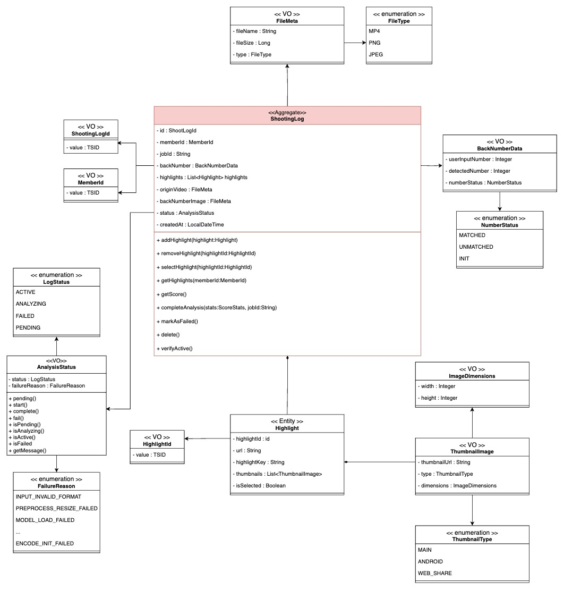

ShootingLog 도메인 모델링

ShootPointer의 주요 기능인 만큼 가장 풍부한 도메인 모델을 가지고 있습니다. 사용자의 원본 경기 영상을 받아 AI(OpenCV) 서버로 분석을 요청하며 그 결과값(하이라이트 클립)를 수신받는 프로세스를 담당합니다.

> **1) 비동기 분석과 공백 상태의 해결: Redis 활용 전략**  
> 일반적인 CRUD 도메인과 달리, ShootingLog는 생성 즉시 완성되지 않습니다. AI 분석 서버(OpenCV)로 영상 처리를 요청하고, 비동기적으로 결과가 반환될 때까지 비교적 긴 호흡의 트랜잭션을 관리해야 합니다.  
> 특히 사용자 경험(UX) 최적화를 위해 입력 과정이 다음과 같이 분리되어 있습니다.  
>   
> **Step 1**: 사용자가 자신의 등 번호 이미지를 업로드 (JobId 발급)  
> **Step 2**: 실제 분석할 농구 경기 영상을 업로드  
> **Step 3**: 분석 상태 수신  
>   
> **🤯 "불완전한 데이터는 어디에 머물러야 하는가?"**  
> Step 1의 등 번호 데이터는 Step 2가 완료될 때까지 갈 곳을 잃게 됩니다. 가장 쉬운 방법은 Step 1 시점에 엔티티를 생성하고 DB에 저장하는 것입니다. 하지만 이는 DDD 설계 원칙에 위배됩니다.  
>   
> **불변식(Invariant) 위반  
> **우리 도메인 규칙상 ShootingLog는 원본 영상(FileMeta)이 없으면 논리적으로 성립될 수 없는 객체입니다. 사용자가 **Step 1**만 수행하고 이탈할 경우, DB에는 영상 정보가 null인 불완전한 데이터가 영구히 남게 됩니다. 이를 정리하기 위한 별도의 배치 작업은 불필요한 리소스 낭비입니다.  
>   
> **Redis**를 임시 저장소로 도입하여 이 문제를 해결하기로 하였습니다. Step 1에서 받은 등 번호 정보는 JobId(또는 임시 UUID)를 Key로 하여 Redis에 짧은 TTL(Time-To-Live)과 함께 저장됩니다. 이후 사용자가 Step 2(영상 업로드)를 완료하고, 최종적으로 분석 결과(하이라이트 등)가 수신되는 시점에 비로소 완전한 상태의 ShootingLog 객체를 생성하여 DB에 저장합니다. 이를 통해 RDB에는 언제나 무결성이 보장된 데이터만 저장될 수 있도록 설계했습니다.  
>   
> **2) 복잡한 데이터의 구조화와 캡슐화 (VO Pattern)**  
> AI 분석 결과는 하이라이트 영상, 썸네일, 등 번호 인식 결과, 그리고 다양한 실패 케이스가 얽혀 있습니다. 이를 엔티티 필드에 나열하는 대신 **Value Object(VO)**와 연관 관계를 통해 구조화했습니다.  
>   
> **Highlight와 Thumbnail의 관계  
> **하나의 Highlight는 다양한 해상도나 포맷의 썸네일을 가질 수 있습니다. 이를 위해 Highlight 엔티티 하위에 ThumbnailImage VO를 1:N 관계(Collection)로 매핑하였습니다.  
> **BackNumberData VO**는사용자가 입력한 번호와 AI(OCR)가 영상에서 판독한 번호, 그리고 그 둘의 일치 여부(MATCHED/UNMATCHED)를 BackNumberData라는 하나의 VO로 묶어 응집도를 높였습니다.  
>   
> **3) 명시적인 에러 처리: AnalysisStatus와 FailureReason**  
> OpenCV 기반의 AI 분석 과정에서는 파일 손상, 포맷 불일치, AI 모델 로딩 실패 등 수많은 오류가 발생할 수 있습니다. 이를 단순히 **실패(FAILED)**라는 상태 하나로 퉁치거나, 의미 없는 문자열 메시지로 저장하는 것은 유지보수에 악영향을 줄 수 있습니다. 따라서, **AnalysisStatus VO**를 도입하여 분석 상태를 체계적으로 관리합니다. 특히 분석 실패 시 앞서 정의한 FailureReason Enum (약 20여 가지의 상세 에러 코드)을 활용합니다.

* * *

## **3\. 마무리**

지금까지 ShootPointer의 DDD로의 변화를 위해 기존 요구사항들을 어떻게 도메인 모델로 해석했는지 고민한 흔적들을 공유해보았습니다. 이제 전체적인 설계도는 끝났습니다. 이제 이 도메인 객체들이 실제로 적용할 수 있도록 요리를 시작할 시간입니다. 다음 포스팅에서는 모듈러 모노리스 아키텍처를 도입하며 **달라진 디렉토리 구조와 적용기**, **각 모듈과 환경으로 분리된 Dockerfile 분리**, **설계도로만 적용한 Member 도메인을 실제 Java 코드상 어떻게 적용**하였는지를 다룰 예정입니다.

* * *

### 📋참고자료

[\[Practical DDD\]2.DDD와 이벤트 스토밍](https://medium.com/@seungwooyu2000kr/practical-ddd-2-ddd%EC%99%80-%EC%9D%B4%EB%B2%A4%ED%8A%B8-%EC%8A%A4%ED%86%A0%EB%B0%8D-152dd1edff11)

[카카오페이 여신코어 DDD로 구축하기](https://tech.kakaopay.com/post/backend-domain-driven-design/)

[\[DDD\] 단일 테이블 기반 다중 애그리거트(Aggregate) 모델링 전략](https://curiousjinan.tistory.com/entry/single-table-multi-aggregate-ddd-jpa)

[\[개발\] id(PK) 직접할당 전략 - Random, UUID, TSID 각각에 대한 비교분석](https://velog.io/@ssssujini99/%EA%B0%9C%EB%B0%9C-idPK-%EC%A7%81%EC%A0%91%ED%95%A0%EB%8B%B9-%EC%A0%84%EB%9E%B5-Random-UUID-TSID-%EA%B0%81%EA%B0%81-%EB%B9%84%EA%B5%90%EB%B6%84%EC%84%9D)

[\[DDD Start!\] 애그리케이트](https://velog.io/@freesky/DDD-Start-%EC%95%A0%EA%B7%B8%EB%A6%AC%EA%B1%B0%ED%8A%B8)
