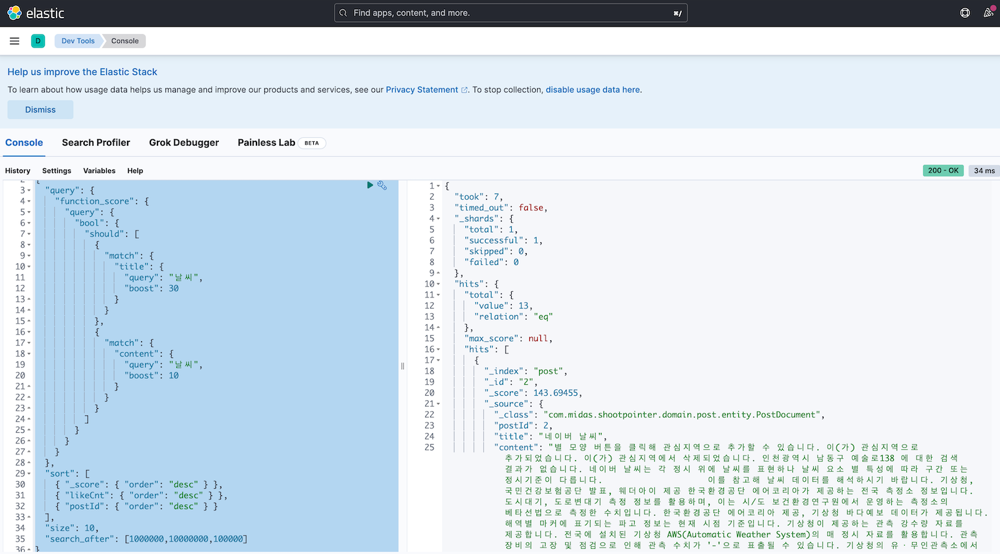
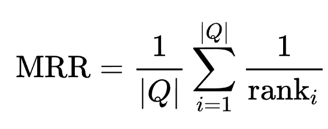
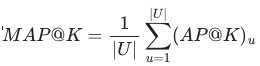
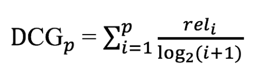
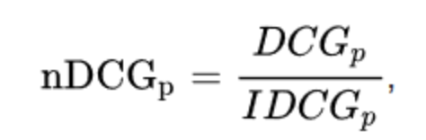
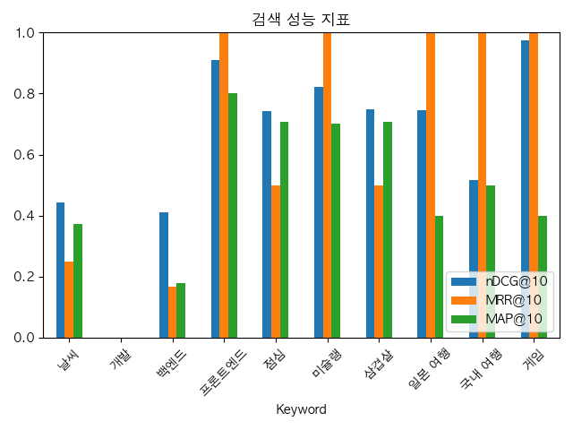
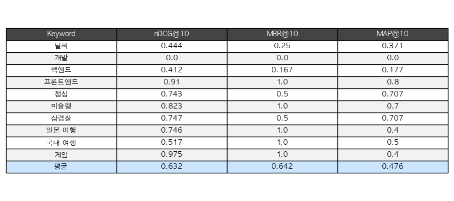
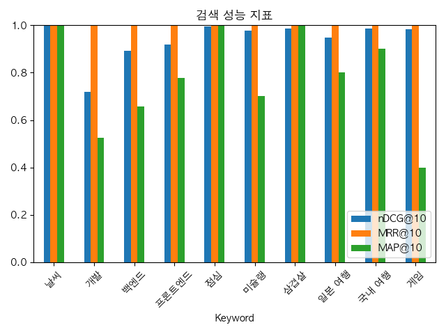
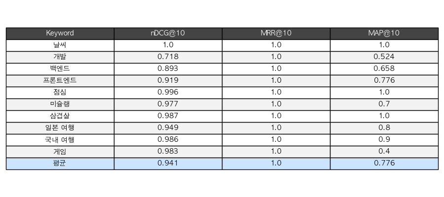

## ******1.  배경******

* * *

[2025.09.25 - \[프로젝트/Shoot-Pointer\] - \[Shoot-Pointer\] 게시물 검색 성능 개선 - ElasticSearch 도입기(1) (Docker를 이용한 ElasticSearch + Kibana 구축 및 테스트 환경 구축)](https://codekim3570.tistory.com/entry/Shoot-Pointer-%EA%B2%8C%EC%8B%9C%EB%AC%BC-%EA%B2%80%EC%83%89-%EC%84%B1%EB%8A%A5-%EA%B0%9C%EC%84%A0-ElasticSearch-%EB%8F%84%EC%9E%85%EA%B8%B01-Docker%EB%A5%BC-%EC%9D%B4%EC%9A%A9%ED%95%9C-ElasticSearch-Kibana-%EA%B5%AC%EC%B6%95-%EB%B0%8F-%ED%85%8C%EC%8A%A4%ED%8A%B8-%ED%99%98%EA%B2%BD-%EA%B5%AC%EC%B6%95)

이전 글에서는 Docker 환경에서 **Elasticsearch + Kibana** 를 구축하고, 기본적인 인덱스 생성과 조회 테스트까지 마쳤습니다. 이제 **Shoot-Pointer**의 게시물 검색 기능에 Elasticsearch를 본격적으로 적용하고자 합니다. **Shoot-Pointer**는 사용자들이 남긴 다양한 하이라이트 게시물 데이터를 다루기 때문에 단순한 문자열 검색만으로는 원하는 결과를 정확히 찾기 어렵습니다. 특히,

-   검색어가 제목과 본문 중 어디에 위치하는지
-   게시물이 얼마나 많은 사용자에게 반응(좋아요)을 받았는지
-   최신성이나 관련성 점수가 어떻게 계산되는지

등을 종합적으로 고려해야 **사용자에게 의미 있는 검색 결과**를 제공할 수 있습니다.

이를 위해 이번 글에서는 아래와 같은 내용을 다룹니다.

1.  **게시물 라벨링(Labeling) 과정**을 통해 **올바른 검색 결과 순위**를 정의하고,
2.  **Elasticsearch** 쿼리를 활용해 **가중치 기반 검색 로직**을 구현하며,
3.  **rank-aware 성능 지표(MRR, MAP, nDCG@K)** 를 적용해 검색 정확성을 정량적으로 평가하는 과정을 다룹니다.

> 이번 글은 단순히 검색 기능을 구현하는 수준을 넘어, 검색 품질을 어떻게 설계·측정·개선할 수 있는가에 초점을 맞추고 있습니다.

## ****2.  해결과정****

* * *

### 1\. 검색 로직 설계

검색 기능은 단순히 키워드를 포함하는 문서를 찾는 수준을 넘어, **관련성·인기·정확성**을 종합적으로 고려하도록 설계했습니다. 검색 로직은 다음과 같은 단계로 구성됩니다.

> **1\. 제목**   
> \- 검색어가 제목(title) 에 포함되면 +30점 가중치 부여.  
> \- 제목은 사용자가 검색 의도를 가장 직접적으로 반영하므로, 높은 점수를 주어 상위에 노출.  
>   
> **2\. 본문**  
> \- 검색어가 본문(content) 에 포함되면 +10점 가중치를 부여.  
> \- 제목보다는 낮지만, 본문 역시 중요한 검색 기준.  
>   
> **3\. 검색 대상 문서 범위**  
> \- 제목 또는 본문에 검색어가 포함된 문서만 대상으로 조회.  
>   
> **4\. 정렬 우선순위** - 검색 결과는 다음과 같은 순서로 정렬.  
>  - ElasticSearch \_score 내림차순 -> likeCnt 내림차순 -> postId 내림차순  
>   
> **5\. 결과 제한**  
> \- 클라이언트 요청에 따라 size 개수만큼만 결과를 반환.  
>   
> **6\. 무한 스크롤 지원**  
> \- search\_after 기능을 활용하여, 마지막으로 조회된 문서 기준 이후의 데이터를 조회.  
> \- 조건은 다음과 같습니다  
>       ▷ 이전 조회 결과의 마지막 \_score 보다 작은 값  
>       ▷\_score 동일 시, 마지막 likeCnt 보다 작은 값  
>       ▷ likeCnt까지 동일 시, 마지막 postId 보다 작은 값

위의 검색 로직을 Elastic search의 쿼리문으로 표현하면 아래와 같습니다. 

```http
GET post/_search
{
  "query": {
    "function_score": {
      "query": {
        "bool": {
          "should": [
            {
              "match": {
                "title": {
                  "query": "검색 키워드",
                  "boost": 30
                }
              }
            },
            {
              "match": {
                "content": {
                  "query": "검색 키워드",
                  "boost": 10
                }
              }
            }
          ]
        }
      }
    }
  },
  "sort": [
    { "_score":  { "order": "desc" } },
    { "likeCnt": { "order": "desc" } },
    { "postId":  { "order": "desc" } }
  ],
  "size": 10,
  "search_after": [마지막 게시물 score, 마지막 게시물 like_cnt, 마지막 게시물 post_id]
}
```



elastic devtools 실제 쿼리 실행 모습

* * *

### 2\. PostElasticSearchCustomRepositoryImpl.class 구현

앞서 설계한 ElasticSearch Query 로직을 실제 코드로 Spring에 어떻게 녹여 구현했는지 살펴보겠습니다. **Spring Data Elasticsearch**를 활용해 검색 쿼리를 객체 지향적으로 작성했습니다.

1) 검색 조건 생성 - Criteria API

```java
Criteria criteria=Criteria.where("title").matches(search).boost(TITLE_WEIGHT)
    .or(Criteria.where("content").matches(search).boost(CONTENT_WEIGHT));
CriteriaQuery booleanQuery=new CriteriaQuery(criteria);
```

-   **Criteria API**를 이용하여 **title**과 **content** 필드에서 사용자가 요청한 검색어가 부분적(**OR**)으로 일치하는 조건을 생성했습니다.
-   **boost**를 이용하여 가중치를 설정하였습니다.

2) 정렬 조건 생성 - NativeQueryBuilder

```java
NativeQueryBuilder builder = NativeQuery.builder()
    .withQuery(booleanQuery)
    .withSort(SortOptions.of(s -> s.score(sc -> sc.order(SortOrder.Desc))))
    .withSort(SortOptions.of(s -> s.field(f -> f.field("likeCnt").order(SortOrder.Desc))))
    .withSort(SortOptions.of(s -> s.field(f -> f.field("postId").order(SortOrder.Desc))))
    .withMaxResults(size);
```

-   정렬 조건을 **\_score->likeCnt->postId** 순으로 내림차순으로 정렬합니다.
-   **withMaxResults(size)**를 통해 사용자가 요청한 크기만큼 조회합니다.

3) 무한 스크롤 적용 및 결과값 반환

```java
if (sort != null) {
	builder.withSearchAfter(sortToList(sort)); 
} 
NativeQuery query = builder.build(); 
return operations.search(query, PostDocument.class);
```

-    **withSearchAfter**를 적용하여 마지막으로 조회된 게시물의 **PostSort**정보를 토대로 무한스크롤을 적용했습니다.
-   마지막 조회 게시물 기준으로 **\_score, likeCnt, postId** 기준으로 다음 데이터를 조회합니다.
-   **Nativequery**를 최종적으로 빌드하여 결과값을 반환합니다.

4) 정렬 변수 저장

```java
public record PostSort(
        @NotNull float _score,
        @NotNull Long likeCnt,
        @NotNull Long lastPostId
) {
}
```

-   게시물의 무한스크롤 적용을 위하여 필요한 변수들을 1개씩 파라미터 형태로 관리하는 것보다 **record**를 이용하여 유지보수성을 높였습니다.

**👇전체 코드 보기**

```java
@Repository
@Profile("!dev")
@RequiredArgsConstructor
public class PostCustomElasticSearchImpl implements PostCustomElasticSearch {
    private final ElasticsearchOperations operations;
    //제목 가중치
    private final float TITLE_WEIGHT = 30f;
    //내용 가중치
    private final float CONTENT_WEIGHT = 10f;

    @Override
    public SearchHits<PostDocument> search(String search, int size, PostSort sort) {
        /**
         * 조건
         * 1. 제목 search 포함 : 가중치 +30
         * 2. 내용 search 포함 : 가중치 +10
         * 3. Elastic Search score 내림차순
         * 4. 점수 동일 시, like_cnt 내림차순
         * 5. score, like_cnt 동일 시 post_id 내림차순
         */

        //Criteria 생성하여 title 필드, content 필드에서 부분 일치 조건 + 가중치 지정
        Criteria criteria=Criteria.where("title").matches(search).boost(TITLE_WEIGHT)
                .or(Criteria.where("content").matches(search).boost(CONTENT_WEIGHT));
        CriteriaQuery booleanQuery=new CriteriaQuery(criteria);

        NativeQueryBuilder builder = NativeQuery.builder()
                .withQuery(booleanQuery)
                // sort: _score desc, likeCnt desc, postId desc
                .withSort(SortOptions.of(s -> s.score(sc -> sc.order(SortOrder.Desc))))
                .withSort(SortOptions.of(s -> s.field(f -> f.field("likeCnt").order(SortOrder.Desc))))
                .withSort(SortOptions.of(s -> s.field(f -> f.field("postId").order(SortOrder.Desc))))
                .withMaxResults(size);

        // search_after
        if (sort != null) {
            builder.withSearchAfter(sortToList(sort));
        }

        NativeQuery query = builder.build();
        return operations.search(query, PostDocument.class);
    }

    /**
     * search_after용 리스트 반환
     */
    private List<Object> sortToList(PostSort sort) {
        return List.of(sort._score(), sort.likeCnt(), sort.lastPostId());
    }
}
```

* * *

### 3\. PostElasticSearchUtilImpl.class 구현

```java
@Transactional(readOnly = true)
@Override
public List<PostSearchHit> getPostByTitleOrContentByElasticSearch(String search, int size, PostSort sort) {
    SearchHits<PostDocument> documentList=postElasticSearchRepository.search(search,size,sort);

   /**
   * 조회된 Document가 없는 경우 빈 리스트 반환
   */
   if(documentList==null) return Collections.emptyList();

   List<PostSearchHit> responses=new ArrayList<>();
   for (SearchHit<PostDocument> hit:documentList){
       PostDocument doc=hit.getContent();
       float _score=hit.getScore();
       //PostResponse 값 , _score 값 저장
       responses.add(new PostSearchHit(doc,_score));
   }
   return responses;
}
```

-   **Elasticsearch**의 검색 결과는 **SearchHit** 형태로 반환됩니다. 이 객체를 순회하면서 각 게시물의 데이터(PostDocument)와 **Elasticsearch**에서 계산한 관련도 **점수(\_score)**를 추출한 뒤, 이를 List 자료구조에 담아 관리합니다.

```java
public record PostSearchHit(
        PostDocument doc,
        float _score
) {
}
```

-   검색 점수(\_score)는 일반적인 게시물 다건 조회 API 응답에서는 필요하지 않지만 무한스크롤을 위한 **cusor**방식으로 활용할 수 있습니다. 따라서 기존의 조회 응답 DTO(PostListResponse)와 함께 사용할 수 있도록, \_score 값을 포함하는 **PostSearchHit** 레코드를 별도로 정의했습니다.
-   **PostListResponse** 내부에 새로운 **빌더 메서드**를 추가하여, 검색 결과를 포함한 응답 객체를 동시에 생성할 수 있도록 확장성을 강화했습니다.

```java
@Builder
public static PostListResponse withSort(Long lastPostId,List<PostResponse> postList,PostSort sort){
  return new PostListResponse(lastPostId,postList,sort);
}
```

* * *

### 4\. PostManager.class 구현

```java
@Transactional(readOnly = true)
public PostListResponse getPostByPostTitleOrPostContentByElasticSearch(String search, int size, PostSort sort) {
    // 0. ElasticSearch가 사용 가능한 경우에만 실행
    if (postElasticSearchHelper == null) {
        // 일반 검색
        return getPostEntitiesByPostTitleOrPostContent(search, sort.lastPostId(), size);
    }

    // 1. 게시물 정렬 조건 + 검색어 게시물 검색 , _score 조회
    List<PostSearchHit> responses = postElasticSearchHelper.getPostByTitleOrContentByElasticSearch(search, size, sort);

    // 2. PostListResponse 형태로 반환 - 마지막 게시물의 정렬 값 보내기
    if (responses.isEmpty()) {
        // 결과값이 없는 경우 - 이전에 보낸 정렬값(기본값) 그대로 전송
        return PostListResponse.withSort(sort.lastPostId(), Collections.emptyList(), sort);
    }

    // 결과값이 존재하는 경우 - 마지막 게시물의 정렬 기준 전송
    int last = responses.size() - 1;
    PostDocument lastResponse = responses.get(last).doc();

    PostSort newSort = new PostSort(
        responses.get(last)._score(),
        lastResponse.getLikeCnt(),
        lastResponse.getPostId()
    );

    // 3. List<PostDocument> -> List<PostResponse> 형태로 변환
    List<PostResponse> postResponses = responses.stream()
        .map(hit -> postMapper.documentToEResponse(hit.doc()))
        .toList();

    return PostListResponse.withSort(lastResponse.getPostId(), postResponses, newSort);
}
```

-   **postElasticSearchHelper**를 통해 키워드 검색을 수행하고, 결과를 **PostSearchHit** 리스트로 가져옵니다.
-   마지막 게시물을 기준으로 **\_score, likeCnt, postId** 값을 추출하여 **PostSort** 객체를 새로 생성합니다.
-   다음 검색 요청 시 **search\_after** 조건으로 활용합니다.

* * *

### 5\. PostQueryController.class 구현

```java
@GetMapping("/list-elastic")
public ResponseEntity<ApiResponse<PostListResponse>> searchElastic(@RequestParam(required = false) String search,
                                                                       @RequestParam(required = false,defaultValue = "922337203685477580") Long postId,
                                                                       @RequestParam(required = false,defaultValue = "10")int size,
                                                                       @RequestParam(required = false,defaultValue = "922337203685477580")float _score,
                                                                       @RequestParam(required = false,defaultValue = "922337203685477580")Long likeCnt){
   /**
   * 검색어가 없는 경우 -> 최신 게시물 리스트 조회
   */
   if(search.isBlank()){
      return ResponseEntity.ok(ApiResponse.ok(postQueryService.multiRead(postId,size,"latest")));
   }
   PostSort sort=new PostSort(_score,likeCnt,postId);
   return ResponseEntity.ok(ApiResponse.ok(postQueryService.searchByElastic(search,size,sort)));
}
```

-   초기 요청에서는 기본값(Long.MAX\_VALUE에 가까운 값)을 활용하여 조건을 무시합니다.

## **3\. 결과**

* * *

### 1\. 데이터 수집 단계

더 정확한 검색 엔진 성능 측정을 위해, 단순히 가상의 데이터셋을 사용하는 대신 **실제 구글 검색 API (Google Custom Search API) + 웹크롤링**을 활용하여 실제 구글 검색 시 조회되는 게시물을 사용했습니다.

-   카테고리는 총 **10개 키워드(날씨, 개발, 백엔드, 프론트엔드, 점심, 미슐랭, 삼겹살, 일본 여행, 국내 여행, 게임)** 로 설정.
-   각 카테고리마다 상위 10개 게시물을 수집.
-   웹 크롤러를 통해 각 게시물의 **제목(title), 본문(content), URL** 정보를 추출.
-   **좋아요 수(likeCnt)**는 1~1000개 랜덤 지정.

```json
  {
    "id": 84,
    "title": "하나투어, 국내여행",
    "content": "NEW #해시태그 검색이 가능해졌어요! 인기검색어 마이메뉴는 회원 전용 메뉴 입니다. 최근 본 상품이 없습니다.",
    "keyword": "국내 여행",
    "url": "https://www.hanatour.com/package/domestic",
    "likeCnt": 889
  }
```

* * *

### 2\. 라벨링 기준 설계

검색 품질을 평가하기 위해서는 정답표가 필요합니다. 이를 위해 각 문서별로 **카테고리별 가중치(score)** 를 부여하는 라벨링 과정을 진행했습니다.

라벨링 규칙은 다음과 같이 설정했습니다

> **1\. 제목 매칭**  
> \- 점수검색 키워드와 제목이 완전히 일치: +9점 (3×3)  
> \- 검색 키워드가 제목에 부분 포함: +6점 (2×3)  
> **2\. 본문 매칭**  
> \- 점수본문 앞부분(200자 이내) 에 키워드 포함: +1점  
> \- 본문 이후 영역에 키워드 포함: +0.5점  
> **3\. 키워드 빈도수**  
> \- 문서 내 키워드 등장 횟수가 3회 이상일 경우: +0.5점  
> \- 좋아요 수 가중치문서의 likeCnt 값을 1000으로 정규화 후, 0.3 가중치 반영

* * *

### 3\. 정답표 생성

제목에 키워드가 완전히 포함되고 본문에서도 여러 번 등장하며 좋아요 수가 높은 문서는 높은 score를 받습니다. 반대로 키워드와 거의 관련이 없는 게시물은 낮은 점수를 받게 됩니다. 다음과 같이 label.json를 생성하여 정답표를 관리했습니다.

```json
{
  "날씨": {
    "1": 7.016,
    "2": 7.585,
    "3": 2.166,
    "4": 6.254,
    "5": 6.125,
    "6": 6.245,
    "7": 6.076,
    "8": 2.286,
    "9": 6.044,
    "10": 2.058
  },
  ...
 }
```

* * *

### 4\. 성능 지표 선정

키워드 검색에서는 사용자가 원하는 게시물이 **얼마나 정확한 순서로 노출되는가**가 핵심입니다. 정보 검색(IR) 분야에서는 이러한 검색 품질을 측정하기 위해 다양한 지표들을 사용하며, 크게 두 가지 유형으로 구분할 수 있습니다.

> Not rank-aware : 문서의 관련 여부만 평가하며, 결과가 몇 번째에 위치하는지는 고려하지 않습니다.  
> \- Precision@K : top-K안에 관련된 문서가 얼마나 있는지.  
> \- Recall@K : 전체 관련 문서 중 top-K에 몇 개가 포함됐는지.  
> \- Fl Score : 정밀도와 재현율의 조화 평균.  
>   
> rank-aware : 문서의 노출 순위까지 평가하여, 상위에 위치할수록 더 큰 가치를 부여합니다.  
> \- MRR : 가장 첫 번째 관련 문서가 몇 번째 등장했는지.  
> \- MAP : 관련 문서가 나올 때마다 precistion을 기록하고 평균.  
> \- nDCG@K : 순위를 고려하여 높은 순위에 있을수록 더 큰 가중치 설정.

라벨링 과정을 통하여 score에 따라 키워드를 검색했을 때 나와야하는 게시물들의 순서를 사전에 지정해두었고, 현재 서비스에서는 가장 정확한 게시물을 먼저 보여주는 것이 중요합니다. 따라서, rank-aware 지표들을 통해 검색엔진의 정확성을 측정하였습니다.

* * *

### 5\. 성능 지표 공식

**MRR**



**| Q | :** 전체 쿼리의 개수 - 현재 진행중인 테스트에서의 | Q | = 10 (검색 키워드 10개)

**ran****k****i**​ :  i번째 쿼리에서 첫 관련 문서가 등장한 순위

**MAP**



**K :** K번째까지 평가 결정 index

**AP@K :** Precision@1부터 Precison@K까지의 평균.

**nDCG@K**





**reli** : i번째 문서의 관련성 점수.

**IDCG** : 이상적인 정렬 기준

* * *

### 6\. 성능 지표별 개선 결과

**SQL LIKE 연산 검색 지표**



막대그래프-LIKE 연산



테이블 - LIKE 연산

**ElasticSearch 연산 검색 지표**



막대 그래프 - ElasticSearch



테이블 - ElasticSearch

**개선율**

|  | nDCG@10 | MRR@10 | MAP@10 | 평균 |
| --- | --- | --- | --- | --- |
| SQL LIKE | 0.632 | 0.642 | 0.476 | - |
| ElasticSearch | 0.941 | 1.0 | 0.776 | - |
| 개선율 | 48.89%🔺 | 55.76%🔺 | 63.03%🔺 | 55.89%🔺 |
