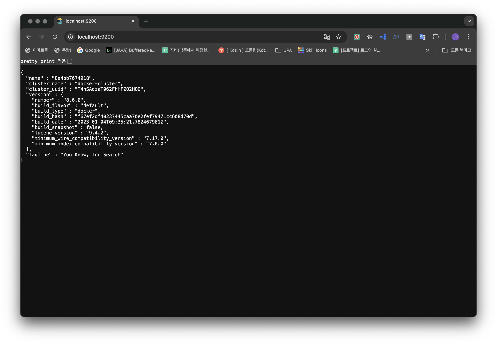
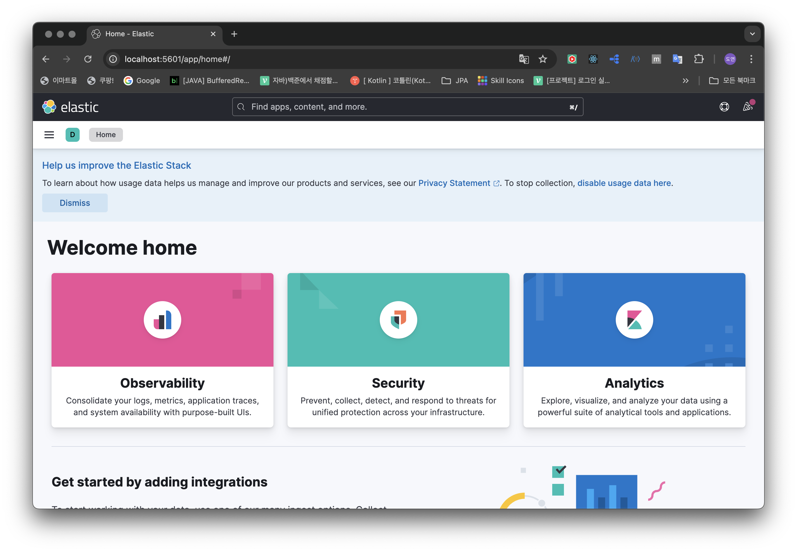
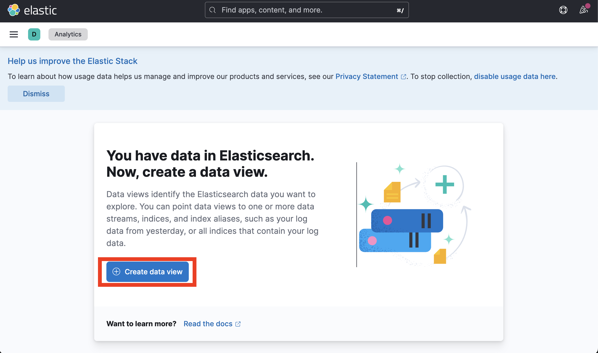
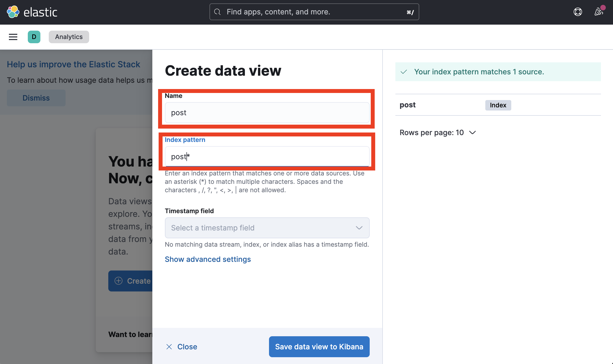
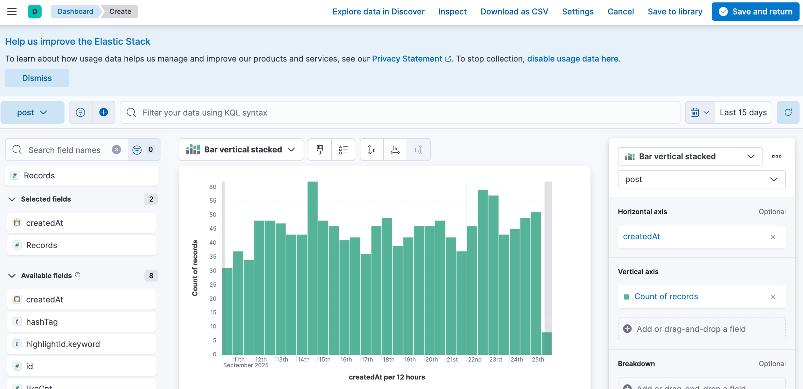
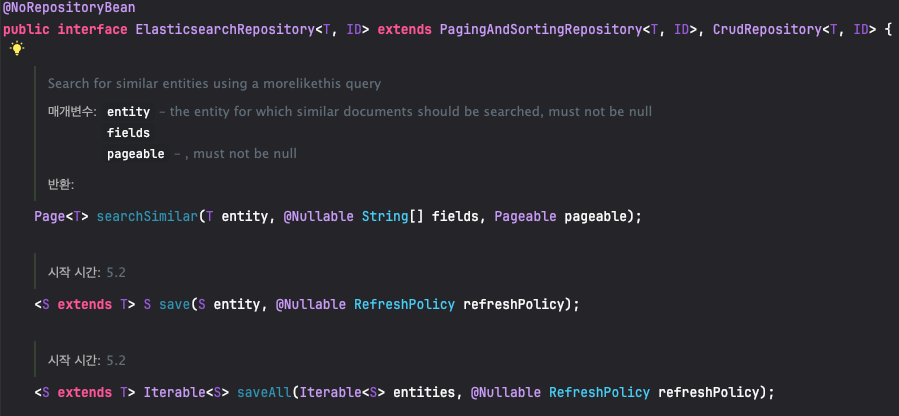
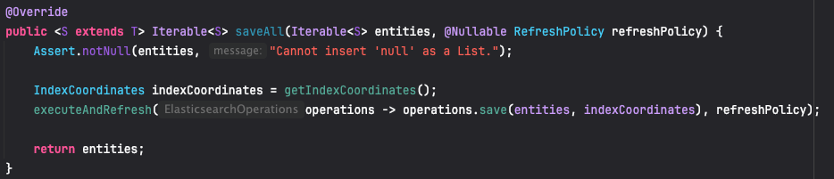
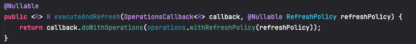
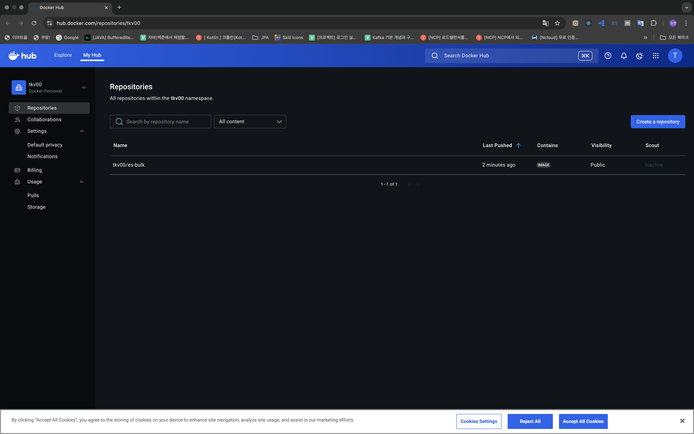
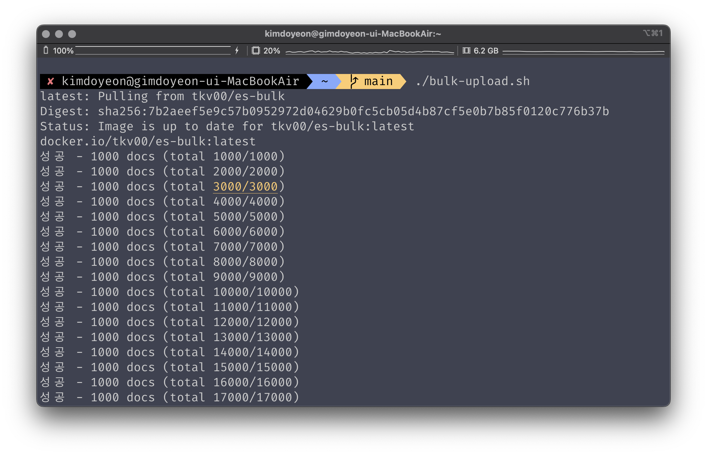

## **1\. 배경**

* * *

기존 **Shoot-Pointer**에서 게시물 전체 검색을 개발하면서, 제목 또는 내용을 바탕으로 검색으로 **like** 연산을 사용하고 있었습니다. 여기서 문제가 되는 부분은 단순히 검색 단어의 유무만을 판단하고 이를 최신순으로 정렬 후 **NoOffset+Slice** 방식으로 조회하는 것입니다. 대부분의 포털 사이트 혹은 SNS에서는 검색 시에 정확도를 기준으로 정렬을 진행합니다. 추가로 검색어 자동완성 기능과 검색어 랭킹 또한 추가 기능으로서 염두에 두고 있는 상황에서 자연스럽게 **Elastic Search**의 도입을 고려하게 되었습니다.

```java
    /**
     * 1. 제목 + 내용 게시물 조회 - NoOffset+slice 방식
     * 2. 조회된 게시물 최신순 정렬 반환.
     */
    @Query(value = """
        SELECT *
        FROM post p
        WHERE (p.title LIKE CONCAT('%', :search, '%')
            OR p.content LIKE CONCAT('%', :search, '%'))
          AND p.post_id < :lastPostId
        ORDER BY p.post_id DESC
        LIMIT :size
        """,
            nativeQuery = true)
    List<PostEntity> getPostEntitiesByPostTitleOrPostContentOrderByCreatedAtDesc(
            @Param("search") String search,
            @Param("size") int size,
            @Param("lastPostId") Long postId
    );
```

* * *

#### **🧠ElasticSearch란?**

**ElasticSearch**란 검색 및 분석 엔진으로 대규모의 데이터를 빠르게 저장, 검색, 분석할 수 있는 도구입니다. **Restful API**를 제공하여 JSON 형식으로 쉽게 데이터를 저장하고 조회할 수 있습니다. **DataBase**는 **B-Tree**를 기반으로 한 인덱스로 문자열 검색에서는 성능이 떨어집니다. 또한, 특정 문자열에 대한 정확한 검색은 최적화가 잘 되어있지만 부분 문자열에 대해서는 비교적 성능이 좋지 못합니다. 

반면, **Elastic Search**는 **역색인 구조(Inverted Index)**를 사용합니다. 역색인 구조란 키워드를 통해 문서를 찾아내는 방식으로 DB에서는 PK값이나 FK값으로 데이터를 찾는 반면 역색인 구조는 데이터에 들어있는 키워드들을 통해서 전체 데이터를 찾는 방법입니다. 

## **2\. 해결과정**

* * *

#### 1-1 )ElasticSearch + Kibana 구축

```yaml
services:
  # Spring Boot Application
  shootpointer:
    build:
    depends_on:
      elasticsearch:
        condition: service_healthy
    environment:
      SPRING_ELASTICSEARCH_URIS: http://elasticsearch:9200
    ports:
      - "9000:9000"
    networks:
      - spring-network

  ## ElasticSearch
  elasticsearch:
    build:
      context: .
      dockerfile: Dockerfile.elesticsearch
    image: docker.elastic.co/elasticsearch/elasticsearch:8.6.0
    container_name: elasticsearch
    environment:
      - discovery.type=single-node
      - xpack.security.enabled=false
      - logger.level=debug
      - ES_JAVA_OPTS=-Xms2g -Xmx2g
    ports:
      - "9200:9200"
      - "9300:9300"
    volumes:
      - esdata:/usr/share/elasticsearch/data
      - ./es-logs:/usr/share/elasticsearch/logs
    networks:
      - spring-network
    restart: always
    healthcheck:
      test: [ "CMD", "curl", "-f", "http://localhost:9200/_cluster/health" ]
      interval: 30s
      timeout: 10s
      retries: 3
      start_period: 60s

  kibana:
      image: docker.elastic.co/kibana/kibana:8.6.0
      container_name: kibana
      environment:
        - ELASTICSEARCH_HOSTS=http://elasticsearch:9200
      ports:
        - "5601:5601"
      depends_on:
        - elasticsearch
      networks:
        - spring-network
      restart: always

networks:
  spring-network:
    driver: bridge

volumes:
  esdata:
```

**Docker-compose.yml**를 위와 같이 작성하였고 직접적으로 필요없는 부분은 제외했습니다. 

> 1\. 현재 **SpringBootApplication**이 돌아가는 network와 동일하게 설정하기 위해 **spring-network**를 추가해줍니다.  
> 2. **elasticsearch**가 정상적으로 작동(service\_healthy)상태일 때까지 기다리기 위해 **shootpointer-depends\_on** 속성에 **elasticsearch**를 추가해줍니다.  
> 3\. 같은 방법으로 **kibana**는 **elasticsearch**가 정상적으로 작동(**service\_healthy**)일 때 실행되어야 하므로 **elasticsearch-depends\_on** 속성에 kibana를 추가합니다.  
> 4. **\- ES\_JAVA\_OPTS=-Xms2g -Xmx2g** 속성을 추가해 **docker**내에서 사용가능한 메모리값을 2GB로 주어 대용량 데이터 삽입 시, **out of memory** 오류를 방지합니다.  
> 5. **\- xpack.security.enabled=false** 속성을 추가하여 **elasticsearch** 접속 시 username과 password없이 접속이 가능하도록 설정합니다.

#### **🚨  **\- ES\_JAVA\_OPTS=-Xms2g -Xmx2g 관련 트러블 슈팅****

ElasticSearch 구축을 완료한 이후 Bulk Api를 사용하여 100만 건의 더미 데이터를 삽입하는 과정에서 **out of memory** 트러블을 마주했습니다.

```bash
curl -XPOST "http://localhost:9200/_bulk" \
  -H "Content-Type: application/json" \
  --data-binary @/Users/kimdoyeon/bulk.json

curl: option --data-binary: out of memory
curl: try 'curl --help' or 'curl --manual' for more information
```

미리 로컬환경에서 만들어 놓은 100만 건(1.18GB)의 더미 데이터인 ./bulk.json 파일을 한 번에 Elastic Serach에 올리게 되면서 맥북의 메모리 초과가 발생하게 되었습니다.

docker-compose.yml에서 elasticsearch 설정 중 ****\- ES\_JAVA\_OPTS=-Xms2g -Xmx2g**** 을 추가하여 docker내에서 사용가능한 메모리의 크기를 증가시켜줍니다.

ElasticSearch와 Kibana가 정상적으로 설치되었는 지 확인하기 위해 각각 **http://localhos:5601** , **http://localhost:9200**에 접속해줍니다.



http://localhost:9200



http://localhos:5601

#### 1-2 ) Nori 형태소 분석기 설치

```dockerfile
FROM docker.elastic.co/elasticsearch/elasticsearch:8.6.0

# 기존 nori 플러그인이 있으면 삭제 후 설치
RUN if [ -d "/usr/share/elasticsearch/plugins/analysis-nori" ]; then \
      bin/elasticsearch-plugin remove analysis-nori; \
    fi && \
    bin/elasticsearch-plugin install analysis-nori --batch
```

한글 형태소의 분석을 좀 더 정확하게 도와줄 **Nori(한글 형태소 분석기)**를 **Dockerfile.elasticsearch** 파일을 생성하여 docker-compose 실행 시 자동으로 설치할 수 있도록 해줍니다.

* * *

#### 2-1) SpringBoot 설정

1\. build.gradle 종속성 추가

```groovy
//ElasticSearch
implementation 'org.springframework.boot:spring-boot-starter-data-elasticsearch'
```

2\. application.yml 설정 추가

```yaml
spring:
  # ElasticSearch
  elasticsearch:
    enabled: false
    uris: ${SPRING_ELASTICSEARCH_URIS:http://elasticsearch:9200}
```

3\. Config Class 생성

```java
@Configuration
@EnableElasticsearchRepositories
@Profile("dev")  // dev 프로파일에서만 활성화
public class ElasticSearchConfig  {
    @Value("${spring.elasticsearch.uris}")
    private String host;

    @Bean
    public ClientConfiguration clientConfiguration() {
        return ClientConfiguration.builder()
                .connectedTo(host.replace("http://",""))
                .build();
    }

    @Bean
    public ElasticsearchClient elasticsearchClient(){
        RestClient restClient=RestClient.builder(HttpHost.create(host)).build();
        return new ElasticsearchClient(new RestClientTransport(restClient,new JacksonJsonpMapper()));
    }
}
```

@EnableElasticsearchRepositories는 ElasticSearch Repository를 사용하기 위한 어노테이션입니다.

#### 2-2) PostDocument

```java
package com.midas.shootpointer.domain.post.entity;

import com.fasterxml.jackson.annotation.JsonIgnoreProperties;
import lombok.AccessLevel;
import lombok.Builder;
import lombok.Getter;
import lombok.NoArgsConstructor;
import org.springframework.context.annotation.Profile;
import org.springframework.data.annotation.Id;
import org.springframework.data.elasticsearch.annotations.*;

import java.time.LocalDateTime;
@Profile("!dev")  // dev 프로파일이 아닐 때만 활성화
@Getter
@Document(indexName = "post",createIndex = true)
@Mapping(mappingPath = "elasticsearch/post-mapping.json")
@Setting(settingPath = "elasticsearch/post-setting.json")
@JsonIgnoreProperties(ignoreUnknown = true)
@NoArgsConstructor(access = AccessLevel.PROTECTED)
public class PostDocument {
    @Id
    @Field(type = FieldType.Long)
    private Long postId;

    @Field(type = FieldType.Text)
    private String title;

    @Field(type = FieldType.Text)
    private String content;

    @Field(type = FieldType.Keyword)
    private HashTag hashTag;

    @Field(type = FieldType.Long)
    private Long likeCnt;

    @Field(type = FieldType.Text)
    private String memberName;

    @Field(type = FieldType.Date,format = {DateFormat.date_hour_minute_second_millis, DateFormat.epoch_millis})
    private LocalDateTime createdAt;

    @Field(type = FieldType.Date,format = {DateFormat.date_hour_minute_second_millis, DateFormat.epoch_millis})
    private LocalDateTime modifiedAt;

    @Field(type = FieldType.Text)
    private String highlightUrl;

    @Builder
    public PostDocument(Long postId,
                        String title,
                        String content,
                        HashTag hashTag,
                        Long likeCnt,
                        String memberName,
                        LocalDateTime createdAt,
                        LocalDateTime modifiedAt,
                        String highlightUrl
    ){
        this.content=content;
        this.hashTag=hashTag;
        this.postId=postId;
        this.title=title;
        this.memberName=memberName;
        this.likeCnt=likeCnt;
        this.createdAt=createdAt;
        this.modifiedAt=modifiedAt;
        this.highlightUrl=highlightUrl;
    }
}
```

> **1**. ElasticSearch 인덱스와 연결을 위해 **PostDocument** 클래스를 생성 해줍니다.  
> **2**. **@Setting** 어노테이션을 이용하여 인덱스 토크나이저를 설정합니다. 이때, 설정할 post-setting.json 파일은 src/resouses 디렉토리 안에 생성합니다.  
> 
> ```
> {
>   "analysis": {
>     "analyzer": {
>       "korean": {
>         "type": "nori"
>       }
>     }
>   }
> }​
> ```
> 
>   
>  **3**. **@Mapping** 어노테이션을 이용하여 필드값들의 type를 지정해줍니다.  
> 
> ```
> {
>   "properties": {
>     "postId": {
>       "type": "long"
>     },
>     "title": {
>       "type": "text",
>       "analyzer": "nori"
>     },
>     "content": {
>       "type": "text",
>       "analyzer": "nori"
>     },
>     "hashTag": {
>       "type": "keyword"
>     },
>     "likeCnt": {
>       "type": "long"
>     },
>     "createdAt": {
>       "type": "date",
>       "format": "yyyy-MM-dd'T'HH:mm:ss.SSS||epoch_millis"
>     },
>     "modifiedAt": {
>       "type": "date",
>       "format": "yyyy-MM-dd'T'HH:mm:ss.SSS||epoch_millis"
>     },
>     "highlightUrl": {
>       "type": "text"
>     }
>   }
> }
> ```
> 
>   
>   
> **4**. **PostDocument**의 id값이 Long값이고 컬럼이름을 postId로 지정한 이유는 DB에 저장되는 게시물 post table의 PK값인 post\_id와의 동기화를 위해 일치시켰습니다.

#### 2-3) ElasticSearch 서비스 로직

1\. **PostElasticSearchRepository** 클래스 

```java
public interface PostElasticSearchRepository extends ElasticsearchRepository<PostDocument,Long> {
}
```

post/respository 디렉토리 내에 **PostElasticSearchRepository** 클래스를 생성해줍니다.

2\. **PostElasticMapperImpl** 클래스

```java
@Component
@Profile("!dev")  // dev 프로파일이 아닐 때만 활성화
public class PostElasticSearchMapperImpl implements PostElasticSearchMapper {
    @Override
    public PostResponse docToResponse(PostDocument doc) {
        return PostResponse.builder()
                .title(doc.getTitle())
                .content(doc.getContent())
                .createdAt(doc.getCreatedAt())
                .memberName(doc.getMemberName())
                .hashTag(doc.getHashTag())
                .highlightUrl(doc.getHighlightUrl())
                .likeCnt(doc.getLikeCnt())
                .modifiedAt(doc.getModifiedAt())
                .postId(doc.getPostId())
                .build();
    }

    @Override
    public PostDocument entityToDoc(PostEntity post) {
        return PostDocument.builder()
                .content(post.getContent())
                .title(post.getTitle())
                .hashTag(post.getHashTag())
                .postId(post.getPostId())
                .likeCnt(post.getLikeCnt())
                .memberName(post.getMember().getUsername())
                .createdAt(post.getCreatedAt())
                .modifiedAt(post.getModifiedAt())
                .highlightUrl(post.getHighlight().getHighlightURL())
                .build();
    }
}
```

1) PostDocument를 API 호출 시 게시물 조회 응답 DTO인 PostResponse로 매핑하는 docToResponse를 구현합니다.

2) PostEntity를 PostDocument 형식으로 매핑하는 entityToDoc를 구현합니다.

3\. **PostElasticSearchHelperImpl** 클래스 

```java
@Component
@Profile("!dev")  // dev 프로파일이 아닐 때만 활성화
@RequiredArgsConstructor
public class PostElasticSearchHelperImpl implements PostElasticSearchHelper{
    private final PostElasticSearchUtil postElasticSearchUtil;

    @Override
    public Long createPostDocument(PostEntity post) {
        return postElasticSearchUtil.createPostDocument(post);
    }
}
```

4\. **PostElasticSearchUtilImpl** 클래스

```java
@RequiredArgsConstructor
@Component
@Profile("!dev")  // dev 프로파일이 아닐 때만 활성화
public class PostElasticSearchUtilImpl implements PostElasticSearchUtil{
    private final PostElasticSearchRepository postElasticSearchRepository;
    private final PostElasticSearchMapper mapper;

    @Transactional
    @Override
    public Long createPostDocument(PostEntity post) {
        PostDocument postDocument=mapper.entityToDoc(post);
        return postElasticSearchRepository.save(postDocument).getPostId();
    }
}
```

만들어둔 mapper 클래스를 이용하여 PostEntity를 **PostDocument**로 매핑을 해주고 **PostElasticSearchRepository**를 이용하여 생성된 document 객체를 저장합니다.

#### 2-4)  Kibana를 통해 생성된 데이터 확인


Observability 선택



Create data view 선택



생성된 post 인덱스 선택 및 정렬 기준 선택



대시보드를 생성한 모습

* * *

#### 3-1) 테스트용 더미 데이터 구축하기

전체적인 ElasticSearch + Kibana의 설정을 모두 끝났습니다. 하지만, 테스트를 위하여 게시물 데이터를 개발자가 1개씩 넣기에는 100건만 넘어가도 벅찹니다. 매우 귀찮은 동작입니다. 개발자의 시간은 *매우 소중*하므로 더미 데이터를 생성 자동화를 구성하도록 하겠습니다.


1) 초기 구현 - saveAll()

```java
@Component
@Profile("testdata")
@RequiredArgsConstructor
public class DummyDataLoader implements CommandLineRunner {
    private final JdbcTemplate jdbcTemplate;
    private final MakeRandomWord makeRandomWord;
    private final MemberCommandRepository memberRepository;
    private final HighlightCommandRepository highlightCommandRepository;
    private final PostElasticSearchRepository postElasticSearchRepository;
    private final PostElasticSearchMapper mapper;

    private final int batchSize=10_000;
    private final int insertSize=100_000;
    private final PostQueryRepository postQueryRepository;

    @Override
    public void run(String... args) throws Exception {
        ...DB batch 로직

        /**
         * Elastic Search 배치 처리
         */
        long esStart = System.currentTimeMillis();
        System.out.println("ES 배치 시작 시간: " + LocalDateTime.now());
        int page = 0;

        Page<PostEntity> result;
        do {
            result  = postQueryRepository.findAllWithMemberAndHighlight(PageRequest.of(page, batchSize));

            // PostEntity → PostDocument 변환
            List<PostDocument> docs = result.stream()
                    .map(mapper::entityToDoc)
                    .toList();

            postElasticSearchRepository.saveAll(docs);

            System.out.println("ES 배치 : " + ((page + 1) * batchSize) + "건 삽입 완료");
            page++;
        } while (result.hasNext());

        long esEnd = System.currentTimeMillis();
        System.out.println("ES 배치 종료 시간: " + LocalDateTime.now());
        System.out.println("ES 전체 소요 시간(ms): " + (esEnd - esStart));
    }
}
```

> 1) **PostDocument**의 id값인 postId는 실제 DB의 post\_id와 동일하게 들어가야 하므로 **jdbcTemplate**의 **batchUpdate**로 생성해둔 post 데이터를 Page를 통해 미리 설정한 batchSize만큼 불러옵니다.  
> 2) 불러온 post 데이터를 mapper 클래스를 이용하여 **PostDocument** 형태로 매핑하여 List형태로 반환합니다.  
> 3) **ElasticRepository**의 saveAll() 메서드를 이용하여 **ElasticSearch**에 저장합니다.


saveAll()을 이용한 내부 배치 처리 결과

  
**‼️왜 saveAll()은 거북이 달리기인가🐢‼️**



ElasticsearchRepository 인터페이스

**ElasticsearchRepository**는 PagingAndSortingRepository ,CrudRepository를 상속받는 구조입니다. 



Elasticsearch-saveAll() 구현 코드

실제 **saveAll** 함수의 구현부분을 보면 **executeAndRefresh()**부분이 눈에 띕니다.



**ElasticSearch**의 **refresh**는 단순한 **flush**가 아니라, 세그먼트 자체를 열어 검색이 가능한 상태로 만드는 무거운 연산입니다. 따라서, 100만 건의 **PostDocument** 저장 요청은 ***100만 / batchSize*** 만큼의 불필요한 refresh 비용이 발생합니다. 반면, **Bulk API** 같은 경우 기본적으로 **refresh=wait\_for** 또는 **refresh=false**로 동작하여 마지막 1번만 **refresh**하거나 내부 주기적 **refresh**를 기다리게 됩니다.

2) 개선 방안 - Bulk API

```python
import psycopg2
import json
import requests
import re
import time
import os

DB_CONFIG = {
    "dbname": os.getenv("DB_NAME", ""),
    "user": os.getenv("DB_USER", ""),
    "password": os.getenv("DB_PASS", ""),
    "host": os.getenv("DB_HOST", "postgres"),
    "port": int(os.getenv("DB_PORT", 5432)),
}
ES_URL = os.getenv("ES_URL", "http://elasticsearch:9200/posts/_bulk")
BATCH_SIZE = int(os.getenv("BATCH_SIZE", 1000))  

CTRL_RE = re.compile(r"[\x00-\x1F\x7F\u00A0]")

def clean_text(text: str) -> str:
    if not text:
        return None
    
    return CTRL_RE.sub(" ", text).strip() or None

def fetch_posts():
    conn = psycopg2.connect(**DB_CONFIG)
    cur = conn.cursor()
    cur.execute("""
        SELECT post_id, title, content, like_cnt, member_id, highlight_id,
               hash_tag, created_at, modified_at
        FROM post
    """)
    while True:
        rows = cur.fetchmany(BATCH_SIZE)
        if not rows:
            break
        yield rows
    cur.close()
    conn.close()

def bulk_upload(rows):
    bulk_lines = []
    for row in rows:
        post_id, title, content, like_cnt, member_id, highlight_id, hash_tag, created_at, modified_at = row

        meta = {"index": {"_id": str(post_id)}}
        doc = {
            "postId": post_id,
            "title": clean_text(title),
            "content": clean_text(content),
            "likeCnt": like_cnt,
            "memberId": str(member_id) if member_id else None,
            "highlightId": str(highlight_id) if highlight_id else None,
            "hashTag": hash_tag,
            "createdAt": created_at.isoformat() if created_at else None,
            "modifiedAt": modified_at.isoformat() if modified_at else None,
        }

        bulk_lines.append(json.dumps(meta, ensure_ascii=False))
        bulk_lines.append(json.dumps(doc, ensure_ascii=False))

    data = "\n".join(bulk_lines) + "\n"
    response = requests.post(ES_URL, headers={"Content-Type": "application/x-ndjson"}, data=data.encode("utf-8"))
    return response.json()

def main():
    start_time = time.time()  
    
    total, success, fail = 0, 0, 0
    for rows in fetch_posts():
        total += len(rows)
        resp = bulk_upload(rows)
        if not resp.get("errors"):
            success += len(rows)
            print(f"성공 - {len(rows)} docs (total {success}/{total})")
        else:
            fail += len(rows)
            print(f"실패 - {len(rows)} docs (total {fail}/{total})")
            print(json.dumps(resp, indent=2, ensure_ascii=False)[:1000])  # 일부만 출력
    
    end_time = time.time()  
    elapsed_ms = int((end_time - start_time) * 1000)

    print("=== 결과 요약 ===")
    print(f"총 문서: {total}")
    print(f"성공:    {success}")
    print(f"실패:    {fail}")
    print(f"총 소요 시간: {elapsed_ms} ms")

if __name__ == "__main__":
    main()
```

> 1) DB에서 모든 게시물 데이터를 조회합니다.  
> 2) DB에 저장된 게시물 데이터들을 파이썬 코드를 이용하여 ElasticSearch의 Bulk API 형식인   
> application/x-ndjson 형식으로 파싱합니다.  
> 3) 아래와 같이 파싱된 데이터를 Bulk API를 이용하여 Elastic Search에게 POST 형식으로 전송합니다.  
> 
> ```
> { "index" : { "_index" : "posts", "_id" : "1" } }
> { "postId" : 1, "title" : "제목1", "content" : "내용1", "likeCnt" : 10, ... }
> { "index" : { "_index" : "posts", "_id" : "2" } }
> { "postId" : 2, "title" : "제목2", "content" : "내용2", "likeCnt" : 50, ... }
> ...​
> ```

#### 3-2) DockeHub 생성 이미지 업로드

실제 서버에서 해당 파이썬 코드를 위해 우분투 환경에서 파일을 생성하고 Python3를 설치하며, 각종 라이브러리를 설치하는 과정은 생각만 해도 귀찮고 복잡합니다. 따라서, Docker를 이용하여 이미지를 만들고 Docker Hub에 배포하여 언제 어디서든 pull를 이용해 위의 더미 데이터 생성 코드를 사용할 수 있도록 하겠습니다.

1) 도커 파일 생성

```dockerfile
FROM python:3.12-slim

WORKDIR /app

COPY requirements.txt .
RUN pip install --no-cache-dir -r requirements.txt

COPY es_bulk.py .

CMD ["python", "es_bulk.py"]
```

2) 필요한 라이브러리 게시 (requirements.txt)

```text
psycopg2-binary
requests
```

3) Docker image 빌드 및 Docker Hub에 push

```bash
docker build -t tkv00/es-bulk:latest .
docker login
docker push tkv00/es-bulk:latest
```

4) Docker Hub에 올라간 이미지 확인



Docker Hub

정상적으로 PUSH에 성공했습니다. 아래는 실제 es-bulk 업로드 주소입니다.

[https://hub.docker.com/r/tkv00/es-bulk

hub.docker.com](https://hub.docker.com/r/tkv00/es-bulk)

5) 로컬 환경에서 docker 이미지 실행

```bash
#!/bin/bash
docker pull tkv00/es-bulk:latest
docker run --rm \
  --network=shootpointer_be_spring-network \
  -e DB_NAME=shootpointer \
  -e DB_USER=myuser \
  -e DB_PASS=rlaehdus00 \
  -e DB_HOST=postgres \
  -e DB_PORT=5432 \
  -e ES_URL=http://elasticsearch:9200/post/_bulk \
  tkv00/es-bulk:latest
```

테스트 데이터를 넣을 때마다 docker에서 이미지를 pull해오는 것과 이를 실행하기 위해 환경변수들을 설정하는 것 또한 매우 귀찮은 행동입니다. 따라서, 저는 위와 같이 **bulk-upload.sh** 이름의 쉘 스크립트를 루트 디렉토리에 생성하여 터미널에 ./bulk-upload.sh만을 입력하여 이미지를 실행할 수 있도록 했습니다.



./bulk-upload 실제 동작

## **3\. 결과**

* * *

ElasticSearchRepository의 saveAll() 단위 배치로 데이터를 저장하는 방식에서 Elastic Search의 **Bulk API**방식으로 전환하여 최종적으로 약 ***56.9%***의 속도 개선을 달성했습니다.


Bulk API 배치 처리 결과

| 처리 방식 | 처리 데이터량 | 소요 시간 (ms) | 개선율 |
| --- | --- | --- | --- |
| 기존 단위 처리 방식 | 1,000,000 rows | 466,580 ms | - |
| Bulk API 방식 | 1,000,000 rows | 201,110 ms | 56.9% ⬆️ |
