## **1\. 배경**

* * *

Shoot-Pointer 프로젝트를 진행하던 중 유저가 자신의 하이라이트 영상을 올릴 수 있는 게시판을 구현하던 중에 좋아요의 개수를 Post 테이블에서 관리하면서 동시성 문제가 발생할 것 같다고 예상할 수 있었습니다. 동시에 여러명의 클라이언트가 요청을 보내게 되면 좋아요의 개수에 대한 **정합성** 문제가 발생할 수 있습니다. 물론, 좋아요의 개수를 증가시키고 좋아요 객체를 생성하는 서비스 로직에서 **@Transactinal** 애노테이션을 통해 하나의 단위 작업으로 설정하였지만, 이는 여러 스레드 환경에서는 데이터 **정합성**을 보장할 수 없습니다. 멀티 스레드 환경에서의 이러한 문제를 도식화하면 아래와 같습니다.

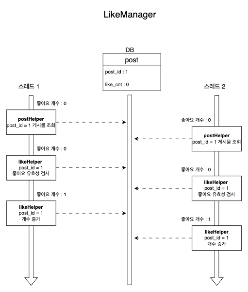

동시성 문제

**ExecutorService**와 **CountDownLatch**를 이용하여 아래와 같은 시나리오로 좋아요의 개수를 증가시켜 보겠습니다.

> 10,000 명의 유저가 동시에 좋아요 요청을 보냅니다.

**👇 테스트 코드 보기**

동시성 제어를 하지 않은 코드

```java
@SpringBootTest
@ActiveProfiles("test")
class LikeManagerConcurrencyTest {
    @Autowired
    private LikeManager likeManager;

    @Autowired
    private LikeHelper likeHelper;

    @Autowired
    private PostHelper postHelper;

    @Autowired
    private MemberRepository memberRepository;

    @Autowired
    private PostCommandRepository postCommandRepository;

    @Autowired
    private PostQueryRepository postQueryRepository;

    @Autowired
    private LikeCommandRepository likeCommandRepository;

    /**
     * 좋아요할 게시물 Id
     */
    private static Long postId;
    private static final List<Member> memberList=new ArrayList<>();

    @BeforeEach
    void setUp(){
        /**
         * 더미 게시판 작성.
         */
        Member savedMember=memberRepository.saveAndFlush(makeMockMember());
        postId=postCommandRepository.saveAndFlush(makeMockPost(savedMember)).getPostId();

        /**
         * 더미 멤버 삽입
         */
        for (int i=0;i<INF;i++){
            memberList.add(memberRepository.save(makeMockMember()));
        }
    }

    @AfterEach
    void tearDown(){
        likeCommandRepository.deleteAll();
        postCommandRepository.deleteAll();
        memberRepository.deleteAll();
    }

    private final int INF=10000;
    @Test
    @DisplayName("동시에 10000개의 요청으로 좋아요 수를 증가시킵니다.")
    void increate_10000_request_of_like() throws InterruptedException {
        //given
        final int threadCount=INF;
        final ExecutorService executorService= Executors.newFixedThreadPool(32);
        final CountDownLatch countDownLatch=new CountDownLatch(threadCount);

        //when
        for (int i=0;i<threadCount;i++){
            final int idx=i;
            executorService.submit(()->{
                try {
                    likeManager.increase(postId,memberList.get(idx));
                }finally {
                    countDownLatch.countDown();
                }
            });
        }
        countDownLatch.await();
        final PostEntity post=postQueryRepository.findByPostId(postId).orElseThrow();

        //then
        assertThat(post.getLikeCnt()).isEqualTo(INF);
    }
```

예상했던 대로 시나리오는 실패했습니다. 10,000개의 요청 결과 게시물의 좋아요 개수는 10,000개가 나와야지 올바른 테스트 결과이지만, 실제 테스트 결과 좋아요 개수는 1,528개밖에 되지 않았습니다.

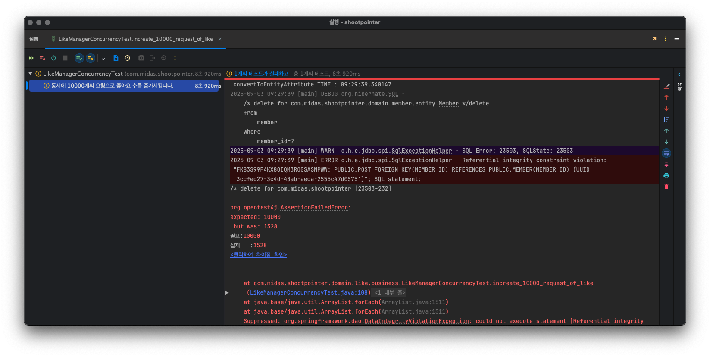

테스트 결과

## **2\. 해결과정**

* * *

동시성을 처리하는 방법에는 다양한 방법이 존재합니다. 이 중 5개의 방법을 선택하여 구현해보고 성능을 비교하여, 선택하도록 하겠습니다.

#### **1\. DataBase 단계**

\- Optimistic Lock (낙관적 락 / 비선점형 락) ✅

\- Pessimistic Lock (비관적 락 / 선점형 락)✅

\- 증분 쿼리

#### **2\. Application 단계**

\- AtomicInteger / AtomicLong ✅

\- synchronized

\- Semaphore

\- ConcurrentHashMap

#### **3\. 외부 연동**

\- Redis ( Distributed Lock - 분산 락)✅

\- Event Queue ( Kafka, Rabbit MQ)

각각의 방법들을 구현하기 이전에 다양한 요청 수에 따른 성능 차이를 확인하기 위해서 시나리오를 아래와 같이 바꾸었고 중복되는 테스트 코드에 대해서 메소드로 만들어 간략화를 하도록 하겠습니다.

> \- 100 명의 유저가 동시에 좋아요 요청을 보냅니다.  
> \- 1,000 명의 유저가 동시에 좋아요 요청을 보냅니다.  
> \- 10,000 명의 유저가 동시에 좋아요 요청을 보냅니다.

✅ **리팩토링한 코드**

```java
...

private final int INF_0=100;
private final int INF_1 = 1_000;
private final int INF_2 = 10_000;

...

 @Test
 @DisplayName("DistributedLock - 동시에 100개의 요청으로 좋아요 수를 증가시킵니다.")
 void DistributedLock_increase_100_request_of_like() throws InterruptedException {
     extracted(INF_0);
 }

@Test
@DisplayName("DistributedLock - 동시에 1,000개의 요청으로 좋아요 수를 증가시킵니다.")
void DistributedLock_increase_1_000_request_of_like() throws InterruptedException {
   extracted(INF_1);
}

@Test
@DisplayName("DistributedLock - 동시에 10,000개의 요청으로 좋아요 수를 증가시킵니다.")
void DistributedLock_increase_10_000_request_of_like() throws InterruptedException {
    extracted(INF_2);
}
    
...
    
private void extracted(int threadCnt) throws InterruptedException {
    //given
    final ExecutorService executorService = Executors.newFixedThreadPool(32);
    final CountDownLatch countDownLatch = new CountDownLatch(threadCnt);

    //when
    for (int i = 0; i < threadCnt; i++) {
         final int idx = i;
         executorService.submit(() -> {
            try {
                likeManager.increase(postId, memberList.get(idx));
             } catch (Exception e){
                log.error("동시성 테스트 오류 : {}",e.getMessage());
             }
             finally{
                 countDownLatch.countDown();
             }
         });
     }
     countDownLatch.await();
     final PostEntity post = postQueryRepository.findByPostId(postId).orElseThrow();

     //then
     assertThat(post.getLikeCnt()).isEqualTo(threadCnt);
 }
```

* * *

### **Increment Query - 증분 쿼리**

증분 쿼리는 말 그대로 데이터베이스에서 숫자 컬럼에 대해 기존 값에서 일정 값만큼 증가 혹은 감소시키는 쿼리를 말합니다. 데이터베이스 엔진 내부에서 원자적으로 수행되기 때문에 원자성(Atomicity)가 보장되고 동시성 환경에서도 비교적 안전합니다. 하지만, 요청이 많이 들어올 경우 락 경합으로 인해 성능상 이슈가 발생할 수 있습니다.

```java
@Repository
public interface LikeCommandRepository extends JpaRepository<LikeEntity,Long> {
    @Modifying
    @Query(value = "UPDATE post SET like_cnt = like_cnt + 1 WHERE post_id=:postId",nativeQuery = true)
    void increasesLikeCnt(@Param(value = "postId")Long postId);

}
```

-   **postId (게시물 PK)** 값을 매개변수로 받아서 게시물 PK와 일치하는 row에 대해서 좋아요 개수를 +1 시키는 **update** 쿼리문입니다.

|  | 100명 | 1,000명 | 10,000명 |
| --- | --- | --- | --- |
| 증분 쿼리 | 1,222 ms | 4,400 ms | 86,000 ms |

* * *

### **AtomicInteger 변수**

**Atomic 변수란?**

멀티 스레드 환경에서 CAS(Compare And Swap) 알고리즘을 이용하여, 원자성을 보장하는 변수입니다. CAS란 변수의 값을 변경하기 전에 기존에 가지고 있던 값이 내가 예상하던 값과 같은 경우만 새로운 값을 할당합니다.

AtomicType같은 경우 java docs를 확인해보면 아래와 같은 종류들이 존재합니다.

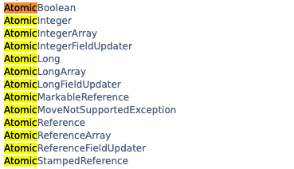

이 중 좋아요는 기존 컬럼 데이터 Type처럼 Integer를 사용하기 위해서 **AtomicInteger**를 사용했습니다.

\- **AtomicInteger = new AtomicInteger()** : 초기값이 0인 AtomicInteger 값을 생성하거나 사용자가 직접 초기값을 생성합니다.

\- **getAndIncrement()** : 현재 값을 가져온 후 1을 증가시킵니다.

```java
@Table(name = "post")
@AllArgsConstructor
@RequiredArgsConstructor
@Entity
@Builder
@Getter
@SQLRestriction("is_deleted = false")
public class PostEntity extends BaseEntity {
    
    ....
    
    /**
     * 원시적 변수
     */
    @Transient
    @Setter
    private AtomicInteger atomicLikeCnt=new AtomicInteger(0);

		...
		
    public int increaseAtomicLikeCnt(){
        return this.atomicLikeCnt.getAndIncrement();
    }
}
```

-   기존 게시물(post) 엔티티에 존재하던 좋아요 개수 컬럼인 like\_cnt이외의 **Atomic** 변수인 **atomicLikeCnt**를 추가하고, 생성자를 통해 0으로 초기화합니다.

```java
 @Override
 public void increaseLikeCnt(PostEntity post) {
    // likeCommandRepository.increasesLikeCnt(post.getPostId());
     int atomic=post.increaseAtomicLikeCnt();
     post.setLikeCnt(atomic);
     postCommandRepository.save(post);
 }
```

-   **getAndIncrement()** 메소드를 이용하여 post 객체의 **atomicLikeCnt**의 개수를 가져온 후 1를 증가시킨 후 저장합니다.

✅ **테스트** **코드**

```java
    @Test
    @DisplayName("AtomicInteger 사용 -동시에 100개의 요청으로 좋아요 수를 증가시킵니다.")
    void AtomicInteger_increase_100_request_of_like() throws InterruptedException {
        atomicExtracted(INF_0);
    }

    @Test
    @DisplayName("AtomicInteger 사용 -동시에 1,000개의 요청으로 좋아요 수를 증가시킵니다.")
    void AtomicInteger_increase_1_000_request_of_like() throws InterruptedException {
        atomicExtracted(INF_1);
    }

    @Test
    @DisplayName("AtomicInteger 사용 -동시에 10,000개의 요청으로 좋아요 수를 증가시킵니다.")
    void AtomicInteger_increase_10_000_request_of_like() throws InterruptedException {
        atomicExtracted(INF_2);
    }
```

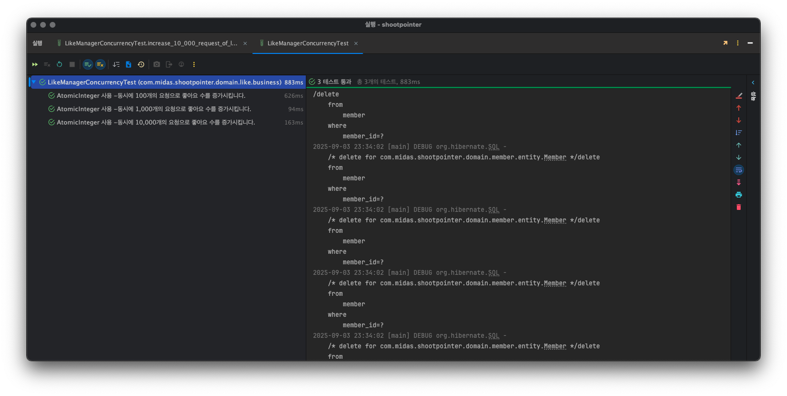

테스트 코드 실행

|  | 100명 | 1,000명 | 10,000명 |
| --- | --- | --- | --- |
| AtomicInteger | 626 ms | 94 ms | 163 ms |

> 예상외로 정말 빠른 속도로 데이터 정합성을 보장할 수 있었습니다. Atomic 변수는 JVM 내부에서 동작하므로 테스트 코드 과정에서는 비교적 매우 빠른 성능을 가질 수 있습니다. 하지만, 제일 큰 단점은 메모리 내에서만 작동을 하므로 다른 서버 인스턴스에서 처리되는 요청에 대해 이 방법은 데이터 정합성을 보장할 수 없습니다. 현재는 1개의 서버만을 구동중이지만, 추후 하이라이트 영상과 좋아요의 개수 증가로 인한 row가 많아지면, 테이블 샤딩을 추가로 할 예정이라 Atomic 변수는 Shoot-Pointer의 해결방법이 되지 못합니다. 

* * *

### **Pessimistic Lock - 비관적 락 (선점형 락)**

선점형 잠금은 데이터에 먼저 접근한 트랜잭션이 잠금을 획득하는 방식입니다. 한 트랜잭션이 특정 레코드에 대한 잠금을 획득한 경우, 잠금을 해제할 때까지 다른 트랜잭션은 동일 레코드에 대한 잠금을 획득하지 못하고 대기해야 합니다. 레코드에 대한 잠금은 트랜잭션이 종료될 때 반환됩니다. 비관적 락은 크게 2가지의 잠금 유형이 존재합니다.

**Shared Lock (읽기 잠금)**

\- 다른 트랜잭션에서 읽는 작업만 가능.

**Exclusive Lock (쓰기 잠금)**

\- 다른 트랜잭션에서 읽기, 쓰기 모두 불가능.

2개의 잠금 유형 중 Shoot-Pointer의 좋아요 요청에 따른 게시판의 좋아요 개수 증가는 1개의 트랜잭션에서 **update** 중에 있다면, 다른 트랜잭션에서는 **update** 뿐만 아니라 **read** 되는 것도 방지해야 하므로 **Exclusive Lock**를 채택하였습니다.

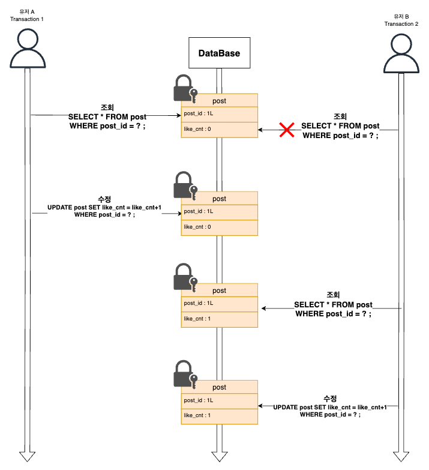

Pessimistic Lock 적용 시나리오

```java
public interface PostQueryRepository extends JpaRepository<PostEntity,Long> {
    Optional<PostEntity> findByPostId(Long postId);
    /**
     * 선점 잠금
     */
    @Lock(LockModeType.PESSIMISTIC_WRITE)
    @Query(value = "SELECT p FROM PostEntity AS p WHERE p.postId=:postId")
    PostEntity findByPostIdWithPessimisticLock(@Param(value = "postId")Long postId);
}
```

-   **PostQueryRepository** (게시물의 조회만을 담당하는 레포지토리)에서 **PESSIMISTIC\_WRITE** 즉, **Exclusive** **Lock**를 이용하여 조회 쿼리에 **Lock**를 걸어줍니다.

```java
@Component
@RequiredArgsConstructor
public class PostUtilImpl implements PostUtil{
    private final PostQueryRepository postQueryRepository;
    private final PostCommandRepository postCommandRepository;
		
		...
		
	/**
	* Lock 건 상태로 조회하는 쿼리 호출 메소드 추가.
	**/
    
    @Override
    public PostEntity findByPostByPostIdWithPessimisticLock(Long postId) {
        return postQueryRepository.findByPostIdWithPessimisticLock(postId);
    }
}
```

-   게시판의 객체 조회,저장,삭제,업데이트 등을 담당하는 **PostUtil class**에 위에서 **Lock**를 추가한 게시판 id를 토대로 게시판 엔티티를 조회하는 메소드를 추가해줍니다.

```java
@Component
@RequiredArgsConstructor
@Slf4j
public class LikeUtilImpl implements LikeUtil {
    private final PostCommandRepository postCommandRepository;
    private final LikeQueryRepository likeQueryRepository;
    private final LikeCommandRepository likeCommandRepository;
    private final PostQueryRepository postQueryRepository;

    ...
    
    @Override
    public void increaseLikeCnt(PostEntity post) {
        post.increase();
    }

		...
		
}
```

-   좋아요의 객체 조회,저장,삭제,업데이트 등을 담당하는 **LikeUtil class에** **Post** 엔티티 내부 편의 메소드를 사용하여 좋아요 개수를 증가시킵니다.

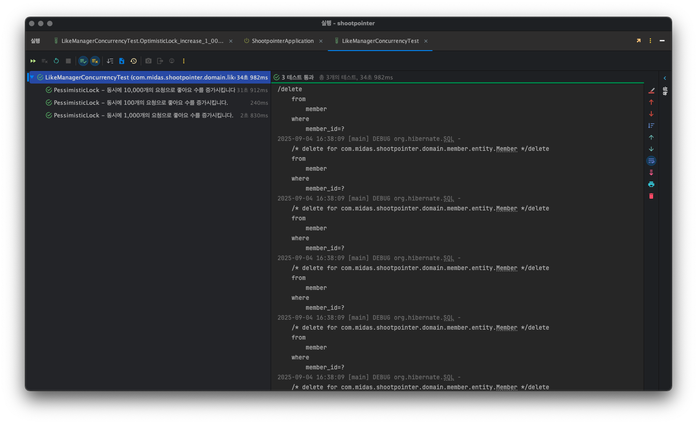

테스트 코드 실행

|  | 100명 | 1,000명 | 10,000명 |
| --- | --- | --- | --- |
| Pessimistic Lock | 240 ms | 2,830 ms | 3,1912 ms |

* * *

### **Optimistic Lock - 낙관적 락 (비선점형 락)**

비선점형 잠금은 명시적으로 잠금을 사용하지 않습니다. 대신 데이터를 조회하는 시점의 **version** 값과 데이터를 수정하려는 시점의 **version**값이 같은지 비교하여 동시성 문제를 해결합니다. 따라서, 데이터베이스에서 제공되는 락 기능을 사용하지 않고 **application** 수준에서 **version**을 통하여 동시성을 제어합니다. 자원에 대해서 미리 **Lock**를 걸지 않고 충돌이 발생했을 때 **Lock**을 걸어 처리합니다.

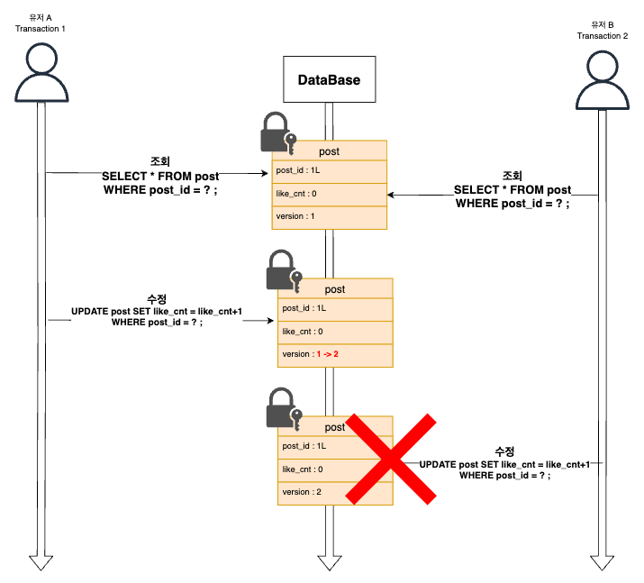

Optimistic Lock 적용 시나리오

```java
@Table(name = "post")
@AllArgsConstructor
@RequiredArgsConstructor
@Entity
@Builder
@Getter
@SQLRestriction("is_deleted = false")
public class PostEntity extends BaseEntity {

	...엔티티 로직
    
    @Version
    private Long version;

	...
}
```

-   Post 엔티티의 Long값으로 **version** 컬럼을 추가합니다.

```java
    /**
     * 비선점 잠금
     */
    @Modifying(clearAutomatically = true, flushAutomatically = true)
    @Query(value = "UPDATE post SET version = version + 1, like_cnt = like_cnt+1 WHERE post_id=:postId AND version=:version",nativeQuery = true)
    int updatedCount(@Param(value = "postId")Long postId, @Param(value = "version")Long version);
```

-   **Native Query**형식으로 게시물의 id값 뿐만 아니라 **version**에 대해서도 일치하는지 조건을 추가합니다.
-   **clearAutomatically = true** : 쿼리 실행 후 영속성 컨텍스트에서 값을 지워줍니다.
-   **flushAutomatically = true** : 쿼리 실행 전 쓰기 지연 저장소의 쿼리들을 flush 해줍니다.

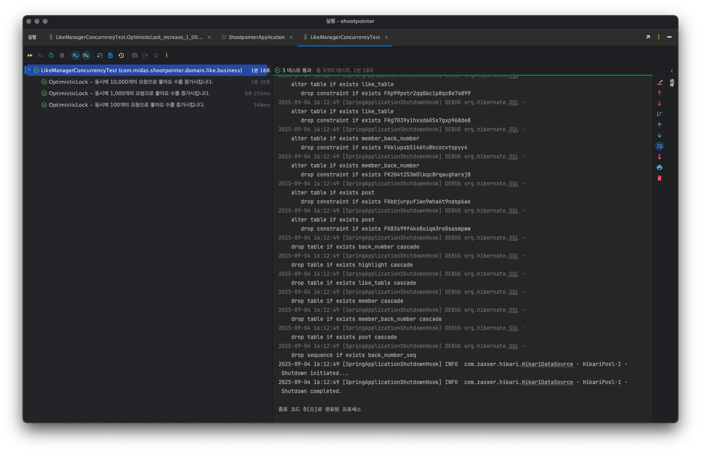

테스트 코드 실행

|  | 100명 | 1,000명 | 10,000명 |
| --- | --- | --- | --- |
| Pessimistic Lock | 240 ms | 2,830 ms | 31,912 ms |

#### **🚨Optimistic Lock 적용 과정 중 트러블 슈팅**

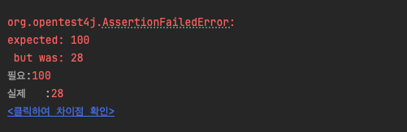

100개 요청 테스트 코드 실패

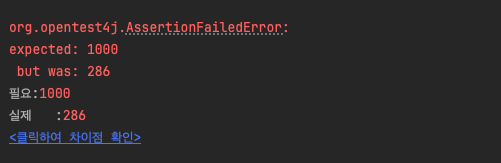

1000개 요청 테스트 코드 실패

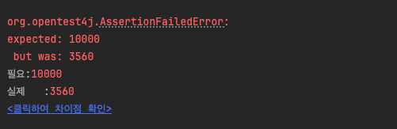

10000개 요청 테스트 코드 실패

**version**을 비교하는 쿼리를 정상적으로 날리고 있음에도 계속해서 동시성 제어를 실패하는 상황이 발생했습니다. 테스트 코드에 오류 로그를 추가하여 확인한 결과 락이 정상적으로 작동은 하지만 계속해서 같은 version만을 조회하는 것을 알 수 있었습니다.

아래는 전체적인 게시물과 좋아요 서비스가 작동하는 아키텍처 입니다.

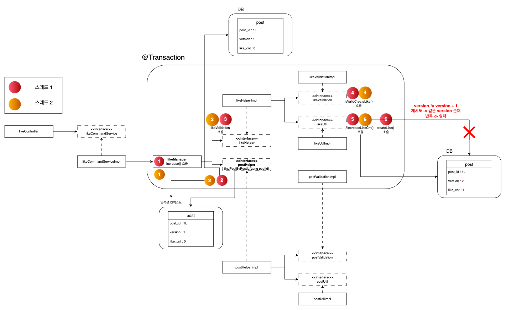

좋아요 아키텍처

먼저 **스레드 1**이 조회를 진행하면서 조회한 게시물을 영속성 컨텍스트의 1차 캐시에 넣게됩니다. 스레드 2가 같은 게시물을 조회할 때는 1차 캐시에 존재하는 게시물을 조회하게 됩니다. 이때, 스레드 1이 수정을 진행하면서 version을 +1 증가 시켜 **version =2** 가 되고 트랜잭션을 종료합니다. 스레드 2가 수정을 진행하려고 할 때 이미 **version = 2**가 존재하므로 재시도를 진행하고 계속해서 1차 캐시에 있는 값을 읽어오므로 결국 테스트는 실패하게 됩니다.

따라서, 이를 해결하기 위해서는 영속성 컨텍스트에서 게시물을 조회하는 것이 아니라 DB에 직접 쿼리를 통하여 조회를 진행해야 합니다. **clearAutomatically = true** 속성을 추가하여 스레드1의 수정이 진행되면 영속성 컨텍스트에 있는 기존 값을 삭제하도록 진행합니다.

**수정 전 코드**

```java
    @Modifying
    @Query(value = "UPDATE post SET version = version + 1, like_cnt = like_cnt+1 WHERE post_id=:postId AND version=:version",nativeQuery = true)
    int updatedCount(@Param(value = "postId")Long postId, @Param(value = "version")Long version);
```

**수정 후 코드**

```java
    /**
     * 비선점 잠금
     */
    @Modifying(clearAutomatically = true, flushAutomatically = true)
    @Query(value = "UPDATE post SET version = version + 1, like_cnt = like_cnt+1 WHERE post_id=:postId AND version=:version",nativeQuery = true)
    int updatedCount(@Param(value = "postId")Long postId, @Param(value = "version")Long version);
```

* * *

### **Distributed Lock -  분산락**

분산락은 여러 프로세스가 동시에 같은 자원에 접근하지 못하도록 막는 방법입니다. 분산은 앞의 DB락과 다르게 여러 프로세스 간에 잠금 처리를 할 수 있다는 차이점이 존재합니다. 락을 획득한 프로세스 혹은 스레드만이 공유 자원에 접근할 수 있도록 제어합니다.

가장 큰 장점으로 **분산 서버 환경**에서도 프로세스들간의 동시성을 제어할 수 있다는 점입니다.

분산 락을 구현하는 방법은 아래와 같이 다양합니다.

-   **Zookeeper**
-   **MySQL**
-   **Redis**

이 중 Redis를 선택하여 구현했습니다. 이유는 아래와 같습니다.

1.  현재 **Shoot-Pointer**는 인증/인가 과정에서 **Refresh Token**의 관리를 위하여 이미 **Redis**를 사용중이고, **Redis**의 기본 설정과 **config class**의 구현을 완료한 상태입니다.
2.  **Shoot-Pointer**는 MySQL이 아닌 **PostgreSQL**를 DB로 사용합니다.

#### **Redisson 라이브러리 선정 이유**

1.  **Redis**에서 일반적으로 많이 사용하는 **Lettuce**의 락은 **setnx** 메서드를 이용하여 사용자가 커스텀하여 스핀락 형태로 구현하게 됩니다. 따라서, 사용자가 직접 재시도, timeout를 구현해야 하는 점이 존재합니다.
2.  **Reddison**은 **Lock** **interface**를 지원하여 보다 쉽게 구현이 가능하다는 장점을 가집니다.

* * *

분산락을 구현하는 과정에서 마켓컬리의 기술 블로그의 방법을 참고하여 코드를 구현했습니다. 때문에 레디스 설정, 애노테이션 지정등은 코드가 거의 동일하므로 해당 게시글에는 따로 코드를 게시하지 않겠습니다.

[풀필먼트 입고 서비스팀에서 분산락을 사용하는 방법 - Spring Redisson

어노테이션 기반으로 분산락을 사용하는 방법에 대해 소개합니다.

helloworld.kurly.com](https://helloworld.kurly.com/blog/distributed-redisson-lock/)

```java
@Component
@RequiredArgsConstructor
public class LikeManager {
    private final LikeHelper likeHelper;
    private final PostHelper postHelper;

    @Transactional
    @DistributedLock(key = "#postId")
    public Long increase(Long postId, Member member){
        /**
         * 1. 게시물이 존재하는 지 여부
         */
        PostEntity postEntity=postHelper.findPostByPostId(postId);

        /**
         * 2. 좋아요 유효성 검증 - 사용자가 이전에 좋아요를 누르지 않았는지 확인.
         */
        likeHelper.isValidCreateLike(member.getMemberId(),postId);

        /**
         * 3. 좋아요 생성 및 증가.
         */
        likeHelper.increaseLikeCnt(postEntity);
        LikeEntity savedLike=likeHelper.createLike(postEntity,member);

        return savedLike.getLikeId();
    }

}
```

-   좋아요의 비즈니스 로직을 작성하는 **LikeManager** 클래스에서 좋아요의 개수를 증가시키는 메소드 i**ncrease()** 전체를 트랜잭션으로 처리하고 **Lock**를 걸어줍니다.
-   Redis의 키값으로 게시물의 PK값인 post\_id를 설정합니다.

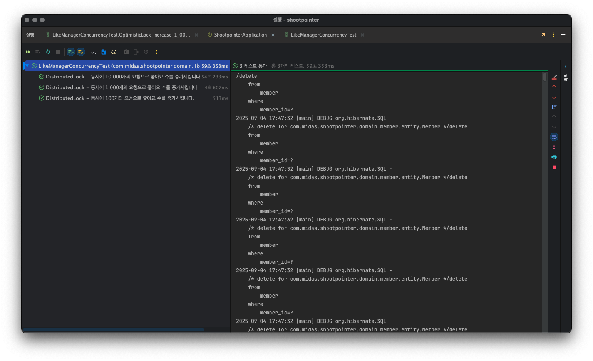

|  | 100명 | 1,000명 | 10,000명 |
| --- | --- | --- | --- |
| Disributed Lock | 513 ms | 4,607 ms | 54,233 ms |

* * *

### **최종 결과 및 동시성 제어 방법 선정**

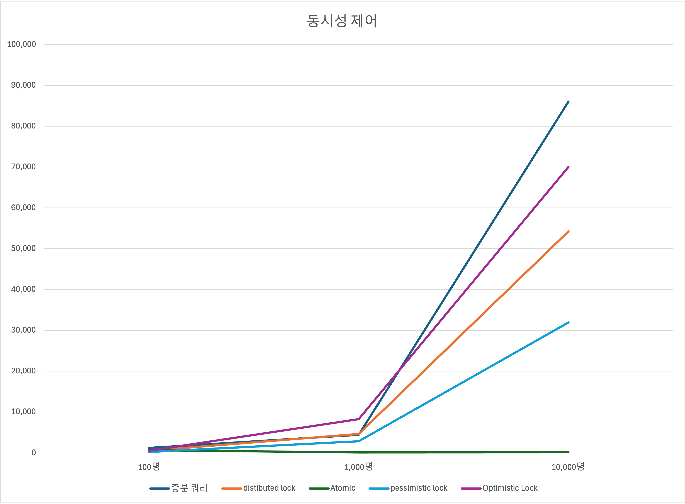

성능 측정 그래프

|  | 100명 | 1,000명 | 10,000명 |
| --- | --- | --- | --- |
| 증분 쿼리 | 1,222ms | 4,400ms | 86000ms |
| distibuted lock | 513ms | 4607ms | 54233ms |
| Atomic | 626ms | 94ms | 163ms |
| pessimistic lock | 240ms | 2830ms | 31912ms |
| Optimistic Lock | 548ms | 8255ms | 70000ms |

|  | 성능 | 다중 서버 사용 가능 유무 | DB 샤딩 시 사용 가능 유무 |
| --- | --- | --- | --- |
| 증분 쿼리 | 5 | ✅ | ✅ |
| distibuted lock | 3 | ✅ | ✅ |
| Atomic | 1 | ❌ | ❌ |
| pessimistic lock | 2 | ✅ | ✅ |
| Optimistic Lock | 4 | ✅ | ✅ |

우선은 테스트 코드 결과 가장 성능상 이점이 있는 Atomic 변수같은 경우는 다중 서버에서 사용이 불가능하므로 제외하도록 하겠습니다.

그 다음으로 성능이 뛰어난 **Pessimistic Lock**를 적용하여 동시성 제어를 해결했습니다. 하지만, 실제 부하 테스트 도구를 이용하여 실제 HTTP 통신에서의 DB 락은 데드락등 다양한 문제를 야기할 수 있어 **Pessimistic Lock**를 사용하지만 **Distributed Lock**도 따로 코드를 관리하도록 결정했습니다.
