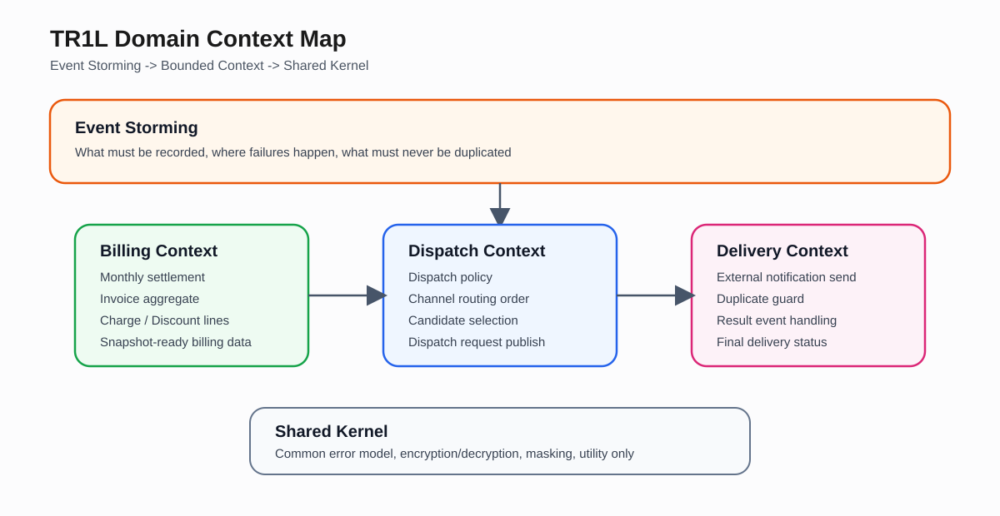
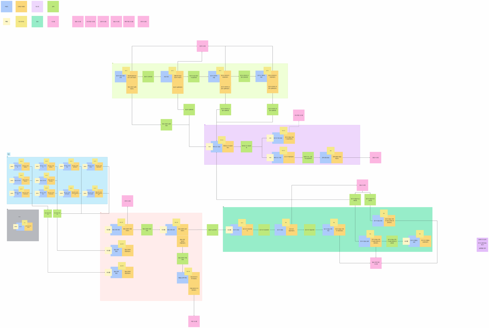
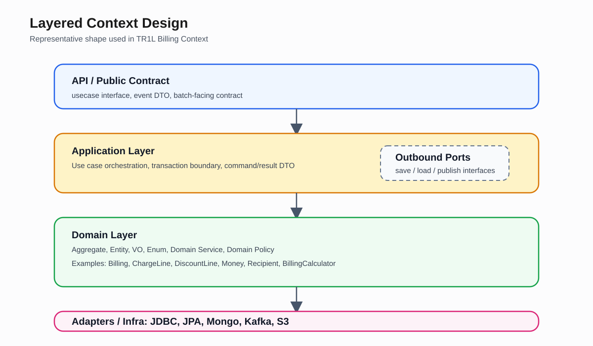
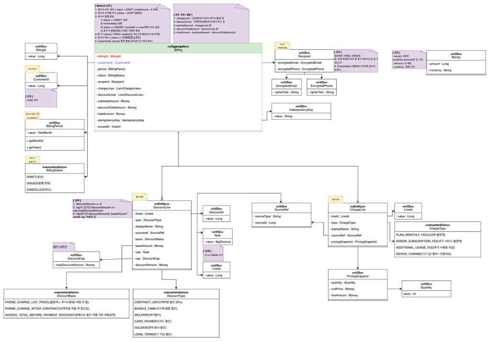
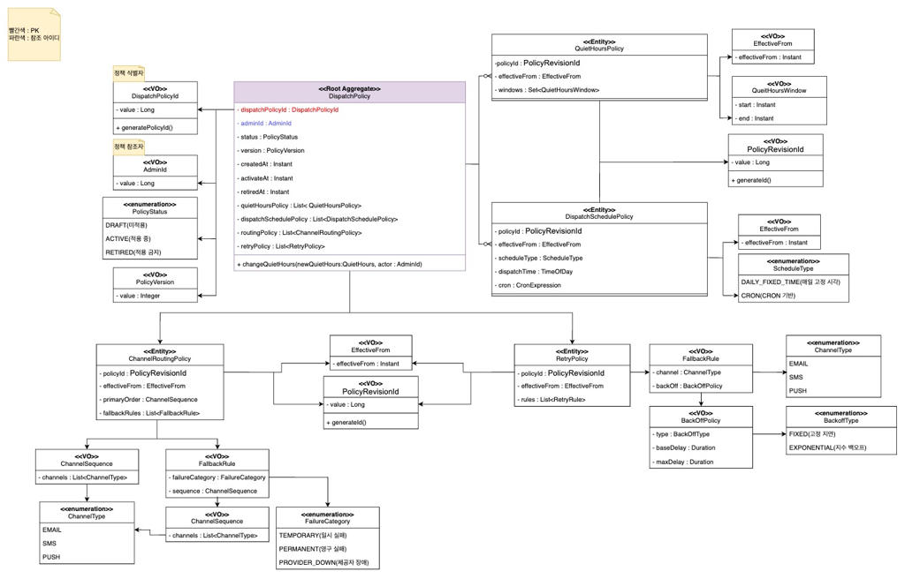

팀원들 모두 나를 포함해 도메인 모델링에 대한 이해도가 높지 않았기 때문에, 나는 공통 이해를 맞추기 위한 두 가지 방법을 제안했다.

첫째, Event Storming에 들어가기 전에 팀원 전원이 관련 강의를 먼저 수강하도록 했다. 특히 Microservice 설계(with EventStorming, DDD) 강의(진짜 도움 많이 됨 ㅜㅜ)는 개념을 처음 접하는 팀원들도 흐름을 잡는 데 큰 도움이 되었고, 이후 논의에서도 공통 언어를 맞추는 데 효과적이었다.

[Microservice 설계(with EventStorming,DDD)| han jeong heon - 인프런 강의

현재 평점 4.6점 수강생 1,037명인 강의를 만나보세요. 마이크로서비스 설계를 위한 도메인 주도 설계(Domain Driven Design)를 쉽게 설명하고, 실제로 활용하기 위한 구체적인 실천 방법을 소개합니다.

www.inflearn.com](https://www.inflearn.com/course/%EB%8F%84%EB%A9%94%EC%9D%B8%EC%A3%BC%EB%8F%84-%EC%84%A4%EA%B3%84-%EB%A7%88%EC%9D%B4%ED%81%AC%EB%A1%9C%EC%84%9C%EB%B9%84%EC%8A%A4/dashboard?cid=328422)

두 번째로, 실제 도메인 모델링 단계에서는 한 가지 자료만 보는 대신, DDD 관련 책과 여러 참고 자료를 함께 보며 이해의 기준을 맞추려고 했다. 도메인 주도 개발 시작하기 같은 자료를 참고했고, 팀 단톡방에서도 관련 레퍼런스를 계속 공유하면서 서로의 이해 포인트를 맞춰 나갔다.

[\[전자책\] 도메인 주도 개발 시작하기 | 최범균 | 한빛미디어 - 예스24

가장 쉽게 배우는 도메인 주도 설계 입문서!이 책은 도메인 주도 설계(DDD)를 처음 배우는 개발자를 위한 책이다. 실제 업무에 DDD를 적용할 수 있도록 기본적인 DDD의 핵심 개념을 익히고 구현을

www.yes24.com](https://www.yes24.com/product/goods/108791897)

추가로 실제 코드 구현 단계에서는 팀원마다 구현 방식이 달라지지 않도록, 도메인 구현에 대한 공통 가이드라인을 직접 작성해 팀원들과 공유했다.

[

TR1L-Project Structure-270326-203205.pdf

0.87MB

](./06-tr1l-project-structure-270326-203205.pdf)

## **1\. 개요**

해당 포스팅에서는 **TR1L**의 인프라 구조나 런타임 분리보다는 우리가 이 프로젝트의 도메인 아키텍처를 어떤 기준으로 설계했는지에 집중해서 정리하고자 한다. 특히, 이번 포스팅에서는 **이벤트 스토밍**으로 어떤 경계를 먼저 발견했고, 그 결과 DDD의 **Bounded Context**와 **Domain Model**로 어떻게 옮겼는지를 중심으로 기록하려고 한다.

TR1L은 월 청구서 정산, 청구서 생성, 발송 정책, 실제 발송, 결과 반영까지 이어지는 흐름을 가진다. 기술 팀장으로서 아키텍처 설계를 담당하였고, 처음 이 흐름을 바라봤을 때 바로 **ERD 설계**나 **API 설계**부터 시작하면 안되겠다고 생각했다. 이 시스템에서 중요한 것은 CRUD 화면을 빠르게 뽑는것보다는

-   무엇이 우리 시스템의 핵심 상태인가
-   어떤 규칙이 실제 도메인 정책인가
-   어디서 실패가 발생하는가
-   무엇이 절대로 중복되어서는 안되는가

를 먼저 정리하는 일이었다.

그래서 **TR1L**의 설계는 **'데이터베이스 중심 설계'**보다는 **'이벤트 흐름과 정책'**을 먼저 정리하고, 그 위에 **도메인 모델**을 세우는 방식'으로 시작했다. 



TR1L Context Map

* * *

## **2\. 이벤트 스토밍으로 시작한 이유**

도메인 아키텍처를 설계할 때 가장 먼저 고민했던 것은., 이 시스템을 어떤 기준으로 나누어야 하는 것이였다. 정산과 발송이 같이 있는 시스템을 설계할 때 흔히 ERD나 배치 플로우 차트부터 그리게 되는데, TR1L에서는 그렇게 접근하면 오히려 중요한 경계가 잘 안보인다고 판단했다.

예를 들어 아래와 같은 질문들은 테이블만 보고는 잘 정리되지 않는다.

-   정산 완료는 발송 대상 선별의 전제 조건인가?
-   발송 요청과 실제 발송 성공은 같은 상태인가?
-   실패가 발생하면 어디까지 되돌아 가야하는가?
-   재실해은 어느 단위에서 끊어야 운영이 쉬운가?

이러한 질문들은 결국 '데이터가 무엇인가?'보다는 '도메인에서 어떤 이벤트가 발생하는가?'의 초점이 맞추어져 있다. 그래서 먼저 **Event Storming**을 통하여 전체 흐름을 펼쳐 보면서,

-   반드시 기록되어야 하는 상태
-   외부 의존으로 인해 실패가 생기는 지점
-   중복되면 안되는 행위

를 먼저 고정하려고 했다.

예를 들어 월 정산은 반드시 **어떤 사이클에서 실행되었는지**가 확인되어야 했고, **발송 요청**은 **실제 발송 완료**와 분리되어야 햇으며, **실제 발송은 절대 중복이 발생**해서는 안되었다. 또한 실패가 발생하더라도 **특정 단계부터 다시 이어서 실행**할 수 있어야 했다.

즉, **Event Storming**은 단순하게 보기 좋은 협업 산출물이 아니라 **어디를 하나의 도메인으로 볼 것인가를 결정**하는 출발점이였다.



TR1L Event Storming

이 과정에서 모든 개념을 도메인 모델로 뽑아내려고 하지 않았다. 

예를 들어 **'Error'**는 모니터링 시스템에서 쿼리 기반으로 다루는 성격이 강했기 때문에 핵심 도메인 모델에서 제외했고, **'Admin'**도 요구사항상 별도의 회원가입/로그인 도메인이 핵심 비즈니스가 아니었기 때문에 **Event Storming** 상에서는 표시는 하되 중심 도메인으로 가져가지는 않았다.

* * *

## **3\. Billing, Dispatch, Delivery로 Bounded Context를 나눈 이유**

**Event Storming** 이후 다음으로 고민했던 점은, 이 흐름을 어떤 **Bounded Context**로 나누어야 하는가였다. 이때 기준으로 잡은 것은 기능 목록이 아니라 Ubiquitous Language가 어디서 바뀌는가였다.

처음에는 모두 같은 '청구서 발송' 흐름처럼 보이지만, 실제로 정산과 발송 정책과 실제 발송은 사용하는 언어도 다르고, 상태도 다르며 실패 모델도 다르다.

따라서, TR1L에서는 크게 아래의 3개의 축으로 서로 다른 언어와 규칙을 가진다고 판단했다.

-   **Billing** - 월 정산, 청구 계산, 청구 스냅샷 생성 
-   **Dispatch** - 발송 정책, 채널 우선순위, 슬롯 선별, 후보 발행
-   **Delivery** - 외부 발송 실행, 결과 반영, 중복 방지

예를 들어 **Billing**에서는 요금제, 할인, 청구기간, 청구라인, 정산결과가 핵심 언어다. 반면 **Dispatch**에서는 정책, 채널 순서, 활성 정책, 시도 횟수, 발송 후보가 중요하다. **Delivery**로 넘어가면 요청 이벤트, 발송 성공/실패, 중복 처리, 결과 이벤트가 핵심이 된다.

#### 고민) **Delivery**를 정말 독립된 컨텍스트로 바로 떼어낼 것인가, 아니면 **Dispatch**와 더 가깝게 둘 것인가?

문서상에서는 **Billing BC**, **Dispatch BC**, **Delivery BC**를 구분해 설명하고 있지만, 현재 저장소 구현을 보면 contexts:dispatch 안에 com.tr1l.dispatch와 com.tr1l.delivery 패키지가 함께 있다. 이건 내가 당시 어떤 판단을 했는지를 잘 보여준다.

즉, **Delivery**는 운영상으로는 별도 런타임이 필요할 정도로 성격이 다르지만, 도메인적으로는 **Dispatch**에서 만든 정책과 요청을 바로 이어받아 실행하는 영역이기 때문에, 현재 코드에서는 가까운 도메인 클러스터로 두고 런타임만 분리하였다.

이 지점에서 내가 결국 답하려고 했던 질문은 이것이었다. "이 경계는 지금 당장 완전히 독립된 서비스여야 하는가, 아니면 도메인적으로 강하게 연결된 하나의 큰 컨텍스트 안에서 관리하는 편이 더 자연스러운가?" TR1L에서는 현재 구현 기준으로 후자에 더 가까운 선택을 하였다.

* * *

## **4\. 컨텍스트 내부 구조를 나눈 이유**

**Bounded Context**를 정한 뒤에는, 각 컨텍스트 내부를 다시 어떤 구조로 설계할지를 고민해야 했다. 이때 가장 중요하게 본 것은 도메인 규칙이 인프라 코드에 섞이지 않게 하는 것이었다. 그래서 문서와 코드에서 공통으로 지향한 구조는 아래와 같다.

> **domain/:**  
> Aggregate, Entity, VO, Enum, Domain Policy, Domain Service  
>   
> **application/:**  
> 유스케이스 조합, 트랜잭션 경계, 입력/출력 DTO  
>   
> **application/port/out/:**  
> 저장, 조회, 발행, 외부 연동에 대한 인터페이스  
>   
> **adapter/out/ 또는 infra/:**  
> JPA, JDBC, Mongo, Kafka, S3 등 기술 구현  
>   
> **api/:  
> **외부에 공개할 계약

```text
contexts/billing/
 ├─ domain/
 │  ├─ model/aggregate
 │  ├─ model/entity
 │  ├─ model/vo
 │  ├─ policy
 │  └─ service
 ├─ application/
 │  ├─ service
 │  ├─ command
 │  ├─ model
 │  └─ port/out
 ├─ adapter/out/
 │  ├─ jdbc
 │  ├─ persistence
 │  └─ message
 └─ api/
    ├─ event
    └─ usecase
```



TR1L Layered Context

위의 사진과 같이 프로젝트 구조의 Layer를 아래와 같은 기준으로 구분하고자 의도하였다.

-   도메인 객체는 JPA나 Kafka를 몰라야 한다.
-   유스케이스는 도메인 규칙을 조합하되 저장 방식에 직접 의존하지 않아야 한다.
-   인프라는 도메인 규칙을 담지 않고, 포트 구현체로만 남아야 한다.

* * *

## **5\. 도메인 모델의 기준을 어떻게 잡았는가**



TR1L Billing Domain Model



TR1L Dispatch Domain Model

컨텍스트 구조를 잡고 나서 다음으로 고민했던 것은, 실제 도메인 모델을 어떤 기준으로 작성할 것인가였다. 특히 원시값과 DTO 중심으로 빠르게 갈 것인지, 아니면 값과 행위를 분리해서 더 명확하게 모델링할 것인지를 많이 고민했다.

우리는 아래와 같은 기준을 잡았다.

-   VO는 record
-   Entity / Aggregate는 class
-   Aggregate는 불필요한 setter를 두지 않음
-   상태 변경은 메서드로만 수행

이 기준을 둔 이유는, VO는 값 그 자체가 중요하고 불변성이 중요하지만, Aggregate는 상태 전이를 가지고 있고 특정 규칙 아래에서만 변경되어야 하기 때문이다.

대표적인 예가 **Billing**의 **Money**다.

```java
public record Money(long amount) {
    public Money {
        if (amount < 0) {
            throw new BillingDomainException(BillingErrorCode.INVALID_MONEY);
        }
    }

    public Money plus(Money o) {
        return new Money(this.amount + o.amount);
    }

    public Money minusNonNegative(Money o) {
        long v = this.amount - o.amount;
        return new Money(Math.max(0, v));
    }
}
```

여기서 중요한 것은 Money가 단순 숫자 wrapper가 아니라는 점이다. 도메인 규칙상 **음수가 될 수 없고, 할인 계산 시에도 음수 방지 규칙**을 같이 들고 다닌다. 즉, 계산 규칙의 일부가 값 객체 안으로 들어가 있다.

**BillingPeriod**도 같은 맥락이다.

```java
public record BillingPeriod(YearMonth value) {
    public BillingPeriod {
        if (value == null) {
            throw new BillingDomainException(BillingErrorCode.INVALID_BILLING_PERIOD);
        }
    }
}
```

이런 값 객체를 둔 이유는, application 서비스에서 YearMonth, long, String 같은 원시값을 계속 흘려보내기 시작하면 도메인 규칙이 흩어지기 쉽다고 봤기 때문이다. 다음으로 중요했던 것은 **Aggregate**였다. **Billing aggregate**는 TR1L에서 도메인 모델링 의도를 가장 잘 보여주는 객체 중 하나다.

```java
public final class Billing implements Serializable {

    private final BillingId billingId;
    private final CustomerId customerId;
    private final BillingPeriod period;
    private BillingStatus status;
    private Recipient recipient;
    private final IdempotencyKey idempotencyKey;

    private final List<ChargeLine> chargeLines = new ArrayList<>();
    private final List<DiscountLine> discountLines = new ArrayList<>();

    public void addChargeLine(ChargeLine line) {
        requireDraft();
        this.chargeLines.add(line);
    }

    public void addDiscountLine(DiscountLine line) {
        requireDraft();
        this.discountLines.add(line);
    }

    public void issue(Instant issuedAt) {
        requireDraft();
        if (!recipient.hasAnyContact()) {
            throw new BillingDomainException(
                    BillingErrorCode.MISSING_RECIPIENT_CONTACT
            );
        }
        this.status = BillingStatus.ISSUED;
        this.issuedAt = issuedAt;
    }
}
```

이 객체에서 중요했던 것은 청구서를 단순 데이터 집합으로 두지 않는 것이었다.

-   **DRAFT** 상태에서만 라인을 추가할 수 있고
-   **recipient**가 없으면 **issue**할 수 없고
-   **issue** 시점에 상태가 바뀌며 이후에는 불변에 가까운 상태가 되어야 한다

즉, **Billing**은 "청구 데이터"가 아니라 청구서의 상태 전이를 관리하는 **Aggregate**로 두고 싶었다. 이렇게 해야 청구 계산과 발행 규칙이 서비스 레이어의 if 문으로 흩어지지 않는다고 봤다.

* * *

## **6\. DispatchPolicy를 왜 설정값이 아니라 도메인 객체로 보았는가**

**Dispatch** 쪽에서는 **DispatchPolicy aggregate**가 중심이었다. 여기서 가장 많이 고민했던 것은, 발송 정책을 단순 설정 테이블 row로 볼 것인가, 아니면 상태와 버전이 있는 도메인 객체로 볼 것인가였다. 처음에는 정책도 그냥 JSON 설정처럼 다룰 수 있다. 하지만 TR1L에서는 발송 정책이 단순 환경설정이 아니라,

-   누가 만들었는지
-   현재 활성 상태인지
-   어떤 채널 순서를 가지는지
-   정책이 변경되었는지

가 중요했다. 그래서 **DispatchPolicy**는 최소한의 상태 전이 규칙을 자기 안에 가지도록 두었다.

```java
public class DispatchPolicy {

    private DispatchPolicyId dispatchPolicyId;
    private AdminId adminId;
    private PolicyStatus status;
    private PolicyVersion version;
    private ChannelRoutingPolicy routingPolicy;

    public static DispatchPolicy create(
            AdminId adminId,
            ChannelRoutingPolicy routingPolicy
    ) {
        DispatchPolicy policy = new DispatchPolicy();
        policy.adminId = adminId;
        policy.routingPolicy = routingPolicy;
        policy.version = PolicyVersion.of(1);
        policy.status = PolicyStatus.DRAFT;
        policy.createdAt = Instant.now();
        return policy;
    }

    public void activate() {
        if (this.status != PolicyStatus.DRAFT) {
            throw new DispatchDomainException(
                    DispatchErrorCode.POLICY_CANNOT_ACTIVATE
            );
        }
        this.status = PolicyStatus.ACTIVE;
        this.activatedAt = Instant.now();
    }
}
```

-   생성 시 DRAFT
-   활성화 시 ACTIVE
-   폐기 시 RETIRED
-   라우팅 정책 변경 시 version 증가

이런 규칙은 서비스 레이어에서도 처리할 수 있었지만, 그렇게 하면 정책 객체는 의미 없는 DTO처럼 남아 버린다. 그래서 **DispatchPolicy**는 최소한의 상태 전이 규칙을 자기 안에서 가지도록 뒀다. 그리고 이와 연결되는 VO가 **ChannelRoutingPolicy**다.

```java
public final class ChannelRoutingPolicy {

    private final ChannelSequence primaryOrder;
    private final int maxAttemptCount;

    public ChannelRoutingPolicy(ChannelSequence primaryOrder) {
        if (primaryOrder == null) {
            throw new DispatchDomainException(DispatchErrorCode.CHANNEL_TYPE_NULL);
        }
        this.primaryOrder = primaryOrder;
        this.maxAttemptCount = primaryOrder.size();
    }
}
```

즉, Dispatch에서는 "정책"을 테이블 row로만 보지 않고, 발송 순서와 재시도 한도를 함께 들고 다니는 값 객체 + Aggregate 조합으로 보려고 했다.

* * *

## 7\. 왜 Shared를 공통 커널로 제한했는가?

DDD 구조를 잡을 때 가장 쉽게 무너지는 지점 중 하나는 **shared**가 점점 커지는 것이다. 그래서 **TR1L**에서는 **shared**를 "편해서 이것도 저것도 넣는 곳"으로 만들기보다, 정말 공통 커널로만 쓰는 방향을 의도했다.

-   공통 에러 모델
-   암복호화 유틸
-   마스킹 유틸
-   SQL 리소스 리더

즉, 특정 BC의 정책이나 계산 규칙은 **shared**로 올리지 않았다. 이렇게 한 이유는, shared가 커질수록 **Bounded Context** 경계가 흐려지고 결국 다시 큰 공통 모듈 하나에 의존하는 구조로 돌아가기 쉽다고 봤기 때문이다.
