## **1\. 개요**

거의 2달만에 블로그 포스팅을 다시 시작했습니다. 그동안 다양한 기업에서 면접과 코딩 테스트를 진행하며 블로그를 관리할 시간이 상대적으로 부족하여 Holliverse 테스트 관련 포스팅도 중간에 멈췄습니다.

결과적으로는 대기업 계열사에서 최종 탈락으로 이번 상반기를 마무리했습니다. 다소 아쉬운 결과이기는 하지만 상반기동안 나의 부족한 점을 다시 깨닫고, 처음부터 천천히 진행하고자 합니다.

오늘은 이전에 정리해두었던 포스팅입니다. 'TR1L' 프로젝트에서 가장 중요한 청구서 정산을 진행하는 Job에 대해서 어떻게 테스트를 진행해볼까에서 출발하여 이를 **LLM**를 활용한 테스트로 진행했습니다.

### 왜 LLM를 이용한 테스트인가?

> 이전까지 프로젝트를 진행하면서 항상 어려웠던 부분은 '테스트 코드 작성 및 구현'이였습니다. 항상 프로젝트 초기에는 라인, 브랜치 커버리지 80%를 잡고 커버리지 값보다 낮으면 CI에서 PR병합을 강제로 못하게 하여 팀원들과 으쌰으쌰하며 억지로라도 테스트 코드를 작성하였습니다.  
> 하지만, 프로젝트 기간이 다가올수록 기능 구현에만 몰두하여, 테스트 코드 작성은 흐지부지 되기 일쑤였다. 또한, 사람이 작성하다보니 빠지는 테스트 조건이 다양하였고, 이러한 조건을 찾고자 하는 시간의 소모가 상당했습니다.  
>   
> 이러한 계기로 'AI의 도움을 받아서 테스트 코드 및 시나리오를 구성하면 어떨까'에서 출발했습니다. 다만, AI를 활용하면서 아래와 같은 고민이 존재했습니다.  
> **1\. AI를 전적으로 믿고 테스트를 검증할 수 있는가?**  
> **2\. 단순 LLM를 통하여 우리의 코드 전문을 그때마다 이해시킬 수 있는가?**  
> **3\. 팀원 모두가 같은 기준으로 LLM를 활용하여 테스트 시나리오와 테스트 코드를 작성할 수 있는가?**  
>   
> 대용량 청구 배치에서는 이러한 질문들이 중요했습니다. 배치가 실패했을 때 다시 실행해도 중복 청구나 데이터 누락 없이 같은 결과로 수렴해야 합니다. 이걸 검증하려면 테스트 코드만 있는 것이 아니라, 테스트가 확인하는 조건 자체가 명확해야 합니다.

이번 포스트는 TR1L에서 Job의 재실행 검증 과정에서 LLM를 어떻게 활용하여 위의 고민들을 해결했고, 어떤 구조로 사람의 검토와 자동 검증을 붙여 **LLM-assisted Test**를 구현했는지 작성하겠습니다.

* * *

## **2\. 배경**

TR1L의 Job1(통신사 청구서 정산 배치)는 월 단위 배치입니다. 단순하게 표현하면 아래와 같은 흐름입니다.

> 정산 입력 생성  
> \-> 사용자별 work 생성  
> \-> work 선점  
> \-> 청구 계산  
> \-> Mongo 청구서 snapshot 저장  
> \-> work 상태 완료

실제 구현에서는 아래와 같은 테이블과 역할로 사용했습니다.

| 테이블명 | 역할 |
| --- | --- |
| billing_targets | 이번 월 청구 계산에 필요한 입력 데이터 |
| billing_work | 사용자별 처리 상태와 재시도 상태 |
| billing_snapshot | 계산이 완료된 청구 결과 문서 |
| billing_cycle | 월 단위 실행 상태 |

예를 들어 Step3에서 이러한 상황이 발생할 수 있습니다.

> Mongo snapshot 저장 성공  
> \-> billing\_work 상태 업데이트 직전 worker 장애  
> \-> snapshot은 존재하지만 work는 PROCESSING으로 남음

또 다른 상황도 존재합니다.

> billing\_work 선점 성공  
> \-> worker 장애  
> \-> PROCESSING 상태로 남음  
> \-> lease 만료 후 재실행에서 회수되어야 함

이러한 배치 프로그램에서 중요한 것은 '장애를 피할 수 없다'라는 점입니다. 현실적으로 **외부 I/O**가 있으며, **RDS**와 **Document DB**를 같이 사용하고, worker 또한 **병렬 처리**로 동작하므로 중간 장애는 언제든지 발생가능합니다.

따라서, 목표는 이렇게 잡았습니다.

> **같은 입력 기준으로 다시 실행했을 때 데이터 중복 없이 같은 최종 상태로 수렴해야 한다.**

* * *

### **1) Invariant: 불변 조건 정하기**

**Invariant**는 '불변'이라는 뜻의 단어입니다. 우리의 목표를 검증하기 위해서는 우선 "정상이라면 반드시 지켜져야 하는 조건"을 정해야 하고, 이러한 조건을 **invariant 조건**이라고 했습니다.

예를 들어 아래와 같은 조건을 의미합니다.

> \- 같은 월과 같은 사용자에 대해서 billing\_work는 하나만 존재해야 한다.  
> \- 재실행이 끝난 뒤 만료된 PROCESSING work가 남아 있으면 안된다.  
> \- CACULATED work에는 대응되는 snapshot이 있어야 한다.  
> \- billing\_targets의 사용자 집합과 billing\_work의 사용자 집합은 같아야 한다.

각 조건들은 실제 장애 시나리오와 연결됩니다.

| invariant 조건 | 장애 시나리오 |
| --- | --- |
| 중복 work 금지 | 같은 사용자의 청구서가 두 번 계산되는 문제 |
| stale PROCESSING 금지 | worker 장애 후 작업이 회수되지 않는 문제 |
| CALCULATED와 snapshot 연결 | 결과 저장과 상태 업데이트가 어긋나는 문제 |
| target / work 사용자 집합 일치 | 계산 대상 누락 또는 고아 work 생성 |

여기서 한 가지 짚고 가야 하는 고민이 존재합니다. 

> 사람이 직접 invariant 조건을 만들 수 있지만, 사람이 만든 invariant는 틀릴 가능성이 존재합니다.  
> 빠뜨린 조건이 있을 수 있고, 너무 느슨한 조건을 만들 수 있습니다. 또한, 작성자가 만든 조건이 충복하다고 생각하지만 실제 장애 시나리오를 제대로 반영하지 못할 수 있다는 점도 존재합니다.

이러한 고민을 해결하기 위해서 invariant 생성 과정에 LLM을 도입하였습니다. 단, LLM의 결과를 사람이 검증할 수 있는 구조를 만들었습니다.

* * *

### **2) 왜 LLM을 사용했는가**

처음부터 LLM을 도입하고자 한것은 아니였습니다. 아래와 같은 방식처럼 사람이 직접 invariant 조건을 만드는 것을 고려했습니다.

> 사람이 invariant 조건 작성  
> \-> 장애 시나리오 실행  
> \-> SQL로 검증  
> \-> 통과 여부 확인

이 방식은 (1)번에서 말한듯이 단순하지만, 아래와 같은 한계를 지니고 있습니다.

> 1\. 사람이 모르는 조건은 테스트에 반영되지 않는다.  
> 2\. invariant가 너무 느슨해도 코드 리뷰 과정에서 알아차리기 어렵다.  
> 3\. 장애 시나리오가 해당 invariant를 실제로 반영하는지 확인하기 어렵다.

그래서 LLM에게 맡긴 역할은 정답 테스트 코드 생성이 아닌 **"invariant 조건의 확장"**이였습니다.

LLM은 구현된 코드와 스키마를 읽고, 사람이 놓칠 수 있는 시나리오 관점을 제안합니다. 대신 그 후보군이 맞는지는 뒤에서 다시 검증합니다.

아래와 같이 역할을 정확하게 나누어 LLM의 장점과 단점을 분리하였습니다.

| 구분 | LLM이 잘하는 일 | LLM에게 맡기면 위험한 일 |
| --- | --- | --- |
| 후보 생성 | 코드와 스키마에서 가능한 조건을 제안 | 최종 테스트 기준 확정 |
| 표현 변환 | 자연어 조건을 SQL 형태로 변환 | SQL 의미 검증 |
| 관점 확장 | temporal, referentail, count 관점 제안 | 장애 영향도 판단 |
| 문서화 | 근거와 설명 초안 작성 | 운영 승인 |

* * *

## **3\. 구현**

TR1L의 LLM-assisted Test 파이프라인은 아래와 같이 설계했습니다.

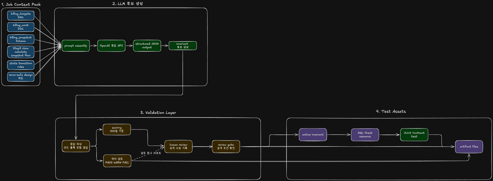

LLM-assisted Test 파이프라인

**Consistency Checker(의미 검토)**가 **active invariant**를 직접 만드는 단계가 아니라는 점이 중요합니다.

**Consistency Checker**는 후보의 SQL 의미, 범위, 기존 active invariant와의 중복 가능성을 다시 검토하는 리포트를 만듭니다. 실제 active 승격은 사람이 남긴 review 기록과 Review Gate를 통과해야 가능한 구조입니다.

즉, **active invariant**로 승격하는 과정에서의 결정권은 LLM이 아닌 **점수화**, **사람 검토**, **Review Gate**, **Consistency Checker**를 거친 뒤 테스트 자산으로 승격됩니다.

이제부터 각 단계별로 어떤 값을 넣었는지, 어떤 값을 출력했는지, 어떻게 승격을 결정했는지에 대해서 설명하도록 하겠습니다.

* * *

### **1) Context Pack: LLM에게 아무거나 던지지 않기**

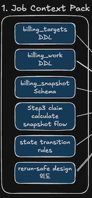

1\. Job Context Pack

LLM에게 그저 **'Job 코드를 분석해서 invariant를 만들어줘'**라고만 하면 위에서 고민했던 내용들은 해결되지 않습니다. 그래서 LLM에게 제공할 우리의 데이터를 Context Pack안에 명시적으로 묶어 LLM의 할루시네이션을 최소화하고 일관된 컨텍스트를 제공했습니다.

> 1\. billing\_tagets DDL  
> 2\. billing\_work DDL  
> 3\. Mongo billing\_snapshot 구조  
> 4\. Step3 핵심 흐름 - Step3만 핵심 흐름을 따로 기입한 것은 Job1에서 선점 과정이 존재하여 가장 큰 장애 가능성을 지닌 구간이기 때문입니다.  
> 5\. 상태 전이 규칙  
> 6\. 기존 rerun-safe 설계 의도

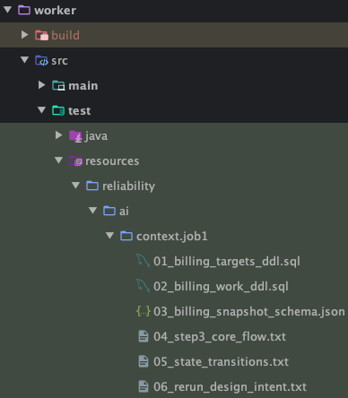

worker Context pack

* * *

### **2) LLM output: JSON으로 제한하기**

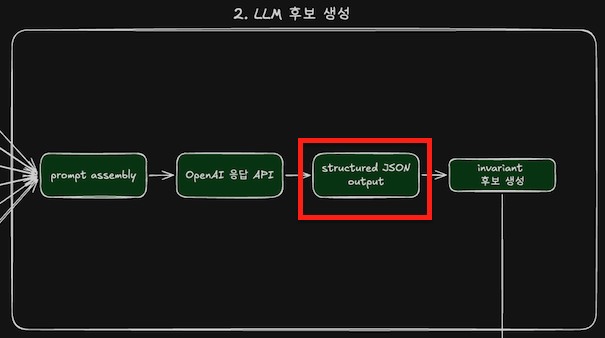

02\. LLM 후보 생성-output JSON 형태로 제한

LLM 출력 값은 단순 텍스트 형식이 아니라 JSON 구조로 제한했습니다. 설명이 단순 텍스트 형식이면 사람이 읽기 좋은 자연어 형태이지만, 자동 검증으로 사용하기에는 어렵습니다.

```json
{
  "id": "INV-103",
  "category": "temporal",
  "description": "재실행이 끝난 뒤에는 lease_until 이 지난 PROCESSING work 가 남아 있으면 안 된다",
  "scope": "rerun_after_crash",
  "sql_check": "SELECT user_id FROM billing_work WHERE billing_month_day = :month AND status = 'PROCESSING' AND lease_until < NOW()",
  "violated_by": "재실행이 끝났는데 reclaim 되지 않은 PROCESSING 이 남은 경우",
  "severity": "major"
}
```

| 필드 | 의미 |
| --- | --- |
| id | invariant 후보 고유 키 |
| category | 검증 관점 분류 |
| description | 자연어 기반의 설명 |
| scope | 언제 조건이 성립해야 하는지 |
| sql_check | 실제 검증 쿼리 |
| violated_by | 어떤 장애와 연결되는지 |
| severity | 중요도 |

여기서 scope는 중요한 역할입니다. 예를 들어 **PROCESSING** 상태는 실행 중에는 정상입니다. 하지만, 재실행이 종료되었는데도 만료된 **PROCESSING**이 남아 있으면 문제가 됩니다.

즉, 이러한 조건은 **always**가 아닌 **rerun\_after\_crash** 또는 **step\_complete**에 가깝습니다.. 이러한 구분이 없다면 정상 실행 중에도 상태를 장애로 판단할 수 있습니다.

* * *

### **3) LLM 후보 생성**

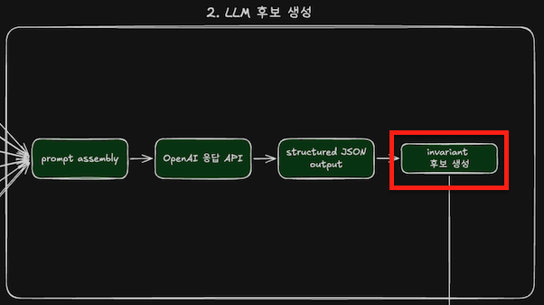

02\. LLM 후보 생성 - invariant 후보 생성

실제로 OpenAI의 GPT-5.4-mini 모델과 연동하여 Job1에 대한 invariant 후보를 생성했습니다. 해당 포스팅에서는 별도의 OpenAI API 연동 과정에 대해서는 서술하지 않겠습니다. 다른 블로그 글이나 OpenAI API 공식문서를 참고해주세요.

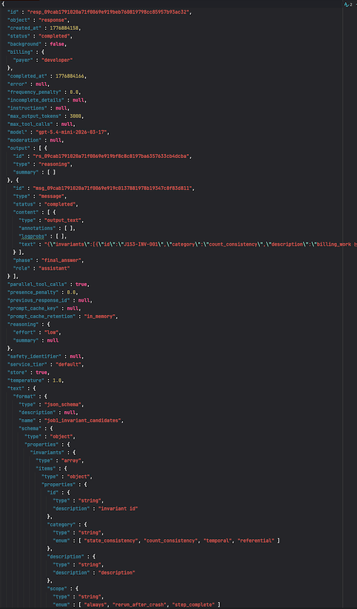

OpenAI API Response 원문

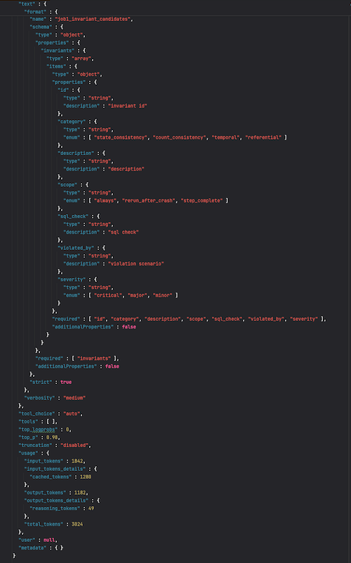

OpenAI API Response 원문

실제 OpenAI API를 통해서 받은 API 응답값은 위 이미지와 같은 원문이였습니다. 해당 응답값을 이제 기존에 정해두었던 JSON 형식에 맞게 파싱하여 저장하도록 구현했습니다.

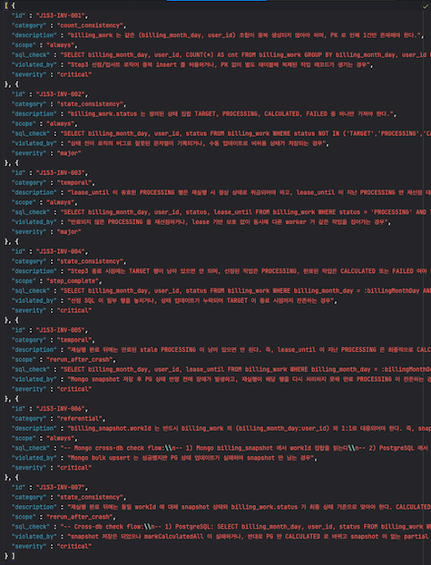

파싱한 JSON OpenAI Response

총 invariant 후보 7건을 생성했습니다.

| 후보 | 분류 | 의미 |
| --- | --- | --- |
| J1S3-INV-001 | count consistency | 같은 월과 사용자 조합의 billing_work가 중복 생성되면 안 됨 |
| J1S3-INV-002 | state consistency | billing_work.status는 허용된 상태값만 가져야 함 |
| J1S3-INV-003 | temporal | lease가 유효한 PROCESSING work는 재선점 대상이 아니어야 함 |
| J1S3-INV-004 | state consistency | Step3 완료 시점에 TARGET work가 남아 있으면 안 됨 |
| J1S3-INV-005 | temporal | 재실행 완료 뒤 만료된 PROCESSING work가 남아 있으면 안 됨 |
| J1S3-INV-006 | referential | Mongo billing_snapshot.workId는 billing_work와 대응되어야 함 |
| J1S3-INV-007 | state consistency | snapshot 존재 여부와 billing_work 최종 상태가 어긋나면 안 됨 |

이러한 후보들은 아직 active invariant 조건들이 아닌 검토 가능한 후보들로 위에서 말한 파이프라인을 거쳐서 **'active invariant 조건'** 으로 승격시킵니다.

* * *

### **4) LLM이 생성한 invariant 조건 점수화 기준**

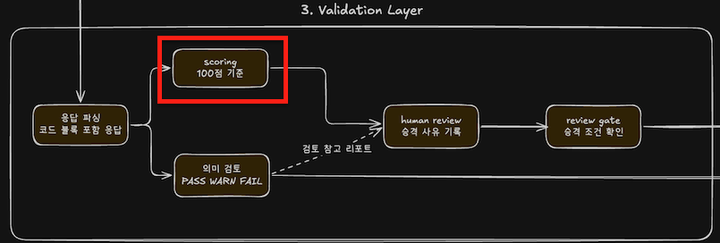

03\. Validation Layer - scoring

invariant 후보를 바로 반영하지 않고 검토하기 위해서 점수화 기준을 만들었습니다. (점수는 100점 기준)

| 평가 항목 | 배점 | 내용 |
| --- | --- | --- |
| 형식 통과 | 20 | JSON 필드가 맞는가 |
| SQL 실행 가능성 | 25 | 실제 검증 쿼리로 사용할 수 있는가 |
| 의미 일치 | 25 | 설명과 SQL이 같은 조건을 말하는가 |
| 시나리오 연결 | 15 | 실제 장애 시나리오와 연결되는가 |
| 신규성 | 15 | 기존 active invariant와 의미 있게 다른가 |

후보군의 승격 상태는 ENUM으로 관리하였습니다.

```java
// 승격 판정 정의
public enum GeneratedInvariantPromotionDecision {
    ACTIVE_CANDIDATE,
    REVIEW_REQUIRED,
    REJECT
}
```

**active invariant 후보** 기준 점수는 ***85점***으로 설정하였습니다. 그리고 아래와 같은 메서드를 통해서 검증 게이트를 구현했습니다.(novel은 신규성 유무입니다.)

```java
// 최종 판정
 private GeneratedInvariantPromotionDecision decide(int totalScore, boolean sqlExecutable, boolean novel) {
     if (!sqlExecutable || totalScore < 60) {
         return GeneratedInvariantPromotionDecision.REJECT;
     }
     if (totalScore >= 85 && novel) {
         return GeneratedInvariantPromotionDecision.ACTIVE_CANDIDATE;
     }
     return GeneratedInvariantPromotionDecision.REVIEW_REQUIRED;
 }
```

* * *

### **5) Human Review: 사람이 검증하는 이유**

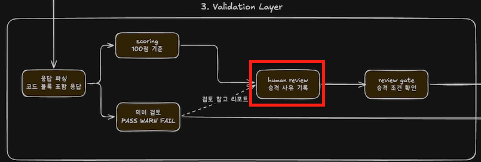

03\. Validation Layer - human review

점수화 다음에는 개발자의 검토를 넣었습니다. 자동화 점수 측정으로만으로 모든 비즈니스 맥락을 완벽히 짚는데 충분하지 않습니다.

실제로 **J1S3-I7 후보**는 점수 평가에서 시나리오 연결성 지표인 **'scenario linkage'** 점수가 ***0점***을 기록하여 **active invariant 승격**이 자동으로 제외되는 문제가 있었습니다.

```json
{
  "generatedInvariantId": "J1S3-I7",
  "reviewStatus": "approved",
  "reviewedBy": "kimdoyeon",
  "scoreSummary": {
    "totalScore": 85,
    "formatScore": 20,
    "sqlExecutableScore": 25,
    "semanticAlignmentScore": 25,
    "scenarioLinkageScore": 0,
    "noveltyScore": 15
  },
  "decisionReason": "billing_targets 와 billing_work 의 사용자 집합 일치 여부는 재실행 안전성에서 별도 경계로 볼 가치가 있음"
}
```

하지만, 제가 판단했을 때 의미 있는 경계라고 생각했습니다. 이유는 단순 count보다 사용자 집합 차이를 보는 것이 더 안전했기 때문입니다.

단순하게 **target 수**와 **work 수**가 같아도 서로 다른 사용자가 섞이면 문제가 발생합니다. 예를 들어 아래와 같은 상태가 가능합니다.

> billing\_targets: user 1, 2, 3  
> billing\_work:      user 1, 2, 999

count는 3으로 동일하지만 정합성은 깨졌습니다. 그래서 active invariant는 단순 count가 아니라 사용자 집합 비교 방식으로 승격하도록 승인 후 리뷰 메모를 남겼습니다.

```json
"reviewNotes": [
    "LLM 생성 결과는 count_consistency 로 분류됐지만 단순 count 보다 사용자 집합 차이를 보는 쪽이 더 안전함",
    "scenarioLinked 점수는 낮았지만 S-001 S-001R S-003R 검증 목록에 직접 연결해서 보완함",
    "cross-db 가 아닌 Postgres 내부 membership 검증으로 먼저 승격함"
  ]
```

* * *

### **6) Review Gate & Consistency Checker: 최종 검증 장치** 

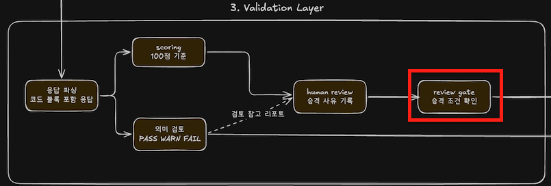

03\. Validation Layer - review gate

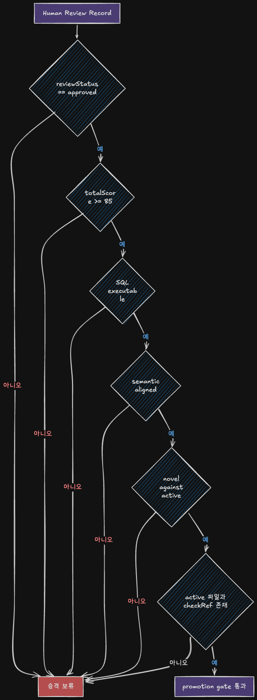

Review Gate flow diagram

Review Gate의 전체적인 흐름은 위와 같습니다.

> 1\. **review 상태 != approved** 이면 active invariant 승격 보류  
> 2\. 전체 점수가 **85점 미만**이면 active invariant 승격 보류  
> 3\. **자연어 설명 != SQL 의미** 이면 active invariant 승격 보류  
> 4\. **기존 active invariant와 중복 가능성이 존재**하면 active invariant 승격 보류  
> 5\. **scenarioLinked가 false이면서 보완 검토 메모가 없으면** active invariant 승격 보류

```java
public ReviewGateResult evaluate(
            HumanReviewRecord review,
            InvariantDefinition promoted,
            ReliabilityResourceCatalog catalog
    ) {
        List<String> blockers = new ArrayList<>();
        List<String> warnings = new ArrayList<>();

        HumanReviewScoreSummary score = review.scoreSummary();
        HumanReviewPromotionTarget target = review.promotionTarget();

        if (!"approved".equalsIgnoreCase(review.reviewStatus())) {
            blockers.add("reviewStatus 가 approved 가 아님");
        }
        if (score.totalScore() < ACTIVE_PROMOTION_SCORE) {
            blockers.add("totalScore 가 active 승격 기준보다 낮음");
        }
        if (!score.sqlExecutable()) {
            blockers.add("SQL 실행 가능 점수가 false");
        }
        if (!score.semanticallyAligned()) {
            blockers.add("자연어 설명과 SQL 의미 일치 검토 실패");
        }
        if (!score.novelAgainstActive()) {
            blockers.add("기존 active invariant 와 중복 가능성 존재");
        }
        if (!score.scenarioLinked() && review.reviewNotes().isEmpty()) {
            blockers.add("scenarioLinked false 인데 보완 검토 메모가 없음");
        }
        if (!score.scenarioLinked() && !review.reviewNotes().isEmpty()) {
            warnings.add("scenarioLinked false 를 사람 검토 메모로 보완");
        }
        if (!target.activeInvariantId().equals(promoted.id())) {
            blockers.add("promotionTarget activeInvariantId 와 active 파일 id 불일치");
        }
        if (!target.checkRef().equals(promoted.checkRef())) {
            blockers.add("promotionTarget checkRef 와 active checkRef 불일치");
        }
        if (!catalog.resourceExists(target.activeInvariantFile())) {
            blockers.add("activeInvariantFile 리소스 누락");
        }
        if (!catalog.resourceExists(target.checkRef())) {
            blockers.add("checkRef 리소스 누락");
        }

        return new ReviewGateResult(
                review.generatedInvariantId(),
                target.activeInvariantId(),
                blockers.isEmpty(),
                blockers,
                warnings
        );
    }
```

여기서 **blockers**는 승격하면 안 되는 조건입니다. 위에서 언급한 Review Gate의 플로우 다이어그램에서의 반드시 지켜져야 하는 조건을 지키지 않았을 때의 blockers가 할당됩니다.

반면, **warnings**는 active invariant로 승격이 가능하지만 검토자의 리뷰가 필요한 조건입니다. **J1S3-I7** 역시 이 부분에서 **scenario linkage 점수가 낮아** 걸렸고, 검토 메모를 통해 보완하여 warnings를 남기고 통과시켰습니다.

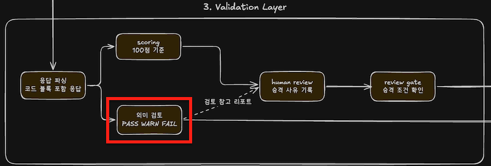

03\. Validation Layer - Consistency Checker

**Consistency Checker**는 생성과 검토의 흐름을 분리하기 위해서 독립적인 LLM 역할을 가진 Checker를 두어 아래와 같은 항목들을 검사합니다.

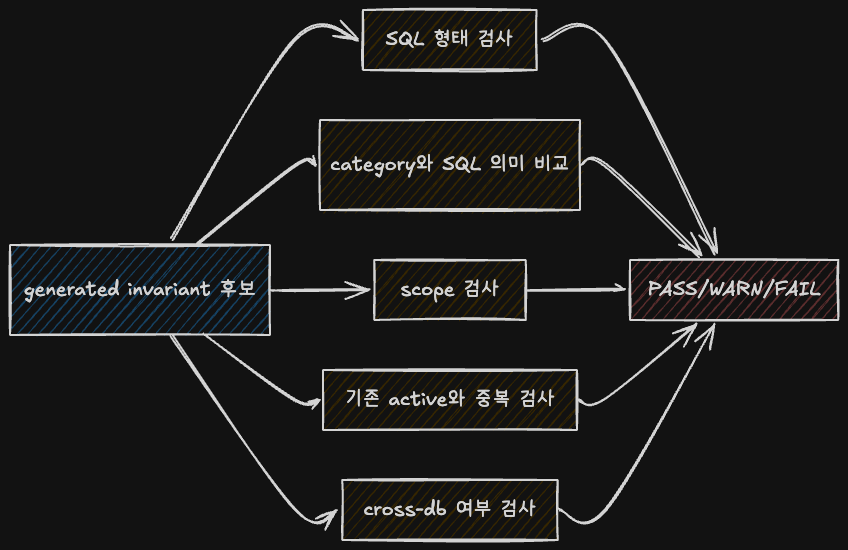

Consistency Checker 검증 항목

active invariant 후보 검증은 아래와 같은 코드를 통해 검사했습니다.

```java
private InvariantConsistencyReview checkOne(
            GeneratedInvariantCandidate candidate,
            List<InvariantDefinition> activeInvariants
    ) {
        List<InvariantConsistencyFinding> findings = new ArrayList<>();

        checkSqlShape(candidate, findings);
        checkCategoryMeaning(candidate, findings);
        checkTemporalScope(candidate, findings);
        checkDuplicateActive(candidate, activeInvariants, findings);

        InvariantConsistencyDecision decision = decide(findings);

        return new InvariantConsistencyReview(
                candidate.id(),
                decision,
                findings,
                suggestedAction(decision)
        );
    }
```

판정 규칙은 아래와 같은 규칙을 통해 구현했습니다.

하나라도 FAIL을 찾으면 해당 후보 전체는 FAIL 처리했습니다.

```java
	// 판정 계산
    private InvariantConsistencyDecision decide(List<InvariantConsistencyFinding> findings) {
        boolean hasFail = findings.stream().anyMatch(finding -> "FAIL".equals(finding.severity()));
        if (hasFail) {
            return InvariantConsistencyDecision.FAIL;
        }

        boolean hasWarn = findings.stream().anyMatch(finding -> "WARN".equals(finding.severity()));
        return hasWarn ? InvariantConsistencyDecision.WARN : InvariantConsistencyDecision.PASS;
    }
```

실제로 **Consistency Checker**가 잘못된 후보를 **FAIL로 검증**으로 판정하고 **active invariant** 승격 대상에서 제외할 수 있음을 테스트하기 위해서 다음과 같은 **BAD-001** 후보를 만들어 보았습니다.

```java
@Test
    @DisplayName("SQL 의미가 맞지 않는 후보는 consistency checker 에서 FAIL 로 막는지 보기")
    void invalidSqlMeaningShouldFailConsistencyCheck() {
        // 실패 후보 차단 확인
        GeneratedInvariantCandidate invalid = new GeneratedInvariantCandidate(
                "BAD-001",
                "count_consistency",
                "billing_work 수가 target 수와 같아야 한다",
                "always",
                "SELECT 1",
                "잘못된 SQL 생성",
                "critical"
        );

        InvariantConsistencyReport report = checker.check(List.of(invalid), catalog.loadActiveInvariants());

        assertThat(report.totalCandidates()).isEqualTo(1);
        assertThat(report.passCount()).isZero();
        assertThat(report.warnCount()).isZero();
        assertThat(report.failCount()).isEqualTo(1);
        assertThat(report.reviews().get(0).findings())
                .extracting("code")
                .contains("SQL_SHAPE_INVALID", "CATEGORY_SQL_MISMATCH");
    }
```

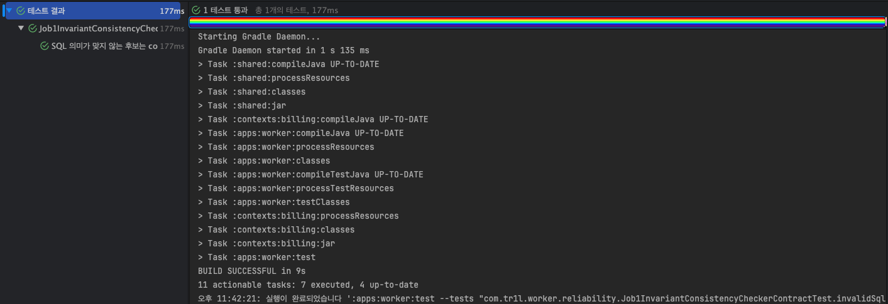

실제로 JUnit를 통한 테스트 코드를 작성하고 실행한 결과 실제로 잘못된 후보를 승격 대상에서 제외할 수 있음을 확인할 수 있었습니다.

* * *

### **7) Acitve Invariant로 승격된 결과**

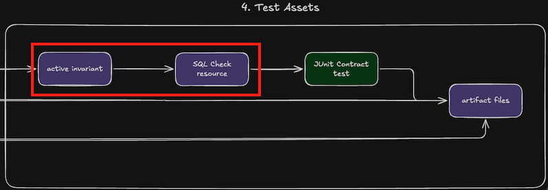

04\. Test Assets - active invariant, SQL Check resources

Review Gate를 통과한 후보는 최종적으로 active invariant로 등록되었습니다. 즉, LLM이 만든 초안 테스트 시나리오가 아니라, 사람이 직접 검토하고 Review Gate를 통과하고 SQL 검증 파일까지 연결된 상태입니다.

이번에 승격한 조건은 **INV-004**였습니다.

```json
{
  "id": "INV-004",
  "title": "Target and work membership match",
  "category": "count_consistency",
  "scope": "always",
  "description": "같은 billing_month_day 기준으로 billing_targets 와 billing_work 의 사용자 집합은 같아야 한다",
  "checkType": "postgres",
  "checkRef": "reliability/checks/postgres/INV-004.sql",
  "expectedViolationCount": 0,
  "severity": "critical"
}
```

이러한 조건은 단순 개수를 비교하는 것이 아닌 **billing\_targets에 들어가 ㄴ사용자**와 **billing\_work에 생성된 사용자**가 정확히 같은지를 검증합니다. 검증을 위한 SQL은 **FULL OUTER JOIN**으로 양쪽 집합의 차이를 모두 잡을수 있도록 작성했습니다.

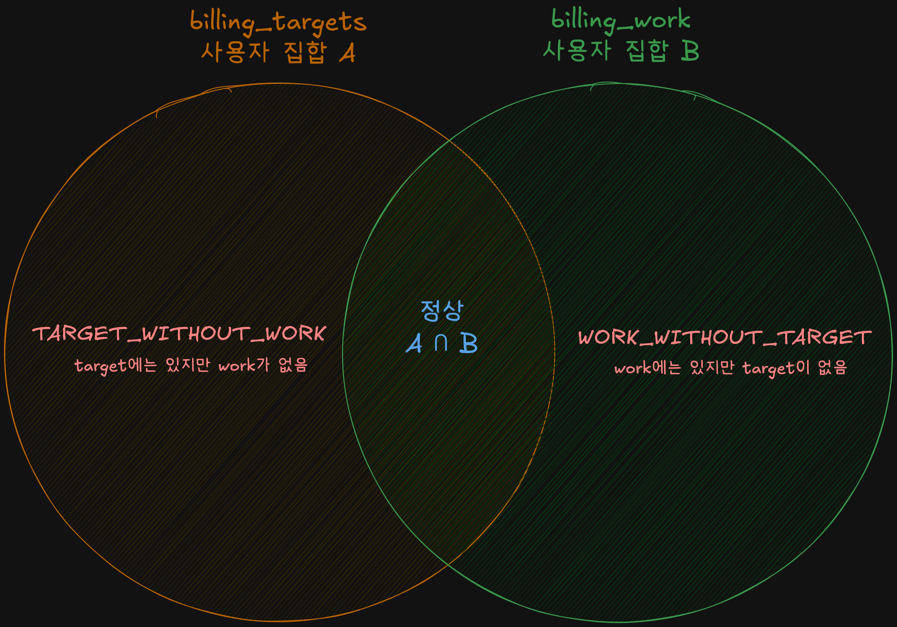

벤 다이어그램

```java
SELECT COALESCE(bt.user_id, bw.user_id) AS user_id,
       bt.billing_month AS target_billing_month,
       bw.billing_month_day AS work_billing_month_day,
       CASE
           WHEN bt.user_id IS NULL THEN 'WORK_WITHOUT_TARGET'
           WHEN bw.user_id IS NULL THEN 'TARGET_WITHOUT_WORK'
       END AS mismatch_type
FROM billing_targets bt
FULL OUTER JOIN billing_work bw
    ON bw.billing_month_day = bt.billing_month
   AND bw.user_id = bt.user_id
WHERE COALESCE(bt.billing_month, bw.billing_month_day) = :billingMonthDay
  AND (bt.user_id IS NULL OR bw.user_id IS NULL);
```

정상 조건이라면 **A=B 상태**이므로 **A-B**와 **B-A 집합**은 **모두 공집합**이어야 합니다. 따라서, SQL 결과가 0이면 정상이고, 1건이라도 나온다면 target과 work의 사용자 집합이 어긋난 상태를 의미합니다.

* * *

### **8) JUnit으로 검증 흐름 묶기**

이번 테스트 도구는 JUnit5을 이용하여 구현했습니다. 이유는 TR1L의 배치 코드는 Java와 Spring Batch 기반이고, 기존 테스트 흐름 또한 JUnit 중심으로 작성하였기 때문입니다. 새로운 테스트 도구의 도입보다는 기존 테스트 체계에서 AI 검증 흐름을 넣는 편이 적합하다고 판단했습니다.

검증은 크게 아래와 같은 항목으로 나누었습니다.

| 테스트 | 검증 내용 |
| --- | --- |
| OpenAI live generation Test | 실제 LLM 호출과 응답 artifact 저장 |
| Scoring contract Test | 후보 점수화와 승격 후보 분류 |
| Human Review contract Test | 사람이 남긴 검토 기록과 active invariaant 연결 |
| Review Gate contract Test | 승인 조건과 차단 조건 검증 |
| Consistency Checker contract Test | 잘못된 후보를 FAIL로 분류하는지 검증 |

실제 검증을 위한 테스트 코드는 아래의 PR들을 참고해주세요.

[\[TR1L-159\] feat: Job1 AI invariant review gate 및 consistency checker 추가 by tkv00 · Pull Request #349 · Team-TR1L/TR1L-BE

📝작업 내용 이번 PR에서는 Job1 AI invariant 결과를 active 로 바로 올리지 않도록 review gate 를 추가했습니다 J1S3-I7 human review 기록이 approved 상태이고 점수와 리소스 연결 조건을 통과할 때만 INV-004 승

github.com](https://github.com/Team-TR1L/TR1L-BE/pull/349)

그리고 OpenAI의 실호출 테스트는 항상 실행되지 않도록 사용자 환경 변수 주입 설정을 통해 막았습니다. 실제 API 호출은 비용과 외부 의존성이 존재하기 때문에 일반 테스트에서는 contract test만을 실행하고, 실제 응답값이 필요할 때만 **live test를 실행**하도록 분리했습니다.

```java
Assumptions.assumeTrue(
    "true".equalsIgnoreCase(System.getenv("JOB1_AI_INVARIANT_LIVE_ENABLED"))
);
```

실행 결과는 아래와 같은 artifact로 저장했습니다.

| artifact | 의미 |
| --- | --- |
| request-body.json | OpenAI에 보낸 요청 |
| response-body.json | OpenAI 원본 응답 |
| response-output-text.json | 모델이 생성한 텍스트 |
| generated-candidates.json | 파싱된 invariant 후보 |
| generated-candidate-evaluation.json | 후보별 점수화 결과 |
| generation-metrics.json | 모델명, token, 후보 수, 평균 점수 |

* * *

## **3\. 마무리 및 확장 방향성**

이번 포스팅에서 진행한 작업의 결과는 아래와 같이 정리할 수 있습니다.

| 항목 | 결과 |
| --- | --- |
| OpenAI live 후보 생성 수 | 7건 |
| live 후보 평균 점수 | 77.86점 |
| active candidate | 3건 |
| review required | 3건 |
| reject | 1건 |
| OpenAI total tokens | 3,024 |
| Human Review 승격 대상 | J1S3-I7 -> INV-004 |
| Human Review 점수 | 85점 |
| Review Gate blockers | 0건 |
| Review Gate Warnings | 1건 |
| Consistency Checker BAD-001 | FAIL |
| JUnit test | Review Gate, Consistency Checker, Human Review, Scoring 계약 테스트 통과 |

이번 구현은 LLM이 생성한 테스트 시나리오를 실제 테스트 자산으로 승격하는 MVP 버전에 불과합니다.

다음 포스팅에서는 MVP에 그치지 않고 원본 invariant 조건을 일부러 악화시킨 변이 조건(Mutant)를 만들고 장애 시나리오에서 이를 해결하는지 확인하는 **Mutation Testing 구조**로 확장하겠습니다. 이를 기반으로 하여 CI/CD Test 파이프라인을 통하여 변경된 비즈니스 코드에 대해서 자동으로 검증하는 구조도 설계 및 구현하도록 하겠습니다.

(추가로 시간이 가능하다면, DDD구조로 구현한 도메인 모델들에 대해서도 같은 구조로 LLM를 이용한 테스트 시나리오 및 테스팅을 진행할 생각입니다.)
