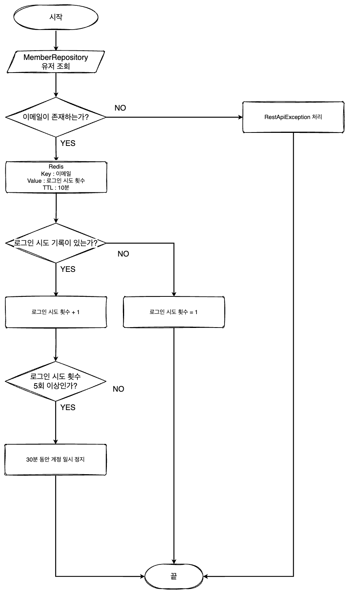
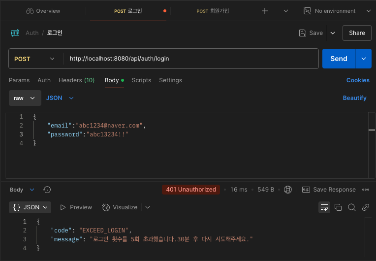
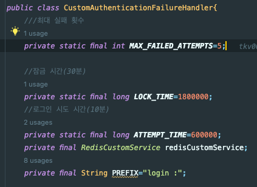
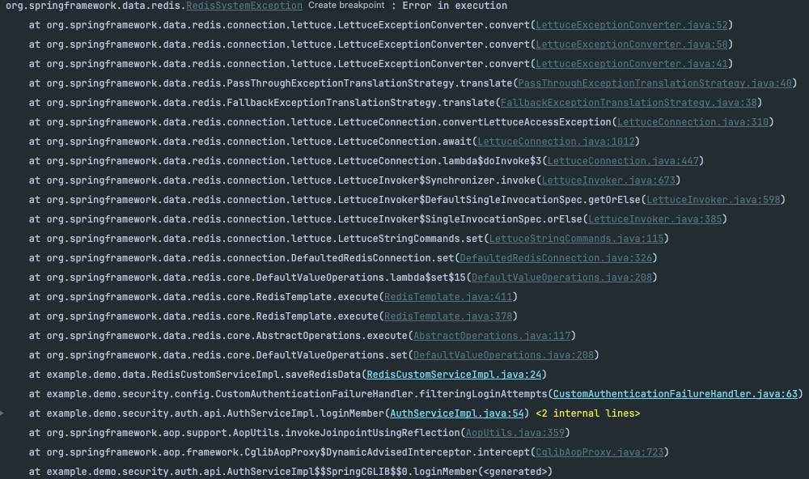
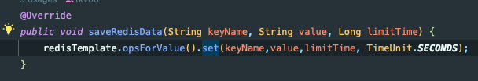
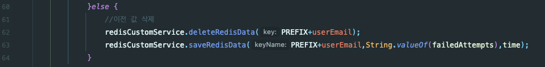
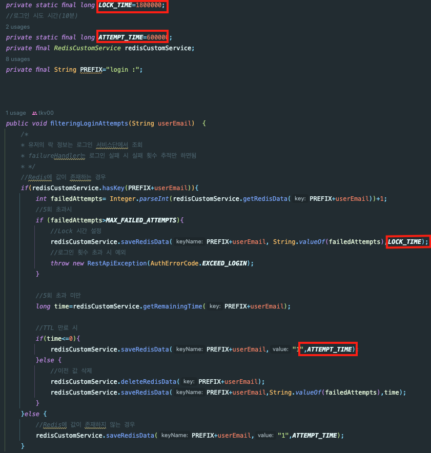
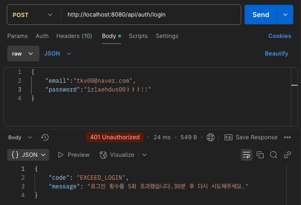

해당 글은 노션에 작성한 글을 티스토리로 재게시했습니다.

## **1\. 배경**

* * *

웹 및 앱 어플리케이션에서 로그인 시도가 반복적으로 실패하는 경우, 단순히 사용자의 실수이 수도 있지만 **Brute Force** 공격일 가능성 또한 존재합니다. 이러한 공격을 방치할 경우 공격자가 **Brute Force** 방식으로 계정을 탈취할 가능성이 커집니다. 이를 해결하기 위해 로그인 실패 횟수를 제한하는 동시에 일정 시간 동안 계정을 잠그는 **로그인 지연(Lockout)** 정책을 **Vero**에 적용하게 되었습니다.

> Brute Force란?  
> 무차별 대입 공격으로 특정한 암호를 풀기 위해 가능한 모든 값을 대입하는 것을 의미한다.  
>   

**Vero**의 **Lockout**를 구현하는 방법에는 **Redis**를 같이 이용하여 구현하였습니다. **Redis**를 선택한 이유는 **TTL 설정**이 비교적 쉬워 사용자의 로그인 실패 횟수를 일정 시간이 지나면 자동으로 초기화할 수 있기 때문입니다.

또한, 회원가입 과정에서 **SMS인증** 시스템을 구현하면서 이미 **RedisTemplate**를 구현해놨기 때문에 접근성이 뛰어나고 기존 인프라를 효율적으로 활용할 수 있다고 판단하였습니다.

## **2\. 해결과정**

* * *

처음에는 **Spring Security**의 기능을 활용하여 로그인 하는 시점에서 **beforeFiltering**를 이용하여 로그인 횟수 검증을 구현 방식을 고려했습니다. **formlogin**에서 주로 사용하는 방법이지만, 현재 **Vero**에서는 **JWT방식의 stateless방식**을 사용하기 때문에 해당 방식은 구현하기 어렵다고 생각했습니다.

설계 구조는 다음과 같습니다.

**MemberRepository** 조회로 회원이 로그인 시 존재하는 이메일인지 확인합니다.

-    존재 O
    1.  **Redis**에 key값으로 유저의 이메일을 **value**값으로 로그인 횟수 시도 저장.
    2.  만료 시간 저장 : 10분 동안 연속된 로그인 시도.
    3.  로그인 시도 기록이 없으면 1 삽입
    4.  로그인 시도 기록이 존재하면 시도 횟수 1씩 증가.
    5.  로그인 5회 초과 시 30분 동안 계정 일시 정지.
-   존재 X
    1.  **RestApiException**으로 **유저의 아이디 혹은 비밀번호가 존재하지 않습니다.** 메세지와 함께 예외를 던져 사용자에게 오류를 전송.



로그인 실패 플로우

## **3\. 구현**

* * *

#### Member 엔티티

```java
@Entity
@NoArgsConstructor(access = AccessLevel.PROTECTED)
@Getter
public class Member extends BaseEntity {
    @Id @GeneratedValue(strategy = GenerationType.IDENTITY)
    @Column(name = "member_id")
    private Long memberId;

    @Column(name = "member_email")
    private String email;

    @Column(name = "member_name")
    private String userName;

    @Column(name = "member_password")
    private String password;

    @Column(name = "member_status")
    @Enumerated(EnumType.STRING)
    private MemberStatus memberStatus;

    @Column(name = "member_phone_number")
    private String phoneNumber;

    @Column(name = "company_position")
    private String companyPosition;

    //계정 잠금 여부
    @Column(name = "account_locked",columnDefinition = "BOOLEAN DEFAULT false")
    private boolean accountLocked;
    //Company랑 양방향
    @ManyToOne(fetch = FetchType.LAZY)
    @JoinColumn(name = "company_id")
    private Company company;
    
    ...
    
  }
```

-   계정의 **잠금 여부**를 저장하기 위해 **accountLocked**라는 **column**를 추가하였고, 기본값으로는 **false**를 부여했습니다.
-   **Redis**에서 **잠금여부**를 관리하지 않는 이유는 추후 관지자의 같은 회사 및 부서 내 직원 계정 잠금 기능 및 잠금해제 기능의 구현을 고려하여 DB에서 관리할 수 있도록 설계했습니다.

#### CustomAuthenticationFailureHandler - 계정 잠금 handler

```java
@Slf4j(topic = "FAILURE_HANDLER")
@AllArgsConstructor
@Component
public class CustomAuthenticationFailureHandler{
    ///최대 실패 횟수
    private static final int MAX_FAILED_ATTEMPTS=5;

    //잠금 시간(30분)
    private static final long LOCK_TIME=1800;
    //로그인 시도 시간(10분)
    private static final long ATTEMPT_TIME=600;
    private final RedisCustomService redisCustomService;
    private final String PREFIX="login :";

    public void filteringLoginAttempts(String userEmail)  {
        /*
        * 유저의 락 정보는 로그인 서비스단에서 조회
        * failureHandler는 로그인 실패 시 실패 횟수 추적만 하면됨
        * */
        //Redis에 값이 존재하는 경우
        if(redisCustomService.hasKey(PREFIX+userEmail)){
            int failedAttempts= Integer.parseInt(redisCustomService.getRedisData(PREFIX+userEmail))+1;
            //5회 초과시
            if (failedAttempts>MAX_FAILED_ATTEMPTS){
                //Lock 시간 설정
                redisCustomService.saveRedisData(PREFIX+userEmail, String.valueOf(failedAttempts),LOCK_TIME);
                //로그인 횟수 초과 시 예외
                throw new RestApiException(AuthErrorCode.EXCEED_LOGIN);
            }

            //5회 초과 미만
            long time=redisCustomService.getRemainingTime(PREFIX+userEmail);

            //TTL 만료 시
            if(time<=0){
                redisCustomService.saveRedisData(PREFIX+userEmail,"1",ATTEMPT_TIME);
            }else {
                //이전 값 삭제
                redisCustomService.deleteRedisData(PREFIX+userEmail);
                redisCustomService.saveRedisData(PREFIX+userEmail,String.valueOf(failedAttempts),time);
            }
        }else {
            //Redis에 값이 존재하지 않는 경우
            redisCustomService.saveRedisData(PREFIX+userEmail,"1",ATTEMPT_TIME);
        }
    }
}
```

-   로그인 실패가 **5회 초과** 시 **30분(1800초)** 계정 잠금.
-   로그인 실패 정보는 **10분(600초)** 유지.
-   **Redis**에 **'login: + 유저의 이메일'** 형식으로 저장.
-   **redisCustomService**의 **getRemainingTime** 메서드를 이용해 남은 시간 확인 후 만료 시 새로운 로그인 실패 기록 저장.
-   **TTL**이 남아있으면 기존 데이터 삭제 후 업데이트하여 로그인 실패 횟수 유지.



로그인 5회 실패 시

* * *

## **🚨 Trouble Shooting 🚨**

## **1\. 배경**

* * *



위와 같은 사용자의 로그인 횟수에 따른 계정 잠금 기능을 구현하던 중 아래 이미지와 같은 오류가 발생했습니다.



오류 로그 이미지

**Spring Data Redis(Lettuce)**를 사용하면서 **RedisSystemException**이 발생하였습니다. 보통 이 오류는 **Redis Server**가 실행되지 않은 상태에서 주로 발생하는 에러입니다.

하지만, **Redis**는 **local환경**에서 문제없이 실행 중이었기 때문에 서버 실행때문임은 아닌듯합니다... 🚨

오류 로그를 자세하게 살펴보면 **RedisCustomServiceImpl.java:24**줄에서 발생하며 **CustomAuthenticationFailureHandler.java:63**줄까지 오류가 이어졌습니다. 즉, **Redis 데이터**를 저장하는 과정에서 문제가 발생한 것입니다!



RedisCustomServiceImpl.java:24



CustomAuthenticationFailureHandler.java:63

## **2\. 해결과정**

* * *

**RedisCustomServiceImpl:java:24**에서 **redisTemplate**의 **opsForValue() 메서드**를 활용한 데이터 저장 시 **만료시간**을 설정하였습니다. 이때, **만료 시간 단위**를 **TimeUnit.SECONDS(초 단위)**로 설정하였습니다. 그러나 실제 데이터를 저장하는 **CustomAuthenticationFailureHandler.java**에서는 설정한 시간을 **밀리초(ms)** 단위로 생각하고 각각 **1,800,000, 600,000**으로 값을 주었습니다. 이를 초 단위로 계산하면 **30,000분과 10,000분**이었던 것입니다! 



## **3\. 구현**

* * *

아래 코드와 같이 다시 시간단위를 일괄되도록 **초 단위를 수정**하여 오류를 해결했습니다.

```java
@Slf4j(topic = "FAILURE_HANDLER")
@AllArgsConstructor
@Component
public class CustomAuthenticationFailureHandler{
    ///최대 실패 횟수
    private static final int MAX_FAILED_ATTEMPTS=5;

    //잠금 시간(30분)
    private static final long LOCK_TIME=1800;
    //로그인 시도 시간(10분)
    private static final long ATTEMPT_TIME=600;
    private final RedisCustomService redisCustomService;
    private final String PREFIX="login :";

    public void filteringLoginAttempts(String userEmail)  {
        /*
        * 유저의 락 정보는 로그인 서비스단에서 조회
        * failureHandler는 로그인 실패 시 실패 횟수 추적만 하면됨
        * */
        //Redis에 값이 존재하는 경우
        if(redisCustomService.hasKey(PREFIX+userEmail)){
            int failedAttempts= Integer.parseInt(redisCustomService.getRedisData(PREFIX+userEmail))+1;
            //5회 초과시
            if (failedAttempts>MAX_FAILED_ATTEMPTS){
                //Lock 시간 설정
                redisCustomService.saveRedisData(PREFIX+userEmail, String.valueOf(failedAttempts),LOCK_TIME);
                //로그인 횟수 초과 시 예외
                throw new RestApiException(AuthErrorCode.EXCEED_LOGIN);
            }

            //5회 초과 미만
            long time=redisCustomService.getRemainingTime(PREFIX+userEmail);

            //TTL 만료 시
            if(time<=0){
                redisCustomService.saveRedisData(PREFIX+userEmail,"1",ATTEMPT_TIME);
            }else {
                //이전 값 삭제
                redisCustomService.deleteRedisData(PREFIX+userEmail);
                redisCustomService.saveRedisData(PREFIX+userEmail,String.valueOf(failedAttempts),time);
            }
        }else {
            //Redis에 값이 존재하지 않는 경우
            redisCustomService.saveRedisData(PREFIX+userEmail,"1",ATTEMPT_TIME);
        }
    }
}
```


