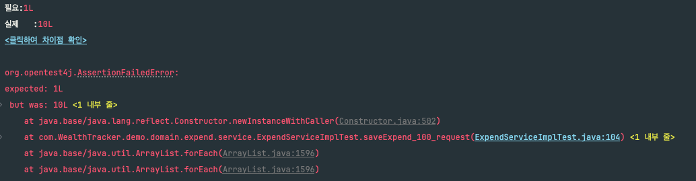
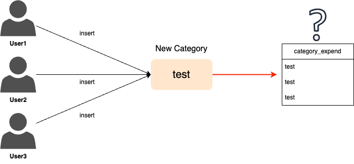
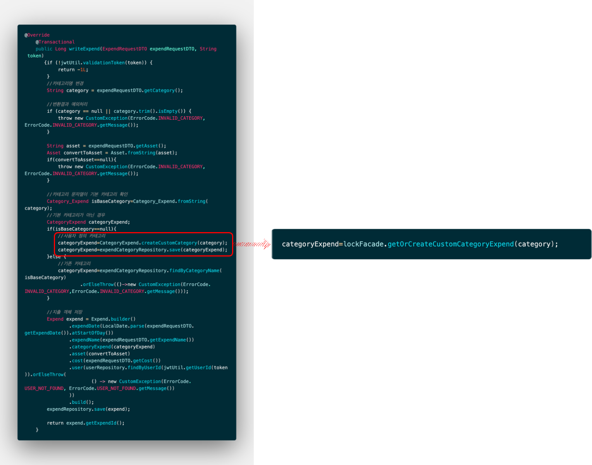
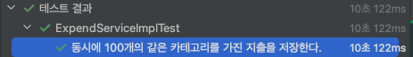

## **1.배경**

* * *

WealthTracker에서는 사용자가 지출 내역을 입력할 때 카테고리를 선택하게 된다. 기본 카테고리는 납부, 식비, 교통, 오락, 쇼핑, 기타 등이며, ENUM으로 관리하고 있다.

문제는 사용자가 새로운 카테고리를 추가할 때 발생했다. 기존 ENUM에 해당하지 않으면 customCategoryName이라는 컬럼에 값을 넣어 새로 등록하도록 구현했는데, ***여러 사용자가 동시에 같은 이름의 새로운 카테고리를 등록하는 상황***에서 동시성 이슈가 발생했다.

* * *

#### **테스트 코드를 통해 확인된 동시성 문제**

ExecutorService를 이용하여 100개의 쓰레드를 동시에 실행해보았고 모든 스레드는 "test"라는 새로운 카테고리명을 등록하도록 설정했다. 테스팅 결과 10개의 카테고리 객체가 생성되는 현상이 발생했고, 이는 **Race Condition**으로 DB에 insert요청이 중복 처리되어 발생한 문제였다. 

```java
    /**
     * 시나리오
     * 동시에 같은 카테고리 지출 생성 요청 -> 여러 요청이 모두 카테고리가 존재하지 않는다고 판단하여 중복하여 생성 가능성.
     */

    @Test
    @DisplayName("동시에 100개의 같은 카테고리를 가진 지출을 저장한다.")
    void saveExpend_100_request() throws InterruptedException {
        //given
        final int threadCount=10;
        final ExecutorService executorService= Executors.newFixedThreadPool(32);
        final CountDownLatch countDownLatch=new CountDownLatch(threadCount);

        //when
        for(int i=0;i<threadCount;i++){
            executorService.submit(()->{
                try {
                    ExpendRequestDTO expendRequestDTO=createMockExpendRequestDTO();
                    Long savedExpendId=expendService.writeExpend(expendRequestDTO,mockToken);

                }finally {
                    countDownLatch.countDown();
                }
            });
        }
        countDownLatch.await();
        executorService.shutdown();

        //then
        //실제 생성된 카테고리
        List<CategoryExpend> allCategory=expendCategoryRepository.findAll();
        long count=allCategory.stream()
                .filter(c->c.getCustomCategoryName()!=null)
                        .filter(c->c.getCustomCategoryName().equalsIgnoreCase("TEST"))
                                .count();

        assertThat(count)
                .isEqualTo(1);
    }

    /**
     * ExpendRequestDTO 생성
     */
    private ExpendRequestDTO createMockExpendRequestDTO(){
        return ExpendRequestDTO
                .builder()
                .asset("현금")
                .category("test")
                .expendDate("2022-12-22")
                .cost(100000L)
                .expendName("테스트를 위한 지출 이름")
                .build();
    }
```



테스트 결과

#### **Race Condition이란?**

> 경쟁 상태(race condition)이란 공유 자원에 대해 여러 개의 프로세스가 동시에 접근을 시도할 때 접근의 타이밍이나 순서 등이 결과값에 영향을 줄 수 있는 상태.  
> (위키 백과)  
>   

> 여기서 내 테스트 상황에 적용하면 공유 자원은 같은 카테고리명인 "test"에 100개의 프로세스가 동시에 insert를 시도할 때 같은 이름의 카테고리명으로 여러 개가 저장되는 것이다.



## **2.해결 과정**

* * *

다양한 방법의 분산락 구현을 통해 동시성 제어를 해결할 수 있다.

1.  **Zookeeper ❌**
2.  **Redis **❌****
3.  **java Synchronized **❌****
4.  **MySQL **✅****

이 중 1번과 2번 방식은 인프라 구축에 대한 비용의 발생과 함께 유지보수에 대한 비용도 발생한다. 3번 synchronized는 큰 단점이 존재하는데 데이터에 하나의 스레드만 접근이 가능하다는 조건이 하나의 프로세스에서만 보장된다는 점이다. 즉, 서버가 여러 대가 존재한다면 동시성이 보장되지 않는다는 단점이다. 따라서 현재 프로젝트에서 RDBMS로 사용중인 **MySQL**를 통해 분산락을 구현하고자 하였다.

* * *

#### **MySQL에서의 분산 Lock**

1.  **Pessimistic Lock - 비관적 락 **❌****
2.  **Optimistic Lock - 낙관적 락 **❌****
3.  **Named Lock - 네임드 락  ****✅******

**Pessimistic Lock**는 특정 컬럼이나 테이블을 단위로 Lock를 걸어야하는데 지출 서비스단 코드를 보면 지출 등록 및 수정을 제외한 모든 서비스 코드는 조회만을 수행하므로 과한 제약이라고 판단했다.

**Optimistic Lock**는 일반적으로 수정(update) 작업에 적합하며 현재 문제 상황처럼 동일한 이름의 카테고리를 중복 삽입하는 것을 막는 것에는 적용이 어렵다고 판단했다.

**Named Lock는** 지출을 등록하는 **ExpendServiceImpl**의 **writeExpend** 메서드에서 새로운 카테고리명을 기반으로 insert 작업만을 락을 걸 수 있어 선택했다.

* * *

#### **Named Lock에 대해 알아보자**

**GET\_LOCK(String,time)**

-   입력받은 String으로 time(단위 : 초) 동안 잠금을 획득한다.
-   한 세션에서 잠금을 유지하고 있는 동안에는 다른 세션에서 동일 이름의 잠금을 획득 불가하다.
-   GET\_LOCK 결과
    -   1 : 잠금 획득 성공
    -   0 : 잠금 획득 실패
    -   null : 잠금 획득 중 에러 발생

**RELEASE\_LOCK(String,time)**

-   입력받은 String으로 잠금 해제
-   RELEASE\_LOCK 결과
    -   1 : 잠금 해제 성공
    -   0 : 잠금 해제 실패
    -   null : 잠금이 존재하지 않음.

## **3.구현**

* * *

나중에 다른 Lock 사용을 위해 global 폴더에 lock폴더를 만들어 **LockRepository**를 구성하였다.

10초동안 잠금을 획득하는 것으로 구성하였다.

```java
@Repository
public interface LockRepository extends JpaRepository<CategoryExpend,Long> {
    @Query(value = "select get_lock(:key,10)",nativeQuery = true)
    Integer getLock(@Param("key") String key);

    @Query(value = "select release_lock(:key)",nativeQuery = true)
    void releaseLock(@Param("key") String key);
}
```

**ExpendCategoryNamedLockFacade** 인터페이스와 구현체를 구현하였다. 사용자가 직접 입력하는 카테고리명에 대해서만 **NAMED\_LOCK**를 수행하도록 한다. 잠금 획득을 실패했을 때는 RuntimeException과 log를 통해 실패 지점을 확인한다.

```java
@Component
@RequiredArgsConstructor
@Slf4j
public class ExpendCategoryNamedLockFacadeImpl implements ExpendCategoryNamedLockFacade{
    private final LockRepository lockRepository;
    private final ExpendCategoryRepository expendCategoryRepository;

    @Transactional
    public CategoryExpend getOrCreateCustomCategoryExpend(String category) {
        Integer lockResult=lockRepository.getLock(category);
        //get_lock 실패시
        if(lockResult==null || lockResult!=1){
            log.error("GET_LOCK FAILED");
            throw new RuntimeException("GET_LOCK FAILED");
        }

        try {
            return expendCategoryRepository.findByCustomCategoryName(category)
                    .orElseGet(()->{
                       CategoryExpend newCategory=CategoryExpend.createCustomCategory(category);
                       return expendCategoryRepository.save(newCategory);
                    });
        } finally {
            lockRepository.releaseLock(category);
        }
    }

}
```

**ExpendServiceImpl** 클래스에서는 아래와 같이 코드를 변경하였다.



* * *

> 변경한 코드를 다시 테스트 코드를 실행한 결과 생성된 새로운 카테고리가 1개임을 확인할 수 있다!



코드 수정 후 테스트 결과
