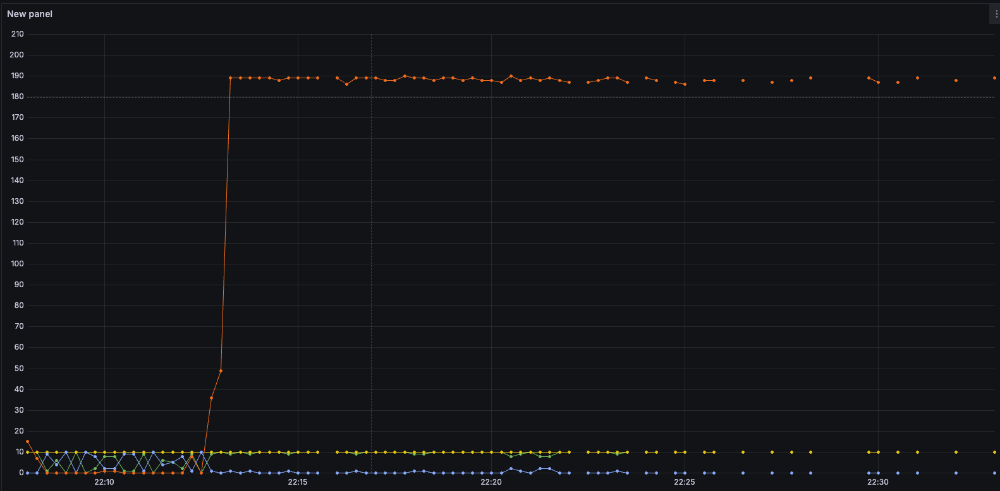
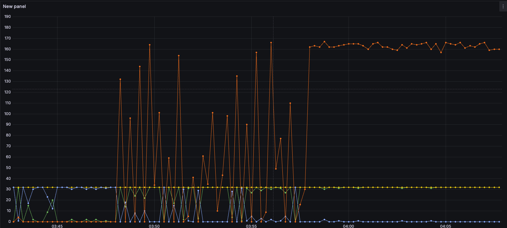
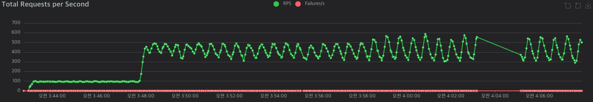
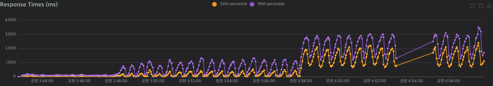
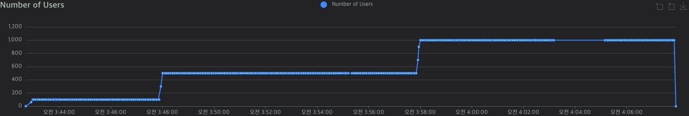
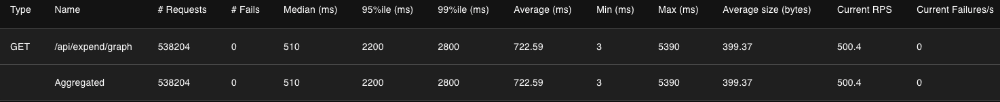

## **1\. 배경**

* * *

이전 게시물에서는 단순히 API 조회에 따라 아래와 같은 지표들을 확인할 수 있었습니다.

-   **Total Request Per Second (초당 전체 요청 수) 그래프**
-   **Response Time (응답 시간) P95와 P50 그래프**
-   **Number Of Users (유저 수) 그래프**

위의 3가지 지표 이외에도 DB의 커넥션 풀을 이용량과 제한량을 확인하기 위해 **Prometheus+Grafana**의 그래프를 통해 확인할 수 있었습니다.



DB 커넥션 그래프

각 그래프의 색깔별로 지표들은 다음과 같습니다.

-   **노란색 : Hikari 커넥션 최대 연결 수**
-   **주황색 : 커넥션 풀 대기 수**
-   **파란색 : idle 상태 수**
-   **초록색 : 커넥션 풀 활동 수**

API 요청 유저 수가 100명 -> 500명으로 증가하는 시점에서 주황색(커넥션 풀 대기 수)가 급격하게 증가하는 추세를 보인다. 따로, 커넥션 풀을 설정하지 않았기 때문에  maximum-pool-size가 기본값인 10으로 설정되어 있었습니다.

## **2\. 해결과정**

* * *

우선, 현재 WealthTracker의 RDMS로 사용중인 MySQL에 접속하여 쿼리 콘솔로 다음과 같은 쿼리로 커넥션 풀의 최대 연결 수를 조회했고 그 결과 **151**로 확인했습니다.

```sql
SHOW VARIABLES LIKE 'max_connections';
```


최대 커넥션 풀

### **최대 연결 수의 기준**

최대 커넥션 풀 연결 수를 어떤 점을 기준으로 해야할 지 고민하였습니다. 답은 HikariCP의 오픈소스 공식 문서를 통해 확인할 수 있었습니다.

[https://github.com/brettwooldridge/HikariCP/wiki/About-Pool-Sizing](https://github.com/brettwooldridge/HikariCP/wiki/About-Pool-Sizing "HikariCP Github")

[About Pool Sizing

光 HikariCP・A solid, high-performance, JDBC connection pool at last. - brettwooldridge/HikariCP

github.com](https://github.com/brettwooldridge/HikariCP/wiki/About-Pool-Sizing)

-   많은 사람들이 스레드 수만큼 커넥션 풀의 크기를 늘리고자 하지만, 실제로는 대부분의 스레드가 DB 커넥션을 동시에 필요하지 않음.
-   병목 현상없이 처리할 수 있는 최적의 크기를 찾는 것이 중요.
-   minimumIdle = maximumPoolSize로 설정하여 고정 풀로 작동.
-   커넥션을 미리 확보하여 성능 예측 가능성을 높일 수 있음.  
      
    오픈소스 설명에서는 아래와 같은 공식을 통해 최대 커넥션 풀을 도출하도록 권장하고 있습니다.

> connections = ((core\_count \* 2) + effective\_spindle\_count)

-   **core\_count** : CPU 코어 개수
-   **effective\_spindle\_count** : 동시에 처리 가능한 디스크

하지만 부하 테스트를 진행중인 로컬 환경인 M2 Macbook air는 SSD 디스크를 사용중으로 **spindle\_count**을 구할 수 없습니다. 따라서, SSD환경에서의 공식이 필요한데 아래의 문서에 따르면 다음과 같은 공식을 적용하면 됩니다.

[https://docs.pingcap.com/tidb/stable/dev-guide-connection-parameters/?utm\_source=chatgpt.com](https://docs.pingcap.com/tidb/stable/dev-guide-connection-parameters/?utm_source=chatgpt.com)

[Connection Pools and Connection Parameters

This document explains how to configure connection pools and parameters for TiDB. It covers connection pool size, probe configuration, and formulas for optimal throughput. It also discusses JDBC API usage and MySQL Connector/J parameter configurations for

docs.pingcap.com](https://docs.pingcap.com/tidb/stable/dev-guide-connection-parameters/?utm_source=chatgpt.com)

> connections = (number of cores \* 4)

### **connections 구하기**

명령어를 아래와 같이 터미널에 입력하여 전체 논리 코어의 개수를 구합니다.

```bash
sysctl -n hw.ncpu
```

명령어 입력 결과 8으로 나왔고 **connections = 8\*4 = 32**로 설정하였습니다.

```properties
#Hikari
spring.datasource.hikari.maximum-pool-size=32
spring.datasource.hikari.minimum-idle=32
```

## **3\. 결과**

* * *

### **커넥션 풀 그래프**

같은 조건으로 부하 테스트를 진행하였고 **Prometheus+Grafana**의 커넥션 풀 그래프를 확인한 결과 아래와 같습니다.

**maximum-pool-size**를 30까지 늘려 주황색(커넥션 대기)이 API 요청 유저 수가 1000명인 상태에서도 커넥션 풀이 끊기지 않는 흐름이 나타났습니다.



DB 커넥션 그래프

### **전체적인 부하 테스트 결과**



초당 요청 수 RPS



응답 시간 Response Time



유저 수 Number Of Users



전체적인 성능  테스트 결과 표

  
처음 부하테스트를 진행했을 때보다 아래와 같은 성능 개선을 달성했습니다.

|  | 평균 | P95 |
| --- | --- | --- |
| 개선 전 | 4,004 ms | 11,000 ms |
| 개선 후 | 722.59 ms | 2,200 ms |
| 개선율 | 454.118% | 400% |
