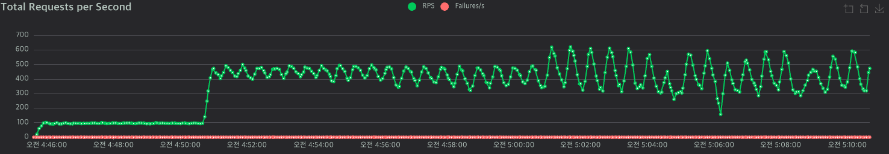
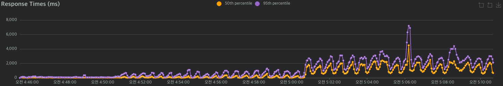
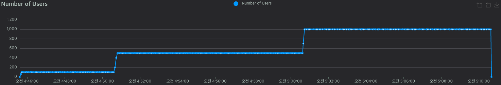
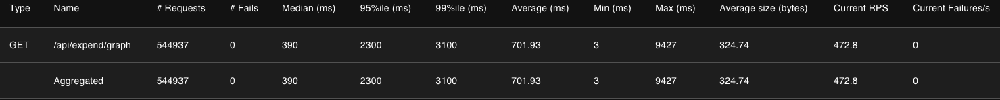
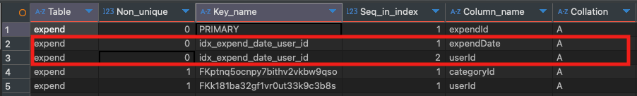
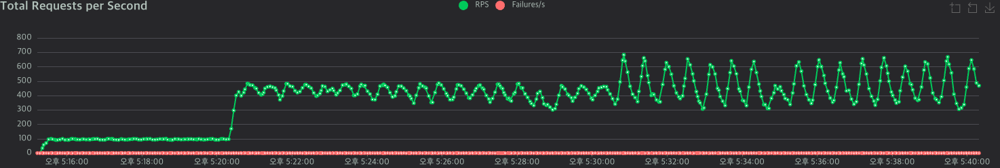
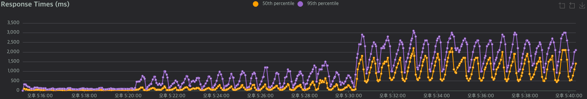
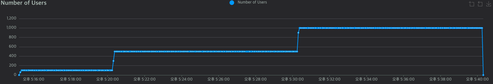
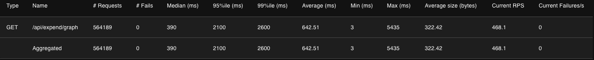

## **1.배경**

* * *

WealthTracker 서비스에서 제공하는 /api/expend/graph API는 사용자의 지출 데이터를 주차(week) 단위로 요약하여 시각화에 활용되는 중요한 API입니다. 해당 API에서 사용되는 서비스 로직은 아래와 같습니다.

```java
 @Override
    public List<ExpendDateResponseDTO> getAmountByWeek(String token) {
        //jwt토큰 검증 실시
        Optional<User> findUser = userRepository.findByUserId(jwtUtil.getUserId(token));
        User user = findUser.orElseThrow(() -> new CustomException(ErrorCode.USER_NOT_FOUND, ErrorCode.USER_NOT_FOUND.getMessage()));

        //이번달 불러오기
        int nowMonth = LocalDate.now().getMonthValue();

        //주차별 총 지출금액 가져오기
        List<Object[]> nowMonthData = expendRepository.getTotalExpendThisMonth(user);
        List<Object[]> prevMonthData = expendRepository.getTotalExpendLastMonth(user);

        List<ExpendDateResponseDTO> graphReport = new ArrayList<>();
        Map<Integer, Integer> currentMonthMap = nowMonthData.stream()
                .collect(Collectors.toMap(
                        o -> ((Number) o[0]).intValue(),
                        o -> ((Number) o[1]).intValue()
                ));

        Map<Integer, Integer> prevMonthMap = prevMonthData.stream()
                .collect(Collectors.toMap(
                        o -> ((Number) o[0]).intValue(),
                        o -> ((Number) o[1]).intValue()
                ));
        for (int week = 1; week <= 5; week++) {
            ExpendDateResponseDTO dto = ExpendDateResponseDTO.builder()
                    .month(nowMonth)
                    .weekNum(week)
                    .thisWeekTotalCost(currentMonthMap.getOrDefault(week, 0))
                    .lastWeekTotalCost(prevMonthMap.getOrDefault(week, 0))
                    .build();
            graphReport.add(dto);
        }
        return graphReport;
    }
```

### 코드 설명

```java
List<Object[]> nowMonthData = expendRepository.getTotalExpendThisMonth(user);
List<Object[]> prevMonthData = expendRepository.getTotalExpendLastMonth(user);

# expendRepository
   //이번 달 주차별 지출 총액 리턴
    @Query("select CAST(FLOOR(DAY(e.expendDate)-1)/7 + 1 AS INTEGER) AS weekNum, " +
           " SUM(e.cost) AS totalCost " +
           "from Expend e " +
           "where e.user = :user " +
           " and MONTH(e.expendDate) = MONTH(CURRENT_DATE) " +
           "group by CAST((FLOOR(DAY(e.expendDate) - 1) / 7) + 1 AS INTEGER)"
    )
    List<Object[]> getTotalExpendThisMonth(@Param("user") User user);

    //저번 달 주차별 지출 총액 리턴
    @Query("select CAST(FLOOR(DAY(e.expendDate)-1)/7 + 1 AS INTEGER) AS weekNum, " +
           " SUM(e.cost) AS totalCost " +
           "from Expend e " +
           "where e.user = :user " +
           " and MONTH(e.expendDate) = MONTH(CURRENT_DATE) - 1 " +
           "group by CAST((FLOOR(DAY(e.expendDate) - 1) / 7) + 1 AS INTEGER)"
    )
    List<Object[]> getTotalExpendLastMonth(@Param("user") User user);
```

-   이번 달 총 지출 금액 , 저번 달 총 지출 금액을 주차별로 조회합니다.
-   **JPQL**의 기능을 활용하여 지출 날짜를 기준으로 **group by**하여 주차별로 집계함수 **sum**를 통해 지출 총 금액과 주차를 조회합니다.

```java
 List<ExpendDateResponseDTO> graphReport = new ArrayList<>();
        Map<Integer, Integer> currentMonthMap = nowMonthData.stream()
                .collect(Collectors.toMap(
                        o -> ((Number) o[0]).intValue(),
                        o -> ((Number) o[1]).intValue()
                ));

        Map<Integer, Integer> prevMonthMap = prevMonthData.stream()
                .collect(Collectors.toMap(
                        o -> ((Number) o[0]).intValue(),
                        o -> ((Number) o[1]).intValue()
                ));
        for (int week = 1; week <= 5; week++) {
            ExpendDateResponseDTO dto = ExpendDateResponseDTO.builder()
                    .month(nowMonth)
                    .weekNum(week)
                    .thisWeekTotalCost(currentMonthMap.getOrDefault(week, 0))
                    .lastWeekTotalCost(prevMonthMap.getOrDefault(week, 0))
                    .build();
            graphReport.add(dto);
     }
```

-   **nowMonthData**와 **prevMonthData**의 각각의 주차별 데이터를 Map형태로 변환합니다.
-   1주차부터 5주차까지에 대해 for문을 통해 현재달과 이전 달의 지출을 비교하여 **DTO**객체로 만들어 리스트에 담고 반환합니다.

### **문제점**

위의 코드들을 보았을 때 이미 이번달과 저번달의 주차별 지출 총액을 조회하고 다시 **stream**을 이용하여 **DTO**를 조립하는 과정은 중복된 과정으로 효율적이지 않습니다. 또한, **expendRepository**의 쿼리문은 이번 달 지출 총액과 저번 달 지출 총액, 총 2번의 쿼리를 날려 비효율적입니다.

```sql
# API 작동 시 실제 날라가는 쿼리문
# 이번 달 지출 총액 조회 쿼리
select
        cast(((floor((day(e1_0.expendDate)-1))/7)+1) as signed),
        sum(e1_0.cost) 
    from
        expend e1_0 
    where
        e1_0.userId=? 
        and month(e1_0.expendDate)=month(current_date) 
    group by
        cast(((floor((day(e1_0.expendDate)-1))/7)+1) as signed)

# 저번 달 지출 총액 조회 쿼리
    select
        cast(((floor((day(e1_0.expendDate)-1))/7)+1) as signed),
        sum(e1_0.cost) 
    from
        expend e1_0 
    where
        e1_0.userId=? 
        and month(e1_0.expendDate)=(
            month(current_date)-1
        ) 
    group by
        cast(((floor((day(e1_0.expendDate)-1))/7)+1) as signed)
```

## **2\. 해결과정**

* * *

### **(1) 전체적인 쿼리 튜닝**

우선 이번 달과 저번 달 지출 총액을 조회하고 다시 **DTO**를 조립하는 중복되는 로직을 1개의 쿼리문을 통해 해결을 1번째 목표로 잡았습니다. **UNION**를 통해 이번 달과 저번달 지출 테이블을 묶어 1개의 쿼리문으로 조회할 수 있도록 리팩토링하였습니다.

또한, **Native Query**를 사용함에 따라 **ExpendWeekCompareDTO** 만들어 **READ**기능만을 위한 인터페이스를 생성하였습니다.

```java
 @Query(value = """
                SELECT
                    weekNum,
                    SUM(CASE WHEN monthType = 'this' THEN totalCost ELSE 0 END) AS thisMonthTotalCost,
                    SUM(CASE WHEN monthType = 'prev' THEN totalCost ELSE 0 END) AS prevMonthTotalCost
                FROM (
                      (
                    SELECT
                        WEEK(e.expendDate, 2)
                          - WEEK(DATE_SUB(e.expendDate, INTERVAL DAYOFMONTH(e.expendDate)-1 DAY), 2) + 1 AS weekNum,
                        SUM(e.cost) AS totalCost,
                        'this' AS monthType
                    FROM expend e
                    WHERE e.userId = :userId
                      AND YEAR(e.expendDate) = YEAR(CURRENT_DATE)
                      AND MONTH(e.expendDate) = MONTH(CURRENT_DATE)
                    GROUP BY WEEK(e.expendDate, 2)
                          - WEEK(DATE_SUB(e.expendDate, INTERVAL DAYOFMONTH(e.expendDate)-1 DAY), 2) + 1
                    )
                    UNION ALL
                    (
                    SELECT
                        WEEK(e.expendDate, 2)
                          - WEEK(DATE_SUB(e.expendDate, INTERVAL DAYOFMONTH(e.expendDate)-1 DAY), 2) + 1 AS weekNum,
                        SUM(e.cost) AS totalCost,
                        'prev' AS monthType
                    FROM expend e
                    WHERE e.userId = :userId
                      AND (
                            (MONTH(CURRENT_DATE) = 1 AND MONTH(e.expendDate) = 12 AND YEAR(e.expendDate) = YEAR(CURRENT_DATE) - 1)
                         OR (MONTH(CURRENT_DATE) != 1 AND MONTH(e.expendDate) = MONTH(CURRENT_DATE) - 1 AND YEAR(e.expendDate) = YEAR(CURRENT_DATE))
                      )
                    GROUP BY WEEK(e.expendDate, 2)
                          - WEEK(DATE_SUB(e.expendDate, INTERVAL DAYOFMONTH(e.expendDate)-1 DAY), 2) + 1
                    )
                ) AS union_table
                GROUP BY weekNum
                ORDER BY weekNum ASC
            """, nativeQuery = true)
    List<ExpendWeekCompareDTO> getExpendWeekCompare(@Param("userId") Long userId);
```

```java
public interface ExpendWeekCompareDTO {
    Integer getWeekNum();
    Long getThisMonthTotalCost();
    Long getPrevMonthTotalCost();
}
```

#### **전체적인 부하 테스트 결과**



초당 요청 수 RPS



응답 시간 Response Time



유저 수 Number Of Users



전체적인 성능  테스트 결과 표

|  | 평균 | P95 |
| --- | --- | --- |
| 개선 전 | 722.59 ms | 2,200 ms |
| 개선 후 | 701.93 ms | 2,300 ms |
| 개선율 | 2.943 % | - 4.347% |

### **(2) 복합 인덱스 설정**

```java
@Table(name = "expend",indexes={
        @Index(name="idx_expend_date_user_id",columnList="expendDate, userId",unique=true)
})
public class Expend{
 //기존 엔티티 로직
 }
```

위의 쿼리문을 보면 유저의 지출 날짜를 토대로 조회를 진행합니다. 따라서, 복합인덱스를 지출 날짜와 유저의 고유 id값을 복합 인덱스로 설정하고 **unique=true**로 설정하였습니다.

복합 인덱스가 제대로 설정되었는 지 확인 하기위해 아래와 같은 쿼리를 통해 확인할 수 있었습니다.

```sql
show index from expend;
```



#### **전체적인 부하 테스트 결과**



초당 요청 수 RPS



응답 시간 Response Time



유저 수 Number Of Users



전체적인 성능  테스트 결과 표

|  | 평균 | P95 |
| --- | --- | --- |
| 개선 전 | 701.93 ms | 2,300 ms |
| 개선 후 | 642.51 ms | 2100 ms |
| 개선율 | 9.248 % | 9.523 % |
