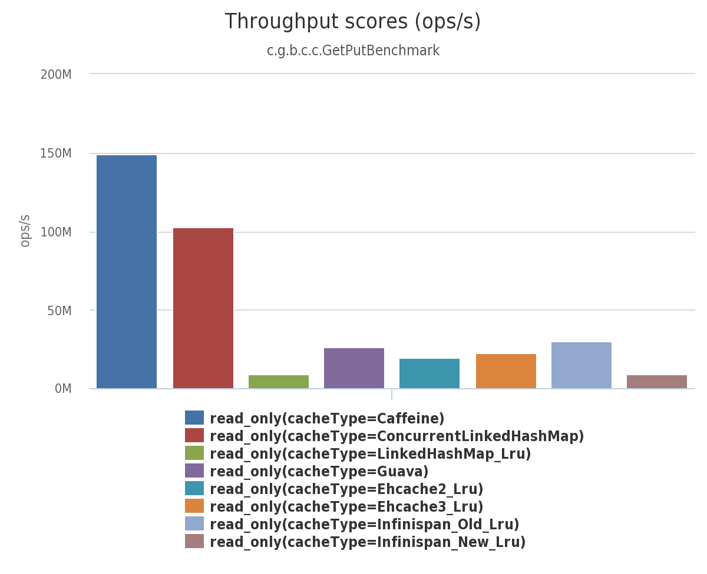
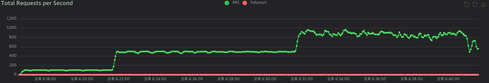
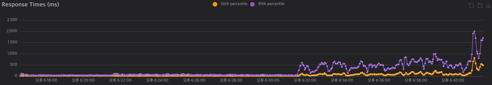
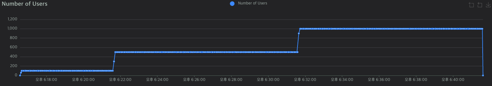
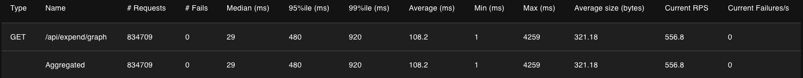

## **1\. 배경**

* * *

[\[WealthTracker\] 성능 개선 이야기 - (3)SQL 쿼리 튜닝

1.배경WealthTracker 서비스에서 제공하는 /api/expend/graph API는 사용자의 지출 데이터를 주차(week) 단위로 요약하여 시각화에 활용되는 중요한 API입니다. 해당 API에서 사용되는 서비스 로직은 아래와

codekim3570.tistory.com](https://codekim3570.tistory.com/entry/%EC%84%A0%ED%83%9D-%EC%95%88%EB%90%A8-WealthTracker-%EC%84%B1%EB%8A%A5-%EA%B0%9C%EC%84%A0-%EC%9D%B4%EC%95%BC%EA%B8%B0-3SQL-%EC%BF%BC%EB%A6%AC-%ED%8A%9C%EB%8B%9D)

전에 시도했던 성능 개선 작업에서 쿼리 튜닝 측면에서는 더 이상 뚜렷한 개선점을 찾기 어려웠습니다. 그래서 이번에는 성능 병목이 발생했던 **/api/expend/graph** API에 **캐시(Cache)**를 적용해보기로 했습니다.

특히 이 API는 사용자가 직접 데이터를 입력하거나 수정하는 경우보다는, **지출 현황을 그래프로 조회하는 요청이 훨씬 빈번하게 발생**하는 특성이 있습니다. 따라서 자주 호출되는 조회성 API에 캐시를 적용하면, **데이터베이스 부하를 줄이고 응답 속도를 개선하는 데 효과적**이라고 판단했습니다.

#### **Cache란?**

> 컴퓨팅에서 **캐시**(cache, 문화어: 캐쉬, 고속완충기, 고속완충기억기)는 데이터를 저장하여 나중에 해당 데이터에 대한 요청을 더 빠르게 처리할 수 있도록 하는 하드웨어 또는 소프트웨어 구성 요소이다.(위키백과)

즉, 자주 사용되는 데이터를 다른 곳에 저장해두었다가 필요할 때 빠르게 꺼내보기 위한 기술입니다.

* * *

#### **어떤 종류의 Cache를 선택할 것인가**

Spring에서 지원하는 cache는 정말 다양합니다.

-   **JCache**
-   **Hazelcast**
-   **Infinispan**
-   **Couchbase**
-   **Redis**
-   **Caffeine**
-   **Simple**

이번 성능 개선을 위한 캐시는 **Caffeine**을 선택하였습니다. 다음과 같은 이유로 선택하게 되었습니다.

1.  Redis 설정을 진행하는 것은 오버 엔지니어링이라고 생각했습니다.
2.  [spring boot 공식 문서](https://docs.spring.io/spring-boot/reference/io/caching.html#io.caching.provider.caffeine)에서 **caffeine**은 **auto-configured** 상태로 직접 제가 구현해야 하는 코드가 적다는 것을 의미합니다. 이것은 비용감소로 이어집니다.
3.  다른 캐시들보다 벤치마크 결과 매우 뛰어난 성능을 보여줍니다. **caffeine**의 오픈소스 공식 문서를 보면 아래와 같이 다른 캐시들보다 **READ**에서 매우 뛰어난 성능을 확인할 수 있습니다.



[Benchmarks

A high performance caching library for Java. Contribute to ben-manes/caffeine development by creating an account on GitHub.

github.com](https://github.com/ben-manes/caffeine/wiki/Benchmarks)

## **  
2.해결과정**

* * *

-   **build-gradle**에서 **dependency**를 아래와 같이 추가합니다.

```groovy
implementation 'org.springframework.boot:spring-boot-starter-cache'
implementation 'com.github.ben-manes.caffeine:caffeine'
```

-   **application.properties** 설정 파일에서 캐시 타입과 캐시 최대 크기, 만료 기한(10분)를 설정합니다.
-   현재 사용하고 있는 캐시의 이름을 등록합니다.

```properties
spring.cache.type=caffeine
spring.cache.caffeine.spec=maximumSize=500,expireAfterWrite=10m
spring.cache.cache-names=expendWeekCache
```

-   spring 실행 클래스에 **@EnableCaching** 애노테이션을 추가합니다.

```java
@SpringBootApplication
@EnableScheduling
@EnableCaching
public class DemoApplication {
	public static void main(String[] args) {
		SpringApplication.run(DemoApplication.class, args);
	}

}
```

-   **/expend/graph**의 서비스 코드인 **getAmountByWeek** 메서드에 캐시를 적용합니다.
-   각 사용자별로 구분하여 캐시를 적용해야 하므로 **JWT**값인 **token**을 **Key**값으로 하여 캐시를 구별합니다.

```java
 @Cacheable(value = "expendWeekCache", key = "#token")
 @Override
 public List<ExpendWeekCompareDTO> getAmountByWeek(String token) {
     Long userId=jwtUtil.getUserId(token);
     if(userId==null){
         throw new CustomException(ErrorCode.USER_NOT_FOUND, ErrorCode.USER_NOT_FOUND.getMessage());
     }
     return expendRepository.getExpendWeekCompare(userId);
}
```

* * *

#### **데이터가 변경되는 경우**

위와 같이 캐시를 적용하였지만 만약 사용자가 지출 데이터를 새로 작성하여 이번 달의 주차별 지출 금액이 달라지거나 지출 내용 중 금액이나 지출 날짜를 수정,삭제하게 되면 이전 캐시된 데이터와 새로 갱신된 데이터가 일치하지 않게 되는 문제가 발생합니다.

따라서, 지출을 작성하는 **POST /api/expend**와 지출을 수정하는 **UPDATE /api/update/{expendId}** , 지출을 삭제하는 DELETE 요청이 있을 때는 유저의 JWT를 기반으로 기존 캐시 데이터를 삭제할 필요가 있습니다. 따라서, **@CacheEvict** 애노테이션을 이용하여 캐시 데이터를 삭제합니다.

만약, JWT가 만료되었다면 JWT를 key값으로 하는 캐시 데이터를 찾지 못하므로 캐시된 데이터가 아니라 기존 서비스 메서드가 실행될 것이며 캐시데이터를 만료 기간을 10분으로 설정하여 필요없는 리소스들은 자동으로 삭제되게 됩니다.

```java
@Override
@Transactional
@CacheEvict(value = "expendWeekCache", key = "#token")
public Long writeExpend(ExpendRequestDTO expendRequestDTO, String token) {
  //지출 작성 로직
}
```

```java
@Override
@Transactional
@CacheEvict(value = "expendWeekCache", key = "#token")
public Long updateExpend(String token, Long expendId, ExpendRequestDTO expendRequestDTO) {
	//지출을 수정하는 로직
}
```

```java
@Override
@Transactional
@CacheEvict(value = "expendWeekCache", key = "#token")
public Long deleteExpend(String token, Long expendId) {
    //지출을 삭제하는 로직
}
```

## **3\. 결과**

* * *

### **전체적인 부하 테스트 결과**



초당 요청 수 RPS



응답 시간 Response Time



유저 수 Number Of Users



전체적인 성능  테스트 결과 표

|  | 평균 | P95 |
| --- | --- | --- |
| 개선 전 | 642.51 ms | 2,100 ms |
| 개선 후 | 108.2 ms | 480 ms |
| 개선율 | 493.817% | 337.5% |

### **최종 성능 개선**

기존 성능 개선 목표와 비교하여 다음과 같은 성능향상을 달성할 수 있었습니다.

|  | 평균 | P95 |
| --- | --- | --- |
| 성능 목표 | 500 ms | 1,000 ms |
| 실제 개선 | 108.2 ms | 480 ms |
| 차이 | 362.107% | 108.33% |

-   기존 목표로 잡았던 **평균값**과 **P95** 기준의 응답 속도를 각각 **362.107%,** **108.33%**를 더 감소시킨 **108.2ms, 480ms**로 최종적으로 응답 속도를 개선했습니다.

처음 진행한 부하테스트 결과와 비교하면 다음과 같은 성능향상을 달성할 수 있었습니다.

|  | 평균 | P95 |
| --- | --- | --- |
| 성능 개선 전 | 4,004 ms | 11,000 ms |
| 성능 개선 후 | 108.2 ms | 480 ms |
| 차이 | 3,600.554% | 2,191.666% |
